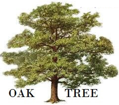
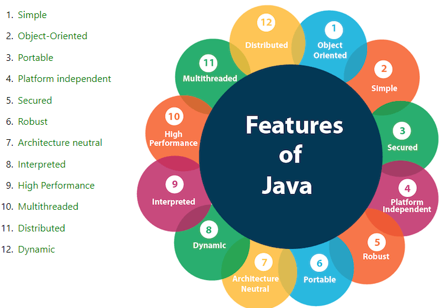
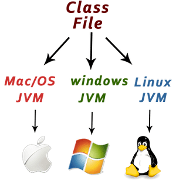
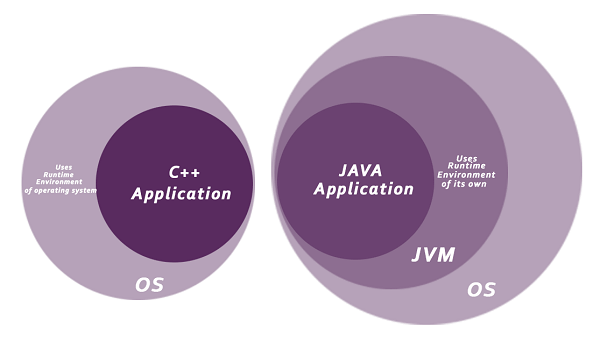

# Java Introduction, History, Features and C++ Vs Java

**Content**

1\. What is Java?

2\. Application

    2.1\. Types of Java Applications

3\. Java Platforms / Editions

4\. History of Java

5\. Java Version History

6\. Features of Java

7\. C++ Vs Java

8\. References

## 1. What is Java?

-   Java is a **programming language** and a **platform**.
-   Java is a high level, robust, object-oriented and secure programming language.
-   Java was developed by **Sun Microsystems** in the year 1995.
-   **James Gosling** is known as the father of Java.
-   Before Java, its name was **Oak**. Since Oak was already a registered company, so James Gosling and his team changed the name from Oak to **Java**.
-   **Platform:** Any hardware or software environment in which a program runs, is known as a platform. Since Java has a runtime environment (JRE) and API, it is called a platform.

## 2. Application

-   According to Sun, 3 billion devices run Java. There are many devices where Java is currently used.

**Some of them are as follows:**

1.  Desktop Applications such as acrobat reader, media player, antivirus, etc.
2.  Web Applications such as irctc.co.in, javatpoint.com, etc.
3.  Enterprise Applications such as banking applications.
4.  Mobile
5.  Embedded System
6.  Smart Card
7.  Robotics
8.  Games, etc.

## 2.1 Types of Java Applications

-   There are mainly 4 types of applications that can be created using Java programming:

## 1) Standalone Application

-   Standalone applications are also known as desktop applications or window-based applications.
-   These are traditional software that we need to install on every machine.
-   Examples of standalone application are Media player, antivirus, etc. AWT and Swing are used in Java for creating standalone applications.

## 2) Web Application

-   An application that runs on the server side and creates a dynamic page is called a web application.
-   Currently, Servlet, JSP, Struts, Spring, Hibernate, JSF, etc. technologies are used for creating web applications in Java.

## 3) Enterprise Application

-   An application that is distributed in nature, such as banking applications, etc. is called an enterprise application.
-   It has advantages like high-level security, load balancing, and clustering.
-   In Java, EJB is used for creating enterprise applications.

## 4) Mobile Application

-   An application which is created for mobile devices is called a mobile application.
-   Currently, Android and Java ME are used for creating mobile applications.

## 3. Java Platforms / Editions

-   There are 4 platforms or editions of Java:

## 3.1 Java SE (Java Standard Edition)

-   It is a Java programming platform.
-   It includes Java programming APIs such as java.lang, java.io, java.net, java.util, java.sql, java.math etc.
-   It includes core topics like OOPs, String, Regex, Exception, Inner classes, Multithreading, I/O Stream, Networking, AWT, Swing, Reflection, Collection, etc.

## 3.2 Java EE (Java Enterprise Edition)

-   It is an enterprise platform that is mainly used to develop web and enterprise applications.
-   It is built on top of the Java SE platform.
-   It includes topics like Servlet, JSP, Web Services, EJB, JPA, etc.

## 3.3 Java ME (Java Micro Edition)

-   It is a micro platform that is dedicated to mobile applications.

## 3.4 JavaFX

-   It is used to develop rich internet applications.
-   It uses a lightweight user interface API.

## 4. History of Java

-   The history of Java is very interesting.
-   Java was originally designed for interactive **television**, but it was too advanced technology for the digital cable television industry at the time.
-   The history of Java starts with the **Green Team**.
-   Java team members (also known as Green Team), initiated this project to develop a language for digital devices such as set-top boxes, televisions, etc.
-   However, it was best suited for internet programming.
-   Later, Java technology was incorporated by Netscape.
-   The principles for creating Java programming were "Simple, Robust, Portable, Platform-independent, Secured, High Performance, Multithreaded, Architecture Neutral, Object-Oriented, Interpreted, and Dynamic".
-   Java was developed by **James Gosling**, who is known as the **father of Java**, in **1995**.
-   James Gosling and his team members started the project in the early '90s.

-   Currently, Java is used in internet programming, mobile devices, games, e-business solutions, etc.

**Following are given significant points that describe the history of Java**

1.  **James Gosling, Mike Sheridan**, and **Patrick Naughton** initiated the Java language project in June 1991. The small team of sun engineers called **Green Team**.
2.  Initially it was designed for small, embedded systems in electronic appliances like set-top boxes.
3.  Firstly, it was called **"Greentalk"** by James Gosling, and the file extension was **.gt**.
4.  After that, it was called **Oak** and was developed as a part of the Green project.

**Why Java was named as "Oak"?**

****

1.  **Why Oak?** Oak is a symbol of **strength** and chosen as a **national tree** of many countries like the U.S.A., France, Germany, Romania, etc.
2.  In 1995, Oak was renamed as **"Java"** because it was already a trademark by Oak Technologies.

**Why Java Programming named "Java"?**

1.  Why had they chose the name Java for Java language? The team gathered to choose a new name. The suggested words were "dynamic", "revolutionary", "Silk", "jolt", "DNA", etc. They wanted something that reflected the essence of the technology: revolutionary, dynamic, lively, cool, unique, and easy to spell, and fun to say. According to James Gosling, "Java was one of the top choices along with **Silk**". Since Java was so unique, most of the team members preferred Java than other names.
2.  **Java** is an **island** in **Indonesia** where the first coffee was produced (called Java coffee). It is a kind of espresso bean. Java name was chosen by James Gosling while having a cup of coffee nearby his office.
3.  Notice that Java is just a name, not an acronym.
4.  Initially developed by James Gosling at **Sun Microsystems** (which is now a subsidiary of Oracle Corporation) and released in 1995.
5.  In 1995, Time magazine called **Java one of the Ten Best Products of 1995**.
6.  **JDK 1.0** was released **on January 23, 1996**. After the first release of Java, there have been many additional features added to the language. Now Java is being used in Windows applications, Web applications, enterprise applications, mobile applications, cards, etc. Each new version adds new features in Java.

## 5. Java Version History

-   Many java versions have been released till now. The current stable release of Java is Java SE 10.
1.  JDK Alpha and Beta (1995)
2.  JDK 1.0 (23rd Jan 1996)
3.  JDK 1.1 (19th Feb 1997)
4.  J2SE 1.2 (8th Dec 1998)
5.  J2SE 1.3 (8th May 2000)
6.  J2SE 1.4 (6th Feb 2002)
7.  J2SE 5.0 (30th Sep 2004)
8.  Java SE 6 (11th Dec 2006)
9.  Java SE 7 (28th July 2011)
10. Java SE 8 (18th Mar 2014)
11. Java SE 9 (21st Sep 2017)
12. Java SE 10 (20th Mar 2018)
13. Java SE 11 (September 2018)
14. Java SE 12 (March 2019)
15. Java SE 13 (September 2019)
16. Java SE 14 (Mar 2020)
17. Java SE 15 (September 2020)
18. Java SE 16 (Mar 2021)
19. Java SE 17 (September 2021)
20. Java SE 18 (to be released by March 2022)
-   Since Java SE 8 release, the Oracle corporation follows a pattern in which every even version is release in March month and an odd version released in September month.

## 6. Features of Java

-   The primary objective of Java programming language creation was to make it portable, simple and secure programming language.
-   Apart from this, there are also some excellent features which play an important role in the popularity of this language.
-   The features of Java are also known as Java buzzwords.
-   A list of the most important features of the Java language is given below.

## 6.1 Simple

-   Java is very easy to learn, and its syntax is simple, clean and easy to understand.
-   According to Sun Microsystem, Java language is a simple programming language because:
1.  Java syntax is based on C++ (so easier for programmers to learn it after C++).
2.  Java has removed many complicated and rarely-used features, for example, explicit pointers, operator overloading, etc.
3.  There is no need to remove unreferenced objects because there is an Automatic Garbage Collection in Java.

## 6.2 Object-oriented

-   Java is an object-oriented programming language.
-   Everything in Java is an object.
-   Object-oriented means we organize our software as a combination of different types of objects that incorporate both data and behavior.
-   Object-oriented programming (OOPs) is a methodology that simplifies software development and maintenance by providing some rules.

**Basic concepts of OOPs are:**

1.  Object
2.  Class
3.  Inheritance
4.  Polymorphism
5.  Abstraction
6.  Encapsulation

## 6.3 Platform Independent

-   Java is platform independent because it is different from other languages like C, C++, etc. which are compiled into platform specific machines while Java is a write once, run anywhere language.
-   A platform is the hardware or software environment in which a program runs.
-   There are two types of platforms software-based and hardware-based. Java provides a software-based platform.
-   The Java platform differs from other platforms in the sense it is a software-based platform that runs on top of other hardware-based platforms.
-   It has two components:
1.  Runtime Environment
2.  API(Application Programming Interface)
-   Java code can be executed on multiple platforms, for example, Windows, Linux, Sun Solaris, Mac/OS, etc.
-   Java code is compiled by the compiler and converted into bytecode.
-   This bytecode is a platform-independent code because it can be run on multiple platforms, i.e., Write Once and Run Anywhere (WORA).

## 6.4 Secured

-   Java is best known for its security.
-   With Java, we can develop virus-free systems.
-   Java is secured because:
1.  **No explicit pointer**
2.  **Java Programs run inside a virtual machine sandbox**

**Classloader:**

-   Classloader in Java is a part of the Java Runtime Environment (JRE) which is used to load Java classes into the Java Virtual Machine dynamically.
-   It adds security by separating the package for the classes of the local file system from those that are imported from network sources.

**Bytecode Verifier:**

-   It checks the code fragments for illegal code that can violate access rights to objects.

**Security Manager:**

-   It determines what resources a class can access such as reading and writing to the local disk.
-   Java language provides these securities by default.
-   Some security can also be provided by an application developer explicitly through SSL, JAAS, Cryptography, etc.

## 6.5 Architecture-neutral

-   Java is architecture neutral because there are no implementation dependent features, for example, the size of primitive types is fixed.
-   In C programming, int data type occupies 2 bytes of memory for 32-bit architecture and 4 bytes of memory for 64-bit architecture. However, it occupies 4 bytes of memory for both 32 and 64-bit architectures in Java.

## 6.6 Portable

-   Java is portable because it facilitates you to carry the Java bytecode to any platform.
-   It doesn't require any implementation.

## 6.7 High-performance

-   Java is faster than other traditional interpreted programming languages because Java bytecode is "close" to native code.
-   It is still a little bit slower than a compiled language (e.g., C++).
-   Java is an interpreted language that is why it is slower than compiled languages, e.g., C, C++, etc.

## 6.8 Distributed

-   Java is distributed because it facilitates users to create distributed applications in Java.
-   RMI and EJB are used for creating distributed applications.
-   This feature of Java makes us able to access files by calling the methods from any machine on the internet.

## 6.9 Multi-threaded

-   A thread is like a separate program, executing concurrently.
-   We can write Java programs that deal with many tasks at once by defining multiple threads.
-   The main advantage of multi-threading is that it doesn't occupy memory for each thread.
-   It shares a common memory area.
-   Threads are important for multi-media, Web applications, etc.

## 6.10 Dynamic

-   Java is a dynamic language.
-   It supports the dynamic loading of classes.
-   It means classes are loaded on demand.
-   It also supports functions from its native languages, i.e., C and C++.
-   Java supports dynamic compilation and automatic memory management (garbage collection).

## 6.11 Robust

The English mining of Robust is strong. Java is robust because:

-   It uses strong memory management.
-   There is a lack of pointers that avoids security problems.
-   Java provides automatic garbage collection which runs on the Java Virtual Machine to get rid of objects which are not being used by a Java application anymore.

There are exception handling and the type checking mechanism in Java. All these points make Java robust.

## 7. C++ Vs Java

-   A list of top differences between C++ and Java are given below:

| **Comparison Index**                    | **C++**                                                                                                                                        | **Java**                                                                                                                                                                                                                                     |
|-----------------------------------------|------------------------------------------------------------------------------------------------------------------------------------------------|----------------------------------------------------------------------------------------------------------------------------------------------------------------------------------------------------------------------------------------------|
| **Platform-independent**                | C++ is platform-dependent.                                                                                                                     | Java is platform-independent.                                                                                                                                                                                                                |
| **Mainly used for**                     | C++ is mainly used for system programming.                                                                                                     | Java is mainly used for application programming. It is widely used in Windows-based, web-based, enterprise, and mobile applications.                                                                                                         |
| **Design Goal**                         | C++ was designed for systems and applications programming. It was an extension of the C programming language .                                 | Java was designed and created as an interpreter for printing systems but later extended as a support network computing. It was designed to be easy to use and accessible to a broader audience.                                              |
| **Goto**                                | C++ supports the goto statement.                                                                                                               | Java doesn't support the goto statement.                                                                                                                                                                                                     |
| **Multiple inheritance**                | C++ supports multiple inheritance.                                                                                                             | Java doesn't support multiple inheritance through class. It can be achieved by using interfaces in java .                                                                                                                                    |
| **Operator Overloading**                | C++ supports operator overloading.                                                                                                             | Java doesn't support operator overloading.                                                                                                                                                                                                   |
| **Pointers**                            | C++ supports pointers. You can write a pointer program in C++.                                                                                 | Java supports pointer internally. However, you can't write the pointer program in java. It means java has restricted pointer support in java.                                                                                                |
| **Compiler and Interpreter**            | C++ uses compiler only. C++ is compiled and run using the compiler which converts source code into machine code so, C++ is platform dependent. | Java uses both compiler and interpreter. Java source code is converted into bytecode at compilation time. The interpreter executes this bytecode at runtime and produces output. Java is interpreted that is why it is platform-independent. |
| **Call by Value and Call by reference** | C++ supports both call by value and call by reference.                                                                                         | Java supports call by value only. There is no call by reference in java.                                                                                                                                                                     |
| **Structure and Union**                 | C++ supports structures and unions.                                                                                                            | Java doesn't support structures and unions.                                                                                                                                                                                                  |
| **Thread Support**                      | C++ doesn't have built-in support for threads. It relies on third-party libraries for thread support.                                          | Java has built-in thread support.                                                                                                                                                                                                            |
| **Documentation comment**               | C++ doesn't support documentation comments.                                                                                                    | Java supports documentation comment (/\*\* ... \*/) to create documentation for java source code.                                                                                                                                            |
| **Virtual Keyword**                     | C++ supports virtual keyword so that we can decide whether or not to override a function.                                                      | Java has no virtual keyword. We can override all non-static methods by default. In other words, non-static methods are virtual by default.                                                                                                   |
| **unsigned right shift \>\>\>**         | C++ doesn't support \>\>\> operator.                                                                                                           | Java supports unsigned right shift \>\>\> operator that fills zero at the top for the negative numbers. For positive numbers, it works same like \>\> operator.                                                                              |
| **Inheritance Tree**                    | C++ always creates a new inheritance tree.                                                                                                     | Java always uses a single inheritance tree because all classes are the child of the Object class in Java. The Object class is the root of the inheritance tree in java.                                                                      |
| **Hardware**                            | C++ is nearer to hardware.                                                                                                                     | Java is not so interactive with hardware.                                                                                                                                                                                                    |
| **Object-oriented**                     | C++ is an object-oriented language. However, in the C language, a single root hierarchy is not possible.                                       | Java is also an object-oriented language. However, everything (except fundamental types) is an object in Java. It is a single root hierarchy as everything gets derived from java.lang.Object.                                               |
| **Program**                             | \#include \<iostream\> **using** **namespace** std; **int** main() { cout \<\< "Hello C++ Programming"; **return** 0; }                        | **class** Simple { **public** **static** **void** main(String args[]) { System.out.println("Hello Java"); } }                                                                                                                                |

**Note**

-   Java doesn't support default arguments like C++.
-   Java does not support header files like C++. Java uses the import keyword to include different classes and methods.

## 8. References

1.  <https://www.javatpoint.com/java-tutorial>
2.  https://www.javatpoint.com/history-of-java
3.  https://www.javatpoint.com/features-of-java
4.  https://www.javatpoint.com/cpp-vs-java
