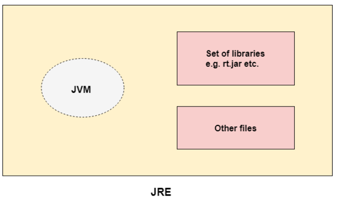
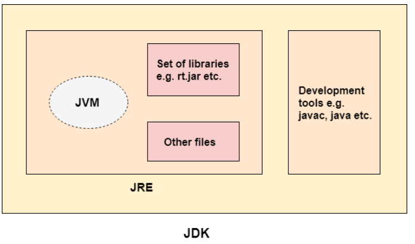

# JVM, JRE, JDK

## **Content**

1.  What is JVM (Java Virtual Machine)?

2.  JVM languages

3.  The three parts of the JVM

4.  What is JRE (Java Runtime Environment)?

5.  What is JDK (Java Development Kit)?

## **1. What is JVM (Java Virtual Machine)?**

-   The Java virtual machine is a program whose purpose is to execute other programs.

-   The JVM has two primary functions:

    -   to allow Java programs to run on any device or operating system (known as the "write once, run anywhere" principle)

    -   to manage and optimize program memory.

-   When Java was released in 1995, all computer programs were written to a specific operating system, and program memory was managed by the software developer. The JVM was a revelation.

-   Having a technical definition for the JVM is useful, and there's also an everyday way that software developers think about it. Let's break that down:

    -   **Technical definition:** The JVM is the specification for a software program that executes code and provides the runtime environment for that code.

    -   **Everyday definition:** The JVM is how we run our Java programs. We configure the settings and then rely on the JVM to manage program resources during execution.

## **2. JVM languages**

-   While it was once only for Java, the JVM is flexible and powerful enough to support many other languages today.

-   Among the most popular are Scala, used for real-time, concurrent applications, and Groovy, a dynamically typed scripting language.

-   Another prominent example is Kotlin, which delivers a blend of object-oriented and functional styles.

-   All of these are considered JVM languages, meaning that, even though they are not coding in Java, the programmer retains access to the vast ecosystem of Java libraries.

-   Who develops and maintains the JVM?

    -   The JVM is widely deployed, heavily used, and maintained by some very bright programmers, both corporate and open source.

    -   The OpenJDK project started with Sun Microsystems' decision to open-source Java and has continued through Oracle's stewardship.

## **3. The three parts of the JVM**

It could be said there are three aspects to the JVM:

-   The JVM specification,

-   The JVM implementation

-   The JVM instance.

Let's consider each of these.

### **The JVM specification**

-   First, the JVM is a software specification.

-   In a somewhat circular fashion, the JVM spec highlights that its implementation details are not defined within the spec, in order to allow for maximum creativity in its realization.

| What is a software specification?                                                                                                                                                                                                        |
|------------------------------------------------------------------------------------------------------------------------------------------------------------------------------------------------------------------------------------------|
| A *software specification* (or spec) is a human-readable design document that describes how a software system should operate. The purpose of a specification is to create a clear description and requirements for engineers to code to. |

-   So, all that the JVM has to do is run Java programs correctly.

-   Sounds simple, and might even look simple from the outside, but it's a massive undertaking, especially given the power and flexibility of the Java language.

### **JVM implementations**

-   Implementing the JVM specification results in an actual software program, which is a JVM implementation.

-   In fact, there are many JVM implementations, both open source and proprietary.

-   OpenJDK's HotSpot is the JVM reference implementation. It remains one of the most thoroughly tried-and-tested codebases in the world.

-   HotSpot may be the most commonly used JVM, but it is by no means the only one.

-   Another interesting and popular implementation is GraalVM which features high performance and support for other, traditionally non-JVM languages like C++ and Rust via the LLVM spec.

-   Typically, you download and install the JVM as a bundled part of a Java Runtime Environment (JRE). The JRE is the on-disk part of Java that spawns a running JVM.

### **The JVM instance**

-   After the JVM spec has been implemented and released as a software product, you may download and run it as a program.

-   That downloaded program is an instance (or instantiated version) of the JVM.

-   Most of the time, when developers talk about "the JVM," we are referring to a JVM instance running in a software development or production environment.

-   You might say, "Hey, how much memory is the JVM on that server using?" or, "I can't believe I created a circular call and a stack overflow error crashed my JVM. What a newbie mistake!"

## **4. JVM Architecture**

-   Java was developed with the concept of WORA (Write Once Run Anywhere), which runs on a VM.

-   The compiler compiles the Java file into a Java .class file, then that .class file is input into the JVM, which loads and executes the class file.

-   Below is a diagram of the Architecture of the JVM.

### **JVM Architecture Diagram**

### **How Does the JVM Work?**

As shown in the above architecture diagram, the JVM is divided into three main subsystems:

1.  ClassLoader Subsystem

2.  Runtime Data Area

3.  Execution Engine

#### 1. **ClassLoader Subsystem**

-   Java's dynamic class loading functionality is handled by the ClassLoader subsystem.

-   It loads, links. and initializes the class file when it refers to a class for the first time at runtime, not compile time.

#### **1.1 Loading**

-   Classes will be loaded by this component.

-   BootStrap ClassLoader, Extension ClassLoader, and Application ClassLoader are the three ClassLoaders that will help in achieving it.

    -   **BootStrap ClassLoader** – Responsible for loading classes from the bootstrap classpath, nothing but rt.jar. Highest priority will be given to this loader.

    -   **Extension ClassLoader** – Responsible for loading classes which are inside the ext folder (jre\\lib).

    -   **Application ClassLoader** –Responsible for loading Application Level Classpath, path mentioned Environment Variable, etc.

#### **1.2 Linking**

-   **Verify** – Bytecode verifier will verify whether the generated bytecode is proper or not if verification fails we will get the verification error.

-   **Prepare** – For all static variables memory will be allocated and assigned with default values.

-   **Resolve** – All symbolic memory references are replaced with the original references from Method Area.

#### **1.3 Initialization**

-   This is the final phase of ClassLoading.

-   Here, all static variables will be assigned with the original values, and the static block will be executed.

#### **2. Runtime Data Area**

-   The Runtime Data Area is divided into five major components:

    1.  **Method Area**

        1.  All the class-level data will be stored here, including static variables.

        2.  There is only one method area per JVM, and it is a shared resource.

    2.  **Heap Area**

        1.  All the Objects and their corresponding instance variables and arrays will be stored here.

        2.  There is also one Heap Area per JVM.

        3.  Since the Method and Heap areas share memory for multiple threads, the data stored is not thread-safe.

    3.  **Stack Area**

        1.  For every thread, a separate runtime stack will be created.

        2.  For every method call, one entry will be made in the stack memory which is called Stack Frame.

        3.  All local variables will be created in the stack memory.

        4.  The stack area is thread-safe since it is not a shared resource.

        5.  The Stack Frame is divided into three subentities:

            1.  **Local Variable Array –** Related to the method how many local variables are involved and the corresponding values will be stored here.

            2.  **Operand stack –** If any intermediate operation is required to perform, operand stack acts as runtime workspace to perform the operation.

            3.  **Frame data –** All symbols corresponding to the method is stored here. In the case of any exception, the catch block information will be maintained in the frame data.

    4.  **PC Registers**

        1.  Each thread will have separate PC Registers, to hold the address of current executing instruction once the instruction is executed the PC register will be updated with the next instruction.

    5.  **Native Method stacks**

        1.  Native Method Stack holds native method information.

        2.  For every thread, a separate native method stack will be created.

#### **3. Execution Engine**

-   The bytecode, which is assigned to the Runtime Data Area, will be executed by the Execution Engine. The Execution Engine reads the bytecode and exe cutes it piece by piece.

    1.  **Interpreter** – The interpreter interprets the bytecode faster but executes slowly. The disadvantage of the interpreter is that when one method is called multiple times, every time a new interpretation is required.

    2.  **JIT Compiler** – The JIT Compiler neutralizes the disadvantage of the interpreter. The Execution Engine will be using the help of the interpreter in converting byte code, but when it finds repeated code it uses the JIT compiler, which compiles the entire bytecode and changes it to native code. This native code will be used directly for repeated method calls, which improve the performance of the system.

        1.  **Intermediate Code Generator –** Produces intermediate code

        2.  **Code Optimizer –** Responsible for optimizing the intermediate code generated above

        3.  **Target Code Generator –** Responsible for Generating Machine Code or Native Code

        4.  **Profiler –** A special component, responsible for finding hotspots, i.e. whether the method is called multiple times or not.

    3.  **Garbage Collector:** Collects and removes unreferenced objects. Garbage Collection can be triggered by calling System.gc(), but the execution is not guaranteed. Garbage collection of the JVM collects the objects that are created.

    4.  **Java Native Interface (JNI):** JNI will be interacting with the Native Method Libraries and provides the Native Libraries required for the Execution Engine.

    5.  **Native Method Libraries:** This is a collection of the Native Libraries, which is required for the Execution Engine.

## **3. What is JRE?**

-   JRE (Java Runtime Environment) is an installation package that provides an environment to only run(not develop) the java program(or application) in your machine. -   JRE is only used by those who only want to run Java programs that are end-users of your system.
-   JRE is also written as Java RTE (RunTime Environment).
-   Practically speaking, a runtime environment is a piece of software that is designed to run other software. 
-   As the runtime environment for Java, the JRE contains the Java class libraries and the Java Virtual Machine. 

## **4. What is JDK?**

-  JDK (Java Development Kit) is a Kit that provides the environment to develop and execute(run) the Java program. 
-  JDK is a kit(or package) that includes two things

    -   Development Tools(to provide an environment to develop your java programs)
    -   JRE (to execute your java program).
-   The JDK contains a private Java Virtual Machine (JVM) and a few other tools/resources such as an interpreter/loader (java), a compiler (javac), an archiver (jar), a documentation generator (Javadoc), etc. to complete the development of a Java Application.

## **5. References**

1.  https://www.javatpoint.com/difference-between-jdk-jre-and-jvm
2.  https://www.javatpoint.com/jvm-java-virtual-machine

