# Program Internal Details, Hello Java Program, Set Path

**Content**

1\. Internal Details of Program

1.1 What happens at compile time?

1.2 What happens at run time?

2\. First Java Program \| Hello Java Example

2.1 The requirement for Hello Java Example

2.2 Creating Hello java Example

2.3 Parameters used in Hello Java Program

2.4 In how many ways we can write a Java program?

3\. How to set path in Java

3.1 How to set the Temporary Path of JDK in Windows

3.2 How to set the Permanent Path of JDK in Windows

4\. References

## 1. Internal Details of Program

In this document, we are going to learn, what happens while we compile and run the Java program.

## 1.1 What happens at compile time?

-   At compile time, the Java file is compiled by Java Compiler (It does not interact with OS) and converts the Java code into bytecode.

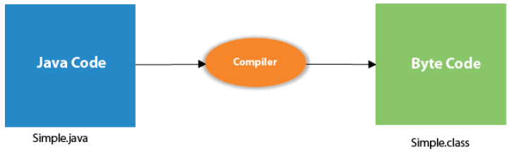

## 1.2 What happens at run time?

-   At runtime, the following steps are performed:

**Classloader:**

-   It is the subsystem of JVM that is used to load class files.

**Bytecode Verifier:**

-   Checks the code fragments for illegal code that can violate access rights to objects.

**Interpreter:**

-   Read bytecode stream then execute the instructions.

## 2. First Java Program \| Hello Java Example

-   In this document, we will learn how to write the simple program of Java.
-   We can write a simple hello Java program easily after installing the JDK.
-   Let's understand the requirement first.

## 2.1 The requirement for Hello Java Example

For executing any Java program, the following software or application must be properly installed.

-   Install the JDK if you don't have installed it, download the JDK and install it.
-   Set path of the jdk/bin directory.
-   Create the Java program
-   Compile and run the Java program

## 2.2 Creating Hello java Example

-   To write the simple program, you need to open notepad by **start menu -\> All Programs -\> Accessories -\> Notepad** and write a simple program as we have shown below:

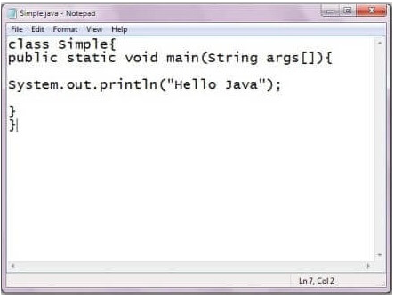

-   Save the file with **classname.java**

    **Example:** Simple.java

-   In order to compile and run the above program, you need to open the command prompt by **start menu -\> All Programs -\> Accessories -\> command prompt**.

-   To compile and run the above program, go to your current directory first; my current directory is c:\\new.

Write here:

-   **To compile:** javac Simple.java
-   **To execute:** java Simple

**Output:**

## 2.3 Parameters used in Hello Java Program

-   Let's see what is the meaning of class, public, static, void, main, String[], System.out.println().

**class**

-   It is a keyword.
-   It is used to declare a class in Java.

**public**

-   It is a keyword.
-   It is an access modifier that represents visibility.
-   It means it is visible to all.

**static**

-   It is a keyword.
-   If we declare any method as static, it is known as the static method.
-   The core advantage of the static method is that there is no need to create an object to invoke the static method.
-   The main() method is executed by the JVM, so it doesn't require creating an object to invoke the main() method. So, it saves memory.

**void**

-   It is the return type of the method.
-   It means it doesn't return any value.

**main**

-   It represents the starting point of the program.

**String[] args** or **String args[]**

-   It is used for command line argument

**System.out.println()**

-   It is used to print statement.
-   Here, System is a class, out is an object of the PrintStream class, println() is a method of the PrintStream class.

## 2.4 In how many ways we can write a Java program?

-   There are many ways to write a Java program.
-   The modifications that can be done in a Java program are given below:

## 1) By changing the sequence of the modifiers, method prototype is not changed in Java.

-   Let's see the simple code of the main method.

## 2) The subscript notation in the Java array can be used after type, before the variable or after the variable.

-   Let's see the different codes to write the main method.

## 3) You can provide var-args support to the main() method by passing 3 ellipses (dots)

## 4) Having a semicolon at the end of class is optional in Java.

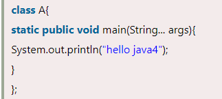

## 5) Valid Java main() method signature

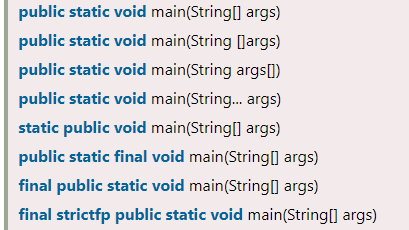

## 6) Invalid Java main() method signature

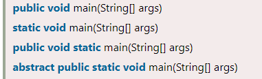

## 3. How to set path in Java

-   The path is required to be set for using tools such as javac, java, etc.
-   If you are saving the Java source file inside the JDK/bin directory, the path is not required to be set because all the tools will be available in the current directory.
-   However, if you have your Java file outside the JDK/bin folder, it is necessary to set the path of JDK.
-   There are two ways to set the path in Java:
1.  Temporary
2.  Permanent

## 3.1 How to set the Temporary Path of JDK in Windows

To set the temporary path of JDK, you need to follow the following steps:

-   Open the command prompt
-   Copy the path of the JDK/bin directory
-   Write in command prompt: **set path=copied_path**

**Example**

-   Let's see it in the figure given below:

## 3.2 How to set the Permanent Path of JDK in Windows

For setting the permanent path of JDK, you need to follow these steps:

-   Go to **MyComputer -\> properties -\> advances system settings -\> advanced tab -\> environment variables -\> new tab of user variable -\>** write path in **variable name -\>** write path of bin folder in **variable value -\> ok -\> ok -\> ok**

**Example**

**Step1:** Go to MyComputer and right click on **mycomputer. Click on properties.**

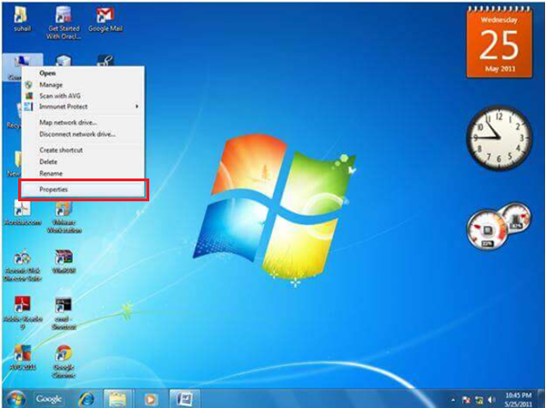

**Step2:** Click on the **advanced system settings.**

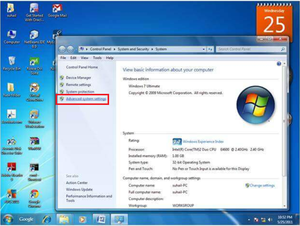

**Step3:** Click on the **advanced tab.**

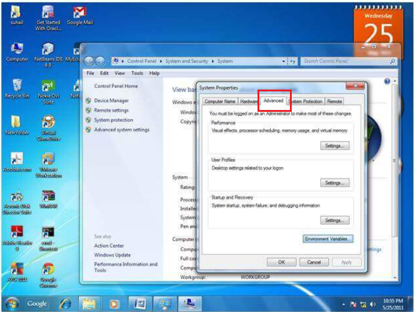

**Step4:** Click on **environment variables.**

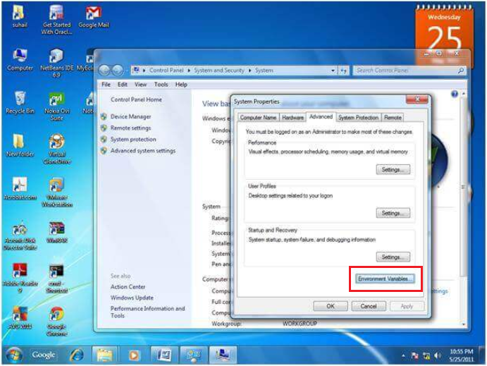

**Step5:** Click on the **new** button of **user variables.**

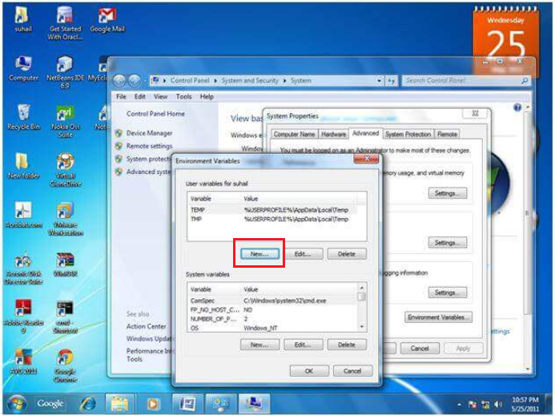

**Step6:** Write the **path** in the **variable name.**

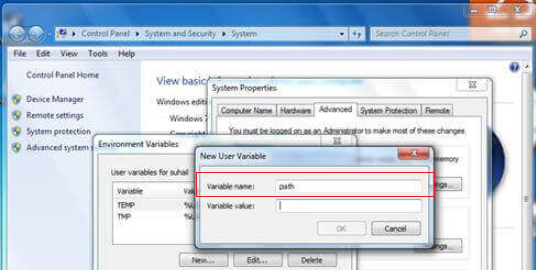

**Step7:** Copy the path of **bin folder.**

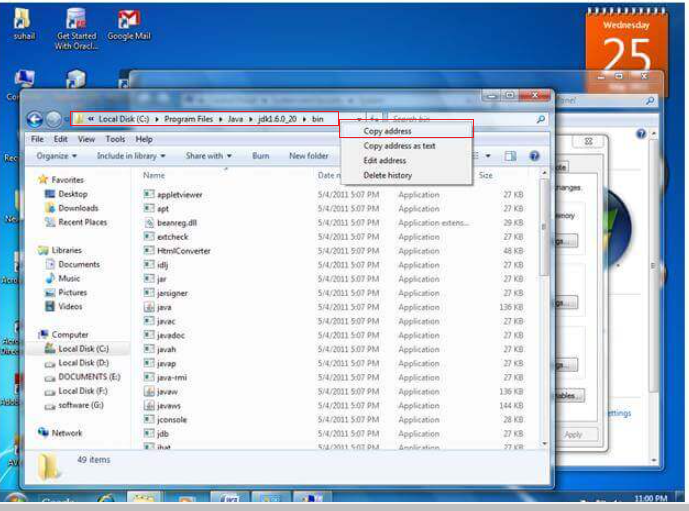

**Step8:** Paste **path of bin folder** in the **variable value.**

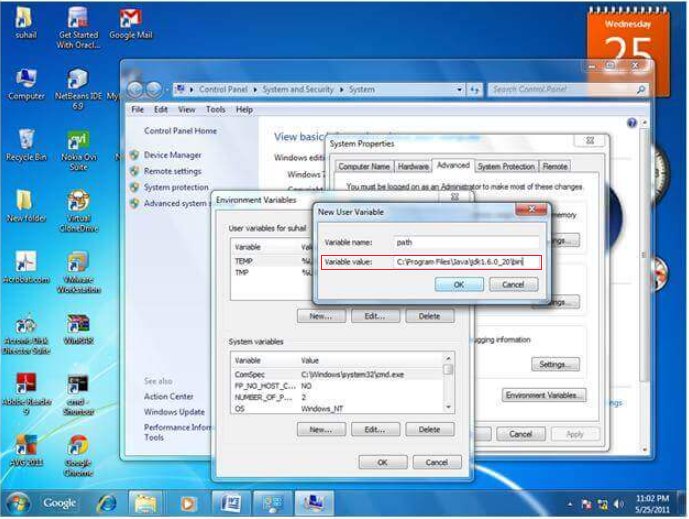

**Step9:** Click on **ok** button.

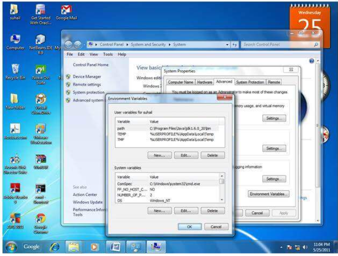

**Step10:** Click on **ok** button.

**Step11:** Click on **ok** button.

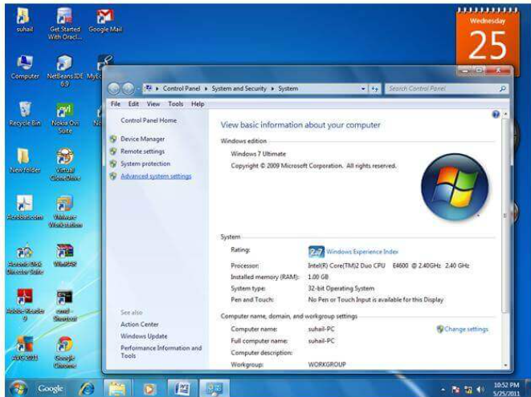

-   Now your permanent path is set.
-   You can now execute any program of java from any drive.

## 4. References

1.  <https://www.javatpoint.com/internal-details-of-hello-java-program>
2.  https://www.javatpoint.com/simple-program-of-java
3.  https://www.javatpoint.com/how-to-set-path-in-java
