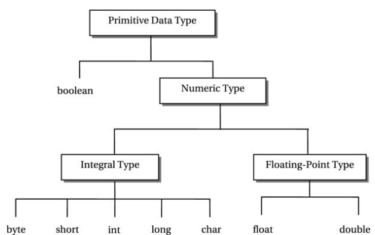

# Java Variables, Data Types, Type Casting

**Content**

1. Java Variables

2. Types of Variables

    2.1 Local Variable

    2.2 Instance Variable

    2.3 Static variable

    2.4 Example to understand the three types of variables in java

3. Display Variables

4. Declare Multiple Variables

5. Data Types in Java

6. Primitive Data Types

    6.1 boolean Data Type

    6.2 Numeric Data Types

        6.2.1 Integral types

        6.2.2 Floating point types

7. Type Casting

8. Types of Type Casting

    8.1 Widening Type Casting

    8.2 Narrowing Type Casting

9. References

## 1. Java Variables

-   A variable is the name of a reserved area allocated in memory.
-   In other words, it is a name of the memory location.
-   It is a combination of "vary + able" which means its value can be changed.
-   A variable is a container which holds the value while the Java program is executed.
-   A variable is assigned with a data type.

**The general rules for naming variables are:**

-   Names can contain letters, digits, underscores, and dollar signs.
-   Names must begin with a letter.
-   Names should start with a lowercase letter and it cannot contain whitespace.
-   Names can also begin with \$ and \_ .
-   Names are case sensitive ("myVar" and "myvar" are different variables)
-   Reserved words (like Java keywords, such as int or boolean) cannot be used as names

**Syntax:**

datatype variable_name=value;

**Example**

## 2. Types of Variables

-   There are three types of variables in Java

## 2.1 Local Variable

-   A variable declared inside the body of the method is called local variable.
-   You can use this variable only within that method and the other methods in the class aren't even aware that the variable exists.
-   A local variable cannot be defined with "static" keyword.

## 2.2 Instance Variable

-   A variable declared inside the class but outside the body of the method, is called an instance variable.
-   It is not declared as static.
-   It is called an instance variable because its value is instance-specific and is not shared among instances.

## 2.3 Static variable

-   A variable that is declared as static is called a static variable.
-   It cannot be local.
-   You can create a single copy of the static variable and share it among all the instances of the class.
-   Memory allocation for static variables happens only once when the class is loaded in the memory.

## 2.4 Example to understand the three types of variables in java

## 3. Display Variables

-   The **println()** method is often used to display variables.
-   To combine both text and a variable, use the **+** character.

**Example:**

**Output:**

## 4. Declare Multiple Variables

-   To declare more than one variable of the **same type**, you can use a comma-separated list.

**Example:**

**Output:**

## 4.1 One Value to Multiple Variables

-   You can also assign the **same value** to multiple variables in one line.

**Example:**

**Output:**

## 5. Data Types in Java

-   Data types specify the different sizes and values that can be stored in the variable.

**There are two types of data types in Java**

1.  **Primitive data types:** The primitive data types include boolean, char, byte, short, int, long, float and double.
2.  **Non-primitive data types:** The non-primitive data types include Classes, Interfaces, and Arrays.
-   To know more information about String [click here.](https://github.com/content-development-2022/Revature-Next-Gen-Java-AWS-Angular-Extended-v3.1/blob/main/Core%20Java%208%2B/2-java-object-oriented-programming-structure/14-java-string.md)
-   To know more information about classes [click here](https://github.com/content-development-2022/Revature-Next-Gen-Java-AWS-Angular-Extended-v3.1/blob/main/Core%20Java%208%2B/2-java-object-oriented-programming-structure/1-java-classes-objects-and-custom-class.md).
-   To know more information about interfaces [click here](https://github.com/content-development-2022/Revature-Next-Gen-Java-AWS-Angular-Extended-v3.1/blob/main/Core%20Java%208%2B/2-java-object-oriented-programming-structure/8-java-abstraction-abstract-classes-and-methods-interfaces.md).
-   To know more information about arrays [click here](https://github.com/content-development-2022/Revature-Next-Gen-Java-AWS-Angular-Extended-v3.1/blob/main/Core%20Java%208%2B/2-java-object-oriented-programming-structure/java-arrays.md).

## 6. Primitive Data Types

-   In Java language, primitive data types are the building blocks of data manipulation.
-   A primitive data type specifies the size and type of variable values, and it has no additional methods.
-   There are **eight primitive data types** in Java:

## 6.1 boolean Data Type

-   The boolean data type is used to store only two possible values: **true and false**.
-   This data type is used for simple flags that track true/false conditions.
-   The boolean data type specifies one bit of information, but its "size" can't be defined precisely.

**Example:**

**boolean** a = false;

**boolean** b=true;

## 6.2 Numeric Data Types

-   Primitive numeric data types are divided into two groups: **integral and floating point** types.

## 6.2.1 Integral types

-   An integral data type is a numeric data type whose values are of **integer** type.
-   Java offers **five integral data types**:
1.  byte
2.  short
3.  int
4.  long
5.  char

## 1) byte Data Type

-   The byte data type is an 8-bit signed two's complement integer.
-   Its value lies between -128 to 127 (inclusive).
-   Its default value is 0.
-   The byte data type is used to save memory in large arrays where the memory savings is most required.
-   It saves space because a byte is 4 times smaller than an integer. It can also be used in place of "int" data type.

**Example:**

**byte** a = 10;

**byte** b = -20;

## 2) short Data Type

-   The short data type is a 16-bit signed two's complement integer.
-   Its value lies between -32,768 to 32,767 (inclusive).
-   Its default value is 0.
-   The short data type can also be used to save memory just like byte data type.
-   A short data type is 2 times smaller than an integer.

**Example:**

**short** s = 10100;

**short** r = -6000;

## 3) int Data Type

-   The int data type is a 32-bit signed two's complement integer.
-   Its value lies between - 2,147,483,648 (-2\^31) to 2,147,483,647 (2\^31 -1) (inclusive).
-   Its default value is 0.
-   The int data type is generally used as a default data type for integral values unless if there is no problem about memory.

**Example:**

**int** a = 100000;

**int** b = -200000 ;

## 4) long Data Type

-   The long data type is a 64-bit two's complement integer.
-   Its value lies between -9,223,372,036,854,775,808(-2\^63) to 9,223,372,036,854,775,807(2\^63 -1)(inclusive).
-   Its default value is 0.
-   The long data type is used when you need a range of values more than those provided by int.

**Example:**

**long** a = 1500009900L;

**long** b = -1508909900L;

## 5) char Data Type

-   The char data type is a single 16-bit Unicode character.
-   Its value lies between '\\u0000' (or 0) to '\\uffff' (or 65,535 inclusive).
-   The char data type is used to store characters.

**Example:**

**char** letter= 'A' ;

## 6.2.2 Floating point types

-   It represent numbers with a fractional part, containing one or more decimals.
-   There are two types: **float and double**.

## 1) float Data Type

-   The float data type is a single-precision 32-bit IEEE 754 floating point.
-   Its value is unlimited.
-   It is recommended to use a float (instead of double) if you need to save memory in large arrays of floating point numbers. The float data type should never be used for precise values, such as currency.
-   Its default value is 0.0F.

**Example:**

**float** f1 = 234.5;

## 2) double Data Type

-   The double data type is a double-precision 64-bit IEEE 754 floating point.
-   Its value range is unlimited.
-   The double data type is generally used for decimal values just like float.
-   The double data type also should never be used for precise values, such as currency. Its default value is 0.0d.

**Example:**

**double** d1 = 12.3;

## 7. Type Casting

-   In Java, **type casting** is a method or process that converts one primitive data type into another data type in both ways manually and automatically.
-   The automatic conversion is done by the compiler and manual conversion performed by the programmer.
-   Convert a value from one data type to another data type is known as **type casting**.

## 8. Types of Type Casting

There are two types of type casting:

-   Widening Type Casting
-   Narrowing Type Casting

    

## 8.1 Widening Type Casting

-   Converting a lower data type into a higher one is called **widening** type casting.
-   It is also known as **implicit conversion** or **casting down**.
-   It is done automatically.
-   It is safe because there is no chance to lose data.
-   It takes place when:
1.  Both data types must be compatible with each other.
2.  The target type must be larger than the source type.

-   For example, the conversion between numeric data type to char or Boolean is not done automatically.
-   Also, the char and Boolean data types are not compatible with each other.

**Example:**

**Output**

-   In the above example, we have taken a variable x and converted it into a long type.
-   After that, the long type is converted into the float type.

## 8.2 Narrowing Type Casting

-   Converting a higher data type into a lower one is called **narrowing** type casting.
-   It is also known as **explicit conversion** or **casting up**.
-   It is done manually by the programmer.
-   If we do not perform casting then the compiler reports a compile-time error.

**Example:**

-   In the following example, we have performed the narrowing type casting two times.
-   First, we have converted the double type into long data type after that long data type is converted into int type.

**Output**

## 9. References

1.  https://www.javatpoint.com/java-variables
2.  https://www.w3schools.com/java/java_operators.asp
3.  https://www.javatpoint.com/java-data-types
4.  https://www.w3schools.com/java/java_data_types.asp
5.  https://www.javatpoint.com/type-casting-in-java
