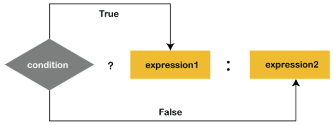

# Java Operators and Keywords

**Content**

1. Java Operators

        1.1 Arithmetic Operators

        1.2 Assignment Operators

        1.3 Arithmetic Assignment Operators

        1.4 Comparison/Relationl Operators

        1.5 Logical Operators

        1.6 Bitwise Operator

        1.7 Unary Operator

        1.8 Binary operator

        1.9 Ternary Operator (Conditional Operator)

2. Java Keywords

        2.1 List of Java Keywords

3. References

## 1. Java Operators

-   Operators are used to perform operations on variables and values.

**Example:** 2 + 3

Where:

    2, 3 are operands

    + is operator

**Java divides the operators into the following groups:**

1.  Arithmetic operators

2.  Assignment operators

3.  Comparison/Relational operators

4.  Logical operators

5.  Bitwise operators

**Other categorization of operators**

6.  Unary Operator

7.  Binary operator

8.  Ternary operator(conditional operator)

### 1.1 Arithmetic Operators

-   Arithmetic operators are used to perform common mathematical operations.

**A list of all Arithmetic operators:**

            | **Operator** | **Name**       | **Description**                  | **Example** |
            |--------------|----------------|----------------------------------|-------------|
            | +            | Addition       | Adds together two values         | x + y       |
            | -            | Subtraction    | Subtracts one value from another | x - y       |
            | \*           | Multiplication | Multiplies two values            | x \* y      |
            | /            | Division       | Divides one value by another     | x / y       |
            | %            | Modulus        | Returns the division remainder   | x % y       |

### 1.2 Assignment Operator

-   Assignment operator is used to assign values to variables.

**A list of all assignment operators:**

            | **Operator** | **Example** | **Same As**  |
            |--------------|-------------|--------------|
            | =            | x = 5       | x = 5        |
            | +=           | x += 3      | x = x + 3    |
            | -=           | x -= 3      | x = x - 3    |
            | \*=          | x \*= 3     | x = x \* 3   |
            | /=           | x /= 3      | x = x / 3    |
            | %=           | x %= 3      | x = x % 3    |
            | &=           | x &= 3      | x = x & 3    |
            | \|=          | x \|= 3     | x = x \| 3   |
            | \^=          | x \^= 3     | x = x \^ 3   |
            | \>\>=        | x \>\>= 3   | x = x \>\> 3 |
            | \<\<=        | x \<\<= 3   | x = x \<\< 3 |

### 1.3 Comparison/Relational Operators

-   Comparison operators are used to compare two values.

-   It returns Boolean value i.e., True or False.

**A list of all Comparison operators:**

            | **Operator** | **Name**                 | **Example** |
            |--------------|--------------------------|-------------|
            | ==           | Equal to                 | x == y      |
            | !=           | Not equal                | x != y      |
            | \>           | Greater than             | x \> y      |
            | \<           | Less than                | x \< y      |
            | \>=          | Greater than or equal to | x \>= y     |
            | \<=          | Less than or equal to    | x \<= y     |

### 1.4 Logical Operators

-   Logical operators are used to determine the logic between variables or values.

**A list of all Logical operators:**

            | **Operator** | **Name**    | **Description**                                         | **Example**          |
            |--------------|-------------|---------------------------------------------------------|----------------------|
            | &&           | Logical and | Returns true if both statements are true                | x \< 5 && x \< 10    |
            | ||           | Logical or  | Returns true if one of the statements is true           | x \< 5 \|\| x \< 4   |
            | !            | Logical not | Reverse the result, returns false if the result is true | !(x \< 5 && x \< 10) |

### 1.5 Bitwise Operator

-   Bitwise operators are used on (binary) numbers.

**There are five types of the bitwise operator in Java:**

-   Bitwise AND

-   Bitwise exclusive OR

-   Bitwise inclusive OR

-   Bitwise Compliment

-   Bit Shift Operators

            | **Operators**                 | **Symbol**       | **Uses**                  |
            |-------------------------------|------------------|---------------------------|
            | Bitwise AND                   | &                | op1 & op2                 |
            | Bitwise exclusive OR          | \^               | op1 \^ op2                |
            | Bitwise inclusive OR          | \|               | op1 \| op2                |
            | Bitwise Compliment            | \~               | \~ op                     |
            | Bitwise left shift            | \<\<             | op1 \<\< op2              |
            | Bitwise right shift           | \>\>             | op1 \>\> op2              |
            | Unsigned Right Shift Operator | \>\>\> op \>\>\> | number of places to shift |

#### 1.5.1 Bitwise AND (&)

-   It is a binary operator denoted by the symbol **&**.

-   It returns 1 if and only if both bits are 1, else returns 0.

        | **x** | **y** | **x & y** |
        |-------|-------|-----------|
        | 0     | 0     | 0         |
        | 0     | 1     | 0         |
        | 1     | 0     | 0         |
        | 1     | 1     | 1         |

#### 1.5.2 Bitwise exclusive OR (\^)

-   It is a binary operator denoted by the symbol **\^** (pronounced as caret).

-   It returns 0 if both bits are the same, else returns 1.

| **x** | **y** | **x \^ y** |
|-------|-------|------------|
| 0     | 0     | 0          |
| 0     | 1     | 1          |
| 1     | 0     | 1          |
| 1     | 1     | 0          |

#### 1.5.3 Bitwise inclusive OR (\|)

It is a binary operator denoted by the symbol **\|** (pronounced as a pipe). It returns 1 if either of the bit is 1, else returns 0.

| **x** | **y** | **x \| y** |
|-------|-------|------------|
| 0     | 0     | 0          |
| 0     | 1     | 1          |
| 1     | 0     | 1          |
| 1     | 1     | 1          |

#### 1.5.4 Bitwise Complement (\~)

-   It is a unary operator denoted by the symbol **\~** (pronounced as the tilde).

-   It returns the inverse or complement of the bit.

-   It makes every 0 a 1 and every 1 a 0.

| **x** | **y** |
|-------|-------|
| 0     | 0     |
| 1     | 1     |

### 1.5.5 Bit Shift Operators

-   Shift operator is used in shifting the bits either right or left.

-   We can use shift operators if we divide or multiply any number by 2.

-   The general format to shift the bit is as follows:

**Syntax**

    variable \<\< or \>\> number of places to shift;

**Example**

```Java 
    a>>2; //shifts two bits  
    a>>4; //shifts 4 bits   
```

**Java provides the following types of shift operators:**

-   Signed Right Shift Operator or Bitwise Right Shift Operator

-   Unsigned Right Shift Operator

-   Signed Left Shift Operator or Bitwise Left Shift Operator

#### **Note: Java does not support the unsigned left shift operator (\<\<\<).**

**1) Signed Right Shift Operator (\>\>)**

-   The signed right shift operator shifts a bit pattern of a number towards the **right** with a specified number of positions and fills 0.

-   The operator is denoted by the symbol **\>\>.**

-   It also preserves the leftmost bit (sign bit).

-   If **0** is presented at the leftmost bit, it means the number is **positive**.

-   If **1** is presented at the leftmost bit, it means the number is **negative**.

-   In general, if we write **a\>\>n**, it means to shift the bits of a number toward the right with a specified position (n).

-   In the terms of mathematics, we can represent the signed right shift operator as follows:

    `b = a >> n  b = a/2n`

#### **Note: When we apply right shift operator on a positive number, we get the positive number in the result also. Similarly, when we apply right shift operator on a negative number, we get the negative number in the result also.**

**2) Signed Left Shift Operator (\<\<)**

-   The signed left shift operator shifts a bit pattern to the **left**.

-   It is represented by the symbol **\<\<.**

-   It also preserves the leftmost bit (sign bit).

-   In general, if we write **a\<\<n**, it means to shift the bits of a number toward the left with specified position (n).

-   In the terms of mathematics, we can represent the signed right shift operator as follows:

    `b = a << n  b = a * (2n)`

**3) Unsigned Right Shift Operator (\>\>\>)**

-   The left operand value is moved right by the number of bits specified by the right operand and the shifted bits are filled up with **zeros**.

-   Excess bits shifted off to the right are discarded.

-   It is denoted by the symbol **\>\>\>.**

-   Note that the leftmost position after \>\> depends on the sign bit. It does not preserve the sign bit.

### 1.6 Unary Operator

-   The Java unary operators require only one operand.

-   Unary operators are used to perform various operations i.e.

1.  incrementing/decrementing a value by one

2.  negating an expression

3.  inverting the value of a Boolean

            | **Operator Type** | **Category** | **Precedence**                         |
            |-------------------|--------------|----------------------------------------|
            | Unary             | postfix      | *expr*++ *expr*--                      |
            |                   | prefix       | ++*expr* --*expr* +*expr* -*expr* \~ ! |

### 1.7 Binary Operator

-   It contains one operator and two operands

**Example:** 2 + 3

### 1.8 Ternary Operator (Conditional Operator)

-   The **ternary operator (? :)** is the only conditional operator that accepts three operands.

-   It is used to evaluate Boolean expressions.

-   The operator decides which value will be assigned to the variable.

-   It can be used instead of the if-else statement. It makes the code much more easy, readable, and shorter.

#### **Note: Every code using an if-else statement cannot be replaced with a ternary operator.**

### Syntax:

variable = (condition) ? expression1 : expression2

-   The above statement states that if the condition returns **true, expression1** gets executed, else the **expression2** gets executed and the final result stored in a variable.

    

**Example:**

```java
    int n1 = 50;
    int n2 = 70;
    int bigger = n1>n2?n1:n2;
```

**Output:**

```
    70
```

## 2. Java Keywords

-   Java keywords are also known as reserved words.

-   Keywords are particular words that act as a key to a code.

-   These are predefined words by Java so they cannot be used as a variable or object name or class name.

### 2.1 List of Java Keywords

A list of Java keywords or reserved words are given below:

**1) abstract:**

-   Java abstract keyword is used to declare an abstract class.

-   An abstract class can provide the implementation of the interface.

-   It can have abstract and non-abstract methods.

**2) boolean:**

-   Java boolean keyword is used to declare a variable as a boolean type.

-   It can hold True and False values only.

**3) break:**

-   Java break keyword is used to break the loop or switch statement.

-   It breaks the current flow of the program at specified conditions.

**4) byte:**

-   Java byte keyword is used to declare a variable that can hold 8-bit data values.

**5) case:**

-   Java case keyword is used with the switch statements to mark blocks of text.

**6) catch:**

-   Java catch keyword is used to catch the exceptions generated by try statements.

-   It must be used after the try block only.

**7) char:**

-   Java char keyword is used to declare a variable that can hold unsigned 16-bit Unicode characters

**8) class:**

-   Java class keyword is used to declare a class.

**9) continue:**

-   Java continue keyword is used to continue the loop.

-   It continues the current flow of the program and skips the remaining code at the specified condition.

**10) default:**

-   Java default keyword is used to specify the default block of code in a switch statement.

**11) do:**

-   Java do keyword is used in the control statement to declare a loop.

-   It can iterate a part of the program several times.

**12) double:**

-   Java double keyword is used to declare a variable that can hold 64-bit floating-point number.

**13) else:**

-   Java else keyword is used to indicate the alternative branches in an if statement.

**14) enum:**

-   Java enum keyword is used to define a fixed set of constants.

-   Enum constructors are always private or default.

**15) extends:**

-   Java extends keyword is used to indicate that a class is derived from another class or interface.

**16) final:**

-   Java final keyword is used to indicate that a variable holds a constant value.

-   It is used with a variable.

-   It is used to restrict the user from updating the value of the variable.

**17) finally:**

-   Java finally keyword indicates a block of code in a try-catch structure.

-   This block is always executed whether an exception is handled or not.

**18) float:**

-   Java float keyword is used to declare a variable that can hold a 32-bit floating-point number.

**19) for:**

-   Java for keyword is used to start a for loop.

-   It is used to execute a set of instructions/functions repeatedly when some condition becomes true.

-   If the number of iteration is fixed, it is recommended to use for loop.

**20) if:**

-   Java if keyword tests the condition.

-   It executes the if block if the condition is true.

**21) implements:**

-   Java implements keyword is used to implement an interface.

**22) import:**

-   Java import keyword makes classes and interfaces available and accessible to the current source code.

**23) instanceof:**

-   Java instanceof keyword is used to test whether the object is an instance of the specified class or implements an interface.

**24) int:**

-   Java int keyword is used to declare a variable that can hold a 32-bit signed integer.

**25) interface:**

-   Java interface keyword is used to declare an interface.

-   It can have only abstract methods.

**26) long:**

-   Java long keyword is used to declare a variable that can hold a 64-bit integer.

**27) native:**

-   Java native keyword is used to specify that a method is implemented in native code using JNI (Java Native Interface).

**28) new:**

-   Java new keyword is used to create new objects.

**29) null:**

-   Java null keyword is used to indicate that a reference does not refer to anything.

-   It removes the garbage value.

**30) package:**

-   Java package keyword is used to declare a Java package that includes the classes.

**31) private:**

-   Java private keyword is an access modifier.

-   It is used to indicate that a method or variable may be accessed only in the class in which it is declared.

**32) protected:**

-   Java protected keyword is an access modifier.

-   It can be accessible within the package and outside the package but through inheritance only.

-   It can't be applied with the class.

**33) public:**

-   Java public keyword is an access modifier.

-   It is used to indicate that an item is accessible anywhere.

-   It has the widest scope among all other modifiers.

**34) return:**

-   Java return keyword is used to return from a method when its execution is complete.

**35) short:**

-   Java short keyword is used to declare a variable that can hold a 16-bit integer.

**36) static:**

-   Java static keyword is used to indicate that a variable or method is a class method.

-   The static keyword in Java is mainly used for memory management.

**37) strictfp:**

-   Java strictfp is used to restrict the floating-point calculations to ensure portability.

**38) super:**

-   Java super keyword is a reference variable that is used to refer to parent class objects.

-   It can be used to invoke the immediate parent class method.

**39) switch:**

-   The Java switch keyword contains a switch statement that executes code based on test value.

-   The switch statement tests the equality of a variable against multiple values.

**40) synchronized:**

-   Java synchronized keyword is used to specify the critical sections or methods in multithreaded code.

**41) this:**

-   Java this keyword can be used to refer the current object in a method or constructor.

**42) throw:**

-   The Java throw keyword is used to explicitly throw an exception.

-   The throw keyword is mainly used to throw custom exceptions.

-   It is followed by an instance.

**43) throws:**

-   The Java throws keyword is used to declare an exception.

-   Checked exceptions can be propagated with throws.

**44) transient:**

-   Java transient keyword is used in serialization.

-   If you define any data member as transient, it will not be serialized.

**45) try:**

-   Java try keyword is used to start a block of code that will be tested for exceptions.

-   The try block must be followed by either catch or finally block.

**46) void:**

-   Java void keyword is used to specify that a method does not have a return value.

**47) volatile:**

-   Java volatile keyword is used to indicate that a variable may change asynchronously.

**48) while:**

-   Java while keyword is used to start a while loop.

-   This loop iterates a part of the program several times.

-   If the number of iteration is not fixed, it is recommended to use the while loop.

## 3. References

1.  https://www.w3schools.com/java/java_operators.asp

2.  https://www.javatpoint.com/bitwise-operator-in-java

3.  https://www.javatpoint.com/ternary-operator-in-java

4.  https://www.javatpoint.com/java-keywords
