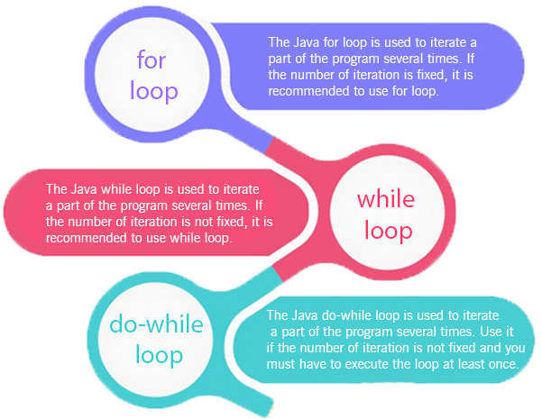
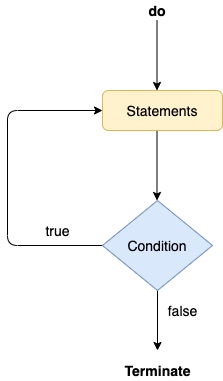

# Java Flow Control Statements

**Content**

1\. Java Flow Control Statements

1.1 Decision-Making Statements

1.1.1 If Statement

1.1.2 Switch Statement

1.2 Loop Statements

1.2.1 for Loop

1.2.2 for-each Loop

1.2.3 while Loop

1.2.4 do-while Loop

1.3 Jump Statements

1.3.1 break Statement

1.3.2 continue Statement

2\. References

## 1. Java Flow Control Statements

-   The statements inside your source files are generally executed from top to bottom, in the order that they appear.

-   *Control flow statements*, however, break up the flow of execution by employing decision making, looping, and branching, enabling your program to *conditionally* execute particular blocks of code.

-   It is one of the fundamental features of Java, which provides a smooth flow of program.

-   Java provides **three** types of control flow statements.


## 1.1. Decision-Making Statements

-   As the name suggests, decision-making statements decide which statement to execute and when.

-   Decision-making statements evaluate the boolean expression and control the program flow depending upon the result of the condition provided.

-   There are **two types** of **decision-making statements** in Java

    -   **if** statement

    -   **switch** statement.

### 1.1.1. if Statement

-   In Java, the "if" statement is used to evaluate a condition.

-   The control of the program is diverted depending upon the specific condition.

-   The condition of the ‘if’ statement gives a boolean value, either true or false.

-   In Java, there are **four types** of **if-statements** given below.

1.  Simple if statement

2.  if-else statement

3.  if-else-if ladder

4.  Nested if-statement

Let's understand the if-statements one by one.

#### 1) Simple if Statement

-   It is the most basic statement among all control flow statements in Java.

-   It evaluates a Boolean expression and enables the program to enter a block of code if the expression evaluates to true.

**Syntax:**

```java
if(test_expression) {
    statement 1;
    statement 2;
    ...
}
```

**Flowchart of Simple if statement:**


**Example:**

```java
public class Sample {
   public static void main(String args[]){
      int a=20, b=30;
      if(b>a)
         System.out.println("b is greater");
      }
}
```

**Ouput:**

```
b is greater
```

#### 2) if-else Statement

-   The if-else statement is an extension to the if-statement, which uses another block of code, i.e., else block.

-   The else block is executed if the condition of the if-block is evaluated as false.

**Syntax:**

```java
if(test_expression) {
   //execute your code
}
else {
   //execute your code
}
```

**Flow chart of if-else statement:**


**Example:**

```java
public class Sample {
 public static void main(String args[]) {
  int a = 80, b = 30;
  if (b > a) {
   System.out.println("b is greater");
  } else {
   System.out.println("a is greater");
  }
 }
}
```

**Output:**

```
a is greater
```

#### 3) if-else-if ladder Statement

-   The if-else-if statement contains the if-statement followed by multiple else-if statements.

-   In other words, we can say that it is the chain of if-else statements that create a decision tree where the program may enter in the block of code where the condition is true.

-   We can also define an else statement at the end of the chain.

**Syntax:**

```java
if(test_expression) {
   //execute your code
} else if(test_expression n) {
   //execute your code
} else {
   //execute your code
}
```

**Flow chart of if-else-if statement:**


**Example:**

```java
public class Sample {
    public static void main(String args[]) {
        int a = 30, b = 30;

        if (b > a) {
            System.out.println("b is greater");
        } else if(a > b){
            System.out.println("a is greater");
        } else {
            System.out.println("Both are equal");
        }
    }
}
```

**Output:**

```
Both are equal
```

#### 4) Nested if-statement

-   In nested if-statements, the **if statement** can **contains** an **if** or **if-else** statement **inside another** **if or else-if** statement.

**Example:**

```java
public class Test {
   public static void main(String args[]) {
      int x = 30;
      int y = 10;
      if( x == 30 ) {
         if( y == 10 ) {
            System.out.print("X = 30 and Y = 10");
         }
      }
   }
}
```

**Output:**

```
X = 30 and Y = 10
```

### 1.1.2. Switch Statement

-   In Java, Switch statements are similar to if-else-if statements.

-   The switch statement contains multiple blocks of code called cases and a single case is executed based on the variable which is being switched.

-   The switch statement is easier to use instead of if-else-if statements.

-   It also enhances the readability of the program.

**Syntax:**

```java
switch(variable){
    case 1:
        //execute your code
        break;
    case n:
        //execute your code
        break;
    default:
        //execute your code
break;
}
```

**Flow chart of switch-case:**

****

**Important Points to be noted about switch statement:**

-   The case variables can be int, short, byte, char, or enumeration. String type is also supported since version 7 of Java.

-   Cases cannot be duplicate.

-   Default statement is executed when any of the case doesn't match the value of expression. It is optional.

-   Break statement terminates the switch block when the condition is satisfied.  
    It is optional, if not used, next case is executed.

-   While using switch statements, we must notice that the case expression will be of the same type as the variable. However, it will also be a constant value.

**Example:**

```java
public class Sample {
 public static void main(String args[]) {
  int a = 5;

  switch (a) {
   case 1:
    System.out.println("You chose One");
    break;

   case 2:
    System.out.println("You chose Two");
    break;

   case 3:
    System.out.println("You chose Three");
    break;

   case 4:
    System.out.println("You chose Four");
    break;

   case 5:
    System.out.println("You chose Five");
    break;

   default:
    System.out.println("Invalid Choice. Enter a no between 1 and 5");
    break;
  }
 }
}
```

**Output:**

```
You chose Five
```

## 1.2. Loop Statements

-   A computer is the most suitable machine to perform repetitive tasks and can tirelessly do a task tens of thousands of times.

-   Every programming language has the feature to instruct to do such repetitive tasks with the help of certain form of statements.

-   The process of repeatedly executing a collection of statement is called **looping.**

-   The statements get executed many numbers of times based on the condition.

-   But if the condition is given in such logic that the repetition continues any number of times with no fixed condition to stop looping those statements, then this type of looping is called **infinite looping**.

-   Java supports many looping features which enable programmers to develop concise Java programs with repetitive processes.

-   Java supports following types of loops:



Let's understand the loop statements one by one.

### 1.2.1. for Loop

-   The Java *for loop* is used to iterate a part of the program several times.

-   If the number of iteration is **fixed**, it is recommended to use for loop.

-   There are three types of for loops in Java.

    -   Simple for Loop

    -   For-each or Enhanced for Loop

    -   Labelled for Loop

    -   Infinitive for Loop

#### 1) Simple for Loop

-   A simple for loop is the same as in C/C++.

-   We can initialize the variable, check condition and increment/decrement value.

-   It consists of **four parts**:

1.  **Initialization**: Which is executed once when the loop starts. Here, we can initialize the variable, or we can use an already initialized variable.

2.  **Condition**: Which is executed each time to test the condition of the loop. It continues execution until the condition is false. It must return boolean value either true or false.

3.  **Increment/Decrement**: It increments or decrements the variable value.

4.  **Statement**: The statement of the loop is executed each time until the second condition is false.

**Syntax:**

```java
for(initialization, condition, increment/decrement) {    
//block of statements    
}    
```

**Flowchart of for loop:**

**Example:**

```java
public class Calculation {  
    public static void main(String[] args) {   
        int sum = 0;  
        for(int j = 1; j<=10; j++) {  
            sum = sum + j;  
        }  
        System.out.println("The sum of first 10 natural numbers is " + sum);  
    }  
}  
```

**Output:**

```
The sum of first 10 natural numbers is 55
```

#### 2) for-each Loop

-   Java provides an enhanced for loop to traverse the data structures like array or collection.

-   It is easier to use than simple for loop because we don't need to increment value and use subscript notation.

-   It works on the basis of elements and not the index.

-   It returns element one by one in the defined variable.

-   In the for-each loop, we don't need to update the loop variable.

**Syntax:**

```java
for(data_type var : array_name/collection_name){
    //statements
}
```

**Example:**

```java
public class Calculation {    
    public static void main(String[] args) {    
        String[] names = {"Java","C","C++","Python","JavaScript"};    
        System.out.println("Printing the content of the array names:\n");    
        for(String name:names) {    
            System.out.println(name);    
        }    
    }    
}    
```

**Output:**

```
Printing the content of the array names:

Java
C
C++
Python
JavaScript
```

#### 3) Labeled For Loop

-   A **label** is a valid variable name that denotes the name of the loop to where the control of execution should jump.

-   To label a loop, place the label before the loop with a colon at the end. Therefore, a loop with the label is called a **labeled loop**.

-   We can use label before the for loop.

-   It is useful while using the nested for loop as we can break/continue specific for loop.

**Syntax:**

```java
labelname:    
for(initialization; condition; incr/decr)  {    
    //functionality of the loop    
}    
```

**Example:**

```java
public class LabeledForLoop {  
    public static void main(String args[]) {  
        //outer loop  
        outer:     //label  
        for(int i=1;i<=5;i++) {  
            System.out.println();  
            //inner loop  
            inner:      //label  
            for(int j=1;j<=10;j++) {  
                System.out.print(j + " ");  
                if(j==9)  
                    break inner;      
            }  
        }  
    }  
}  
```

**Output:**

```
1 2 3 4 5 6 7 8 9 
1 2 3 4 5 6 7 8 9 
1 2 3 4 5 6 7 8 9 
1 2 3 4 5 6 7 8 9 
1 2 3 4 5 6 7 8 9
```

#### 4) Infinitive for Loop

-   If you use two semicolons ;; in the for loop, it will be infinitive for loop.

**Syntax:**

```java
for(;;){  
    //code to be executed  
}  
```

**Example:**

```java
//Java program to demonstrate the use of infinite for loop  
//which prints an statement  
public class ForExample {  
    public static void main(String[] args) {  
        //Using no condition in for loop  
        for(;;){  
            System.out.println("infinitive loop");  
        }  
    }  
}  
```

**Output:**

```
infinitive loop
infinitive loop
infinitive loop
infinitive loop
infinitive loop
ctrl+c
```

-   Now, you need to press ctrl+c to exit from the program.

### 1.2.2. while Loop

-   The while loop is also used to iterate over the number of statements multiple times.

-   However, if we don't know the number of iterations in advance, it is recommended to use a while loop.

-   Unlike for loop, the initialization and increment/decrement doesn't take place inside the loop statement in while loop.

-   It is also known as the **entry-controlled loop** since the condition is checked at the start of the loop.

-   If the condition is true, then the loop body will be executed; otherwise, the statements after the loop will be executed.

**Syntax:**

```java
while(condition){    
    //looping statements    
}    
```

**Flow chart of while loop:**


**Example:**

```java
public class Calculation {    
    public static void main(String[] args) {    
        int i = 0;    
        System.out.println("Printing the list of first 10 even numbers \n");    
        while(i<=10) {    
            System.out.println(i);    
            i = i + 2;    
        }    
    }    
}    
```

**Output:**

```
Printing the list of first 10 even numbers 

0
2
4
6
8
10
```

### 1.2.3. do-while Loop

-   The do-while loop checks the condition at the end of the loop after executing the loop statements.

-   When the number of iteration is not known and we have to execute the loop at least once, we can use do-while loop.

-   It is also known as the **exit-controlled loop** since the condition is not checked in advance.

**Syntax:**

```java
do {
    //statements
} while(condition);
```

**Flowchart of do…while loop:**



**Example:**

```java
public class Calculation {    
    public static void main(String[] args) {    
        int i = 0;    
        System.out.println("Printing the list of first 10 even numbers \n");    
        do {    
            System.out.println(i);    
            i = i + 2;    
        }while(i<=10);    
    }    
}    
```

**Output**

```
Printing the list of first 10 even numbers 
0
2
4
6
8
10
```

## Java for Loop Vs while Loop Vs do-while Loop

| **Comparison**           | **for loop**                                                                                               | **while loop**                                                                 | **do-while loop**                                                                                                                                         |
|--------------------------|------------------------------------------------------------------------------------------------------------|--------------------------------------------------------------------------------|-----------------------------------------------------------------------------------------------------------------------------------------------------------|
| **Introduction**         | It iterates a block of code for a known number of times which is known to the programmer                   | This iterates a block of code based on the output of a boolean condition       | It is similar to the while loop except the fact that it checks for the condition after the statement is executed for that particular iteration.           |
| **When to use**          | It should be used when the number of iterations is constant and known before the execution of the program. | When the number of iterations is not fixed, while loop can be used to iterate. | If there is a necessity for executing the loop at least once whilst having no knowledge about the number of iterations, the do while loop has to be used. |
| **Syntax**               | for(initializing statement;testing condition;increment/decrement) { //code to be iterated }                | while(boolean condition) { //statements; }                                     | do { //statements } while(boolean condition);                                                                                                             |
| **Example**              | for(i=1;i\<5;i++) { System.out.println(“Hello”); }                                                         | while(a\<10) { a++; }                                                          | do { a++; } while(a\<10)                                                                                                                                  |
| **Infinite Loop Syntax** | for(;;) { //code }                                                                                         | while(true) { //code }                                                         | do { //code } while(true);                                                                                                                                |

## 1.3. Jump Statements

-   Jump statements are used to transfer the control of the program to the specific statements.

-   In other words, jump statements transfer the execution control to the other part of the program.

-   There are **two types** of **jump** statements in Java.

```
1.  break

2.  continue
```

### 1.3.1. break Statement

-   As the name suggests, the break statement is used to break the current flow of the program and transfer the control to the next statement outside a loop or switch statement.

-   However, it breaks only the inner loop in the case of the nested loop.

-   We can use Java break statement in all types of loops such as for loop, while loop and do-while loop.

-   The break statement cannot be used independently in the Java program, i.e., it can only be written inside the loop or switch statement.

**Example:**

```java
public class BreakExample {  
    public static void main(String[] args) {  
        for(int i = 0; i<= 10; i++) {  
            System.out.println(i);  
            if(i==6) {  
                break;  
            }  
        }  
    }  
}  
```

**Output:**

```
0
1
2
3
4
5
6
```

### 1.3.2. continue Statement

-   Unlike break statement, the continue statement doesn't break the loop, whereas, it skips the specific part of the loop and jumps to the next iteration of the loop immediately.

-   The Java *continue statement* is used to continue the loop.

-   It continues the current flow of the program and skips the remaining code at the specified condition.

-   In case of an inner loop, it continues the inner loop only.

-   We can use Java continue statement in all types of loops such as for loop, while loop and do-while loop.

**Example:**

```java
public class ContinueExample {  
    public static void main(String[] args) {  
        for(int i = 0; i<= 2; i++) {    
            for (int j = i; j<=5; j++) {  
            if(j == 4) {  
                continue;  
            }  
            System.out.println(j);  
            }  
        }  
    }  
}  
```

**Output:**

```
0
1
2
3
5
1
2
3
5
2
3
5
```

-   As you can see in the above output, 5 is not printed on the console. It is because the loop is continued when it reaches to 5.

## 2. References

1.  https://www.javatpoint.com/control-flow-in-java
