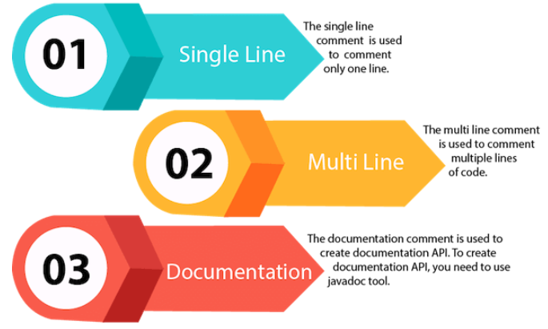
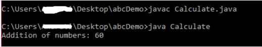
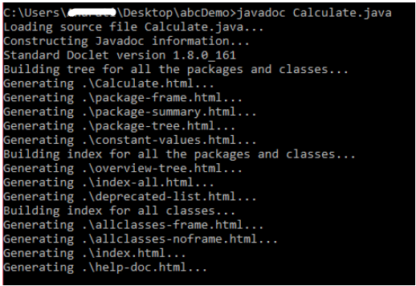

# Coding Conventions for Java Programming Language

**Content**

1\. Introduction

2\. File Organization

3 Indentation

4\. Comments

5\. Declarations

6\. Statements

7\. White Space

8\. Naming Conventions

9\. Programming Practices

10\. References

## 1. Introduction

-   The quality of code development has several aspects, so adhering to certain rules when writing code is important.

-   This applies not only to formatting but also to many other factors, determined by the corresponding coding convention for the selected programming language and the selected development framework.

**What is Coding Conventions?**

Coding conventions are **a set of guidelines for a specific programming language that recommend programming style, practices, and methods for each aspect of a program written in that language**.

Typically, a coding convention standard describes:

-   ways of choosing names and the used case of characters for variable names and other identifiers:

-   writing the type of the variable in its identifier (Hungarian notation) and a cast of characters (lower, upper, "camel", "camel" with a lowercase letter), the use of underscores to separate words;

-   indentation style for logical blocks - whether tabs are used, indent width;

-   a method for placing brackets bounding logical blocks;

-   the use of spaces in the design of logical and arithmetic expressions;

-   comment style and the use of documentary comments;

-   variable, class and file naming conventions;

-   statement style and best practices of their usage;

-   file organization;

-   declaration of classes and interfaces;

-   programming practices.

Outside of the standard, the following are implied:

-   lack of magic numbers;

-   restriction of the size of the code horizontally (so that it fits on the screen) and vertical (so that all the code of the file is held in memory)

-   as well as a function or method to the size of one screen (for some programming languages).

Coding rules are “must have” in modern software development. This means that it is better to write programming code a little bit slower than usual, but according to all requirements from the coding conventions. Then you will write code in the style of required coding conventions and the process will be done at the same speed. But the quality of code will be much much better.

**Why use coding Conventions**

Coding standards are important for software developers for several reasons:

-   40% - 80% of the total cost of software is spent on its maintenance.

-   Software is almost never fully supported by its original author.

-   Coding standards improve software readability by allowing developers to understand new code faster and better.

-   Like any other product, the software must be "well packaged" and clean.

The main reasons for using the coding convention are as follows:

-   The same rules for writing code make it easy for other colleagues to understand

-   It is easier to understand the code in a year or 5 without the need to read each term

-   You always know where certain classes and files are in a huge project

In general, this is the cleanness of the code, which simply speeds up the work. This can be compared to a desktop: if everything is neatly arranged, it is easy to work. If there is a mess, then every little thing takes a long time to find.

Very often Coding Conventions for each team are different, and sometimes very different from project to project. We need them so that other developers can easily figure out the code and in general, the code written by different team members looks the same within the project and is maintainable and supportable.

For various programming languages, there are coding conventions. These coding conventions are not absolute. In each project and in each company, standards can be developed for the coding convention.

## 2. File Organization

-   A file consists of sections that should be separated by blank lines and an optional comment identifying each section.

-   Files longer than 2000 lines are cumbersome and should be avoided.

### 2.1 Java Source Files

-   Each Java source file contains a single public class or interface.

-   When private classes and interfaces are associated with a public class, you can put them in the same source file as the public class.

-   The public class should be the first class or interface in the file.

**Java source files have the following ordering:**

-   Beginning comments

-   Package and Import statements

-   Class and interface declarations

#### 2.1.1 Beginning Comments

-   All source files should begin with a c-style comment that lists the class name, version information, date, and copyright notice:

```java
/*

 * Classname
 * 
 * Version information
 *
 * Date
 * 
 * Copyright notice
 */
```

#### 

#### 2.1.2 Package and Import Statements

-   The first non-comment line of most Java source files is a package statement.

-   After that, import statements can follow.

**Example:**

```java
package java.awt;
import java.awt.peer.CanvasPeer;
```

#### 2.1.3 Class and Interface Declarations

-   The following table describes the parts of a class or interface declaration, in the order that they should appear.

|   | **Part of Class/Interface Declaration**                           | **Notes**                                                                                                                                                                                                                                 |
|---|-------------------------------------------------------------------|-------------------------------------------------------------------------------------------------------------------------------------------------------------------------------------------------------------------------------------------|
| 1 | Class/interface documentation comment ( /\*\*...\*/)              | Class or interface documentation comment                                                                                                                                                                                                  |
| 2 | class or interface statement                                      | class or interface statement                                                                                                                                                                                                              |
| 3 | Class/interface implementation comment ( /\*...\*/), if necessary | This comment should contain any class-wide or interface-wide information that wasn't appropriate for the class/interface documentation comment.                                                                                           |
| 4 | Class ( static) variables                                         | First the public class variables, then the protected, then package level (no access modifier), and then the private.                                                                                                                      |
| 5 | Instance variables                                                | First public, then protected, then package level (no access modifier), and then private.                                                                                                                                                  |
| 6 | Constructors                                                      |                                                                                                                                                                                                                                           |
| 7 | Methods                                                           | These methods should be grouped by functionality rather than by scope or accessibility. For example, a private class method can be in between two public instance methods. The goal is to make reading and understanding the code easier. |

## 3. Indentation

-   Four spaces should be used as the unit of indentation.

-   The exact construction of the indentation (spaces vs. tabs) is unspecified.

-   Tabs must be set exactly every 8 spaces (not 4).

### 3.1 Line Length

-   Avoid lines longer than 80 characters, since they're not handled well by many terminals and tools.

**Note:** Examples for use in documentation should have a shorter line length-generally no more than 70 characters.

### 3.2 Wrapping Lines

When an expression will not fit on a single line, break it according to these general principles:

-   Break after a comma.

-   Break before an operator.

-   Prefer higher-level breaks to lower-level breaks.

-   Align the new line with the beginning of the expression at the same level on the previous line.

-   If the above rules lead to confusing code or to code that's squished up against the right margin, just indent 8 spaces instead.

-   For example, on this topic. Please click the [link.](https://www.oracle.com/java/technologies/javase/codeconventions-indentation.html)

## 4. Comments

-   The Java comments are the statements in a program that are not executed by the compiler and interpreter.

**Why do we use comments in a code?**

-   Comments are used to make the program more readable by adding the details of the code.

-   It makes easy to maintain the code and to find the errors easily.

-   The comments can be used to provide information or explanation about the variable, method, class, or any statement.

-   It can also be used to prevent the execution of program code while testing the alternative code.

### 4.1. Types of Java Comments

**There are three types of comments in Java.**



#### 4.1.1 Single Line Comment

-   The single-line comment is used to comment only one line of the code.

-   It is the widely used and easiest way of commenting the statements.

-   Single line comments starts with two forward slashes **(//)**.

-   Any text in front of // is not executed by Java.

**Syntax:**

```java
//This is single line comment
```

**Example:**

```java
public class CommentExample1{
	public static void main(String[] args){
		int i = 10; // i is a variable with value 10 
		System.out.println(i); //printing the variable i
	}
}
```

**Output:**

```java
	10
```

#### 4.1.2 Multi Line Comment

-   The multi-line comment is used to comment multiple lines of code.

-   It can be used to explain a complex code snippet or to comment multiple lines of code at a time (as it will be difficult to use single-line comments there).

-   Multi-line comments are placed between /\* and \*/. Any text between /\* and \*/ is not executed by Java.

**Syntax:**

```java
/*
This
is
multi line 
comment
*/
```

**Example:**

```java
public class CommentExample2 {    
public static void main(String[] args) {    
/* Let's declare and  
 print variable in java. */    
  int i=10;    
    System.out.println(i);    
/* float j = 5.9; 
    float k = 4.4; 
    System.out.println( j + k ); */    
}    
}    
```

**Output:**

```java
10
```

Note: Usually // is used for short comments and /\* \*/ is used for longer comments.

#### 4.1.3 Documentation Comment

-   Documentation comments are usually used to write large programs for a project or software application as it helps to create documentation API.

-   These APIs are needed for reference, i.e., which classes, methods, arguments, etc., are used in the code.

-   To create documentation API, we need to use the **javadoc tool**.

-   The documentation comments are placed between /\*\* and \*/.

**Syntax:**

```java
/**  
* 
*We can use various tags to depict the parameter 
*or heading or author name 
*We can also use HTML tags   
* 
*/    
```

**Example:**

```java
import java.io.*;  
  
/** 
 * <h2> Calculation of numbers </h2> 
 * This program implements an application 
 * to perform operation such as addition of numbers  
 * and print the result  
 * <p> 
 * <b>Note:</b> Comments make the code readable and  
 * easy to understand. 
 *  
 * @author Anurati  
 * @version 16.0 
 * @since 2021-07-06 
 */  
   
 public class Calculate{  
    /** 
     * This method calculates the summation of two integers. 
     * @param input1 This is the first parameter to sum() method 
     * @param input2 This is the second parameter to the sum() method. 
     * @return int This returns the addition of input1 and input2 
     */  
    public int sum(int input1, int input2){  
        return input1 + input2;  
    }  
    /** 
    * This is the main method uses of sum() method. 
    * @param args Unused 
    * @see IOException  
    */    
    public static void main(String[] args) {  
        Calculate obj = new Calculate();  
        int result = obj.sum(40, 20);  
  
        System.out.println("Addition of numbers: " + result);  
    }    
 }   
```

**Output:**



-   Create documentation API by **javadoc** tool:



-   Now, the HTML files are created for the **Calculate** class in the current directory, i.e., **abcDemo**.

-   Open the HTML files, and we can see the explanation of Calculate class provided through the documentation comment.

**Are Java comments executable?**

-   Java comments are not executed by the compiler or interpreter, however, before the lexical transformation of code in compiler, contents of the code are encoded into ASCII in order to make the processing easy.

## 5. Declarations

### 5.1 Number per Line

-   One declaration per line is recommended since it encourages commenting.

```java
int level; // indentation level
int size; // size of table
```

is preferred over

```java
int level, size;
```

-   Do not put different types on the same line.

**Example:**

```java
int foo, fooarray[]; //WRONG!
```

**Note:** The examples above use one space between the type and the identifier.

-   Another acceptable alternative is to use tabs.

**Example:**

```java
int     level;          // indentation level
int     size;            // size of table
Object  currentEntry;    // currently selected table entry
```

### 5.2 Initialization

-   Try to initialize local variables where they're declared.

-   The only reason not to initialize a variable where it's declared is if the initial value depends on some computation occurring first.

### 5.3 Placement

-   Put declarations only at the beginning of blocks. (A block is any code surrounded by curly braces "{" and "}".)

-   Don't wait to declare variables until their first use; it can confuse the unwary programmer and hamper code portability within the scope.

```java
void myMethod() {
    int int1 = 0;         // beginning of method block
    if (condition) {
        int int2 = 0;     // beginning of "if" block
        ...
    }
}
```

-   The one exception to the rule is indexes of for loops, which in Java can be declared in the for statement:

```java
for (int i = 0; i < maxLoops; i++) { ... }
```

-   Avoid local declarations that hide declarations at higher levels.

-   For example, do not declare the same variable name in an inner block:

```java
int count;
...
myMethod() {
    if (condition) {
        int count = 0;     // AVOID!
        ...
    }
    ...
}
```

### 5.4 Class and Interface Declarations

When coding Java classes and interfaces, the following formatting rules should be followed:

-   No space between a method name and the parenthesis "(" starting its parameter list

-   Open brace "{" appears at the end of the same line as the declaration statement

-   Closing brace "}" starts a line by itself indented to match its corresponding opening statement, except when it is a null statement the "}" should appear immediately after the "{".

**Example:**

```java
class Sample extends Object {
    int ivar1;
    int ivar2;

    Sample(int i, int j) {
        ivar1 = i;
        ivar2 = j;
    }

    int emptyMethod() {}
    ...
}
```

Methods are separated by a blank line

## 6. Statements

### 6.1 Simple Statements

-   Each line should contain at most one statement.

**Example:**

```java
argv++; // Correct
argc--; // Correct
argv++; argc--; // AVOID!
```

### 6.2 Compound Statements

-   Compound statements are statements that contain lists of statements enclosed in braces "{ statements }".

See the following sections for examples.

-   The enclosed statements should be indented one more level than the compound statement.

-   The opening brace should be at the end of the line that begins the compound statement; the closing brace should begin a line and be indented to the beginning of the compound statement.

-   Braces are used around all statements, even single statements, when they are part of a control structure, such as an if-else or for statement. This makes it easier to add statements without accidentally introducing bugs due to forgetting to add braces.

### 6.3 return Statements

-   A return statement with a value should not use parentheses unless they make the return value more obvious in some way.

**Example:**

```java
return;
return myDisk.size();
return (size ? size : defaultSize);
```

-   For more information, [click here](https://www.oracle.com/java/technologies/javase/codeconventions-statements.html).

## 7. White Space

### 7.1 Blank Lines

-   Blank lines improve readability by setting off sections of code that are logically related.

**Two blank lines should always be used in the following circumstances:**

-   Between sections of a source file

-   Between class and interface definitions

**One blank line should always be used in the following circumstances:**

-   Between methods

-   Between the local variables in a method and its first statement

-   Before a block or single-line comment

-   Between logical sections inside a method to improve readability

### 7.2 Blank Spaces

**Blank spaces should be used in the following circumstances:**

-   A keyword followed by a parenthesis should be separated by a space.

**Example:**

```java
    while (true) {
        ...
    }
```

**Note** that a blank space should not be used between a method name and its opening parenthesis. This helps to distinguish keywords from method calls.

-   A blank space should appear after commas in argument lists.

-   All binary operators except . should be separated from their operands by spaces.

-   Blank spaces should never separate unary operators such as unary minus, increment ("++"), and decrement ("--") from their operands.

**Example:**

```java
a += c + d;
a = (a + b) / (c * d);
    
while (d++ = s++) {
	n++;
}
printSize("size is " + foo + "\n");
```

-   The expressions in a for statement should be separated by blank spaces.

**Example:**

for (expr1; expr2; expr3)

-   Casts should be followed by a blank space.

**Examples:**

```java
myMethod((byte) aNum, (Object) x);
myMethod((int) (cp + 5), ((int) (i + 3)) + 1);
```

## 8. Naming Conventions

-   Naming conventions make programs more understandable by making them easier to read.

-   They can also give information about the function of the identifier.

-   for example, whether it's a constant, package, or class-which can be helpful in understanding the code.

| **Identifier Type** | **Rules for Naming**                                                                                                                                                                                                                                                                                                                                                                                                                                                                                                                                                                                                                                   | **Examples**                                                                                        |
|---------------------|--------------------------------------------------------------------------------------------------------------------------------------------------------------------------------------------------------------------------------------------------------------------------------------------------------------------------------------------------------------------------------------------------------------------------------------------------------------------------------------------------------------------------------------------------------------------------------------------------------------------------------------------------------|-----------------------------------------------------------------------------------------------------|
| Packages            | The prefix of a unique package name is always written in all-lowercase ASCII letters and should be one of the top-level domain names, currently com, edu, gov, mil, net, org, or one of the English two-letter codes identifying countries as specified in ISO Standard 3166, 1981. Subsequent components of the package name vary according to an organization's own internal naming conventions. Such conventions might specify that certain directory name components be division, department, project, machine, or login names.                                                                                                                    | com.sun.eng com.apple.quicktime.v2 edu.cmu.cs.bovik.cheese                                          |
| Classes             | Class names should be nouns, in mixed case with the first letter of each internal word capitalized. Try to keep your class names simple and descriptive. Use whole words-avoid acronyms and abbreviations (unless the abbreviation is much more widely used than the long form, such as URL or HTML).                                                                                                                                                                                                                                                                                                                                                  | class Raster; class ImageSprite;                                                                    |
| Interfaces          | Interface names should be capitalized like class names.                                                                                                                                                                                                                                                                                                                                                                                                                                                                                                                                                                                                | interface RasterDelegate; interface Storing;                                                        |
| Methods             | Methods should be verbs, in mixed case with the first letter lowercase, with the first letter of each internal word capitalized.                                                                                                                                                                                                                                                                                                                                                                                                                                                                                                                       | run(); runFast(); getBackground();                                                                  |
| Variables           | Except for variables, all instance, class, and class constants are in mixed case with a lowercase first letter. Internal words start with capital letters. Variable names should not start with underscore \_ or dollar sign \$ characters, even though both are allowed. Variable names should be short yet meaningful. The choice of a variable name should be mnemonic- that is, designed to indicate to the casual observer the intent of its use. One-character variable names should be avoided except for temporary "throwaway" variables. Common names for temporary variables are i, j, k, m, and n for integers; c, d, and e for characters. | Copy Copied to Clipboard Error: Could not Copy int i;  char c; float myWidth;                       |
| Constants           | The names of variables declared class constants and of ANSI constants should be all uppercase with words separated by underscores ("_"). (ANSI constants should be avoided, for ease of debugging.)                                                                                                                                                                                                                                                                                                                                                                                                                                                    | static final int MIN_WIDTH = 4; static final int MAX_WIDTH = 999; static final int GET_THE_CPU = 1; |

## 9. Programming Practices

### 9.1 Providing Access to Instance and Class Variables

-   Don't make any instance or class variable public without good reason.

-   Often, instance variables don't need to be explicitly set or gotten-often that happens as a side effect of method calls.

-   Example of appropriate public instance variables is the case where the class is essentially a data structure, with no behavior.

-   In other words, if you would have used a struct instead of a class (if Java supported struct), then it's appropriate to make the class's instance variables public.

### 9.2 Referring to Class Variables and Methods

-   Avoid using an object to access a class (static) variable or method. Use a class name instead.

**Example:**

```java
classMethod(); //OK
AClass.classMethod(); //OK
anObject.classMethod(); //AVOID!
```

### 9.3 Constants

-   Numerical constants (literals) should not be coded directly, except for -1, 0, and 1, which can appear in a for loop as counter values.

### 9.4 Variable Assignments

-   Avoid assigning several variables to the same value in a single statement.

-   It is hard to read.

Example:

```java
fooBar.fChar = barFoo.lchar = 'c'; // AVOID!
```

-   Do not use the assignment operator in a place where it can be easily confused with the equality operator.

**Example:**

```java
if (c++ = d++) { // AVOID! (Java disallows)
...
}
```

should be written as

```java
if ((c++ = d++) != 0) {
...
}
```

-   Do not use embedded assignments in an attempt to improve run-time performance. This is the job of the compiler.

**Example:**

```java
d = (a = b + c) + r; // AVOID!
```

should be written as

```java
a = b + c;
d = a + r;
```

### 9.5 Miscellaneous Practices

#### 9.5.1 Parentheses

-   It is generally a good idea to use parentheses liberally in expressions involving mixed operators to avoid operator precedence problems.

-   Even if the operator precedence seems clear to you, it might not be to others-you shouldn't assume that other programmers know precedence as well as you do.

```java
if (a == b && c == d) // AVOID!
if ((a == b) && (c == d)) // RIGHT
```

#### 9.5.2 Returning Values

-   Try to make the structure of your program match the intent.

**Example:**

```java
if (booleanExpression) {
    return true;
} else {
    return false;
}
```

should instead be written as

```java
return booleanExpression;
```

Similarly,

```Java
if (condition) {
    return x;
}
return y;
```

should be written as

```java
return (condition ? x : y);
```

#### 9.5.3 Expressions before \`?' in the Conditional Operator

-   If an expression containing a binary operator appears before the ? in the ternary ?: operator, it should be parenthesized.

**Example:**

```java
(x >= 0) ? x : -x;
```

## 10. References

1.  https://www.javatpoint.com/java-comments

2.  https://www.oracle.com/java/technologies/javase/codeconventions-introduction.html
