# Code Conventions for the Java Programming Language

**Content**

1\. **Introduction**

2\. File Organization

3 Indentation

4\. Java Comments

5\. Declarations

6\. Statements

## 1. Introduction

**Why Have Code Conventions**

Code conventions are important to programmers for a number of reasons:

-   80% of the lifetime cost of a piece of software goes to maintenance.
-   Hardly any software is maintained for its whole life by the original author.
-   Code conventions improve the readability of the software, allowing engineers to understand new code more quickly and thoroughly.
-   If you ship your source code as a product, you need to make sure it is as well packaged and clean as any other product you create.

## 2. File Organization

-   A file consists of sections that should be separated by blank lines and an optional comment identifying each section.
-   Files longer than 2000 lines are cumbersome and should be avoided.

## 2.1 Java Source Files

-   Each Java source file contains a single public class or interface.
-   When private classes and interfaces are associated with a public class, you can put them in the same source file as the public class.
-   The public class should be the first class or interface in the file.

**Java source files have the following ordering:**

-   Beginning comments
-   Package and Import statements
-   Class and interface declarations

## 2.1.1 Beginning Comments

-   All source files should begin with a c-style comment that lists the class name, version information, date, and copyright notice:

#### 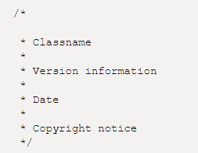

## 2.1.2 Package and Import Statements

-   The first non-comment line of most Java source files is a package statement.
-   After that, import statements can follow.

**Example:**

#### 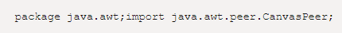

## 2.1.3 Class and Interface Declarations

-   The following table describes the parts of a class or interface declaration, in the order that they should appear.

|   | **Part of Class/Interface Declaration**                           | **Notes**                                                                                                                                                                                                                                 |
|---|-------------------------------------------------------------------|-------------------------------------------------------------------------------------------------------------------------------------------------------------------------------------------------------------------------------------------|
| 1 | Class/interface documentation comment ( /\*\*...\*/)              |                                                                                                                                                                                                                                           |
| 2 | class or interface statement                                      |                                                                                                                                                                                                                                           |
| 3 | Class/interface implementation comment ( /\*...\*/), if necessary | This comment should contain any class-wide or interface-wide information that wasn't appropriate for the class/interface documentation comment.                                                                                           |
| 4 | Class ( static) variables                                         | First the public class variables, then the protected, then package level (no access modifier), and then the private.                                                                                                                      |
| 5 | Instance variables                                                | First public, then protected, then package level (no access modifier), and then private.                                                                                                                                                  |
| 6 | Constructors                                                      |                                                                                                                                                                                                                                           |
| 7 | Methods                                                           | These methods should be grouped by functionality rather than by scope or accessibility. For example, a private class method can be in between two public instance methods. The goal is to make reading and understanding the code easier. |

## 3 Indentation

-   Four spaces should be used as the unit of indentation.
-   The exact construction of the indentation (spaces vs. tabs) is unspecified.
-   Tabs must be set exactly every 8 spaces (not 4).

## 3.1 Line Length

-   Avoid lines longer than 80 characters, since they're not handled well by many terminals and tools.

**Note:** Examples for use in documentation should have a shorter line length-generally no more than 70 characters.

## 3.2 Wrapping Lines

When an expression will not fit on a single line, break it according to these general principles:

-   Break after a comma.
-   Break before an operator.
-   Prefer higher-level breaks to lower-level breaks.
-   Align the new line with the beginning of the expression at the same level on the previous line.
-   If the above rules lead to confusing code or to code that's squished up against the right margin, just indent 8 spaces instead.
-   For example, on this topic. Please click the [link.](https://www.oracle.com/java/technologies/javase/codeconventions-indentation.html)

## 4. Java Comments

-   The Java comments are the statements in a program that are not executed by the compiler and interpreter.

**Why do we use comments in a code?**

-   Comments are used to make the program more readable by adding the details of the code.
-   It makes easy to maintain the code and to find the errors easily.
-   The comments can be used to provide information or explanation about the variable, method, class, or any statement.
-   It can also be used to prevent the execution of program code while testing the alternative code.

## 4.1. Types of Java Comments

**There are three types of comments in Java.**

## 4.1.1 Single Line Comment

-   The single-line comment is used to comment only one line of the code.
-   It is the widely used and easiest way of commenting the statements.
-   Single line comments starts with two forward slashes **(//)**.
-   Any text in front of // is not executed by Java.

**Syntax:**

**Example:**

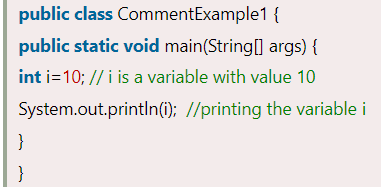

**Output:**

## 4.1.2 Multi Line Comment

-   The multi-line comment is used to comment multiple lines of code.
-   It can be used to explain a complex code snippet or to comment multiple lines of code at a time (as it will be difficult to use single-line comments there).
-   Multi-line comments are placed between /\* and \*/. Any text between /\* and \*/ is not executed by Java.

**Syntax:**

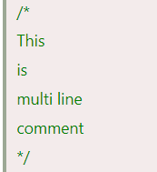

**Example:**

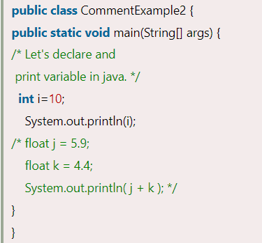

**Output:**

## 4.1.3 Documentation Comment

-   Documentation comments are usually used to write large programs for a project or software application as it helps to create documentation API.
-   These APIs are needed for reference, i.e., which classes, methods, arguments, etc., are used in the code.
-   To create documentation API, we need to use the **javadoc tool**.
-   The documentation comments are placed between /\*\* and \*/.

**Syntax:**

**Example:**

**Output:**

-   Create documentation API by **javadoc** tool:

-   Now, the HTML files are created for the **Calculate** class in the current directory, i.e., **abcDemo**.
-   Open the HTML files, and we can see the explanation of Calculate class provided through the documentation comment.

**Are Java comments executable?**

-   Java comments are not executed by the compiler or interpreter, however, before the lexical transformation of code in compiler, contents of the code are encoded into ASCII in order to make the processing easy.

## 5. Declarations

## 5.1 Number per Line

-   One declaration per line is recommended since it encourages commenting.

**int level; // indentation level**

**int size; // size of table**

is preferred over

**int level, size;**

-   Do not put different types on the same line.

**Example:**

int foo, fooarray[]; //WRONG!

**Note:** The examples above use one space between the type and the identifier.

-   Another acceptable alternative is to use tabs.

**Example:**

**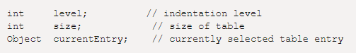**

## 5.2 Initialization

-   Try to initialize local variables where they're declared.
-   The only reason not to initialize a variable where it's declared is if the initial value depends on some computation occurring first.

## 5.3 Placement

-   Put declarations only at the beginning of blocks. (A block is any code surrounded by curly braces "{" and "}".)
-   Don't wait to declare variables until their first use; it can confuse the unwary programmer and hamper code portability within the scope.

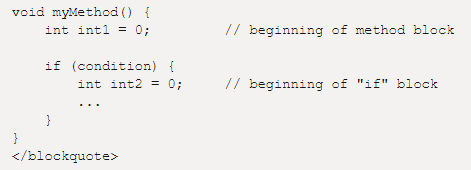

-   The one exception to the rule is indexes of for loops, which in Java can be declared in the for statement:

for (int i = 0; i \< maxLoops; i++) { ... }

\</blockquote\>

-   Avoid local declarations that hide declarations at higher levels.
-   For example, do not declare the same variable name in an inner block:

## 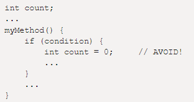

## 5.4 Class and Interface Declarations

When coding Java classes and interfaces, the following formatting rules should be followed:

-   No space between a method name and the parenthesis "(" starting its parameter list
-   Open brace "{" appears at the end of the same line as the declaration statement
-   Closing brace "}" starts a line by itself indented to match its corresponding opening statement, except when it is a null statement the "}" should appear immediately after the "{".

**Example:**

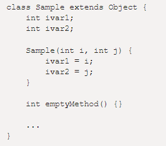

Methods are separated by a blank line

## 6. Statements

## 6.1 Simple Statements

-   Each line should contain at most one statement.

**Example:**

argv++; // Correct

argc--; // Correct

argv++; argc--; // AVOID!

## 6.2 Compound Statements

-   Compound statements are statements that contain lists of statements enclosed in braces "{ statements }".

See the following sections for examples.

-   The enclosed statements should be indented one more level than the compound statement.
-   The opening brace should be at the end of the line that begins the compound statement; the closing brace should begin a line and be indented to the beginning of the compound statement.
-   Braces are used around all statements, even single statements, when they are part of a control structure, such as an if-else or for statement. This makes it easier to add statements without accidentally introducing bugs due to forgetting to add braces.

## 6.3 return Statements

-   A return statement with a value should not use parentheses unless they make the return value more obvious in some way.

**Example:**

return;return myDisk.size();

return (size ? size : defaultSize);

-   For more information, [click here](https://www.oracle.com/java/technologies/javase/codeconventions-statements.html).

## 7. White Space

## 7.1 Blank Lines

-   Blank lines improve readability by setting off sections of code that are logically related.

**Two blank lines should always be used in the following circumstances:**

-   Between sections of a source file
-   Between class and interface definitions

**One blank line should always be used in the following circumstances:**

-   Between methods
-   Between the local variables in a method and its first statement
-   Before a block or single-line comment
-   Between logical sections inside a method to improve readability

## 7.2 Blank Spaces

**Blank spaces should be used in the following circumstances:**

-   A keyword followed by a parenthesis should be separated by a space.

**Example:**

while (true) {

...

}

**Note** that a blank space should not be used between a method name and its opening parenthesis. This helps to distinguish keywords from method calls.

-   A blank space should appear after commas in argument lists.
-   All binary operators except . should be separated from their operands by spaces.
-   Blank spaces should never separate unary operators such as unary minus, increment ("++"), and decrement ("--") from their operands.

**Example:**

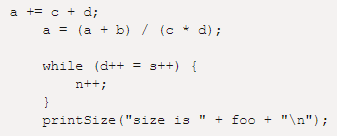

-   The expressions in a for statement should be separated by blank spaces.

**Example:**

for (expr1; expr2; expr3)

-   Casts should be followed by a blank space.

**Examples:**

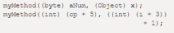

## 8. Naming Conventions

-   Naming conventions make programs more understandable by making them easier to read.
-   They can also give information about the function of the identifier.
-   for example, whether it's a constant, package, or class-which can be helpful in understanding the code.

| Packages   | The prefix of a unique package name is always written in **all-lowercase ASCII letters** and should be one of the top-level domain names, currently com, edu, gov, mil, net, org, or one of the English two-letter codes identifying countries as specified in ISO Standard 3166, 1981. Subsequent components of the package name vary according to an organization's own internal naming conventions. Such conventions might specify that certain directory name components be division, department, project, machine, or login names.                                                                                                                | com.sun.eng com.apple.quicktime.v2 edu.cmu.cs.bovik.cheese                                          |
|------------|--------------------------------------------------------------------------------------------------------------------------------------------------------------------------------------------------------------------------------------------------------------------------------------------------------------------------------------------------------------------------------------------------------------------------------------------------------------------------------------------------------------------------------------------------------------------------------------------------------------------------------------------------------|-----------------------------------------------------------------------------------------------------|
| Classes    | Class names should be **nouns**, in mixed case with the first letter of **each internal word capitalized**. Try to keep your class names simple and descriptive. Use whole words-avoid acronyms and abbreviations (unless the abbreviation is much more widely used than the long form, such as URL or HTML).                                                                                                                                                                                                                                                                                                                                          | class Raster; class ImageSprite;                                                                    |
| Interfaces | Interface names should be capitalized like class names.                                                                                                                                                                                                                                                                                                                                                                                                                                                                                                                                                                                                | interface RasterDelegate; interface Storing;                                                        |
| Methods    | Methods should be **verbs**, in mixed case with the first letter lowercase, with the first letter of each internal word capitalized.                                                                                                                                                                                                                                                                                                                                                                                                                                                                                                                   | run(); runFast(); getBackground();                                                                  |
| Variables  | Except for variables, all instance, class, and class constants are in mixed case with a lowercase first letter. Internal words start with capital letters. Variable names should not start with underscore \_ or dollar sign \$ characters, even though both are allowed. Variable names should be short yet meaningful. The choice of a variable name should be mnemonic- that is, designed to indicate to the casual observer the intent of its use. One-character variable names should be avoided except for temporary "throwaway" variables. Common names for temporary variables are i, j, k, m, and n for integers; c, d, and e for characters. | int i; char c; float myWidth;                                                                       |
| Constants  | The names of variables declared class constants and of ANSI constants should be all uppercase with words separated by underscores ("_"). (ANSI constants should be avoided, for ease of debugging.)                                                                                                                                                                                                                                                                                                                                                                                                                                                    | static final int MIN_WIDTH = 4; static final int MAX_WIDTH = 999; static final int GET_THE_CPU = 1; |

## 8. References

1.  https://www.javatpoint.com/java-comments
2.  https://www.oracle.com/java/technologies/javase/codeconventions-introduction.html
