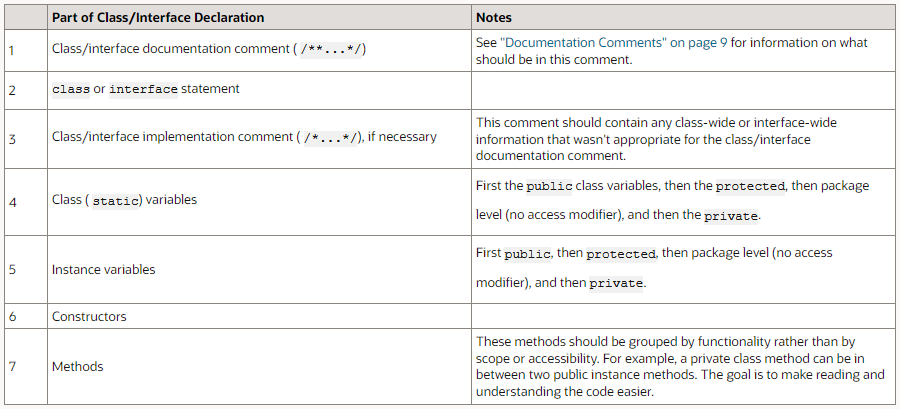

**Code Conventions for the Java Programming Language**

**1 - Introduction**

**1.1 Why Have Code Conventions**

Code conventions are important to programmers for a number of reasons:

-   80% of the lifetime cost of a piece of software goes to maintenance.
-   Hardly any software is maintained for its whole life by the original author.
-   Code conventions improve the readability of the software, allowing engineers to understand new code more quickly and thoroughly.
-   If you ship your source code as a product, you need to make sure it is as well packaged and clean as any other product you create.

## 2 - File Organization

-   A file consists of sections that should be separated by blank lines and an optional comment identifying each section.
-   Files longer than 2000 lines are cumbersome and should be avoided.

#### 2.1 Java Source Files

-   Each Java source file contains a single public class or interface.
-   When private classes and interfaces are associated with a public class, you can put them in the same source file as the public class.
-   The public class should be the first class or interface in the file.

**Java source files have the following ordering:**

-   Beginning comments
-   Package and Import statements
-   Class and interface declarations

#### 2.1.1 Beginning Comments

-   All source files should begin with a c-style comment that lists the class name, version information, date, and copyright notice:

#### 

#### 2.1.2 Package and Import Statements

-   The first non-comment line of most Java source files is a package statement.
-   After that, import statements can follow.

**Example:**

#### 

#### 2.1.3 Class and Interface Declarations

-   The following table describes the parts of a class or interface declaration, in the order that they should appear.

