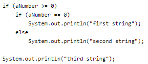
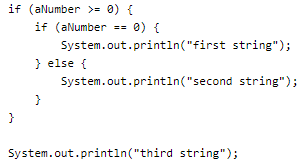
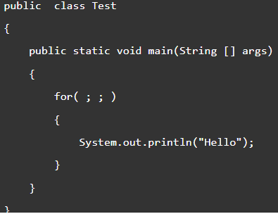
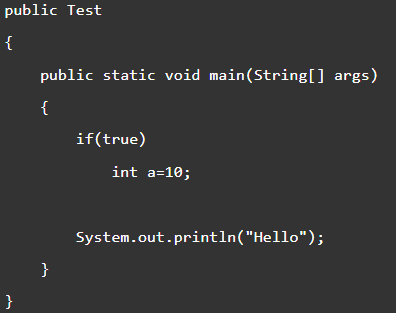
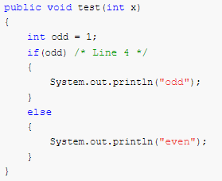
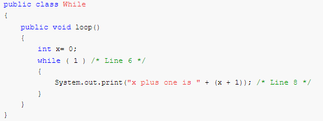
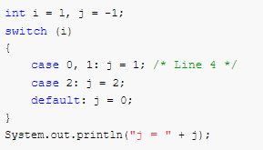
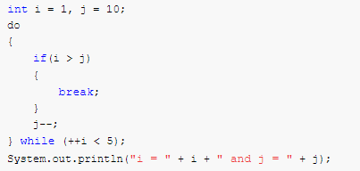
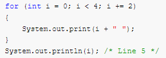

1)The most basic control flow statement supported by the Java programming language is the \__\_ statement.

**Solution:** if-then

2)The \__\_ statement allows for any number of possible execution paths.

**Solution:** switch

3)The \_*\_ statement is similar to the while statement, but evaluates its expression at the \_*\_ of the loop.

**Solution:** do-while, bottom

4)How do you write an infinite loop using the for statement?

**Solution:**

for ( ; ; ) {

}

5)How do you write an infinite loop using the while statement?

**Solution:**

while (true) {

}

6)How Can You Exit From a Loop?

**Solution:**

-   Using the break statement, we can terminate the execution of a loop immediately:

**for** (**int** i = 0; ; i++) {

**if** (i \> 10) {

**break**;

}

}

7)Consider the following code.

if (aNumber \>= 0)

if (aNumber == 0)

System.out.println("first string");

else System.out.println("second string");

System.out.println("third string");

a) What output do you think the code will produce if aNumber is 3?

b) Using only spaces and line breaks, reformat the code snippet to make the control flow easier to understand.

c) Use braces, { and }, to further clarify the code.

**a) What output do you think the code will produce if a Number is 3?**

**Solution:**

second string

third string

b) Using only spaces and line breaks, reformat the code snippet to make the control flow easier to understand.

**Solution:**

c) Use braces { and } to further clarify the code and reduce the possibility of errors by future maintainers of the code.

**Solution:**

8)What Happens When We Forget to Put a break Statement in a case Clause of a switch?

**Solution:**

-   It will continue the execution of all *case* labels until if finds a *break* statement, even though those labels don't match the expression's value.

9)What will be the output of below Java code?

**Solution:**

-   infinite times Hello

10)What will be the output of below Java code?

**Solution:**

-   Compile-time error: Variable declaration not allowed here.

11)

Which statement is true?

A.Compilation fails.

B.”odd" will always be output.

C."even" will always be output.

D.”odd" will be output for odd values of x, and "even" for even values.

**Solution:**

Option **A**

**Explanation:**

-   The compiler will complain because of incompatible types (line 4), the if expects a boolean but it gets an integer.

12)

Which statement is true?

A.There is a syntax error on line 1.

B.There are syntax errors on lines 1 and 6.

C.There are syntax errors on lines 1, 6, and 8.

D.There is a syntax error on line 6.

**Answer:** Option **D**

**Explanation:**

Using the integer 1 in the while statement, or any other looping or conditional construct for that matter, will result in a compiler error. This is old C Program syntax, not valid Java.

A, B and C are incorrect because line 1 is valid (Java is case sensitive so While is a valid class name). Line 8 is also valid because an equation may be placed in a String operation as shown.

13)What will be the output of the program?

A. j = -1

B. j = 0

C. j = 1

D. Compilation fails.

**Answer:** Option **D**

**Explanation:**

The case statement takes only a single argument. The case statement on line 4 is given two arguments so the compiler complains.

14)What will be the output of the program?

A. i = 6 and j = 5

B. i = 5 and j = 5

C. i = 6 and j = 4

D. i = 5 and j = 6

**Answer:** Option **D**

**Explanation:**

This loop is a do-while loop, which always executes the code block within the block at least once, due to the testing condition being at the end of the loop, rather than at the beginning. This particular loop is exited prematurely if i becomes greater than j.

The order is, test i against j, if bigger, it breaks from the loop, decrements j by one, and then tests the loop condition, where a pre-incremented by one i is tested for being lower than 5. The test is at the end of the loop, so i can reach the value of 5 before it fails. So it goes, start:

1, 10

2, 9

3, 8

4, 7

5, 6 loop condition fails.

15)What will be the output of the program?

A. 0 2 4

B.0 2 4 5

C.0 1 2 3 4

D.Compilation fails.

**Answer:** Option **D**

**Explanation:**

Compilation fails on the line 5 - System.out.println(i); as the variable i has only been declared within the for loop. It is not a recognised variable outside the code block of loop.
