# Java Classes and Objects

**Content**

1\. Classes and Objects in Java

1.1 What is a Class in Java

1.2 What is an Object in Java

1.3 Class and Object Example: main within the class

1.4 Class and Object Example: main outside the class

1.5 What are the different ways to create an object in Java?

1.6 Ways to Initialize Object

2\. References

## 1. Classes and Objects in Java

-   In this document, we will learn about Java classes and objects.
-   In object-oriented programming technique, we design a program using classes and objects.
-   An object in Java is the physical as well as a logical entity, whereas, a class in Java is a logical entity only.

## 1.1 What is a Class in Java

-   It is a template or blueprint from which objects are created.
-   It is a logical entity.
-   It can't be physical.

**A class in Java can contain:**

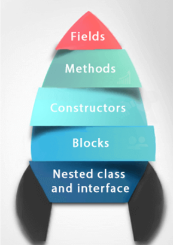

**Syntax:**

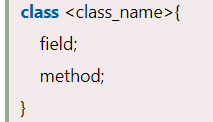

## 1.2 What is an Object in Java

-   An object is *a* **real-world entity.**
-   An object is *a* **runtime entity.**
-   The object is *an* **entity** *which has* **state** *and* **behavior.**
-   The object is *an* **instance of a class**.
-   It can be physical or logical (tangible and intangible).

    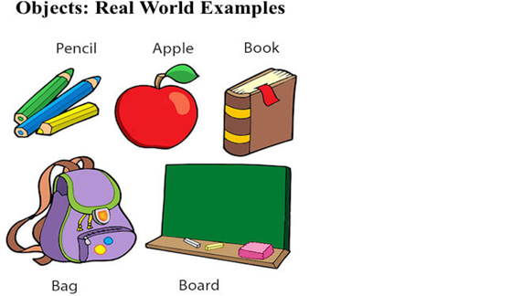

-   **An object has three characteristics**

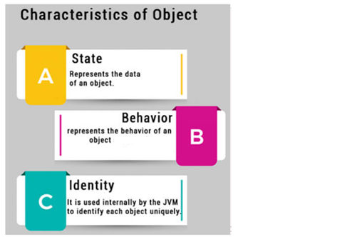

**Example**: Pen is an object. Its name is Reynolds; color is white, known as its state. It is used to write, so writing is its behavior.

## 1.3 Class and Object Example: main within the class

-   In this example, we have created a Student class which has two data members **id** and **name**.
-   We are creating the object of the Student class by **new** keyword and printing the object's value.
-   Here, we are creating a main() method within the class.

**Example: Student.java**

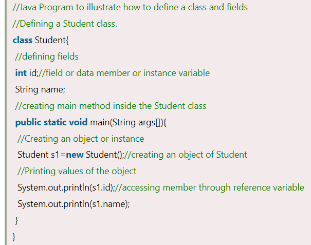

**Output:**

**new keyword in Java**

-   The new keyword is used to allocate memory at runtime.
-   All objects get memory in Heap memory area.

## 1.4 Class and Object Example: main outside the class

-   We create classes and use it from another class.
-   It is a better approach than previous one.
-   We can have multiple classes in different Java files or single Java file.
-   If you define multiple classes in a single Java source file, it is a good idea to save the file name with the class name which has main() method.

**Example: TestStudent1.java**

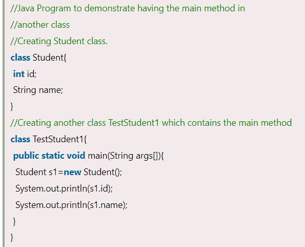

**Output:**

**Instance variable in Java**

-   A variable which is created inside the class but outside the method is known as an instance variable.
-   Instance variable doesn't get memory at compile time.
-   It gets memory at runtime when an object or instance is created. That is why it is known as an instance variable.

**Method in Java**

-   In Java, a method is like a function which is used to expose the behavior of an object.

**Advantage of Method**

-   Code Reusability
-   Code Optimization

## 1.5 What are the different ways to create an object in Java?

-   There are many ways to create an object in java. They are:

## 1) Anonymous object

-   Anonymous simply means nameless.
-   An object which has no reference is known as an anonymous object.
-   It can be used at the time of object creation only.
-   If you have to use an object only once, an anonymous object is a good approach.

**Example:**

**

-   Let's see the full example of an anonymous object in Java.

*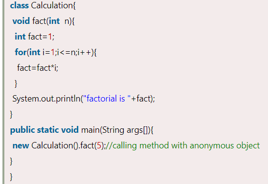*

Output:

**

## 2) Creating multiple objects by one type only

We can create multiple objects by one type only as we do in case of primitives.

-   Initialization of primitive variables:

**

-   Initialization of reference variables:

**

Let's see the example:

*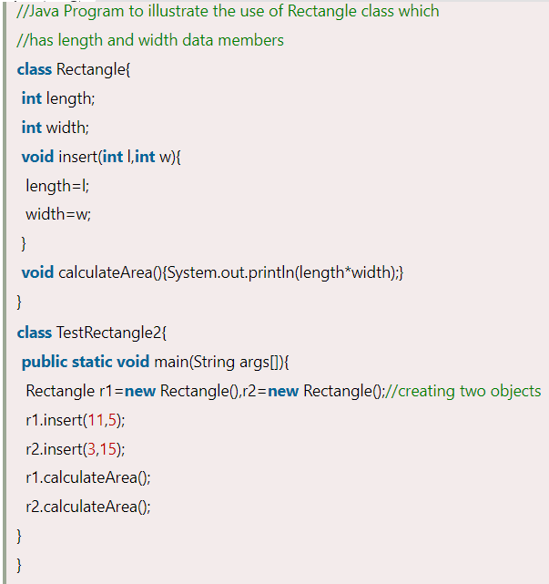*

**Output:**

**

## 1.6 Ways to initialize object

There are 3 ways to initialize object in Java.

1.  By reference variable
2.  By method
3.  By constructor

## 1) Initialization object through reference variable

-   Initializing an object means storing data into the object.
-   Let's see a simple example where we are going to initialize the object through a reference variable.

**Example: TestStudent2.java**

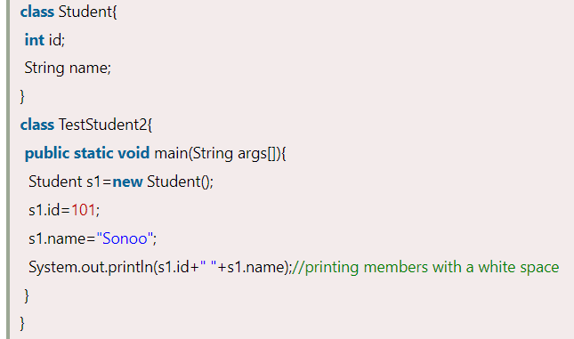

**Output:**

-   We can also create multiple objects and store information in it through reference variable.

**Example: TestStudent3.java**

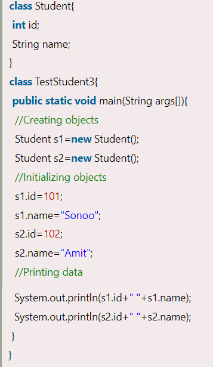

**Output:**

## 2) Initialization object through method

-   In this example, we are creating the two objects of Student class and initializing the value to these objects by invoking the insertRecord method. Here, we are displaying the state (data) of the objects by invoking the displayInformation() method.

**Example: TestStudent4.java**

*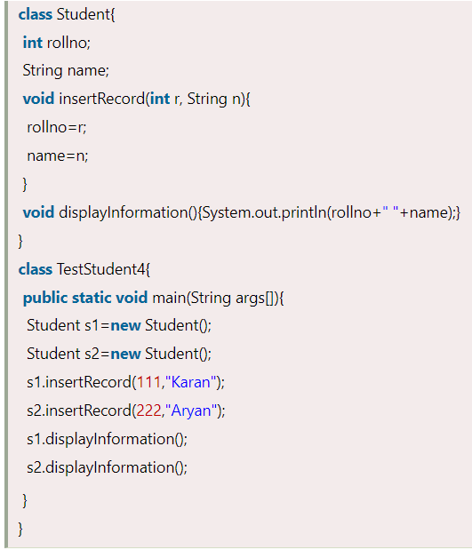*

**Output:**

*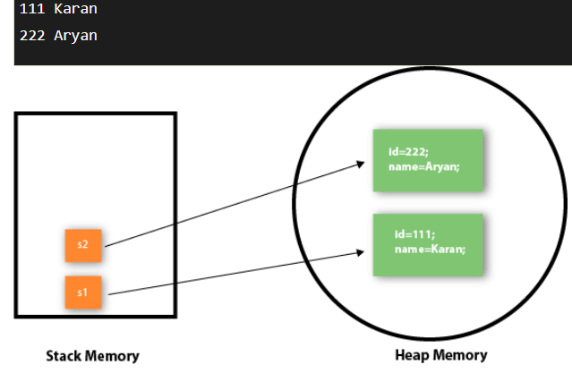*

-   As you can see in the above figure, object gets the memory in heap memory area.
-   The reference variable refers to the object allocated in the heap memory area.
-   Here, s1 and s2 both are reference variables that refer to the objects allocated in memory.

## 3) Initialization through a constructor

-   Let's see an example where we are maintaining records of employees.

**Example: TestEmployee.java**

**

**Output:**

*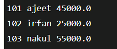*

## 2. References

1.  https://www.javatpoint.com/object-and-class-in-java
