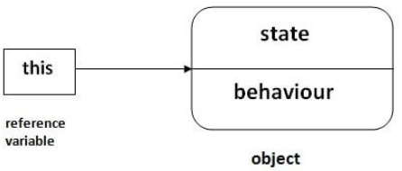

# Java Classes, Objects and Custom Class

**Content**

[1. Introduction](#1-introduction)

[2. What is a Class in Java?](#2-what-is-a-class-in-java)

[2.1 Fields in Java?](#21-fields-in-java)

[2.2 What is a method in Java?](#22-what-is-a-method-in-java)	

[3. What is an Object in Java?](#3-what-is-an-object-in-java)

[3.1 What are the different ways to create an object in Java?](#31-what-are-the-different-ways-to-create-an-object-in-java)

[3.2 Ways to Initialize Object](#32-ways-to-initialize-object)

[4. Create a Custom Class in Java](#4-create-a-custom-class-in-java)

[5. Java Constructors](#5-java-constructors)

[5.1 Rules for creating Java constructor](#51-rules-for-creating-java-constructor)

[5.2 Types of Java constructors](#52-types-of-java-constructors)

[5.2.1 Java Default Constructor](#521-java-default-constructor)

[5.2.2 Java Parameterized Constructor](#522-java-parameterized-constructor)

[5.3 Constructor Overloading in Java](#53-constructor-overloading-in-java)

[5.4. Difference between constructor and method in Java](#54-difference-between-constructor-and-method-in-java)

[5.5 Java Copy Constructor](#55-java-copy-constructor)

[5.5.1 Copying values with constructor](#551-copying-values-with-constructor)

[5.5.2 Copying values without constructor](#552-copying-values-without-constructor)

[6. this Keyword in Java](#6-this-keyword-in-java)

[7. Introduction of Stack and Heap in Java](#7-introduction-of-stack-and-heap-in-java)

[7.1 Stack Memory](#71-stack-memory)

[7.2 Heap Memory](#72-heap-memory)

[7.3 Difference between Stack and Heap Memory](#73-difference-between-stack-and-heap-memory)

[8. Java Garbage Collection](#8-java-garbage-collection)

[8.1 Advantage of Garbage Collection](#81-advantage-of-garbage-collection)

[8.2 How can an object be unreferenced?](#82-how-can-an-object-be-unreferenced)

[9. References](#9-references)

## 1. Introduction

-   In this document, we will learn about Java classes and objects.
-   In object-oriented programming technique, we design a program using classes and objects.
-   An object in Java is the physical as well as a logical entity, whereas, a class in Java is a logical entity only.

## 2. What is a Class in Java?

-   It is a template or blueprint from which objects are created.
-   It is a logical entity.
-   It can't be physical.

**A class in Java can contain:**


**Syntax:**

```java
class <class_name> {  
    field;  
    method;  
}  
```

## 2.1 Fields in Java

The fields in class are known as instance variables

-   Instance variables are declared in a class, but outside a method, constructor or any block.
-   When space is allocated for an object in the heap, a slot for each instance variable value is created.
-   Instance variables are created when an object is created with the use of the keyword 'new' and destroyed when the object is destroyed.
-   Instance variables hold values that must be referenced by more than one method, constructor or block, or essential parts of an object's state that must be present throughout the class.
-   Instance variables can be declared in a class level before or after use.
-   Access modifiers can be given for instance variables.
-   The instance variables are visible for all methods, constructors, and block in the class. Normally, it is recommended to make these variables private (access level). However, visibility for subclasses can be given for these variables with the use of access modifiers.
-   Instance variables have default values. For numbers, the default value is 0, for Booleans it is false, and for object references it is null. Values can be assigned during the declaration or within the constructor.
-   Instance variables can be accessed directly by calling the variable name inside the class. However, within static methods (when instance variables are given accessibility), they should be called using the fully qualified name. ObjectReference.VariableName.

**Syntax:**

```java
datatype variableName;
```

## 2.2 What is a method in Java?

-   A **method** is a block of code or collection of statements or a set of code grouped together to perform a certain task or operation.
-   The method is executed only when we call or invoke it.

**Advantages of methods**

-   It is used to achieve the **reusability** of code.
-   It also provides the **easy modification** and **readability** of code, just by adding or removing a chunk of code.

## 2.2.1 Method Defination

Syntax: Declare a method

```java
access_modifier return_type method_name( list_of_parameters) {

 //body of method

}
```

**Method Signature:** Every method has a method signature. It is a part of the method declaration. It includes the **method name** and **parameter list**.

**Access Specifier:** Access specifier or modifier is the access type of the method. It specifies the visibility of the method. Java provides **four** types of access specifier:

-   **Public:** The method is accessible by all classes when we use public specifier in our application.
-   **Private:** When we use a private access specifier, the method is accessible only in the classes in which it is defined.
-   **Protected:** When we use protected access specifier, the method is accessible within the same package or subclasses in a different package.
-   **Default:** When we do not use any access specifier in the method declaration, Java uses default access specifier by default. It is visible only from the same package only.

**Return Type:**

-   Return type is a data type that the method returns.
-   It may have a primitive data type, object, collection, void, etc.
-   If the method does not return anything, we use void keyword.

**Method Name:**

-   It is a unique name that is used to define the name of a method.
-   It must be corresponding to the functionality of the method.
-   Suppose, if we are creating a method for subtraction of two numbers, the method name must be **subtraction().**
-   A method is invoked by its name.

**Parameter List:**

-   It is the list of parameters separated by a comma and enclosed in the pair of parentheses.
-   It contains the data type and variable name.
-   If the method has no parameter, left the parentheses blank.

**Method Body:**

-   It is a part of the method declaration.
-   It contains all the actions to be performed.
-   It is enclosed within the pair of curly braces.

## 2.2.2 How to Call or Invoke a User-defined Method

-   Once we have defined a method, it should be called.
-   There are two ways in which a method is called i.e., method returns a value or returning nothing (no return value).
-   The calling of a method in a program is simple.
-   To call a method in Java, write the method's name followed by two parentheses **()** and a semicolon (;).
-   If the method has parameters in the declaration, those parameters are passed within the parentheses () but this time without their datatypes specified.
-   However, it is important to keep the sequence of arguments the same as defined in the method definition.
-   When we call or invoke a user-defined method, the program control transfer to the called method.

**Example:**

```java
public class Addition {
    public static void main(String[] args) {
    int a = 19;
    int b = 5;
    //method calling
    int c = add(a, b); //a and b are actual parameters
    System.out.println("The sum of a and b is= " + c);
    }
   
    //user defined method
    public static int add(int n1, int n2) { //n1 and n2 are formal parameters
        int s;
        s=n1+n2;
        return s; //returning the sum
    }
}
```

**Output:**

```
The sum of a and b is= 24
```

## 3. What is an Object in Java?

-   An object is *a* **real-world entity.**
-   An object is *a* **runtime entity.**
-   The object is *an* **entity** *which has* **state** *and* **behavior.**
-   The object is *an* **instance of a class**.
-   It can be physical or logical (tangible and intangible).

    

-   **An object has three characteristics**


**Example**: Pen is an object. Its name is Reynolds; color is white, known as its state. It is used to write, so writing is its behavior.

**Class and Object Example: main within the class**

-   In this example, we have created a Student class which has two data members **id** and **name**.
-   We are creating the object of the Student class by **new** keyword and printing the object's value.
-   Here, we are creating a main() method within the class.

**Example: Student.java**

```java
//Java Program to illustrate how to define a class and fields  
//Defining a Student class.  
class Student{  
 //defining fields  
 int id;//field or data member or instance variable  
 String name;  
 //creating main method inside the Student class  
 public static void main(String args[]){  
  //Creating an object or instance  
  Student s1=new Student();//creating an object of Student  
  //Printing values of the object  
  System.out.println(s1.id);//accessing member through reference variable  
  System.out.println(s1.name);  
 }  
}  
```

**Output:**

```
0 
null
```

**new keyword in Java**

-   The new keyword is used to allocate memory at runtime.
-   All objects get memory in Heap memory area.

**Class and Object Example: main outside the class**

-   We create classes and use it from another class.
-   It is a better approach than previous one.
-   We can have multiple classes in different Java files or single Java file.
-   If you define multiple classes in a single Java source file, it is a good idea to save the file name with the class name which has main() method.

**Example: TestStudent1.java**

```java
//Java Program to demonstrate having the main method in   
//another class  
//Creating Student class.  
class Student{  
 int id;  
 String name;  
}  
//Creating another class TestStudent1 which contains the main method  
class TestStudent1{  
 public static void main(String args[]){  
  Student s1=new Student();  
  System.out.println(s1.id);  
  System.out.println(s1.name);  
 }  
}  
```

**Output:**

```
0 
null
```

**Instance variable in Java**

-   A variable which is created inside the class but outside the method is known as an instance variable.
-   Instance variable doesn't get memory at compile time.
-   It gets memory at runtime when an object or instance is created. That is why it is known as an instance variable.

**Method in Java**

-   In Java, a method is like a function which is used to expose the behavior of an object.

**Advantage of Method**

-   Code Reusability
-   Code Optimization

## 3.1 What are the different ways to create an object in Java?

-   There are many ways to create an object in java. They are:

## 1) Anonymous object

-   Anonymous simply means nameless.
-   An object which has no reference is known as an anonymous object.
-   It can be used at the time of object creation only.
-   If you have to use an object only once, an anonymous object is a good approach.

**Example:**

```java
new Calculation();//anonymous object
```

-   Let's see the full example of an anonymous object in Java.

```java
class Calculation{  
 void fact(int  n){  
  int fact=1;  
  for(int i=1;i<=n;i++){  
   fact=fact*i;  
  }  
 System.out.println("factorial is "+fact);  
}  
public static void main(String args[]){  
 new Calculation().fact(5);//calling method with anonymous object  
}  
}  
```

Output:

```
Factorial is 120
```

## 2) Creating multiple objects by one type only

We can create multiple objects by one type only as we do in case of primitives.

-   Initialization of primitive variables:

```java
int a=10, b=20;  
```

-   Initialization of reference variables:

```java
Rectangle r1=new Rectangle(), r2=new Rectangle();//creating two objects
```

Let's see the example:

```java
//Java Program to illustrate the use of Rectangle class which  
//has length and width data members  
class Rectangle{  
 int length;  
 int width;  
 void insert(int l,int w){  
  length=l;  
  width=w;  
 }  
 void calculateArea(){System.out.println(length*width);}  
}  
class TestRectangle2{  
 public static void main(String args[]){  
  Rectangle r1=new Rectangle(),r2=new Rectangle();//creating two objects  
  r1.insert(11,5);  
  r2.insert(3,15);  
  r1.calculateArea();  
  r2.calculateArea();  
}  
}  
```

**Output:**

```
55 
45  
```

## 3.2 Ways to initialize object

There are 3 ways to initialize object in Java.

1.  By reference variable
2.  By method
3.  By constructor

## 1) Initialization object through reference variable

-   Initializing an object means storing data into the object.
-   Let's see a simple example where we are going to initialize the object through a reference variable.

**Example: TestStudent2.java**

```java
class Student{  
 int id;  
 String name;  
}  
class TestStudent2{  
 public static void main(String args[]){  
  Student s1=new Student();  
  s1.id=101;  
  s1.name="Sonoo";  
  System.out.println(s1.id+" "+s1.name);//printing members with a white space  
 }  
} 
```

**Output:**

```
101 Sonoo
```

-   We can also create multiple objects and store information in it through reference variable.

**Example: TestStudent3.java**

```java
class Student{  
 int id;  
 String name;  
}  
class TestStudent3{  
 public static void main(String args[]){  
  //Creating objects  
  Student s1=new Student();  
  Student s2=new Student();  
  //Initializing objects  
  s1.id=101;  
  s1.name="Sonoo";  
  s2.id=102;  
  s2.name="Amit";  
  //Printing data  
  System.out.println(s1.id+" "+s1.name);  
  System.out.println(s2.id+" "+s2.name);  
 }  
}  
```

**Output:**

```
101 Sonoo
102 Amit
```

## 2) Initialization object through method

-   In this example, we are creating the two objects of Student class and initializing the value to these objects by invoking the insertRecord method. Here, we are displaying the state (data) of the objects by invoking the displayInformation() method.

**Example: TestStudent4.java**

```java
class Student{  
 int rollno;  
 String name;  
 void insertRecord(int r, String n){  
  rollno=r;  
  name=n;  
 }  
 void displayInformation(){System.out.println(rollno+" "+name);}  
}  
class TestStudent4{  
 public static void main(String args[]){  
  Student s1=new Student();  
  Student s2=new Student();  
  s1.insertRecord(111,"Karan");  
  s2.insertRecord(222,"Aryan");  
  s1.displayInformation();  
  s2.displayInformation();  
 }  
}  
```

**Output:**

```
111 Karan
222 Aryan
```


-   As you can see in the above figure, object gets the memory in heap memory area.
-   The reference variable refers to the object allocated in the heap memory area.
-   Here, s1 and s2 both are reference variables that refer to the objects allocated in memory.

## 3) Initialization through a constructor

-   Let's see an example where we are maintaining records of employees.

**Example: TestEmployee.java**

```java
class Employee{  
    int id;  
    String name;  
    float salary;  
    void insert(int i, String n, float s) {  
        id=i;  
        name=n;  
        salary=s;  
    }  
    void display(){System.out.println(id+" "+name+" "+salary);}  
}  
public class TestEmployee {  
public static void main(String[] args) {  
    Employee e1=new Employee();  
    Employee e2=new Employee();  
    Employee e3=new Employee();  
    e1.insert(101,"ajeet",45000);  
    e2.insert(102,"irfan",25000);  
    e3.insert(103,"nakul",55000);  
    e1.display();  
    e2.display();  
    e3.display();  
}  
}  
```

**Output:**

```
101 ajeet 45000.0
102 irfan 25000.0
103 nakul 55000.0
```

## 4. Create a Custom Class in Java

-   Class is a templates and prototypes or blueprints from which objects are created.
-   Class does not occupy memory.
-   We can write a custom class as per our choice for an illustration purpose a sample is shown in the program below.

**Example:**

```java
// Java Program to Creating our Own Custom Class

// Importing input output classes
import java.io.*;
// Class 1
// Helper class
class Employee {
	// Member variables of this class
	// first attribute
	int id;
	// second attribute
	int salary;
	// third attribute
	String name;
	// Member function of this class
	// Method 1
	public void printDetails()
	{
		// Print and display commands
		System.out.println("My id is " + id);
		System.out.println("This is my name " + name);
	}
	// Method 2
	public int getSalary()
	{
		// Simply returning the salary
		return salary;
	}
}
// Class 2
// Main class
class Custom {
	// Main driver method
	public static void main(String[] args)
	{
		// Display message only
		System.out.println("This is the custom class");
		// Creating object of custom class in the main()
		// method Instantiating a new Employee object
		Employee harry = new Employee();
		// Again creating object of custom class and
		// instantiating a new Employee object
		Employee robin = new Employee();
		// Initializing values for first object created
		// above
		harry.id = 23;
		harry.salary = 100000;
		harry.name = "Ritu bhatiya";
		// Initializing values for second object created
		// above
		robin.id = 25;
		robin.salary = 150000;
		robin.name = "Amit thripathi";
		// Printing object attributes by
		// calling the method as defined in our class
		harry.printDetails();
		robin.printDetails();
		// Calling the method again of our class and
		// storing it in a variable
		int salary = robin.getSalary();
		// Print and display the above salary
		System.out.println("Salary of robin : " + salary
						+ "$");
		System.out.println("ID : " + harry.id);
	}
}
```

**Output:**

```
This is the custom class
My id is 23
This is my name Ritu bhatiya
My id is 25
This is my name Amit thripathi
Salary of robin : 150000$
ID : 23
```

## 5. Java Constructors

-   In Java, a constructor is a block of codes similar to the method.
-   Constructor is called when an instance of the class is created.
-   At the time of calling constructor, memory for the object is allocated in the memory.
-   It is a special type of method which is used to initialize the object.
-   Every time an object is created using the new() keyword, at least one constructor is called.
-   It calls a default constructor if there is no constructor available in the class. In such case, Java compiler provides a default constructor by default.

## 5.1 Rules for creating Java constructor

1.  Constructor name must be the same as its class name
2.  A Constructor must have no explicit return type
3.  A Java constructor cannot be abstract, static, final, and synchronized

**Note:** We can use access modifiers while declaring a constructor. It controls the object creation. In other words, we can have private, protected, public or default constructor in Java.

## 5.2. Types of Java constructors

-   There are two types of constructors in Java:


## 5.2.1 Java Default Constructor

-   If you don’t implement any constructor in your class, the Java compiler inserts default constructor into your code on your behalf.
-   You will not see the default constructor in your source code(the .java file) as it is inserted during compilation and present in the bytecode(.class file).


**Are no-arg constructor and default constructor same?**

-   The **default constructor** is inserted by compiler and has **no code** in it, on the other hand we can implement **no-arg constructor** in our class which looks like default constructor but we can provide **any initialization code** in it.

**Syntax for default constructor:**

```java
<class_name>(){}  
```

**Example**:

-   In this example, we are creating the no-arg constructor in the Bike class.
-   It will be invoked at the time of object creation.

```java
//Java Program to create and call a default constructor  
class Bike1{  
//creating a default constructor  
Bike1(){System.out.println("Bike is created");}  
//main method  
public static void main(String args[]){  
//calling a default constructor  
Bike1 b=new Bike1();  
}  
}  
```

**Output:**

```
Bike is created
```

**Rule:** If there is no constructor in a class, compiler automatically creates a default constrctor.

-   The default constructor provides the default values to the object like 0, null, etc., depending on the type.

    **Example:**

```java
//Let us see another example of default constructor  
//which displays the default values  
class Student3{  
int id;  
String name;  
//method to display the value of id and name  
void display(){System.out.println(id+" "+name);}  
  
public static void main(String args[]){  
//creating objects  
Student3 s1=new Student3();  
Student3 s2=new Student3();  
//displaying values of the object  
s1.display();  
s2.display();  
}  
}  
```

**Output:**

```
0 null
0 null
```

**Explanation:**

-   In the above class, you are not creating any constructor so compiler provides you a default constructor.
-   Here 0 and null values are provided by default constructor.

## 5.2.2 Java Parameterized Constructor

-   A constructor which has a specific number of parameters is called a parameterized constructor.

**Why use the parameterized constructor?**

-   The parameterized constructor is used to provide different values to distinct objects.
-   However, you can provide the same values also.

**Example:**

-   In this example, we have created the constructor of Student class that have two parameters.
-   We can have any number of parameters in the constructor.

```java
//Java Program to demonstrate the use of the parameterized constructor.  
class Student4{  
    int id;  
    String name;  
    //creating a parameterized constructor  
    Student4(int i,String n){  
    id = i;  
    name = n;  
    }  
    //method to display the values  
    void display(){System.out.println(id+" "+name);}  
   
    public static void main(String args[]){  
    //creating objects and passing values  
    Student4 s1 = new Student4(111,"Karan");  
    Student4 s2 = new Student4(222,"Aryan");  
    //calling method to display the values of object  
    s1.display();  
    s2.display();  
   }  
}  
```

**Output:**

```
111 Karan
222 Aryan
```

## 5.3. Constructor Overloading in Java

-   In Java, a constructor is just like a method but without return type. It can also be overloaded like Java methods.
-   Constructor overloading in Java is a technique of having more than one constructor with different parameter lists.
-   They are arranged in a way that each constructor performs a different task.
-   They are differentiated by the compiler by the number of parameters in the list and their types.

**Example:**

```java
//Java program to overload constructors  
class Student5{  
    int id;  
    String name;  
    int age;  
    //creating two arg constructor  
    Student5(int i,String n){  
    id = i;  
    name = n;  
    }  
    //creating three arg constructor  
    Student5(int i,String n,int a){  
    id = i;  
    name = n;  
    age=a;  
    }  
    void display(){System.out.println(id+" "+name+" "+age);}  
   
    public static void main(String args[]){  
    Student5 s1 = new Student5(111,"Karan");  
    Student5 s2 = new Student5(222,"Aryan",25);  
    s1.display();  
    s2.display();  
   }  
}  
```

**Output:**

```
Code Language
111 Karan 0
222 Aryan 25
```

## 5.4. Difference between constructor and method in Java


## 5.5. Java Copy Constructor

-   There is no copy constructor in Java. However, we can copy the values from one object to another like copy constructor in C++.
-   There are many ways to copy the values of one object into another in Java. They are:
1.  Copying values with constructor.
2.  By assigning the values of one object into another without constructor.

## 5.5.1 Copying values with constructor

-   We are going to copy the values of one object into another using Java constructor.

**Example:**

```java
//Java program to initialize the values from one object to another object.  
class Student6{  
    int id;  
    String name;  
    //constructor to initialize integer and string  
    Student6(int i,String n){  
    id = i;  
    name = n;  
    }  
    //constructor to initialize another object  
    Student6(Student6 s){  
    id = s.id;  
    name =s.name;  
    }  
    void display(){System.out.println(id+" "+name);}  
   
    public static void main(String args[]){  
    Student6 s1 = new Student6(111,"Karan");  
    Student6 s2 = new Student6(s1);  
    s1.display();  
    s2.display();  
   }  
}  
```

**Output:**

```
111 Karan
111 Karan
```

## 5.5.2 Copying values without constructor

-   We can copy the values of one object into another by assigning the objects values to another object.
-   In this case, there is no need to create the constructor.

**Example:**

```java
class Student7{  
    int id;  
    String name;  
    Student7(int i,String n){  
    id = i;  
    name = n;  
    }  
    Student7(){}  
    void display(){System.out.println(id+" "+name);}  
   
    public static void main(String args[]){  
    Student7 s1 = new Student7(111,"Karan");  
    Student7 s2 = new Student7();  
    s2.id=s1.id;  
    s2.name=s1.name;  
    s1.display();  
    s2.display();  
   }  
}  
```

**Output:**

```
111 Karan
111 Karan
```

# 6. this keyword in Java

-   In Java, this is a **reference variable** that refers to the current object.



**Usage of Java this keyword**


## 6.1 this: to refer current class instance variable

-   The this keyword can be used to refer current class instance variable.
-   If there is ambiguity between the instance variables and parameters, this keyword resolves the problem of ambiguity.

**Understanding the problem without this keyword**

-   Let's understand the problem if we don't use this keyword by the example given below:

```java
class Student { 
 
    int rollno;  
    String name;  
    float fee;  

    Student(int rollno, String name, float fee) {  
        rollno = rollno;  
        name = name;  
        fee = fee;  
    }  

    void display() {
        System.out.println(rollno +" " +name +" " +fee);
    } 
 
}  

class TestThis1 {  

    public static void main(String args[]) {  
        Student student1 = new Student(111, "ankit", 5000f);  
        Student student2 = new Student(112, "sumit", 6000f);  
        student1.display();  
        student2.display();  
    }

}  
```

**Output:**

```
0 null 0.0
0 null 0.0
```

-   In the above example, parameters (formal arguments) and instance variables are same.
-   So, we are using this keyword to distinguish local variable and instance variable.

**Solution of the above problem by using this keyword**

```java
class Student {
  
    int rollno;  
    String name;  
    float fee;  

    Student(int rollno, String name, float fee) {  
        this.rollno = rollno;  
        this.name = name;  
        this.fee = fee;  
    } 
 
    void display() {
        System.out.println(rollno +" " +name +" " +fee);
    }

}  
 
class TestThis2 { 
 
    public static void main(String args[]){  
        Student student1 = new Student(111, "ankit", 5000f);  
        Student student2 = new Student(112, "sumit", 6000f);  
        student1.display();  
        student2.display();  
    }

}  
```

**Output:**

```
111 ankit 5000.0
112 sumit 6000.0
```

-   If local variables(formal arguments) and instance variables are different, there is no need to use this keyword.
-   It is better approach to use meaningful names for variables.
-   So we use same name for instance variables and parameters in real time, and always use this keyword.

## 6.2 this: to invoke current class method

-   You may invoke the method of the current class by using this keyword.
-   If you don't use this keyword, compiler automatically adds this keyword while invoking the method.


**Example:**

```java
class CurrentClass { 
 
    void display1() {
  	  System.out.println("hello display1");
    }  

    void display2() {  
  	System.out.println("hello display2");  
        //display1();//same as this.display1()  
  	this.display1();  
    }  

}  

class TestThis4 { 
 
    public static void main(String args[]) {  
        CurrentClass hai = new CurrentClass();  
        hai.display2();  
    }

}  
```

**Output:**

```
hello display2
hello display1
```

## 6.3 this() : to invoke current class constructor

-   The this() constructor call can be used to invoke the current class constructor.
-   It is used to reuse the constructor.
-   In other words, it is used for constructor chaining.

**Calling no argument constructor from parameterized constructor:**

```java
class Aclass { 
 
    Aclass() {
        System.out.println("hello message in no argument constructor ");
    }  

    Aclass(int x) {  
        this();  
        System.out.println(x);  
    } 
 
} 
 
class TestThis5{  

    public static void main(String args[]) {  
        Aclass value = new Aclass(10);  
    }

}  
```

**Output:**

```
hello message in no argument constructor 
10
```

**Calling parameterized constructor from no argument constructor:**

```java
class Aclass {  

    Aclass() {  
        this(5);  
        System.out.println("hello message in no argument constructor");  
    }  

    A(int x){  
        System.out.println(x);  
    }  

} 
 
class TestThis6 { 
 
    public static void main(String args[]) {  
        Aclass value = new Aclass();  
    }

}  
```

**Output:**

```
5
hello message in no argument constructor
```

**Note:** this must be the first statement in constructor.

## 6.4 this: to pass as an argument in the method

-   The this keyword can also be passed as an argument in the method.
-   It is mainly used in the event handling.

**Example:**

```java
class Student {

  void method(Student obj) {  
     System.out.println("method is invoked");  
  }  
  
  void display() {  
      method(this);  
  }
  
  public static void main(String args[]) {  
      Student student1 = new Student();  
      student1.display();  
  }  
  
}  
```

**Output:**

```
method is invoked
```

## 6.5 this: to pass as argument in the constructor call

-   We can pass this keyword in the constructor also.
-   It is useful if we have to use one object in multiple classes.

**Example:**

```java
class BClass {  

    AClass obj;   
  
    BClass(AClass obj) {  
        this.obj=obj;  
    }  
  
    void display() {  
        System.out.println(obj.data);//using instance variable of AClass class  
    }
  
}  
  
class AClass {  

    int data=10;  
  
    AClass() {  
        BClass bobj = new BClass(this);  
        bobj.display();  
    }  
  
    public static void main(String args[]) {  
        AClass aobj = new AClass();  
  } 
  
} 
 
```

**Output:**

```
10
```

## 6.6 this keyword can be used to return current class instance

-   We can return this keyword as an statement from the method.
-   In such case, return type of the method must be the class type (non-primitive).

**Syntax:**

```java
classname methodname(){  
return this;  
}  
```

**Example:**

```java
class AClass {  

    AClass getA() {  
        return this;  
    }  
    
    void msg() {
        System.out.println("Hello java");
    } 
} 

class Test1 {

    public static void main(String args[]) {  
        new AClass().getA().msg();  
    }  
} 
```

**Output:**

```
Hello java
```

## 7. Introduction of Stack and Heap in Java

-   In Java, memory management is a vital process.
-   It is managed by Java automatically.
-   The JVM divides the memory into two parts: stack memory and heap memory.
-   From the perspective of Java, both are important memory areas but both are used for different purposes.
-   The **major difference between Stack memory and heap memory** is that the stack is used to store the order of method execution and local variables while the heap memory stores the objects and it uses dynamic memory allocation and deallocation.


## 7.1 Stack Memory

-   The stack memory is a physical space (in RAM) allocated to each thread at run time.
-   It is created when a thread creates.
-   Memory management in the stack follows LIFO (Last-In-First-Out) order because it is accessible globally.
-   It stores the variables, references to objects, and partial results.
-   Memory allocated to stack lives until the function returns.
-   If there is no space for creating the new objects, it throws the **java.lang.StackOverFlowError.**
-   The scope of the elements is limited to their threads.

**Example of Stack Memory in Java**

```java
public class Main {
  public static int addOne(int input) {
    return input + 1;
  }
  public static int addTwo(int input) {
    return input + 2;
  }
  public static void main(String[] args) {
    int x = 0;
    x = addOne(x);
    x = addTwo(x);
  }
}
```


**Explanation:**

1.  When the program is executed, the main method is executed first by the JVM. When the main method is called, a block is allocated for it in the call stack.
2.  The main method contains one primitive value x. This primitive value is stored in the memory block allocated for the main method.
3.  When the addOne method is called from the main method, a new block for addOne method is allocated in the stack memory.
4.  The variables specific to the method are created and stored in the allocated memory block. Upon the completion of the execution of the method, the value is returned to the calling method(here it is the main method), and the block is removed from the call stack.
5.  Similarly, when the addTwo method is called, a new block is allocated for it, and the variables are created and stored. When the method finishes execution, the value is returned to the calling method, and the block is cleared.
6.  Finally, the main method completes its execution, and the memory block corresponding to main method is cleared from the stack.

**What is StackOverflowError in Java?**

-   Stack memory is limited in size and cannot be enlarged or shrunk once created.
-   Therefore, if we use all of the stack memory, there will be no space left for upcoming method calls, and we will get the StackOverflowError.

**Example:**

```java
public class Main {
  public static int factorial(int n) {
    /* Base case is commented to make it run indefinitely
    if (n == 0) {
        return 1;
    }
    */

    return n * factorial(n - 1);
  }

  public static void main(String[] args) {
    int x = 3;
    int fact = factorial(x);
  }
}
```

Error:

```
Exception in thread "main" java.lang.StackOverflowError
	at StackMemory.factorial(StackMemory.java:15)
	at StackMemory.factorial(StackMemory.java:15)
    ...
```

**Explanation:**

-   A new block on the stack is allocated for each call to the factorial method.
-   When the above program is executed, the factorial method will be called **indefinitely** because the base case is commented.
-   As the stack size is fixed, and the factorial method is called indefinitely and doesn't return any value, so the stack memory runs out, resulting in StackOverflowError.


## 7.2 Heap Memory

-   It is created when the JVM starts up and used by the application as long as the application runs.
-   It stores objects and JRE classes.
-   Whenever we create objects it occupies space in the heap memory while the reference of that object creates in the stack.
-   It does not follow any order like the stack.
-   It dynamically handles the memory blocks.
-   It means, we need not to handle the memory manually.
-   For managing the memory automatically, Java provides the garbage collector that deletes the objects which are no longer being used.
-   Memory allocated to heap lives until any one event, either program terminated or memory free does not occur.
-   The elements are globally accessible in the application.
-   It is a common memory space shared with all the threads.
-   If the heap space is full, it throws the java.lang.OutOfMemoryError.

**Example of Heap Memory in Java**

```java
import java.util.ArrayList;
import java.util.List;
public class HeapMemory {
  public static void main(String[] args) {
    int x = 10;
    List<Integer> list = new ArrayList<>();
    list.add(1);
    list.add(2);
    list.add(3);
  }
}
```

**Explanation:**

-   In the above example, the variable x is allocated in the stack, whereas the object list is allocated memory in the heap.
-   Only the reference to the list object is stored in the stack memory alongside x.


**Why OutOfMemoryError is thrown in Java?**

-   **OutOfMemoryError** is thrown when there is no more space left in the heap to create and store a new object.
-   This happens when the Garbage Collector could not freeup any space to store new objects.

```java
public class HeapMemory {
public static void main(String[] args) {
for (int i = 1; i < 100; i *= 2) {
int n = (int) Math.pow(2, i);
int[] array = new int[n];
for (int j = 0; j < n; j++) {
array[j] = 1000;
}
}
}
}
```

**Error**

```
Exception in thread "main" java.lang.OutOfMemoryError: Requested array size exceeds VM limit
	at HeapMemory.main(HeapMemory.java:7)
```

**Explanation:**

-   Consider the above program where we are repeatedly generating arrays of bigger sizes and storing values in them.
-   Once the space ran out in the heap, it threw OutOfMemoryError.

## 7.3 Difference between Stack and Heap Memory

The following table summarizes all the major differences between stack memory and heap space.


## 8. Java Garbage Collection

-   When JVM starts up, it creates a **heap area** which is known as **runtime data area.**
-   This area is used to store all the objects (instances of class).
-   Since this area is limited, it is required to manage this area efficiently by removing the objects that are no longer in use.
-   The process of removing unused objects from heap memory is known as **Garbage collection** and this is a part of memory management in Java.
-   Languages like C/C++ **don’t** support automatic garbage collection, however in java, the garbage collection is automatic.
-   In java, garbage means unreferenced objects.

## 8.1 Advantage of Garbage Collection

-   It makes java **memory efficient** because garbage collector removes the unreferenced objects from heap memory.
-   It is **automatically done** by the garbage collector(a part of JVM) so we don't need to make extra efforts.

## 8.2 How can an object be unreferenced?


**1) By nulling a reference:**

```java
Employee e=new Employee();  
e=null;  
```

**2) By assigning a reference to another:**

```java
Employee e1=new Employee();  
Employee e2=new Employee();  
e1=e2;//now the first object referred by e1 is available for garbage collection  
```

**3) By anonymous object:**

```java
new Employee();  
```

## finalize() method

-   The finalize() method is invoked each time before the object is garbage collected.
-   This method can be used to perform cleanup processing.
-   This method is defined in Object class as:

```java
protected void finalize(){}  
```

**Note:** The Garbage collector of JVM collects only those objects that are created by new keyword. So if you have created any object without new, you can use finalize method to perform cleanup processing (destroying remaining objects).

## gc() method

-   The gc() method is used to invoke the garbage collector to perform cleanup processing.
-   The gc() is found in System and Runtime classes.

```java
public static void gc(){}  
```

**Note:** Garbage collection is performed by a daemon thread called Garbage Collector(GC). This thread calls the finalize() method before object is garbage collected.

**Simple Example of garbage collection in java**

```java
public class TestGarbage1{  
 public void finalize(){System.out.println("object is garbage collected");}  
 public static void main(String args[]){  
  TestGarbage1 s1=new TestGarbage1();  
  TestGarbage1 s2=new TestGarbage1();  
  s1=null;  
  s2=null;  
  System.gc();  
 }  
}  
```

**Output:**

```
object is garbage collected
object is garbage collected
```

**Note:** Neither finalization nor garbage collection is guaranteed.

## 9. References

1.  https://www.javatpoint.com/object-and-class-in-java
2.  https://www.geeksforgeeks.org/how-to-create-custom-class-in-java/
3.  https://www.javatpoint.com/method-in-java
4.  https://www.tutorialspoint.com/Member-variables-in-Java
5.  https://www.javatpoint.com/java-constructor
6.  https://www.javatpoint.com/this-keyword
7.  https://www.javatpoint.com/stack-vs-heap-java
8.  https://www.scaler.com/topics/java/heap-memory-and-stack-memory-in-java/
9.  https://www.javatpoint.com/Garbage-Collection
10. https://beginnersbook.com/2013/04/java-garbage-collection/
