# Java String

**Content**

1\. Java String

2\. String Methods

2.1 String toUpperCase() and toLowerCase()

2.2 String Length

2.3 Finding a Character in a String

2.4 String Concatenation

3\. Adding Numbers and Strings

4\. Strings - Special Characters

5\. References

## 1. Java Strings

-   Strings are used for storing text.
-   A String variable contains a collection of characters surrounded by double quotes.

**Example**

String greeting = "Hello";

## 2. String Methods

-   A String in Java is actually an object, which contain methods that can perform certain operations on strings.
-   There are many string methods available.

## 2.1 String toUpperCase() and toLowerCase()

**Example**

**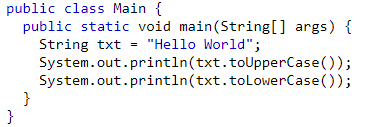**

**Output**:

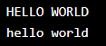

## 2.2 String Length

-   The length of a string can be found with the length() method.

**Example**

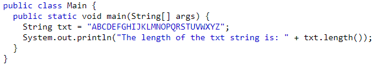

**Output**

****

## 2.3 Finding a Character in a String

-   The indexOf() method returns the **index** (the position) of the first occurrence of a specified text in a string (including whitespace):

**Example**

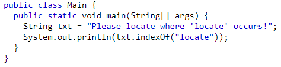

**Output:**

****

## 2.4 String Concatenation

-   The + operator can be used between strings to combine them. This is called **concatenation**.

**Example**

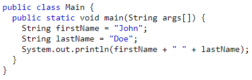

**Output:**

-   You can also use the concat() method to concatenate two strings.

**Example**

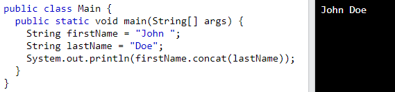

## 3. Adding Numbers and Strings

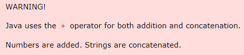

**1) If you add two numbers, the result will be a number:**

**Example**

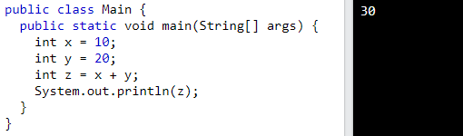

**2) If you add two strings, the result will be a string concatenation.**

**Example:**

**3) If you add a number and a string, the result will be a string concatenation.**

**Example:**

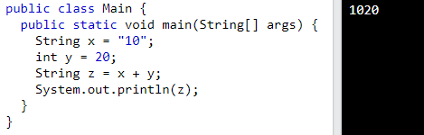

## 4. Strings - Special Characters

-   Strings must be written within quotes, Java will misunderstand this string, and generate an error.

**Example:**

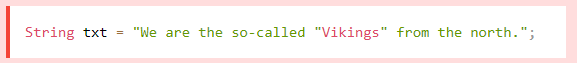

-   The solution to avoid this problem, is to use the **backslash escape character**.
-   The backslash (\\) escape character turns special characters into string characters.

**1) The sequence \\" inserts a double quote in a string.**

**Example:**

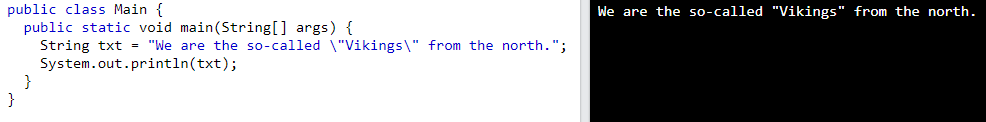

**2) The sequence \\' inserts a single quote in a string.**

**Example:**

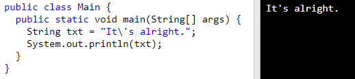

**3) The sequence \\\\ inserts a single backslash in a string.**

**Example:**

Other common escape sequences that are valid in Java are:

## 5. References

1.  https://www.w3schools.com/java/java_strings.asp
2.  https://www.w3schools.com/java/java_strings_concat.asp
3.  https://www.w3schools.com/java/java_strings_numbers.asp
4.  https://www.w3schools.com/java/java_strings_specchars.asp
