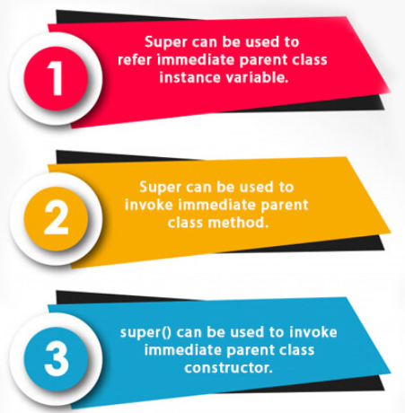

# Super Keyword in Java

**Content**

1\. super Keyword in Java

2\. References

## 1. super Keyword in Java

-   The **super is a** keyword in Java which is used to refer immediate parent class object.
-   Whenever you create the instance of subclass, an instance of parent class is created implicitly.

**Usage of Java super Keyword**



## 1.1 super is used to refer immediate parent class instance variable.

-   We can use super keyword to access the data member or field of parent class.
-   It is used if parent class and child class have same fields.

**Example:**

```
class Animal {
 String color="white";
}

class Dog extends Animal {
 String color="black";
 void printColor() {
 System.out.println(color);//prints color of Dog class
 System.out.println(super.color);//prints color of Animal class
 }
}

class TestSuper1 {
 public static void main(String args[]) {
 Dog d=new Dog();
 d.printColor();
 }
}
```

**Output:**

```
black

white
```

-   In the above example, Animal and Dog both classes have a common property color.
-   If we print color property, it will print the color of current class by default.
-   To access the parent property, we need to use super keyword.

## 1.2 super can be used to invoke parent class method

-   The super keyword can also be used to invoke parent class method.
-   It should be used if subclass contains the same method as parent class.
-   In other words, it is used if method is overridden.

**Example:**

```
class Animal {

        void eat() {
        
        System.out.println("eating...");
        
        }

}

class Dog extends Animal{

    void eat() {
              
          System.out.println("eating bread...");
        
    }

   void bark() {
            
        System.out.println("barking...");
            
    }
    
    void work() {

        super.eat();

        bark();

    }

}

class TestSuper2 {

    public static void main(String args[]){

        Dog d=new Dog();

        d.work();

    }

}
```

**Output:**

```
eating...

barking...
```

-   In the above example Animal and Dog both classes have eat() method if we call eat() method from Dog class, it will call the eat() method of Dog class by default because priority is given to local.
-   To call the parent class method, we need to use super keyword.

## 1.3 super is used to invoke parent class constructor.

-   The super keyword can also be used to invoke the parent class constructor.

**Example:**

```
class Animal {

    Animal() {
    
        System.out.println("animal is created");
    
    }

}

class Dog extends Animal {

    Dog() {

        super();

        System.out.println("dog is created");

    }

}

class TestSuper3 {

    public static void main(String args[]) {

        Dog d=new Dog();

    }
    
}
```

**Output:**

```
animal is created

dog is created
```

**Note:**

-   super() is added in each class constructor automatically by compiler if there is no super() or this().


-   As we know well that default constructor is provided by compiler automatically if there is no constructor. But, it also adds super() as the first statement.

## 2. References

1.  https://www.javatpoint.com/super-keyword
