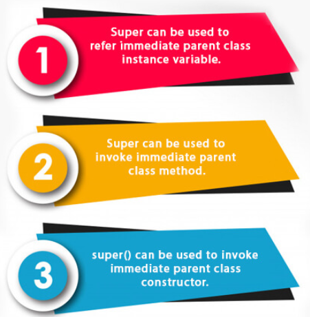
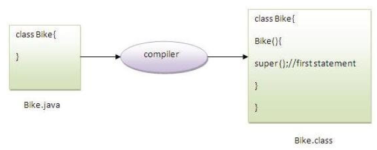
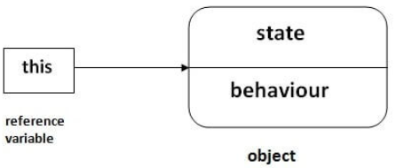
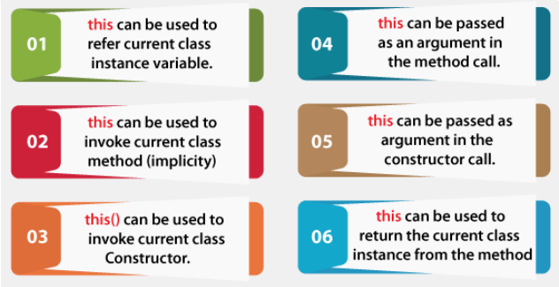
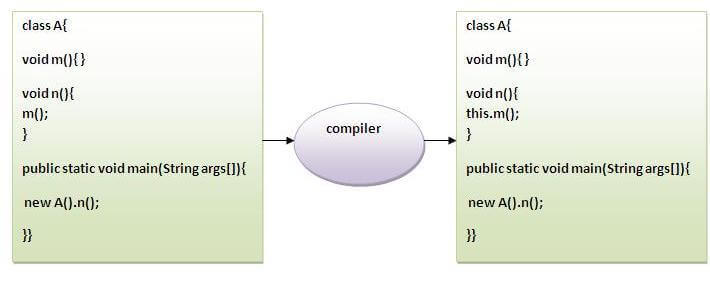

# Super Keyword in Java

**Content**

1\. super Keyword in Java

2\. this Keyword in Java

3\. References

## 1. super Keyword in Java

-   The **super is a** keyword in Java which is used to refer immediate parent class object.
-   Whenever you create the instance of subclass, an instance of parent class is created implicitly.

**Usage of Java super Keyword**



## 1.1 super is used to refer immediate parent class instance variable.

-   We can use super keyword to access the data member or field of parent class.
-   It is used if parent class and child class have same fields.

**Example:**

```
class Animal {
    String color="white";
}

class Dog extends Animal {
    String color="black";
    void printColor() {
        System.out.println(color);//prints color of Dog class
        System.out.println(super.color);//prints color of Animal class
    }
}

class TestSuper1 {
    public static void main(String args[]) {
        Dog d=new Dog();
        d.printColor();
    }
}
```

**Output:**

```
black

white
```

-   In the above example, Animal and Dog both classes have a common property color.
-   If we print color property, it will print the color of current class by default.
-   To access the parent property, we need to use super keyword.

## 1.2 super can be used to invoke parent class method

-   The super keyword can also be used to invoke parent class method.
-   It should be used if subclass contains the same method as parent class.
-   In other words, it is used if method is overridden.

**Example:**

```
class Animal {
        void eat() {  
        System.out.println("eating...");     
        }
}

class Dog extends Animal{
    void eat() {
        System.out.println("eating bread...");       
    }
   void bark() {       
        System.out.println("barking...");            
    }  
    void work() {
        super.eat();
        bark();
    }
}

class TestSuper2 {
    public static void main(String args[]){
        Dog d=new Dog();
        d.work();
    }
}
```

**Output:**

```
eating...

barking...
```

-   In the above example Animal and Dog both classes have eat() method if we call eat() method from Dog class, it will call the eat() method of Dog class by default because priority is given to local.
-   To call the parent class method, we need to use super keyword.

## 1.3 super is used to invoke parent class constructor.

-   The super keyword can also be used to invoke the parent class constructor.

**Example:**

```
class Animal {
    Animal() {
        System.out.println("animal is created");
    }
}

class Dog extends Animal {
    Dog() {
        super();
        System.out.println("dog is created");
    }
}

class TestSuper3 {
    public static void main(String args[]) {
        Dog d=new Dog();
    }  
}
```

**Output:**

```
animal is created

dog is created
```

**Note:**

-   super() is added in each class constructor automatically by compiler if there is no super() or this().



-   As we know well that default constructor is provided by compiler automatically if there is no constructor. But, it also adds super() as the first statement.

# 2. this keyword in Java

-   In Java, this is a **reference variable** that refers to the current object.



**Usage of Java this keyword**



## 2.1 this: to refer current class instance variable

-   The this keyword can be used to refer current class instance variable.
-   If there is ambiguity between the instance variables and parameters, this keyword resolves the problem of ambiguity.

**Understanding the problem without this keyword**

-   Let's understand the problem if we don't use this keyword by the example given below:

```
class Student { 
 
    int rollno;  
    String name;  
    float fee;  

    Student(int rollno, String name, float fee) {  
        rollno = rollno;  
        name = name;  
        fee = fee;  
    }  

    void display() {
        System.out.println(rollno +" " +name +" " +fee);
    } 
 
}  

class TestThis1 {  

    public static void main(String args[]) {  
        Student student1 = new Student(111, "ankit", 5000f);  
        Student student2 = new Student(112, "sumit", 6000f);  
        student1.display();  
        student2.display();  
    }

}  
```

**Output:**

```
0 null 0.0
0 null 0.0
```

-   In the above example, parameters (formal arguments) and instance variables are same.
-   So, we are using this keyword to distinguish local variable and instance variable.

**Solution of the above problem by using this keyword**

```
class Student {
  
    int rollno;  
    String name;  
    float fee;  

    Student(int rollno, String name, float fee) {  
        this.rollno = rollno;  
        this.name = name;  
        this.fee = fee;  
    } 
 
    void display() {
        System.out.println(rollno +" " +name +" " +fee);
    }

}  
 
class TestThis2 { 
 
    public static void main(String args[]){  
        Student student1 = new Student(111, "ankit", 5000f);  
        Student student2 = new Student(112, "sumit", 6000f);  
        student1.display();  
        student2.display();  
    }

}  
```

**Output:**

```
111 ankit 5000.0
112 sumit 6000.0
```

-   If local variables(formal arguments) and instance variables are different, there is no need to use this keyword.
-   It is better approach to use meaningful names for variables.
-   So we use same name for instance variables and parameters in real time, and always use this keyword.

## 2.2 this: to invoke current class method

-   You may invoke the method of the current class by using this keyword.
-   If you don't use this keyword, compiler automatically adds this keyword while invoking the method.



**Example:**

```
class CurrentClass { 
 
    void display1() {
  	  System.out.println("hello display1");
    }  

    void display2() {  
  	System.out.println("hello display2");  
        //display1();//same as this.display1()  
  	this.display1();  
    }  

}  

class TestThis4 { 
 
    public static void main(String args[]) {  
        CurrentClass hai = new CurrentClass();  
        hai.display2();  
    }

}  
```

**Output:**

```
hello display2
hello display1
```

## 2.3 this() : to invoke current class constructor

-   The this() constructor call can be used to invoke the current class constructor.
-   It is used to reuse the constructor.
-   In other words, it is used for constructor chaining.

**Calling no argument constructor from parameterized constructor:**

```
class Aclass { 
 
    Aclass() {
        System.out.println("hello message in no argument constructor ");
    }  

    Aclass(int x) {  
        this();  
        System.out.println(x);  
    } 
 
} 
 
class TestThis5{  

    public static void main(String args[]) {  
        Aclass value = new Aclass(10);  
    }

}  
```

**Output:**

```
hello message in no argument constructor 
10
```

**Calling parameterized constructor from no argument constructor:**

```
class Aclass {  

    Aclass() {  
        this(5);  
        System.out.println("hello message in no argument constructor");  
    }  

    A(int x){  
        System.out.println(x);  
    }  

} 
 
class TestThis6 { 
 
    public static void main(String args[]) {  
        Aclass value = new Aclass();  
    }

}  
```

**Output:**

```
5
hello message in no argument constructor
```

**Note:** this must be the first statement in constructor.

## 2.4 this: to pass as an argument in the method

-   The this keyword can also be passed as an argument in the method.
-   It is mainly used in the event handling.

**Example:**

```
class Student {

  void method(Student obj) {  
     System.out.println("method is invoked");  
  }  
  
  void display() {  
      method(this);  
  }
  
  public static void main(String args[]) {  
      Student student1 = new Student();  
      student1.display();  
  }  
  
}  
```

**Output:**

```
method is invoked
```

## 2.5 this: to pass as argument in the constructor call

-   We can pass this keyword in the constructor also.
-   It is useful if we have to use one object in multiple classes.

**Example:**

```
class BClass {  

    AClass obj;   
  
    BClass(AClass obj) {  
        this.obj=obj;  
    }  
  
    void display() {  
        System.out.println(obj.data);//using instance variable of AClass class  
    }
  
}  
  
class AClass {  

    int data=10;  
  
    AClass() {  
        BClass bobj = new BClass(this);  
        bobj.display();  
    }  
  
    public static void main(String args[]) {  
        AClass aobj = new AClass();  
  } 
  
} 
 
```

**Output:**

```
10
```

## 6) this keyword can be used to return current class instance

-   We can return this keyword as an statement from the method.
-   In such case, return type of the method must be the class type (non-primitive).

**Syntax:**

```
classname methodname(){  
return this;  
}  
```

**Example:**

```
class AClass {  

    AClass getA() {  
        return this;  
    }  

    void msg() {
        System.out.println("Hello java");
    } 
    
}  

class Test1 {

    public static void main(String args[]) {  
        new AClass().getA().msg();  
    }  
}  
```

**Output:**

```
Hello java
```

## 3. References

1.  https://www.javatpoint.com/super-keyword
2.  https://www.javatpoint.com/this-keyword
