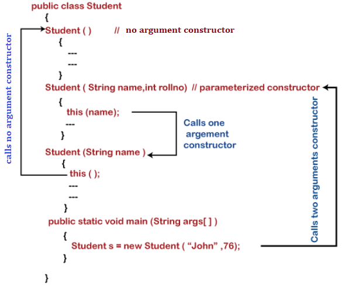

# Constructor Chaining

**Content**

## Constructor Chaining

-   In constructor chain, a constructor is called from another constructor in the same class this process is known as **constructor chaining.**
-   It occurs through inheritance.
-   When we create an instance of a derived class, all the constructors of the inherited class (base class) are first invoked, after that the constructor of the calling class (derived class) is invoked.

We can achieve constructor chaining in two ways:

**1) Within the same class:**

-   If the constructors belong to the same class, we use **this** keyword

**2) From the base class:**

-   If the constructor belongs to different classes (parent and child classes), we use the **super** keyword to call the constructor from the base class.

**Remember** that changing the order of the constructor does not affect the output.

### The Need of Constructor Chaining

-   By using the constructor chaining mechanism, we can implement multiple tasks in a single constructor.
-   We can make the program more readable and understandable by using constructor chaining.

### Rules of Constructor Chaining

-   An expression that uses **this** keyword must be the first line of the constructor.
-   **Order** does not matter in constructor chaining.
-   There must exist at least one constructor that does not use **this**

#### **Note: In the same constructor block, we cannot use this() and super() simultaneously.**

### Calling Current Class Constructor

-   We use **this()** keyword if we want to call the current class constructor within the same class.
-   this() is mandatory because [JVM](https://www.javatpoint.com/jvm-java-virtual-machine) never put it automatically.
-   Note that this() must be the first line of the constructor.
-   There must exist at least one constructor without [this() keyword](https://www.javatpoint.com/this-keyword).

**Syntax:**

this(); or this(parameters list);

**Example:**

public class ConstructorChain

{

//No argument constructor

ConstructorChain()

{

this("Javatpoint");

System.out.println("No argument constructor called.");

}

//parameterized constructor

ConstructorChain(String str)

{

System.out.println("Parameterized constructor called");

}

//main method

public static void main(String args[])

{

//initializes the instance of example class

ConstructorChain cc = new ConstructorChain();

}

}

**Output:**

Parameterized constructor called

No argument constructor called
