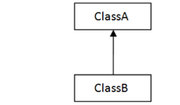
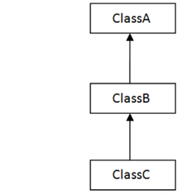
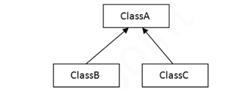
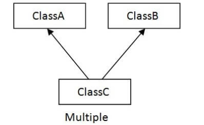

# Java Inheritance, Association, Aggregation and Composition

**Content**

1\. Inheritance in java

1.1 Why use inheritance in java

1.2 Terms used in inheritance

2\. Types of inheritance in java

2.1 Single inheritance

2.2 Multilevel inheritance

2.3 Hierarchical inheritance

3\. Association in java

4\. Aggregation in Java

5\. Association vs Aggregation vs Composition

6\. References

## 1. Inheritance in java

-   Inheritance is a mechanism in which child object acquires all the properties and behaviors of a parent object.
-   It is an important part of OOPs (Object Oriented programming system).
-   The idea behind inheritance is that you can create new classes that are built upon existing classes.
-   When you inherit from an existing class, you can reuse methods and fields of the parent class.
-   Moreover, you can add new methods and fields in your current class also.
-   Inheritance represents the **IS-A relationship** which is also known as a **parent-child** relationship.

## 1.1 Why use inheritance in java

-   For Method Overriding (so runtime polymorphism can be achieved).
-   For Code Reusability.

## 1.2 Terms used in inheritance

**Class:**

-   It is a template or blueprint from which objects are created.

**Sub Class/Child Class:**

-   Subclass is a class which inherits the other class.
-   It is also called a derived class, extended class, or child class.

**Super Class/Parent Class:**

-   Superclass is the class from where a subclass inherits the features.
-   It is also called a base class or a parent class.

**Reusability:**

-   As the name specifies, reusability is a mechanism which facilitates you to reuse the fields and methods of the existing class when you create a new class.
-   You can use the same fields and methods already defined in the previous class.

**Syntax:**

```java
class Subclass-name extends Superclass-name  
{  
   //methods and fields  
}  
```

**extends keyword:**

-   It indicates that you are making a new class that derives from an existing class.
-   The meaning of "extends" is to increase the functionality.

## 2. Types of inheritance in java

-   There can be three types of inheritance in java:
1.  Single inheritance
2.  Multilevel inheritance
3.  Hierarchical inheritance
-   In java programming, multiple and hybrid inheritance is supported through interface only.

## 2.1 Single inheritance

-   When a class inherits another class, it is known as a *single inheritance*.



**Example: TestInheritance.java**

```java
class Animal{  
void eat(){System.out.println("eating...");}  
}  
class Dog extends Animal{  
void bark(){System.out.println("barking...");}  
}  
class TestInheritance{  
public static void main(String args[]){  
Dog d=new Dog();  
d.bark();  
d.eat();  
}}  
```

**Output:**

```
barking...
eating...
```

## 2.2 Multilevel inheritance

-   When there is a chain of inheritance, it is known as *multilevel inheritance*.

    

-   As you can see in the example given below, BabyDog class inherits the Dog class which again inherits the Animal class, so there is a multilevel inheritance.

**Example: TestInheritance2.java**

```java
class Animal{  
void eat(){System.out.println("eating...");}  
}  
class Dog extends Animal{  
void bark(){System.out.println("barking...");}  
}  
class BabyDog extends Dog{  
void weep(){System.out.println("weeping...");}  
}  
class TestInheritance2{  
public static void main(String args[]){  
BabyDog d=new BabyDog();  
d.weep();  
d.bark();  
d.eat();  
}} 
```

**Output:**

```
weeping...
barking...
eating...
```

## 2.3 Hierarchical inheritance

-   When two or more classes inherits a single class, it is known as *hierarchical inheritance*.

    

-   In the example given below, Dog and Cat classes inherits the Animal class, so there is hierarchical inheritance.

**Example: TestInheritance3.java**

```java
class Animal{  
void eat(){System.out.println("eating...");}  
}  
class Dog extends Animal{  
void bark(){System.out.println("barking...");}  
}  
class Cat extends Animal{  
void meow(){System.out.println("meowing...");}  
}  
class TestInheritance3{  
public static void main(String args[]){  
Cat c=new Cat();  
c.meow();  
c.eat();  
//c.bark();//C.T.Error  
}}  
```

**Output:**

```
meowing...
eating...
```

## Q) Why multiple inheritance is not supported in java?

-   multiple inheritance is not supported in java.



-   Consider a scenario where A, B, and C are three classes.
-   The C class inherits A and B classes.
-   If A and B classes have the same method and you call it from child class object, there will be ambiguity to call the method of A or B class.
-   Since compile-time errors are better than runtime errors, Java renders compile-time error if you inherit 2 classes.
-   So whether you have same method or different, there will be compile time error.

**Example:**

```java
class A{  
void msg(){System.out.println("Hello");}  
}  
class B{  
void msg(){System.out.println("Welcome");}  
}  
class C extends A,B{//suppose if it were  
   
 public static void main(String args[]){  
   C obj=new C();  
   obj.msg();//Now which msg() method would be invoked?  
}  
}  
```

**Output:**

```
Compile Time Error
```

## 3. Association in java

-   Association establishes relationship between two separate **classes** through their **objects**.
-   The relationship can be one to one, One to many, many to one and many to many.

**Association Example**

```java
class CarClass{
   String carName;
   int carId;
   CarClass(String name, int id)
   {
	this.carName = name;
	this.carId = id;
   }
}
class Driver extends CarClass{
   String driverName;
   Driver(String name, String cname, int cid){
	super(cname, cid);
	this.driverName=name;
   }
}
class TransportCompany{
   public static void main(String args[])
   {
	Driver obj = new Driver("Andy", "Ford", 9988);
	System.out.println(obj.driverName+" is a driver of car Id: "+obj.carId);
   }
}
```

**Output:**

```
Andy is a driver of car Id: 9988
```

-   In the above example, there is a one to one relationship (**Association**) between two classes: CarClass and Driver. Both the classes represent two separate entities.

## 4. Aggregation in Java

-   If a class have an entity reference, it is known as Aggregation.
-   Aggregation represents **HAS-A** relationship.
-   Aggregation is a special form of association.
-   It is a relationship between two classes like association, however its a uni**directional** association, which means it is strictly a **one way association.**

**Why use Aggregation?**

-   For Code Reusability.

**Simple Example of Aggregation**

-   Consider two classes **Student** class and **Address** class.
-   Every student has an address so the relationship between student and address is a Has-A relationship.
-   But if you consider its vice versa then it would not make any sense as an Address doesn’t need to have a Student necessarily.
-   Lets write this example in a java program.  
    **Student Has-A Address**

```java
class Address
{
   int streetNum;
   String city;
   String state;
   String country;
   Address(int street, String c, String st, String coun)
   {
       this.streetNum=street;
       this.city =c;
       this.state = st;
       this.country = coun;
   }
}
class StudentClass
{
   int rollNum;
   String studentName;
   //Creating HAS-A relationship with Address class
   Address studentAddr; 
   StudentClass(int roll, String name, Address addr){
       this.rollNum=roll;
       this.studentName=name;
       this.studentAddr = addr;
   }
   public static void main(String args[]){
       Address ad = new Address(55, "Agra", "UP", "India");
       StudentClass obj = new StudentClass(123, "Chaitanya", ad);
       System.out.println(obj.rollNum);
       System.out.println(obj.studentName);
       System.out.println(obj.studentAddr.streetNum);
       System.out.println(obj.studentAddr.city);
       System.out.println(obj.studentAddr.state);
       System.out.println(obj.studentAddr.country);
   }
}
```

**Output:**

```
123
Chaitanya
55
Agra
UP
India
```

-   The above example shows the **Aggregation** between Student and Address classes.
-   You can see that in Student class i have declared a property of type Address to obtain student address.

## 5. Association vs Aggregation vs Composition

**difference between Association, Aggregation and Composition**:

-   Although all three are related terms, there are some major differences in the way they relate two classes.

**Association**

-   It is a relationship between two separate classes and the association can be of any type say one to one, one to may etc.
-   It joins two entirely separate entities.

**Aggregation**

-   It is a special form of association which is a unidirectional one way relationship between classes (or entities).
-   For e.g. Wallet and Money classes. Wallet has Money but money doesn’t need to have Wallet necessarily so its a one directional relationship.
-   In this relationship both the entities can survive if other one ends.
-   In our example if Wallet class is not present, it does not mean that the Money class cannot exist.

**Composition**

-   **It** is a restricted form of Aggregation in which two entities (or you can say classes) are highly dependent on each other.
-   For e.g. Human and Heart.
-   A human needs heart to live and a heart needs a Human body to survive.
-   In other words when the classes (entities) are dependent on each other and their life span are same (if one dies then another one too) then its a composition.
-   Heart class has no sense if Human class is not present.

## 6. References

1.  https://www.javatpoint.com/inheritance-in-java
2.  https://www.javatpoint.com/aggregation-in-java
3.  https://beginnersbook.com/2013/05/association/
4.  https://beginnersbook.com/2013/05/aggregation/
