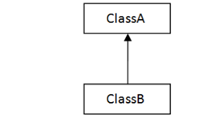
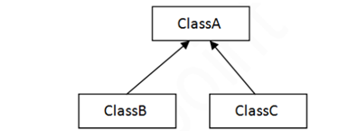
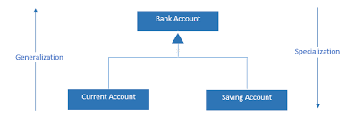

# Java Inheritance, Object Typecasting, Generalization, Specialization, Association, Aggregation and Composition

**Content**

[1. Inheritance in java](#1-inheritance-in-java)

[1.1 Why use inheritance in java](#11-why-use-inheritance-in-java)

[1.2 Terms used in inheritance](#12-terms-used-in-inheritance)

[2. Types of inheritance in java](#2-types-of-inheritance-in-java)

[2.1 Single inheritance](#21-single-inheritance)

[2.2 Multilevel inheritance](#22-multilevel-inheritance)

[2.3 Hierarchical inheritance](#23-hierarchical-inheritance)

[3. Object Typecasting](#3-object-typecasting)

[3.1 Upcasting](#31-upcasting)

[3.2 Downcasting](#32-downcasting)

[3.3 Why we need Upcasting and Downcasting?](#33-why-we-need-upcasting-and-downcasting)

[3.4 Difference between Upcasting and Downcasting](#34-difference-between-upcasting-and-downcasting)

[4. Generalization and Specialization](#4-generalization-and-specialization)

[5. Association in java](#5-association-in-java)

[6. Aggregation in Java](#6-aggregation-in-java)

[7. Association vs Aggregation vs Composition](#7-association-vs-aggregation-vs-composition)

[8. References](#8-references)

## 1. Inheritance in java

-   Inheritance is a mechanism in which child object acquires all the properties and behaviors of a parent object.
-   It is an important part of OOPs (Object Oriented programming system).
-   The idea behind inheritance is that you can create new classes that are built upon existing classes.
-   When you inherit from an existing class, you can reuse methods and fields of the parent class.
-   Moreover, you can add new methods and fields in your current class also.
-   Inheritance represents the **IS-A relationship** which is also known as a **parent-child** relationship.

## 1.1 Why use inheritance in java

-   For Method Overriding (so runtime polymorphism can be achieved).
-   For Code Reusability.

## 1.2 Terms used in inheritance

**Class:**

-   It is a template or blueprint from which objects are created.

**Sub Class/Child Class:**

-   Subclass is a class which inherits the other class.
-   It is also called a derived class, extended class, or child class.

**Super Class/Parent Class:**

-   Superclass is the class from where a subclass inherits the features.
-   It is also called a base class or a parent class.

**Reusability:**

-   As the name specifies, reusability is a mechanism which facilitates you to reuse the fields and methods of the existing class when you create a new class.
-   You can use the same fields and methods already defined in the previous class.

**Syntax:**

```java
class Subclass-name extends Superclass-name  
{  
   //methods and fields  
}  
```

**extends keyword:**

-   It indicates that you are making a new class that derives from an existing class.
-   The meaning of "extends" is to increase the functionality.

## 2. Types of inheritance in java

-   There can be three types of inheritance in java:
1.  Single inheritance
2.  Multilevel inheritance
3.  Hierarchical inheritance
-   In java programming, multiple and hybrid inheritance is supported through interface only.

## 2.1 Single inheritance

-   When a class inherits another class, it is known as a *single inheritance*.



**Example: TestInheritance.java**

```java
class Animal{  
void eat(){System.out.println("eating...");}  
}  
class Dog extends Animal{  
void bark(){System.out.println("barking...");}  
}  
class TestInheritance{  
public static void main(String args[]){  
Dog d=new Dog();  
d.bark();  
d.eat();  
}}  
```

**Output:**

```
barking...
eating...
```

## 2.2 Multilevel inheritance

-   When there is a chain of inheritance, it is known as *multilevel inheritance*.

    

-   As you can see in the example given below, BabyDog class inherits the Dog class which again inherits the Animal class, so there is a multilevel inheritance.

**Example: TestInheritance2.java**

```java
class Animal{  
void eat(){System.out.println("eating...");}  
}  
class Dog extends Animal{  
void bark(){System.out.println("barking...");}  
}  
class BabyDog extends Dog{  
void weep(){System.out.println("weeping...");}  
}  
class TestInheritance2{  
public static void main(String args[]){  
BabyDog d=new BabyDog();  
d.weep();  
d.bark();  
d.eat();  
}} 
```

**Output:**

```
weeping...
barking...
eating...
```

## 2.3 Hierarchical inheritance

-   When two or more classes inherits a single class, it is known as *hierarchical inheritance*.

    

-   In the example given below, Dog and Cat classes inherits the Animal class, so there is hierarchical inheritance.

**Example: TestInheritance3.java**

```java
class Animal{  
void eat(){System.out.println("eating...");}  
}  
class Dog extends Animal{  
void bark(){System.out.println("barking...");}  
}  
class Cat extends Animal{  
void meow(){System.out.println("meowing...");}  
}  
class TestInheritance3{  
public static void main(String args[]){  
Cat c=new Cat();  
c.meow();  
c.eat();  
//c.bark();//C.T.Error  
}}  
```

**Output:**

```
meowing...
eating...
```

## Q) Why multiple inheritance is not supported in java?

-   multiple inheritance is not supported in java.


-   Consider a scenario where A, B, and C are three classes.
-   The C class inherits A and B classes.
-   If A and B classes have the same method and you call it from child class object, there will be ambiguity to call the method of A or B class.
-   Since compile-time errors are better than runtime errors, Java renders compile-time error if you inherit 2 classes.
-   So whether you have same method or different, there will be compile time error.

**Example:**

```java
class A{  
void msg(){System.out.println("Hello");}  
}  
class B{  
void msg(){System.out.println("Welcome");}  
}  
class C extends A,B{//suppose if it were  
   
 public static void main(String args[]){  
   C obj=new C();  
   obj.msg();//Now which msg() method would be invoked?  
}  
}  
```

**Output:**

```
Compile Time Error
```

## 3. Object Typecasting

-   A process of converting one data type to another is known as **Typecasting**.
-   In Java, the object can also be typecasted like the datatypes.
-   Parent and Child objects are two types of objects.
-   So, there are two types of typecasting possible for an object, i.e., **Parent to Child** and **Child to Parent** or can say **Upcasting** and **Downcasting**.
-   Typecasting is used to ensure whether variables are correctly processed by a function or not.
-   In Upcasting and Downcasting, we typecast a child object to a parent object and a parent object to a child object simultaneously.
-   We can perform Upcasting implicitly or explicitly, but downcasting cannot be implicitly possible.


## 3.1 Upcasting

-   Upcasting is a type of object typecasting in which a **child object** is typecasted to a **parent class object**.
-   By using the Upcasting, we can easily access the variables and methods of the parent class to the child class.
-   Here, we don't access all the variables and the method.
-   We access only some specified variables and methods of the child class.
-   Upcasting is also known as **Generalization** and **Widening**.

**Example:**

```java
class  Parent{  
   void PrintData() {  
      System.out.println("method of parent class");  
   }  
}  
  
class Child extends Parent {  
   void PrintData() {  
      System.out.println("method of child class");  
   }  
}  
class UpcastingExample{  
   public static void main(String args[]) {  
        
      Parent obj1 = (Parent) new Child();  
      Parent obj2 = (Parent) new Child();   
      obj1.PrintData();  
      obj2.PrintData();  
   }  
}  
```

**Output:**

```
Method of child class
Method of child class
```

## 3.2 Downcasting

-   **Downcasting** is another type of object typecasting.
-   In Downcasting, we assign a parent class reference object to the child class.
-   In Java, we cannot assign a parent class reference object to the child class, but if we perform downcasting, we will not get any compile-time error.
-   However, when we run it, it throws the **"ClassCastException"**.
-   Now the point is if downcasting is not possible in Java, then why is it allowed by the compiler? In Java, some scenarios allow us to perform downcasting.
-   Below is an example of downcasting in which both the valid and the invalid scenarios are explained:

**Example:**

```java
//Parent class  
class Parent {   
    String name;   
    
    // A method which prints the data of the parent class   
    void showMessage()   
    {   
        System.out.println("Parent method is called");   
    }   
}   
    
// Child class   
class Child extends Parent {   
    int age;   
    
    // Performing overriding  
    @Override  
    void showMessage()   
    {   
        System.out.println("Child method is called");   
    }   
}   
    
public class Downcasting{  
    
    public static void main(String[] args)   
    {   
        Parent p = new Child();  
        p.name = "Shubham";  
          
        // Performing Downcasting Implicitly   
        //Child c = new Parent(); // it gives compile-time error   
          
        // Performing Downcasting Explicitly   
        Child c = (Child)p;   
    
        c.age = 18;   
        System.out.println(c.name);   
        System.out.println(c.age);   
        c.showMessage();   
    }   
}  
```

**Output:**

```
Shubham
18
Child method is called
```

## 3.3 Why we need Upcasting and Downcasting?

-   In Java, we rarely use **Upcasting**. We use it when we need to develop a code that deals with only the parent class.
-   **Downcasting** is used when we need to develop a code that accesses behaviors of the child class.


## 3.4 Difference between Upcasting and Downcasting

-   These are the following differences between Upcasting and Downcasting:


## 4. Generalization and Specialization

-   **Generalization** is a bottom-up design process whereas **Specialization** is a top-down design process.
-   **Generalization** is the process of common features from two or more classes, and combining them into a generalized super class.
-   Common features can be methods, attributes and associations.
-   In other word, we can say that a super class is a generalization of its subclass. But, a subclass is a Specialization of its super class.
-   Specialization is the reverse process of Generalization means creating new sub classes from an existing class.

**Example**:



-   We are going to see very simple and general example of generalization and specialization.
-   As we know that a bank provides us different types of account to customers.
-   Here We see there are two types of bank account: Current account and Saving account.
-   Both account inherit the common/generalized properties like Account Number, Account Balance etc. from a Bank Account and also have their own specialized properties like interest rate etc.

## 5. Association in java

-   Association establishes relationship between two separate **classes** through their **objects**.
-   The relationship can be one to one, One to many, many to one and many to many.

**Association Example**

```java
class CarClass{
   String carName;
   int carId;
   CarClass(String name, int id)
   {
	this.carName = name;
	this.carId = id;
   }
}
class Driver extends CarClass{
   String driverName;
   Driver(String name, String cname, int cid){
	super(cname, cid);
	this.driverName=name;
   }
}
class TransportCompany{
   public static void main(String args[])
   {
	Driver obj = new Driver("Andy", "Ford", 9988);
	System.out.println(obj.driverName+" is a driver of car Id: "+obj.carId);
   }
}
```

**Output:**

```
Andy is a driver of car Id: 9988
```

-   In the above example, there is a one to one relationship (**Association**) between two classes: CarClass and Driver. Both the classes represent two separate entities.

## 6. Aggregation in Java

-   If a class have an entity reference, it is known as Aggregation.
-   Aggregation represents **HAS-A** relationship.
-   Aggregation is a special form of association.
-   It is a relationship between two classes like association, however its a uni**directional** association, which means it is strictly a **one way association.**

**Why use Aggregation?**

-   For Code Reusability.

**Simple Example of Aggregation**

-   Consider two classes **Student** class and **Address** class.
-   Every student has an address so the relationship between student and address is a Has-A relationship.
-   But if you consider its vice versa then it would not make any sense as an Address doesn’t need to have a Student necessarily.
-   Lets write this example in a java program.  
    **Student Has-A Address**

```java
class Address
{
   int streetNum;
   String city;
   String state;
   String country;
   Address(int street, String c, String st, String coun)
   {
       this.streetNum=street;
       this.city =c;
       this.state = st;
       this.country = coun;
   }
}
class StudentClass
{
   int rollNum;
   String studentName;
   //Creating HAS-A relationship with Address class
   Address studentAddr; 
   StudentClass(int roll, String name, Address addr){
       this.rollNum=roll;
       this.studentName=name;
       this.studentAddr = addr;
   }
   public static void main(String args[]){
       Address ad = new Address(55, "Agra", "UP", "India");
       StudentClass obj = new StudentClass(123, "Chaitanya", ad);
       System.out.println(obj.rollNum);
       System.out.println(obj.studentName);
       System.out.println(obj.studentAddr.streetNum);
       System.out.println(obj.studentAddr.city);
       System.out.println(obj.studentAddr.state);
       System.out.println(obj.studentAddr.country);
   }
}
```

**Output:**

```
123
Chaitanya
55
Agra
UP
India
```

-   The above example shows the **Aggregation** between Student and Address classes.
-   You can see that in Student class i have declared a property of type Address to obtain student address.

## 7. Association vs Aggregation vs Composition

**difference between Association, Aggregation and Composition**:

-   Although all three are related terms, there are some major differences in the way they relate two classes.

**Association**

-   It is a relationship between two separate classes and the association can be of any type say one to one, one to may etc.
-   It joins two entirely separate entities.

**Aggregation**

-   It is a special form of association which is a unidirectional one way relationship between classes (or entities).
-   For e.g. Wallet and Money classes. Wallet has Money but money doesn’t need to have Wallet necessarily so its a one directional relationship.
-   In this relationship both the entities can survive if other one ends.
-   In our example if Wallet class is not present, it does not mean that the Money class cannot exist.

**Composition**

-   **It** is a restricted form of Aggregation in which two entities (or you can say classes) are highly dependent on each other.
-   For e.g. Human and Heart.
-   A human needs heart to live and a heart needs a Human body to survive.
-   In other words when the classes (entities) are dependent on each other and their life span are same (if one dies then another one too) then its a composition.
-   Heart class has no sense if Human class is not present.

## 8. References

1.  https://www.javatpoint.com/inheritance-in-java
2.  https://www.javatpoint.com/aggregation-in-java
3.  https://beginnersbook.com/2013/05/association/
4.  https://beginnersbook.com/2013/05/aggregation/
5.  https://www.javatpoint.com/upcasting-and-downcasting-in-java
