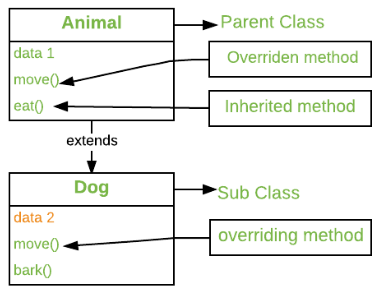
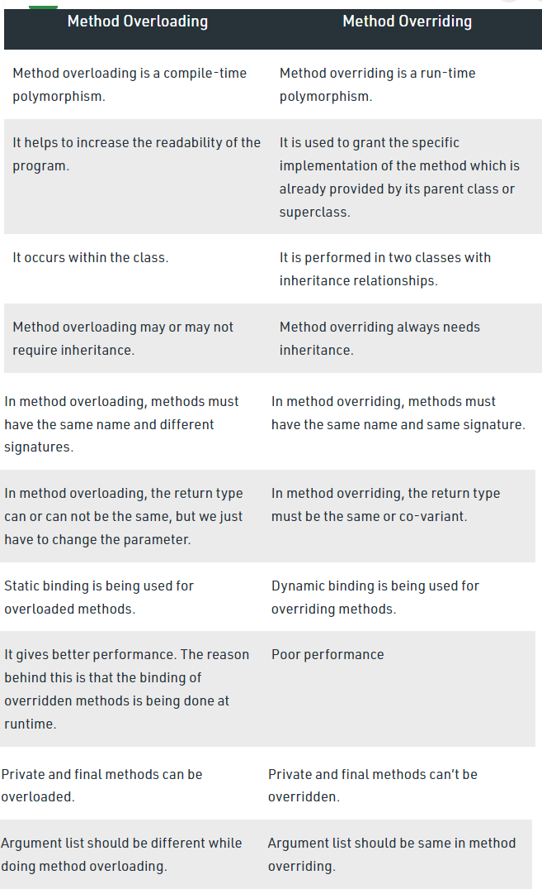

# Java Polymorphism, Method Overloading and Method Overriding

**Content**

[1. Polymorphism](#1-polymorphism)

[2. Types of Polymorphism](#2-types-of-polymorphism)

[2.1 Compile-Time Polymorphism /Static Polymorphism/Early Binding](#21-compile-time-polymorphism-static-polymorphismearly-binding)

[2.1.1 Different ways to Overload Methods](#211-different-ways-to-overload-methods)

[2.1.3 Advantages of compile-time polymorphism:](#213-advantages-of-compile-time-polymorphism)

[2.2 Run-Time Polymorphism/Dynamic Polymorphism/Late Binding](#22-run-time-polymorphismdynamic-polymorphismlate-binding)

[2.2.1 Rules for method overriding](#221-rules-for-method-overriding)

[2.2.2 Difference between Method Overloading and Method Overriding in Java](#222-difference-between-method-overloading-and-method-overriding-in-java)

[3. super Keyword in Java](#3-super-keyword-in-java)

[4. References](#5-references)

## 1. Polymorphism

-   The word “Polymorphism” derives from two words i.e. **“Poly”** which means many and “**morphs**” meaning forms. Thus polymorphism means many forms.
-   In a programming language, we can say that an object can take many forms, and hence the object is polymorphic.
-   Polymorphism is one of the OOPs feature that allows us to perform a single action in different ways.

## 2. Types of Polymorphism

There are two types of polymorphism in java:

1.  **Compile-Time Polymorphism**
2.  **Run-Time Polymorphism**

**Note:** Run time polymorphism is implemented through Method overriding. Whereas, Compile Time polymorphism is implemented through Method overloading.

## 2.1 Compile-Time Polymorphism /Static Polymorphism/Early Binding

-   Compile-time polymorphism is a polymorphism that is resolved during the compilation process.
-   Compile-time polymorphism is achieved by **method overloading**
-   Method Overloading occurs when a class has many methods with the same name but different parameters.
-   Two or more methods may have the same name if they have different order of parameters, different data types, or different numbers of parameters.
-   **Compile-time Polymorphism** is also known as **Static Polymorphism, or** **Early binding** in Java.

**Example of Compile-Time Polymorphism in Java**

```java
public class Addition { 
void sum(int a, int b) { 
int c = a+b; 
System.out.println(“ Addition of two numbers :” +c); 
} 
void sum(int a, int b, int e) { 
int c = a+b+e; 
System.out.println(“ Addition of three numbers :” +c); 
} 
public static void main(String[] args) { 
Addition obj = new Addition(); 
obj.sum ( 30,90); 
obj.sum(45, 80, 22); 
} 
}
```

**Output:**

```
Sum of two numbers: 120
Sum of three numbers: 147
```

-   In this program, the sum() method overloads with two types via different parameters.
-   This is the basic concept of compile-time polymorphism in java where we can perform various operations by using multiple methods having the same name.

**Another Example:**

```java
class Shapes { 
public void area() { 
System.out.println("Find area "); 
} 
public void area(int r) { 
System.out.println("Circle area = "+3.14*r*r); 
} 
public void area(double b, double h) { 
System.out.println("Triangle area="+0.5*b*h); 
} 
public void area(int l, int b) { 
System.out.println("Rectangle area="+l*b); 
} 
} 
class Main { 
public static void main(String[] args) { 
Shapes myShape = new Shapes(); // Create a Shapes object myShape.area(); myShape.area(5); myShape.area(6.0,1.2); myShape.area(6,2); 
} 
}
```

**Output:**

```
Find area
Circle area = 78.5
Triangle area=3.60
Rectangle area=12
```

## 2.1.1 Different ways to Overload Methods

**1). Method overloading by changing the number of parameters**

-   In this type, Method overloading is done by overloading methods in the function call with a varied number of parameters

**Example:**

```java
Show(char a)
Show(char a, char b)
```

-   In the given example, the first show method has one parameter, and the second show method has two methods.
-   When a function is called, the compiler looks at the number of parameters and decides how to resolve the method call.

**2). Method overloading by changing datatype of parameter**

-   In this type, Method overloading is done by overloading methods in the function call with different types of parameters

**Example:**

```java
Show(float a, float b)
Show(int a, int b)
```

-   In the above example, the first show method has two float parameters, and the second show method has two int parameters.
-   When a function is called, the compiler looks at the data type of input parameters and decides how to resolve the method call.

**3). By changing the** **sequence of parameters**

-   In this type, overloading is dependent on the sequence of the parameters

**Example:**

```java
Show (int a, float b)
Show(float a, int b)
```

-   In this example, The parameters int and float are used in the first declaration.
-   The parameters are int and float in the second declaration, but their order in the parameter list is different.

## 2.1.1.2 Invalid cases of method overloading

-   Method overloading does not allow **changing the** **return type of method**( function ); it occurs ambiguity.

**Examples**

```java
int sum(int, int)
String sum(int, int)
```

-   Because the arguments are matching, the code above will not compile.
-   Both methods have the same amount of data types and the same sequence of data types in the parameters.

## 2.1.3 Advantages of compile-time polymorphism:

1.  It improves code clarity and allows for the use of a single name for similar procedures.
2.  It has a faster execution time since it is discovered early in the compilation process.

The only **disadvantage** of compile-time polymorphism is that it doesn’t include inheritance.

## 2.2 Run-Time Polymorphism/Dynamic Polymorphism/Late Binding

-   Whenever an object is bound with the functionality at run time, this is known as runtime polymorphism.
-   Java virtual machine determines the proper method to call at the runtime, not at the compile time.
-   It is also called **dynamic polymorphism or late binding**.
-   The runtime polymorphism can be achieved by **method overriding**.
-   In any object-oriented programming language, Overriding is a feature that allows a subclass or child class to provide a specific implementation of a method that is already provided by one of its super-classes or parent classes.
-   When a method in a subclass has the same name, same parameters or signature, and same return type(or sub-type) as a method in its super-class, then the method in the subclass is said to *override* the method in the super-class.



## 2.2.1 Rules for method overriding

1.  There must be an IS-A relationship (inheritance).
2.  The access modifier can only allow more access for the overridden method.
3.  A final method does not support method overriding.
4.  A static method cannot be overridden.
5.  Private methods cannot be overridden.
6.  The return type of the overriding method must be the same.
7.  We can call the parent class method in the overriding method using the super keyword.
8.  A constructor cannot be overridden because a child class and a parent class cannot have the constructor with the same name.

**Example:**

```java
Class Animal
Public void move() {
System.out.println(“Animals can move”);
}
}
Class Dog extends Animal {
	Public void move(){
	System.out.println(“Dogs can walk and run”);
}
}
Public class TestDog {
	Public static void main(String args[]) {
Animal a = new Animal(); // Animal reference and object
Animal b = new Dog(); // Animal reference but Dog object
a.move(); //runs the method in Animal class
b.move(); //runs the method in Dog class
}
}
```

**Output:**

```
Animal can move
Dogs can walk and run
```

## 2.2.2 Difference between Method Overloading and Method Overriding in Java



## 3. super Keyword in Java

-   The **super is a** keyword in Java which is used to refer immediate parent class object.
-   Whenever you create the instance of subclass, an instance of parent class is created implicitly.

**Usage of Java super Keyword**


## 3.1 super is used to refer immediate parent class instance variable.

-   We can use super keyword to access the data member or field of parent class.
-   It is used if parent class and child class have same fields.

**Example:**

```java
class Animal {
    String color="white";
}

class Dog extends Animal {
    String color="black";
    void printColor() {
        System.out.println(color);//prints color of Dog class
        System.out.println(super.color);//prints color of Animal class
    }
}

class TestSuper1 {
    public static void main(String args[]) {
        Dog d=new Dog();
        d.printColor();
    }
}
```

**Output:**

```
black
white
```

-   In the above example, Animal and Dog both classes have a common property color.
-   If we print color property, it will print the color of current class by default.
-   To access the parent property, we need to use super keyword.

## 3.2 super can be used to invoke parent class method

-   The super keyword can also be used to invoke parent class method.
-   It should be used if subclass contains the same method as parent class.
-   In other words, it is used if method is overridden.

**Example:**

```java
class Animal {
        void eat() {  
        System.out.println("eating...");     
        }
}

class Dog extends Animal{
    void eat() {
        System.out.println("eating bread...");       
    }
   void bark() {       
        System.out.println("barking...");            
    }  
    void work() {
        super.eat();
        bark();
    }
}

class TestSuper2 {
    public static void main(String args[]){
        Dog d=new Dog();
        d.work();
    }
}
```

**Output:**

```
eating...
barking...
```

-   In the above example Animal and Dog both classes have eat() method if we call eat() method from Dog class, it will call the eat() method of Dog class by default because priority is given to local.
-   To call the parent class method, we need to use super keyword.

## 3.3 super is used to invoke parent class constructor.

-   The super keyword can also be used to invoke the parent class constructor.

**Example:**

```java
class Animal {
    Animal() {
        System.out.println("animal is created");
    }
}

class Dog extends Animal {
    Dog() {
        super();
        System.out.println("dog is created");
    }
}

class TestSuper3 {
    public static void main(String args[]) {
        Dog d=new Dog();
    }  
}
```

**Output:**

```
animal is created
dog is created
```

**Note:**

-   super() is added in each class constructor automatically by compiler if there is no super() or this().


-   As we know well that default constructor is provided by compiler automatically if there is no constructor. But, it also adds super() as the first statement.

## 4. References

1.  https://www.mygreatlearning.com/blog/polymorphism-in-java/
2.  https://www.tutorialspoint.com/Runtime-Polymorphism-in-Java
3.  https://www.javatpoint.com/super-keyword
