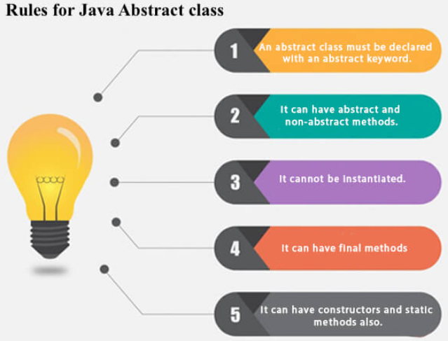
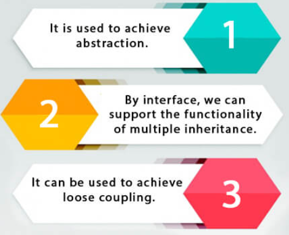
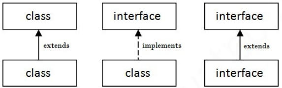
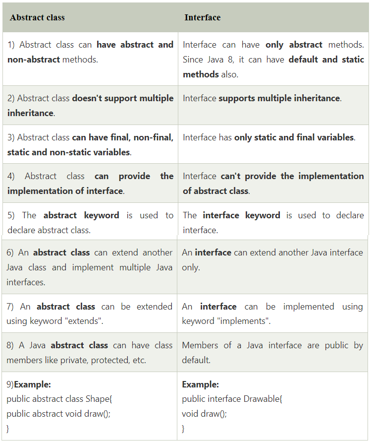

# Java Abstraction, Abstract Class, Abstract Method and Interfaces

**Content**

1\. Abstraction in Java

1.1 Abstract class in Java

1.2 Abstract Method in Java

2\. Interfaces

2.1 Multiple Interfaces

2.2 Difference between abstract class and interface

3\. References

## 1. Abstraction in Java

-   **Abstraction** is a process of hiding the implementation details and showing only functionality to the user.
-   Another way, it shows only essential things to the user and hides the internal details.
-   For example, sending SMS where you type the text and send the message. You don't know the internal processing about the message delivery.
-   Abstraction lets you focus on what the object does instead of how it does it.

**Ways to achieve Abstraction**

There are two ways to achieve abstraction in java

1.  Abstract class (0 to 100%)
2.  Interface (100%)

## 1.1 Abstract class in Java

-   A class which is declared with the abstract keyword is known as an abstract class in Java.
-   **Abstract class:** is a restricted class that cannot be used to create objects (to access it, it must be inherited from another class).
-   An abstract class can have both abstract and regular methods.

**Example:**

```java
abstract class Animal {
  public abstract void animalSound();
  public void sleep() {
    System.out.println("Zzz");
  }
}
```

-   From the example above, it is not possible to create an object of the Animal class:

```java
Animal myObj = new Animal(); // will generate an error
```

-   To access the abstract class, it must be inherited from another class.

### Why can’t we create the object of an abstract class?

-   Because the class is incomplete, they have abstract methods that have no body so if java allows you to create object of this class then if someone calls the abstract method using that object then What would happen? There would be no actual implementation of the method to invoke.
-   Also an object is concrete. An abstract class is like a template, so you have to extend it and build on it before you can use it.



## 1.2 Abstract Method in Java

-   A method which is declared as abstract and it does not have a body is known as an abstract method.
-   The body is provided by the subclass (inherited from).

**Example of abstract method**

```java
abstract void printStatus();//no method body and abstract  
```

**Example for abstract class and abstract method**

```java
// Abstract class
abstract class Animal {
  // Abstract method (does not have a body)
  public abstract void animalSound();
  // Regular method
  public void sleep() {
    System.out.println("Zzz");
  }
}

// Subclass (inherit from Animal)
class Pig extends Animal {
  public void animalSound() {
    // The body of animalSound() is provided here
    System.out.println("The pig says: wee wee");
  }
}

class Main {
  public static void main(String[] args) {
    Pig myPig = new Pig(); // Create a Pig object
    myPig.animalSound();
    myPig.sleep();
  }
}
```

**Output:**

```
The pig says: wee weee
Zzz
```

**Why and when to use abstract classes and methods?**

-   To achieve security - hide certain details and only show the important details of an object.

## 2. Interfaces

-   Another way to achieve abstraction in Java, is with interfaces.
-   An interface is a completely "**abstract class**" that is used to group related methods with empty bodies:

**Syntax:**

```java
interface <interface_name>{  
      
    // declare constant fields  
    // declare methods that abstract   
    // by default.  
}  
```

-   To access the interface methods, the interface must be "implemented" by another class with the **implements** keyword (instead of extends).
-   The body of the interface method is provided by the "implement" class.

**Example:**

```java
// Interface
interface Animal {
  public void animalSound(); // interface method (does not have a body)
  public void sleep(); // interface method (does not have a body)
}

// Pig "implements" the Animal interface
class Pig implements Animal {
  public void animalSound() {
    // The body of animalSound() is provided here
    System.out.println("The pig says: wee wee");
  }
  public void sleep() {
    // The body of sleep() is provided here
    System.out.println("Zzz");
  }
}

class Main {
  public static void main(String[] args) {
    Pig myPig = new Pig();  // Create a Pig object
    myPig.animalSound();
    myPig.sleep();
  }
}
```

**Output:**

```
The pig says: wee weee
Zzz
```

**Notes on Interfaces:**

-   Like **abstract classes**, interfaces **cannot** be used to create objects (in the example above, it is not possible to create an "Animal" object in the Main Class)
-   Interface methods do not have a body - the body is provided by the "implement" class
-   On implementation of an interface, you must override all of its methods
-   Interface methods are by default abstract and public
-   Interface attributes are by default public, static and final
-   An interface cannot contain a constructor (as it cannot be used to create objects)

**Why use java interfaces?**



**The relationship between classes and interfaces**

-   As shown in the figure given below, a class extends another class, an interface extends another interface, but a **class implements an interface**.



## 2.1 Multiple Interfaces

-   To implement multiple interfaces, separate them with a comma:

**Example:**

```java
interface FirstInterface {
  public void myMethod(); // interface method
}

interface SecondInterface {
  public void myOtherMethod(); // interface method
}

class DemoClass implements FirstInterface, SecondInterface {
  public void myMethod() {
    System.out.println("Some text..");
  }
  public void myOtherMethod() {
    System.out.println("Some other text...");
  }
}

class Main {
  public static void main(String[] args) {
    DemoClass myObj = new DemoClass();
    myObj.myMethod();
    myObj.myOtherMethod();
  }
}
```

**Output:**

```
Some text…
Some other text…
```

## 2.2 Difference between abstract class and interface

-   Abstract class and interface both are used to achieve abstraction.
-   But there are many differences between abstract class and interface that are given below.



Simply, abstract class achieves partial abstraction (0 to 100%) whereas interface achieves fully abstraction (100%).

## 3. References

1.  https://www.w3schools.com/java/java_abstract.asp
2.  https://www.w3schools.com/java/java_interface.asp
3.  https://www.javatpoint.com/difference-between-abstract-class-and-interface

## 
