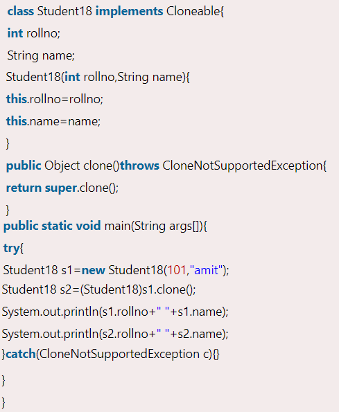

# Java Object class, hashCode and equals

**Content**

1\. Object Class in Java

1.1 Methods of object class

2\. Object Cloning in Java

2.1 Why use clone() method ?

2.2 Advantage of object cloning

2.3 Disadvantage of object cloning

2.4 Example of clone() method (object cloning)

3\. hashCode

4\. equals

5\. References

## 1. Object Class in Java

-   The **Object class** is the parent class of all the classes in java by default.
-   In other words, it is the topmost class of java.
-   The Object class is beneficial if you want to refer any object whose type you don't know.
-   Notice that parent class reference variable can refer the child class object, know as **upcasting**.
-   Let's take an example, there is getObject() method that returns an object but it can be of any type like Employee, Student etc, we can use Object class reference to refer that object. 
-   The Object class provides some common behaviors to all the objects such as object can be compared, object can be cloned, object can be notified etc.

## 1.1 Methods of object class

-   The Object class provides many methods. They are as follows:

## 2. Object Cloning in Java

-   The **object cloning** is a way to create exact copy of an object.
-   The clone() method of Object class is used to clone an object.
-   The **java.lang.Cloneable interface** must be implemented by the class whose object clone we want to create.
-   If we don't implement Cloneable interface, clone() method generates **CloneNotSupportedException**.
-   The **clone() method** is defined in the Object class.

**Syntax of the clone() method is as follows:**

## 2.1 Why use clone() method ?

-   The **clone() method** saves the extra processing task for creating the exact copy of an object.
-   If we perform it by using the new keyword, it will take a lot of processing time to be performed that is why we use object cloning.

## 2.2 Advantage of object cloning

-   Although Object.clone() has some design issues but it is still a popular and easy way of copying objects.

**Following is a list of advantages of using clone() method:**

-   You don't need to write lengthy and repetitive codes. Just use an abstract class with a 4- or 5-line long clone() method.
-   It is the easiest and most efficient way for copying objects, especially if we are applying it to an already developed or an old project. Just define a parent class, implement Cloneable in it, provide the definition of the clone() method and the task will be done.
-   Clone() is the fastest way to copy array.

## 2.3 Disadvantage of object cloning

-   To use the Object.clone() method, we have to change a lot of syntaxes to our code, like implementing a Cloneable interface, defining the clone() method and handling CloneNotSupportedException, and finally, calling Object.clone() etc.
-   We have to implement cloneable interface while it doesn't have any methods in it. We just have to use it to tell the JVM that we can perform clone() on our object.
-   Object.clone() is protected, so we have to provide our own clone() and indirectly call Object.clone() from it.
-   Object.clone() doesn't invoke any constructor so we don't have any control over object construction.
-   If you want to write a clone method in a child class then all of its superclasses should define the clone() method in them or inherit it from another parent class. Otherwise, the super.clone() chain will fail.
-   Object.clone() supports only shallow copying but we will need to override it if we need deep cloning.

## 2.4 Example of clone() method (object cloning)

-   As you can see in the above example, both reference variables have the same value.
-   Thus, the clone() copies the values of an object to another.
-   So we don't need to write explicit code to copy the value of an object to another.
-   If we create another object by new keyword and assign the values of another object to this one, it will require a lot of processing on this object. So to save the extra processing task we use clone() method.

## 3. hashCode

The general contract of hashCode is:

-   Whenever it is invoked on the same object more than once during an execution of a Java application, the hashCode method must consistently return the same integer, provided no information used in equals comparisons on the object is modified. This integer need not remain consistent from one execution of an application to another execution of the same application.
-   If two objects are equal according to the equals(Object) method, then calling the hashCode method on each of the two objects must produce the same integer result.
-   It is *not* required that if two objects are unequal according to the equals(java.lang.Object) method, then calling the hashCode method on each of the two objects must produce distinct integer results. However, the programmer should be aware that producing distinct integer results for unequal objects may improve the performance of hash tables.

The hashCode method defined by class Object does return distinct integers for distinct objects. (This is typically implemented by converting the internal address of the object into an integer, but this implementation technique is not required by the Java™ programming language.)

**public int hashCode()**

-   Returns a hash code value for the object.

## 4. equals

-   The equals method implements an equivalence relation on non-null object references:
1.  It is *reflexive*: for any non-null reference value x, x.equals(x) should return true.
2.  It is *symmetric*: for any non-null reference values x and y, x.equals(y) should return true if and only if y.equals(x) returns true.
3.  It is *transitive*: for any non-null reference values x, y, and z, if x.equals(y) returns true and y.equals(z) returns true, then x.equals(z) should return true.
4.  It is *consistent*: for any non-null reference values x and y, multiple invocations of x.equals(y) consistently return true or consistently return false, provided no information used in equals comparisons on the objects is modified.
5.  For any non-null reference value x, x.equals(null) should return false.
-   The equals method for class Object implements the most discriminating possible equivalence relation on objects; that is, for any non-null reference values x and y, this method returns true if and only if x and y refer to the same object (x == y has the value true).
-   **Note** that it is generally necessary to override the hashCode method whenever this method is overridden, so as to maintain the general contract for the hashCode method, which states that equal objects must have equal hash codes.

**public boolean equals(Object obj)**

-   Indicates whether some other object is "equal to" this one.

**Parameters:**

obj - the reference object with which to compare.

**Returns:**

true if this object is the same as the obj argument; false otherwise.

## 5. References

1.  https://www.javatpoint.com/object-class
2.  https://www.javatpoint.com/object-cloning
3.  https://docs.oracle.com/javase/8/docs/api/
