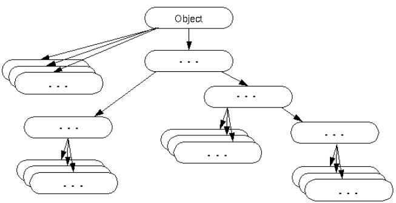
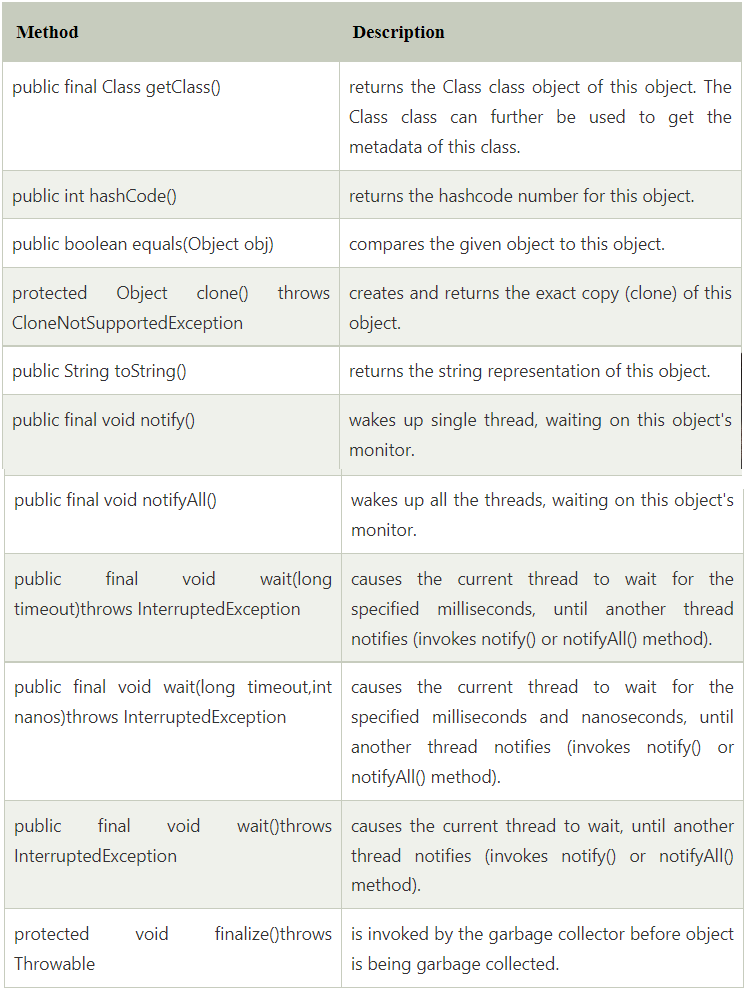
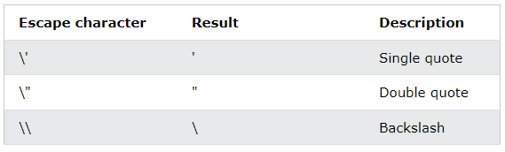
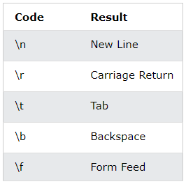

# Java Object class, hashCode and equals

**Content**

1\. Object Class in Java

1.1 Methods of object class

2\. Object Cloning in Java

2.1 Why use clone() method ?

2.2 Advantage of object cloning

2.3 Disadvantage of object cloning

2.4 Example of clone() method (object cloning)

3\. hashCode

4\. equals

5\. Java String

5.1. String Methods

5.1.1 String toUpperCase() and toLowerCase()

5.1.2 String Length

5.1.3 Finding a Character in a String

5.1.4 String Concatenation

5.2 Adding Numbers and Strings

5.3 Strings - Special Characters

6\. Class Math

6.1 Math Methods

7\. References

## 1. Object Class in Java

-   The **Object class** is the parent class of all the classes in java by default.
-   In other words, it is the topmost class of java.
-   The Object class is beneficial if you want to refer any object whose type you don't know.
-   Notice that parent class reference variable can refer the child class object, know as **upcasting**.
-   Let's take an example, there is getObject() method that returns an object but it can be of any type like Employee, Student etc, we can use Object class reference to refer that object.

```java
Object obj=getObject();//we don't know what object will be returned from this method  
```

-   The Object class provides some common behaviors to all the objects such as object can be compared, object can be cloned, object can be notified etc.



## 1.1 Methods of object class

-   The Object class provides many methods. They are as follows:



## 2. Object Cloning in Java

-   The **object cloning** is a way to create exact copy of an object.
-   The clone() method of Object class is used to clone an object.
-   The **java.lang.Cloneable interface** must be implemented by the class whose object clone we want to create.
-   If we don't implement Cloneable interface, clone() method generates **CloneNotSupportedException**.
-   The **clone() method** is defined in the Object class.

**Syntax of the clone() method is as follows:**

```java
protected Object clone() throws CloneNotSupportedException 
```

## 2.1 Why use clone() method ?

-   The **clone() method** saves the extra processing task for creating the exact copy of an object.
-   If we perform it by using the new keyword, it will take a lot of processing time to be performed that is why we use object cloning.

## 2.2 Advantage of object cloning

-   Although Object.clone() has some design issues but it is still a popular and easy way of copying objects.

**Following is a list of advantages of using clone() method:**

-   You don't need to write lengthy and repetitive codes. Just use an abstract class with a 4- or 5-line long clone() method.
-   It is the easiest and most efficient way for copying objects, especially if we are applying it to an already developed or an old project. Just define a parent class, implement Cloneable in it, provide the definition of the clone() method and the task will be done.
-   Clone() is the fastest way to copy array.

## 2.3 Disadvantage of object cloning

-   To use the Object.clone() method, we have to change a lot of syntaxes to our code, like implementing a Cloneable interface, defining the clone() method and handling CloneNotSupportedException, and finally, calling Object.clone() etc.
-   We have to implement cloneable interface while it doesn't have any methods in it. We just have to use it to tell the JVM that we can perform clone() on our object.
-   Object.clone() is protected, so we have to provide our own clone() and indirectly call Object.clone() from it.
-   Object.clone() doesn't invoke any constructor so we don't have any control over object construction.
-   If you want to write a clone method in a child class then all of its superclasses should define the clone() method in them or inherit it from another parent class. Otherwise, the super.clone() chain will fail.
-   Object.clone() supports only shallow copying but we will need to override it if we need deep cloning.

## 2.4 Example of clone() method (object cloning)

```java
class Student18 implements Cloneable{  
int rollno;  
String name;  
  
Student18(int rollno,String name){  
this.rollno=rollno;  
this.name=name;  
}  
  
public Object clone()throws CloneNotSupportedException{  
return super.clone();  
}  
  
public static void main(String args[]){  
try{  
Student18 s1=new Student18(101,"amit");  
  
Student18 s2=(Student18)s1.clone();  
  
System.out.println(s1.rollno+" "+s1.name);  
System.out.println(s2.rollno+" "+s2.name);  
  
}catch(CloneNotSupportedException c){}  
  
}  
}  
Output:101 amit
       101 amit
```

-   As you can see in the above example, both reference variables have the same value.
-   Thus, the clone() copies the values of an object to another.
-   So we don't need to write explicit code to copy the value of an object to another.
-   If we create another object by new keyword and assign the values of another object to this one, it will require a lot of processing on this object. So to save the extra processing task we use clone() method.

## 3. hashCode

The general contract of hashCode is:

-   Whenever it is invoked on the same object more than once during an execution of a Java application, the hashCode method must consistently return the same integer, provided no information used in equals comparisons on the object is modified. This integer need not remain consistent from one execution of an application to another execution of the same application.
-   If two objects are equal according to the equals(Object) method, then calling the hashCode method on each of the two objects must produce the same integer result.
-   It is *not* required that if two objects are unequal according to the equals(java.lang.Object) method, then calling the hashCode method on each of the two objects must produce distinct integer results. However, the programmer should be aware that producing distinct integer results for unequal objects may improve the performance of hash tables.

The hashCode method defined by class Object does return distinct integers for distinct objects. (This is typically implemented by converting the internal address of the object into an integer, but this implementation technique is not required by the Java™ programming language.)

**public int hashCode()**

-   Returns a hash code value for the object.

## 4. equals

-   The equals method implements an equivalence relation on non-null object references:
1.  It is *reflexive*: for any non-null reference value x, x.equals(x) should return true.
2.  It is *symmetric*: for any non-null reference values x and y, x.equals(y) should return true if and only if y.equals(x) returns true.
3.  It is *transitive*: for any non-null reference values x, y, and z, if x.equals(y) returns true and y.equals(z) returns true, then x.equals(z) should return true.
4.  It is *consistent*: for any non-null reference values x and y, multiple invocations of x.equals(y) consistently return true or consistently return false, provided no information used in equals comparisons on the objects is modified.
5.  For any non-null reference value x, x.equals(null) should return false.
-   The equals method for class Object implements the most discriminating possible equivalence relation on objects; that is, for any non-null reference values x and y, this method returns true if and only if x and y refer to the same object (x == y has the value true).
-   **Note** that it is generally necessary to override the hashCode method whenever this method is overridden, so as to maintain the general contract for the hashCode method, which states that equal objects must have equal hash codes.

**public boolean equals(Object obj)**

-   Indicates whether some other object is "equal to" this one.

**Parameters:**

obj - the reference object with which to compare.

**Returns:**

true if this object is the same as the obj argument; false otherwise.

## 5. Java Strings

-   Strings are used for storing text.
-   A String variable contains a collection of characters surrounded by double quotes.
-   The String class represents character strings.
-   All string literals in Java programs, such as "abc", are implemented as instances of this class.
-   Strings are constant; their values cannot be changed after they are created.
-   String buffers support mutable strings. Because String objects are immutable they can be shared.

**Example:**

```java
String str = "abc";
```

**is equivalent to:**

```java
char data[] = {'a', 'b', 'c'};
String str = new String(data);
```

Here are some more examples of how strings can be used:

```java
System.out.println("abc");
String cde = "cde";
System.out.println("abc" + cde);
String c = "abc".substring(2,3);
String d = cde.substring(1, 2);
```

## 5.1. String Methods

-   A String in Java is actually an object, which contain methods that can perform certain operations on strings.
-   There are many string methods available.

## 5.1.1 String toUpperCase() and toLowerCase()

**Example:**

```java
public class Main {
  public static void main(String[] args) {
    String txt = "Hello World";
    System.out.println(txt.toUpperCase());
    System.out.println(txt.toLowerCase());
  }
}
```

**Output**:

```
HELLO WORLD
hello world
```

## 5.1.2 String Length

-   The length of a string can be found with the length() method.

**Example:**

```java
public class Main {
  public static void main(String[] args) {
    String txt = "ABCDEFGHIJKLMNOPQRSTUVWXYZ";
    System.out.println("The length of the txt string is: " + txt.length());
  }
}
```

**Output:**

```
The length of the txt string is: 26
```

## 5.1.3 Finding a Character in a String

-   The indexOf() method returns the **index** (the position) of the first occurrence of a specified text in a string (including whitespace):

**Example:**

```java
public class Main {
  public static void main(String[] args) {
    String txt = "Please locate where 'locate' occurs!";
    System.out.println(txt.indexOf("locate"));
  }
}
```

**Output:**

```
7
```

## 5.1.4 String Concatenation

-   The + operator can be used between strings to combine them. This is called **concatenation**.

**Example:**

```java
public class Main {
  public static void main(String args[]) {
    String firstName = "John";
    String lastName = "Doe";
    System.out.println(firstName + " " + lastName);
  }
}
```

**Output:**

```
John Doe
```

-   You can also use the concat() method to concatenate two strings.

**Example:**

```java
public class Main {
  public static void main(String[] args) {
    String firstName = "John ";
    String lastName = "Doe";
    System.out.println(firstName.concat(lastName));
  }
}
```

Output:

```
John Doe
```

## 5.2 Adding Numbers and Strings

```
WARNING!
Java uses the + operator for both addition and concatenation.
Numbers are added. Strings are concatenated.
```

**1) If you add two numbers, the result will be a number:**

**Example:**

```java
public class Main {
  public static void main(String[] args) {
    int x = 10;
    int y = 20;
    int z = x + y;
    System.out.println(z);
  }
}
```

Output:

```
30
```

**2) If you add two strings, the result will be a string concatenation.**

**Example:**

```java
public class Main {
  public static void main(String[] args) {
    String x = "10";
    String y = "20";
    String z = x + y;
    System.out.println(z);
  }
}
```

**Output:**

```
1020
```

**3) If you add a number and a string, the result will be a string concatenation.**

**Example:**

```java
public class Main {
  public static void main(String[] args) {
    String x = "10";
    int y = 20;
    String z = x + y;
    System.out.println(z);
  }
}
```

**Output:**

```
1020
```

-   To know more information about String methods [click here](https://docs.oracle.com/en/java/javase/11/docs/api/java.base/java/lang/String.html).

## 5.3 Strings - Special Characters

-   Strings must be written within quotes, Java will misunderstand this string, and generate an error.

**Example:**

```java
String txt = "We are the so-called "Vikings" from the north.";
```

-   The solution to avoid this problem, is to use the **backslash escape character**.
-   The backslash (\\) escape character turns special characters into string characters.



**1) The sequence \\" inserts a double quote in a string.**

**Example:**

```java
public class Main {
  public static void main(String[] args) {
    String txt = "We are the so-called \"Vikings\" from the north.";
    System.out.println(txt);
  }
}
```

**Output:**

```
We are the so-called \"Vikings\" from the north.
```

**2) The sequence \\' inserts a single quote in a string.**

**Example:**

```java
public class Main {
  public static void main(String[] args) {
    String txt = "It\'s alright.";
    System.out.println(txt);
  }
}
```

**Output:**

```
It\'s alright.
```

**3) The sequence \\\\ inserts a single backslash in a string.**

**Example:**

```java
public class Main {
  public static void main(String[] args) {
    String txt = "The character \\ is called backslash.";
    System.out.println(txt);
  }
}
```

**Output:**

```
The character \\ is called backslash.
```

**Other common escape sequences that are valid in Java are:**



## 6. Math API

-   The class Math contains methods for performing basic numeric operations such as the elementary exponential, logarithm, square root, and trigonometric functions.

## 6.1 Math Methods

## 1) floor

```java
public static double floor(double a)
```

**Parameters:**

a - a value.

**Returns:**

-   The largest (closest to positive infinity) floating-point value that less than or equal to the argument and is equal to a mathematical integer.

**Special cases:**

-   If the argument value is already equal to a mathematical integer, then the result is the same as the argument.
    -   If the argument is NaN or an infinity or positive zero or negative zero, then the result is the same as the argument.

## 2) max

```java
public static double max(double a, double b)
```

**Parameters:**

a - an argument.

b - another argument.

**Returns:**

the larger of a and b.

-   If the arguments have the same value, the result is that same value.
-   If either value is NaN, then the result is NaN.
-   Unlike the numerical comparison operators, this method considers negative zero to be strictly smaller than positive zero.
-   If one argument is positive zero and the other negative zero, the result is positive zero.

## 3) min

```java
public static int min(int a, int b)
```

**Parameters:**

a - an argument.

b - another argument.

**Returns:**

the smaller of a and b.

-   If the arguments have the same value, the result is that same value.

## 4) round

```java
public static int round(float a)
```

**Parameters:**

a - a floating-point value to be rounded to an integer.

**Returns:**

the value of the argument rounded to the nearest int value.

**Special cases:**

-   If the argument is NaN, the result is 0.
    -   If the argument is negative infinity or any value less than or equal to the value of Integer.MIN_VALUE, the result is equal to the value of Integer.MIN_VALUE.
    -   If the argument is positive infinity or any value greater than or equal to the value of Integer.MAX_VALUE, the result is equal to the value of Integer.MAX_VALUE.

## 5) random

```java
public static double random()
```

**Returns:**

a pseudorandom double greater than or equal to 0.0 and less than 1.0.

The positive square root of a. If the argument is NaN or less than zero, the result is NaN.

-   Returns a double value with a positive sign, greater than or equal to 0.0 and less than 1.0. Returned values are chosen pseudorandomly with (approximately) uniform distribution from that range.
-   When this method is first called, it creates a single new pseudorandom-number generator, exactly as if by the expression

    new java.util.Random()

-   This new pseudorandom-number generator is used thereafter for all calls to this method and is used nowhere else.
-   This method is properly synchronized to allow correct use by more than one thread. However, if many threads need to generate pseudorandom numbers at a great rate, it may reduce contention for each thread to have its own pseudorandom-number generator.

## 6) sqrt

```java
public static double sqrt(double a)
```

**Parameters:**

a – a value

**Returns:**

Returns the correctly rounded positive square root of a double value.

**Special cases:**

-   If the argument is NaN or less than zero, then the result is NaN.
    -   If the argument is positive infinity, then the result is positive infinity.
    -   If the argument is positive zero or negative zero, then the result is the same as the argument.

Otherwise, the result is the double value closest to the true mathematical square root of the argument value.

## 7) abs

```java
public static int abs(int a)
```

**Parameters:**

a - the argument whose absolute value is to be determined

**Returns:**

The absolute value of the argument.

-   If the argument is not negative, the argument is returned. If the argument is negative, the negation of the argument is returned.

**Note** that if the argument is equal to the value of Integer. MIN_VALUE, the most negative representable int value, the result is that same value, which is negative.

-   To know more information about math methods [click here](https://docs.oracle.com/javase/8/docs/api/java/lang/Math.html#floor-double-).

## 7. References

1.  https://www.javatpoint.com/object-class
2.  https://www.javatpoint.com/object-cloning
3.  https://docs.oracle.com/javase/8/docs/api/
4.  https://www.w3schools.com/java/java_strings.asp
5.  https://www.w3schools.com/java/java_strings_concat.asp
6.  https://www.w3schools.com/java/java_strings_numbers.asp
7.  https://www.w3schools.com/java/java_strings_specchars.asp
8.  https://docs.oracle.com/en/java/javase/11/docs/api/java.base/java/lang/String.html
9.  https://docs.oracle.com/javase/8/docs/api/java/lang/Math.html
