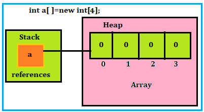
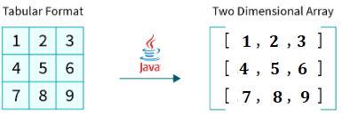
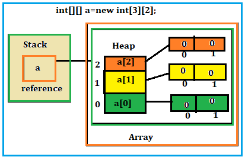
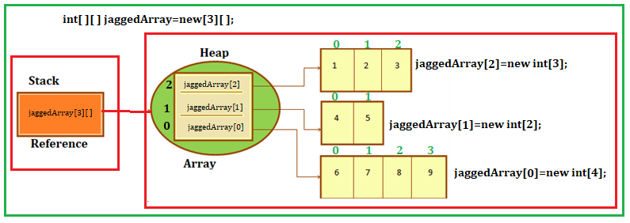
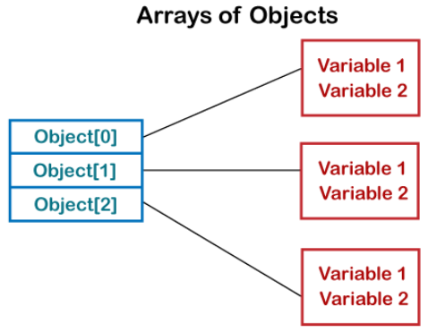

# Java Arrays

**Content**

1\. Arrays in Java

2\. Types of Arrays in java

2.1 Single Dimensional Array in Java

2.1.1 Declaring 1D Array Variables in Java

2.1.2 Initializing 1D Array in Java

2.1.3 Accessing 1D Array elements in Java

2.1.4 Iterating/Traversing 1D Arrays in Java

2.1.5 Change an 1D Array Element

2.1.6 1D Array Length

2.2 Multiple Dimensional Array in Java

2.2.1 Declaring Multiple Dimensional Array Variables in Java

2.2.2 Two Dimensional Array in Java

2.2.2.1 Declaring 2D Array Variables in Java

2.2.2.2 Initializing 2D Array in Java

2.2.2.3 Accessing 2D Array elements in Java

2.2.2.4 Iterating/Traversing 2D Array in Java

2.3 Advantages of array

2.4 Disadvantages of array

3\. Jagged Array in Java

3.1 Declaration and Initialization of Jagged array in java

4\. Array of Objects in Java

4.1 Declaring an Array of Objects in Java

4.2 Instantiate an Array of Objects in Java

4.3 Initializing Array of Objects

4.3.1 By using the constructor

4.3.2 By using a separate member method

5\. References

## 1. Arrays in Java

-   Java provides a data structure, the **array**, which stores a fixed-size sequential collection of elements of the same type.
-   Arrays are used to store multiple values in a single variable, instead of declaring separate variables for each value.
-   The elements of an array are stored in a contiguous memory location.

**Note:**

-   Array indices always start from 0. That is, the first element of an array is at index 0.
-   If the size of an array is n, then the last element of the array will be at index n-1.

## 2. Types of Arrays in java

There are two types of arrays.

-   Single Dimensional Array
-   Multidimensional Array

## 2.1 Single Dimensional Array in Java

-   Single dimensional array of Java is a normal array where, the array contains sequential elements (of same type).
-   It is also known as a linear array or 1D or one Dimensional array, the elements are stored in a single row.
-   One dimensional array use single index to store elements.

## 2.1.1 Declaring 1D Array Variables in Java

-   To use an array in a program, you must declare a variable to reference the array, and you must specify the type of array the variable can reference.

**Syntax:**

```java
dataType[] arr; (or)  //Preferred
dataType []arr; (or)  
dataType arr[];  
```

-   **dataType -** it can be primitive data types like int, char, double, byte, etc. or Java objects
-   **arrayName -** it is an identifier

**Example-1:**

```java
double[] data;
```

-   Here, data is an array that can hold values of type double.

**But, how many elements can array this hold?**

-   Good question! To define the number of elements that an array can hold, we have to allocate memory for the array in Java.

**Example-2:**

```java
// declare an array
double[] data;

// allocate memory
data = new double[10];
```

-   Here, the array can store **10** elements. We can also say that the **size or length** of the array is 10.
-   In Java, we can declare and allocate the memory of an array in one single statement.

**Syntax:**

```java
dataType[] arrayRefVar = new dataType[arraySize];  
```

-   The above statement does two things :
1.  It creates an array using new dataType[arraySize].
2.  It assigns the reference of the newly created array to the variable arrayRefVar.

**Example-3:**



## 2.1.2 Initializing 1D Array in Java

-   In Java, we can initialize arrays during declaration.

**Example-1:**

```java
//declare and initialize and array
int[] age = {12, 4, 5, 2, 5};
```

-   Here, we have created an array named age and initialized it with the values inside the curly brackets.
-   Note that we have not provided the size of the array.
-   In this case, the Java compiler automatically specifies the size by counting the number of elements in the array (i.e. 5).
-   In the Java array, each memory location is associated with a number.
-   The number is known as an array index.
-   We can also initialize arrays in Java, using the index number.

**Example-2:**

```java
// declare an array
int[] age = new int[5];

// initialize array
age[0] = 12;
age[1] = 4;
age[2] = 5;
..
```

## 2.1.3 Accessing 1D Array elements in Java

-   We can access the element of an array using the index number.

**Syntax:**

```java
// access array elements
array[index]
```

**Example:**

```java
class Main {
 public static void main(String[] args) {
  
   // create an array
   int[] age = {12, 4, 5, 2, 5};

   // access each array elements
   System.out.println("Accessing Elements of Array:");
   System.out.println("First Element: " + age[0]);
   System.out.println("Second Element: " + age[1]);
   System.out.println("Third Element: " + age[2]);
   System.out.println("Fourth Element: " + age[3]);
   System.out.println("Fifth Element: " + age[4]);
 }
}
```

**Output:**

```
Accessing Elements of Array:
First Element: 12
Second Element: 4
Third Element: 5
Fourth Element: 2
Fifth Element: 5
```

-   In the above example, notice that we are using the index number to access each element of the array.
-   We can use loops to access all the elements of the array at once.

# 2.1.4 Iterating/Traversing 1D Arrays in Java

**1) 1D Array with for Loop**

-   You can loop through the array elements with the **for** loop, and use the **length** property to specify how many times the loop should run.

    **Example:**

```java
public class Main {
  public static void main(String[] args) {
    String[] cars = {"Volvo", "BMW", "Ford", "Mazda"};
    for (int i = 0; i < cars.length; i++) {
      System.out.println(cars[i]);
    }
  }
}
```

**Output:**

```
Volvo
BMW
Ford
Mazda
```

**2) 1D Array with for-each**

-   There is also a "**for-each**" loop, which is used exclusively to loop through elements in arrays:

**Syntax:**

```java
for(type variable : arrayname) {
        …
}
```

**Example:**

```java
public class Main {
  public static void main(String[] args) {
    String[] cars = {"Volvo", "BMW", "Ford", "Mazda"};
    for (String i : cars) {
      System.out.println(i);
    }    
  }
}
```

**Output:**

```
Volvo
BMW
Ford
Mazda
```

-   The example above can be read like this: **for each** String element (called **i** - as in **i**ndex) in **cars**, print out the value of **i**.
-   If you compare the for loop and **for-each** loop, you will see that the **for-each** method is easier to write, it does not require a counter (using the length property), and it is more readable.

## 2.1.5 Change an 1D Array Element

-   To change the value of a specific element, refer to the index number:

```java
public class Main {
  public static void main(String[] args) {
    String[] cars = {"Volvo", "BMW", "Ford", "Mazda"};
    cars[0] = "Opel";
    System.out.println(cars[0]);
  }
}
```

**output:**

```
Opel
```

## 2.1.6 1D Array Length

-   To find out how many elements an array has, use the length property:

```java
public class Main {
  public static void main(String[] args) {
    String[] cars = {"Volvo", "BMW", "Ford", "Mazda"};
    System.out.println(cars.length);
  }
}
```

**Output:**

```
4
```

## 2.2 Multiple Dimensional Array in Java

-   A multidimensional array is an array of arrays.
-   It is also known as N-Dimensional array.

## 2.2.1 Declaring Multiple Dimensional Array Variables in Java

**Syntax:**

```java
datatype[1st dimension][2nd dimension][]…[nth dimension] arrayname = new datatype[size1][size2][]….[sizeN];
```

**where:**

-   **data_type**: Type of data to be stored in the array.
-   **dimension**: The dimension of the array created. For example: 1D, 2D, 3D etc.
-   **array_name**: Name of the array
-   **size1, size2, …, sizeN**: Sizes of the dimensions respectively.

**Example**:

```java
// Two dimensional array:
int[ ][ ] twoDArray = new int[10][20];
// Three dimensional array:
int[ ][ ][ ] threeDArray = new int[10][20][30];
```

**Size of multidimensional arrays**

-   The total number of elements that can be stored in a multidimensional array can be calculated by multiplying the size of all the dimensions.

**Example:**

**int[][][] x = new int[5][10][20]** can store a total of (5\*10\*20) = 1000 elements.

-   Two – dimensional array is the simplest form of a multidimensional array.

## 2.2.2 Two Dimensional Array in Java

-   In Java, the tabular representation of data is implemented using a two-dimensional array.
-   The 2D array is organized as matrices which can be represented as the collection of rows and columns.



## 2.2.2.1 Declaring 2D Array Variables in Java

-   A 2D array consists of rows and columns, we need two indices, one to refer rows and the other to a particular column in that row.
-   Hence, the syntax of declaring a 2D array is similar to that of a one-dimensional array with the exception of having two square brackets instead of one:

```java
datatype[ ][ ] arrayName;
```

-   The above-described syntax only declares the array i.e., the memory is allocated for the array object but the values will be added later.

**Example:**

```java
//Declaring 2D array
int[ ][ ] a;
```

-   To create a 2D array object we need to use the new keyword as shown below:

```java
// Declaring 2D array
DataType[][] ArrayName;

// Creating a 2D array
ArrayName = new DataType[r][c];
```

-   Here, the new DataType[r][c] statement creates a 2D array object that contains r rows and c columns and elements of DataType type.
-   This array object is referenced by the reference variable ArrayName.

**Example:**

```java
//Declaring 2D array
int[][] a;

//Creating a 2D array
a = new int[3][3];
```

-   In Java, we can declare and allocate the memory of an array in one single statement.

**Syntax:**

```java
datatype [][] arrayName = new datatype[rowSize][columnSize];
```

**Note:**

-   When we create a 2D array object using the new keyword, the JVM (Java Virtual Machine) allocates the memory required for the 2D array and initializes the memory spaces with the default values according to the data type of the array object.
-   For example, in the case of the Integer array (int[][]), every element of the array is initialized with the default value of 0.

    

## 2.2.2.2 Initializing 2D Array in Java

-   Once the array is declared and created, it is time to initialize it with values.
-   There are two methods of initializing the 2D array with values.

**Method1:**

-   The first method is the traditional method of assigning values to each element.

**Syntax:**

```java
arrayName[rowIndex][columnIndex] = value;
```

**Example:**

```java
int[][] myarray = new int[2][2];
myarray[0][0] = 1;
myarray[0][1] = myarray[1][0] = 0;
myarray[1][1] = 1;
```

**Method2:**

**Syntax:**

```java
Datatype[][] arrayName = {{valr1c1, valr1c2,…valr1cn},
                          {valr2c1, val r2c2,…valr2cn},
                          {valrnc1, valrnc2,….valrncn}};
```

**Example:**

```java
int [][] intArray = {{1, 2, 3}, {4, 5, 6}};
```

## 2.2.2.3 Accessing 2D Array elements in Java

-   We can directly access any element from an array using indexing.
-   In the case of 2D arrays, we use row and column indices to access a particular element from the matrix.

**Syntax:**

```java
arrayName[i][j];
```

-   Here, the ArrayName[i][j] statement is used to access the element present at the intersection of **i**th row and **j**th column in the 2D array ArrayName.

**Example:**

```java
Class 2DArray {
public static void main(String args[]) {
int[][] arr = new int [10][20];
arr[0][0] = 1;
System.out.println(“arr[0][0] = “ +arr[0][0]);
}
}
```

**Note :**

-   We can only access the elements of an array using positive integer as the index.
-   We can't use negative indices to access any elements from an array in Java.
-   If we pass an index that is greater than the size of the array (out of bounds index), the ArrayIndexOutOfBoundsException error will occur.

# 2.2.2.4 Iterating/Traversing 2D Array in Java

**1) 2D Array with for Loop**

**Example:**

```java
Class 2DArray {
public static void main(String args[]) {
int[][] arr = {{1, 2}, {3, 4}};
for(int i = 0; i < 2; i++)
for(int j = 0; j < 2; j++)
System.out.println(“arr[“ +i + “][“ + j + “] = “ +arr[i][j]);
}
}
```

**Output:**

```
arr[0][0] = 1
arr[0][1] = 2
arr[1][0] = 3
arr[1][1] = 4
```

**2) 2D Array with for-each**

**Example:**

```java
Class 2DArray {
public static void main(String args[]) {
//create a 2d array
int[][] a= {
{1, -2, 3},
{-4,-5, 6, 9},
{7}
};
//first for…each loop access the individual array
//inside the 2d array
for(int[] innerArray : a) {
//second for…each loop access each element inside the row
for(int data: innerArray) {
System.out.println(data);
}
}
}
}
```

**Output:**

```
1
-2
3
-4
-5
6
9
7
```

## 2.3 Advantages of array

**1) Code Optimization**

-   It makes the code optimized, we can retrieve or sort the data efficiently.

**2) Random access**

-   We can get any data located at an index position.

## 2.4 Disadvantages of array

**1) Size Limit**

-   We can store only the fixed size of elements in the array.
-   It doesn’t grow its size at runtime.
-   To solve this problem, collection framework is used in Java which grows automatically.

## 3. Jagged Array in Java

-   Jagged arrays are also known as ragged or irregular arrays.
-   A Jagged Array is defined as an array where each element of that array is an array itself.
-   It is a Multidimensional array whose each element can have different sizes.



-   From the above pictorial representation, we got an idea of how does it look.
-   Above shown is a two-dimensional Jagged array.
-   Each individual element of this array is a one-dimensional array that has varied sizes as shown above.
-   The first 1D array has 3 columns; the second row has 2 columns while the third has 4 columns.

## 3.1 Declaration and Initialization of Jagged array in java

-   While creating an array of arrays you only specify the first dimension that represents a number of rows in the array.

**Syntax:**

```java
data_type array_name[][] = new data_type[n][];  //n: no. of rows
             array_name[] = new data_type[n1] //n1= no. of columns in row-1
             array_name[] = new data_type[n2] //n2= no. of columns in row-2
             array_name[] = new data_type[n3] //n3= no. of columns in row-3
                                   .
                                   .
                                   .
             array_name[] = new data_type[nk]  //nk=no. of columns in row-n
```

-   **Alternative, ways to Initialize a Jagged array**

```java
int arr_name[][] = new int[][]  {
                                  new int[] {10, 20, 30 ,40},
                                  new int[] {50, 60, 70, 80, 90, 100},
                                  new int[] {110, 120}
                                      };
                                      
                              OR                                     
                                                         
                    int[][] arr_name = {
                          new int[] {10, 20, 30 ,40},
                          new int[] {50, 60, 70, 80, 90, 100},
                          new int[] {110, 120}
                              };
                              
                              OR                                     
                                                         
                    int[][] arr_name = {
                           {10, 20, 30 ,40},
                           {50, 60, 70, 80, 90, 100},
                           {110, 120}
                              };
```

**Example:**

```java
// Program to demonstrate 2-D jagged array in Java
class Main {
    public static void main(String[] args)
    {
        // Declaring 2-D array with 2 rows
        int arr[][] = new int[2][];
 
        // Making the above array Jagged
 
        // First row has 3 columns
        arr[0] = new int[3];
 
        // Second row has 2 columns
        arr[1] = new int[2];
 
        // Initializing array
        int count = 0;
        for (int i = 0; i < arr.length; i++)
            for (int j = 0; j < arr[i].length; j++)
                arr[i][j] = count++;
 
        // Displaying the values of 2D Jagged array
        System.out.println("Contents of 2D Jagged Array");
        for (int i = 0; i < arr.length; i++) {
            for (int j = 0; j < arr[i].length; j++)
                System.out.print(arr[i][j] + " ");
            System.out.println();
        }
    }
}
```

**Output:**

```
Contents of 2D Jagged Array
0 1 2 
3 4 
```

## 4. Array of Objects in Java

-   Java is an object-oriented programming language.
-   Most of the work done with the help of **objects**.
-   We know that an array is a collection of the same data type that dynamically creates objects and can have elements of primitive types.
-   Java allows us to store objects in an array.
-   In Java, the class is also a user-defined data type.
-   An array that conations **class type elements** are known as an **array of objects**.
-   It stores the reference variable of the object.



## 4.1 Declaring an Array of Objects in Java

-   An Array of Objects is created using the Object class, and we know Object class is the root class of all Classes.
-   We use the *Class_Name* followed by a square bracket *[]* then object reference name to create an Array of Objects.

**Syntax:**

```java
ClassName[] objArray;  
```

-   Alternatively, we can also declare an Array of Objects as:

```java
ClassName objeArray[];  
```

**Example:**

```java
Student[ ] studentObjects;  
Or
Student studentObjects[];
```

## 4.2 Instantiate an Array of Objects in Java

**Syntax:**

```java
ClassName obj[]=new ClassName[array_length]; //declare and instantiate an array of objects 
```

-   For example, if you have a class Student, and we want to declare and instantiate an array of Student objects with two objects/object references then it will be written as:

```java
Student[ ] studentObjects = new Student[2];
```

-   Once an array of objects is instantiated like this, then the individual elements of the array of objects needs to be created using the new keyword.
-   The below figure shows the structure of an Array of Objects :


## 4.3 Initializing Array of Objects

-   Once the array of objects is instantiated, we need to initialize it with values.
-   We cannot initialize the array in the way we initialize with primitive types as it is different from an array of primitive types.
-   In an array of objects, we have to initialize each element of array i.e. each object/object reference needs to be initialized.

**Different ways to initialize the array of objects:**

1.  By using the constructors
2.  By using a separate member method

## 4.3.1 By using the constructor

-   At the time of creating actual objects, we can assign initial values to each of the objects by passing values to the constructor separately.
-   Individual actual objects are created with their distinct values.

**Example:**

```java
// Java program to demonstrate initializing
// an array of objects using constructor
 
class GFG {
 
    public static void main(String args[])
    {
 
        // Declaring an array of student
        Student[] arr;
 
        // Allocating memory for 2 objects
        // of type student
        arr = new Student[2];
 
        // Initializing the first element
        // of the array
        arr[0] = new Student(1701289270, "Satyabrata");
 
        // Initializing the second element
        // of the array
        arr[1] = new Student(1701289219, "Omm Prasad");
 
        // Displaying the student data
        System.out.println(
            "Student data in student arr 0: ");
        arr[0].display();
 
        System.out.println(
            "Student data in student arr 1: ");
        arr[1].display();
    }
}
 
// Creating a student class with
// id and name as a attributes
class Student {
 
    public int id;
    public String name;
 
    // Student class constructor
    Student(int id, String name)
    {
        this.id = id;
        this.name = name;
    }
 
    // display() method to display
    // the student data
    public void display()
    {
        System.out.println("Student id is: " + id + " "
                           + "and Student name is: "
                           + name);
        System.out.println();
    }
}
```

**Output:**

```
Student data in student arr 0: 
Student id is: 1701289270 and Student name is: Satyabrata

Student data in student arr 1: 
Student id is: 1701289219 and Student name is: Omm Prasad
```

## 4.3.2 By using a separate member method

-   By using a separate member method also we can initialize objects.
-   A member function of the respective class is created and that is used to assign the initial values to the objects.

**Example:**

```java
// Java program to demonstrate initializing
// an array of objects using a method
 
class GFG {
 
    public static void main(String args[])
    {
 
        // Declaring an array of student
        Student[] arr;
 
        // Allocating memory for 2 objects
        // of type student
        arr = new Student[2];
 
        // Creating actual student objects
        arr[0] = new Student();
        arr[1] = new Student();
 
        // Assigning data to student objects
        arr[0].setData(1701289270, "Satyabrata");
        arr[1].setData(1701289219, "Omm Prasad");
 
        // Displaying the student data
        System.out.println(
            "Student data in student arr 0: ");
        arr[0].display();
 
        System.out.println(
            "Student data in student arr 1: ");
        arr[1].display();
    }
}
 
// Creating a Student class with
// id and name as a attributes
class Student {
 
    public int id;
    public String name;
 
    // Method to set the data to
    // student objects
    public void setData(int id, String name)
    {
        this.id = id;
        this.name = name;
    }
 
    // display() method to display
    // the student data
    public void display()
    {
        System.out.println("Student id is: " + id + " "
                           + "and Student name is: "
                           + name);
        System.out.println();
    }
}
```

**Output:**

```
Student data in student arr 0: 
Student id is: 1701289270 and Student name is: Satyabrata

Student data in student arr 1: 
Student id is: 1701289219 and Student name is: Omm Prasad
```

## 5. References

1.  https://www.w3schools.com/java/java_arrays.asp
2.  https://www.javatpoint.com/array-in-java
3.  https://www.programiz.com/java-programming/arrays
4.  https://www.scaler.com/topics/two-dimensional-array-in-java/
5.  https://www.softwaretestinghelp.com/jagged-array-in-java/
6.  https://www.geeksforgeeks.org/jagged-array-in-java/
7.  https://www.javatpoint.com/how-to-create-array-of-objects-in-java
8.  https://www.geeksforgeeks.org/how-to-create-array-of-objects-in-java/
