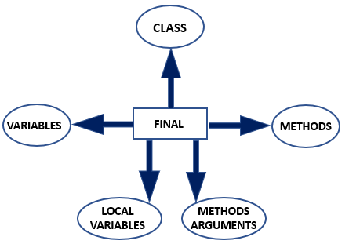
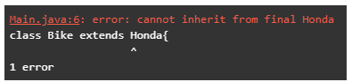
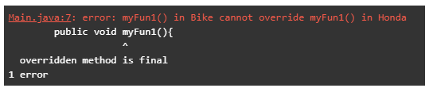
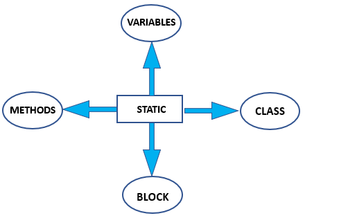
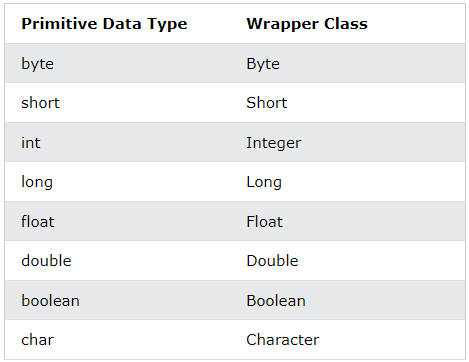
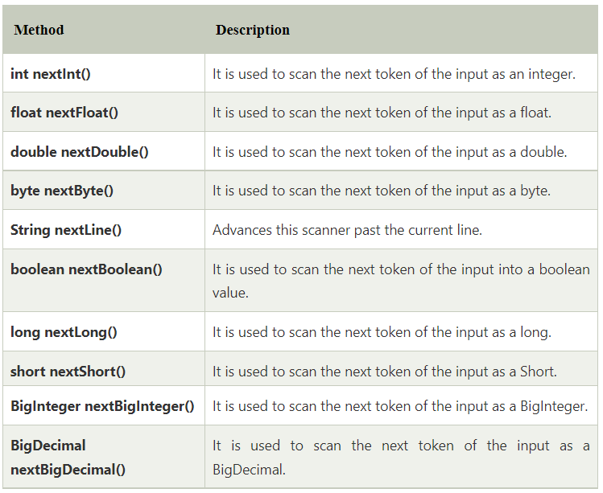

# Java Non Access Modifiers

**Content**

[1. Introduction to Non-Access Modifiers in Java](#1-introduction-to-non-access-modifiers-in-java)

[1.1 Final Non Access Modifiers](#11-final-non-access-modifiers)

[1.2 Abstract Non-Access Modifier](#12-abstract-non-access-modifier)

[1.3 Synchronized Non-Access Modifier](#13-synchronized-non-access-modifier)

[1.4 Static Non-Access Modifier](#14-static-non-access-modifier)

[1.5 Native Non Access Modifier](#15-native-non-access-modifier)

[1.6 Strictfp Non-Access Modifier](#16-strictfp-non-access-modifier)

[1.7 Transient Non-Access Modifier](#17-transient-non-access-modifier)

[2. Wrapper Classes](#2-wrapper-classes)

[2.1 Creating Wrapper Objects](#21-creating-wrapper-objects)

[3. What is a Console?](#3-what-is-a-console)

[4. Java Scanner Class](#4-java-scanner-class)

[4.1 Methods in scanner class](#41-methods-in-scanner-class)

[4.2 Advantages of scanner class](#42-advantages-of-scanner-class)

[4.3 Disadvantages of scanner class](#43-disadvantages-of-scanner-class)

[5. References](#5-references)

## 1. Introduction to Non-Access Modifiers in Java

-   Non Access Modifiers are the keywords introduced in Java 7 to notify JVM about a class’s behaviour, methods or variables, etc.
-   There are 7 non-access modifiers introduced.
1.  Static
2.  Final
3.  Abstract
4.  Synchronized
5.  transient
6.  strictfp
7.  native

## 1.1 Final Non Access Modifiers

-   This modifier can be applied with:



**Final Class**:

-   Final Keyword is used with a class when we want to restrict its inheritance by any other class.
-   For example, If we have a final class Honda, then any attempt to extend this class can lead to a compile-time error.

**Example:**

```java
final class Honda{
public void myFun1(){
System.out.println("Honda Class");
}
}
class Bike extends Honda{
public void myFun1(){
System.out.println("Bike Class");
}
}
```

**Output:**



**Final Method:**

-   Final Keyword is used to indicate Java Runtime Environment that this method is not meant to be overridden in any of its subclasses.

**Example:**

```java
class Honda{
public final void myFun1(){
System.out.println("Honda Class");
}
}
class Bike extends Honda{
public void myFun1(){
System.out.println("Bike Class");
}
}
```

**Output:**



**Final Variable**:

-   The final keyword is used with a variable to restrict any modification to the variable’s value, thus indicating JVM to treat it as a constant.
-   This means final variables can be initialized only **once.**

## 1.2 Abstract Non-Access Modifier

-   This modifier can be applied with:


**Abstract Class**:

-   A class is declared as abstract to indicate that this class cannot be instantiated, which means no objects can be formed for this class but can be inherited.
-   Still, this class has a constructor that will be called inside the constructor of its subclass.
-   It can contain abstract as well as final methods, where abstract methods will be overridden in the subclass.

**Example:**

```java
public abstract class MyActivity{
public MyActivity(){
}
public final String myFun1(){
}
}
```

**Abstract Method**

-   Abstract methods are methods without any definition.
-   It contains only the signature of the method and is meant to indicate that these need to be overridden in the subclass.

**Example:**

```java
abstract class Electronics
{
abstract void display();
abstract void display(String msg);
}
class Computers extends Electronics
{
@Override
void display() {
System.out.println("Abstract method is called");
}
@Override
void display(String txt) {
System.out.println(txt);
}
}
public class AbstractDemo {
public static void main(String[] args) {
Computers obj=new Computers();
obj.display();
obj.display("Method with arguments");
}
}
```

**Output:**

```
Abstract method is called
Method with arguments
```

## 1.3 Synchronized Non-Access Modifier

-   This modifier can be applied with:


-   This keyword helps prevent the access of one method by multiple threads simultaneously, thus synchronizing the flow of a program and bringing out the desired results using the multithreading feature.

**Example:**

```java
class Person1
{
public synchronized void sendFun(String txt)
{
System.out.println("Sending message\t" + txt );
try
{
Thread.sleep(1000);
}
catch (Exception e)
{
System.out.println("Thread interrupted.");
}
System.out.println("\n" + txt + "Sent");
}
}
class DemoThread extends Thread
{
private String txt;
Person1  person;
DemoThread(String m,  Person1 obj)
{
txt = m;
person = obj;
}
public void run()
{
synchronized(person)
{
person.sendFun(txt);
}
}
}
public class HelloWorld
{
public static void main(String args[])
{
Person1 snd = new Person1();
DemoThread S1 =
new DemoThread( " Hi " , snd );
DemoThread S2 =
new DemoThread( " Bye " , snd );
S1.start();
S2.start();
// wait for threads to end
try
{
S1.join();
S2.join();
}
catch(Exception e)
{
System.out.println("Interrupted");
}
}
}
```

**Output:**

```
Sending message Hi
Hi Sent
Sending message Bye
Bye Sent
```

## 1.4 Static Non-Access Modifier

-   This modifier can be applied with:



-   This variable is used for memory management and the first thing being referenced while loading a class.
-   These members are treated on a class level; thus, they cannot be called using an object; instead, the name of the class is used to refer to them.

**Static Variable:**

-   If a variable is declared as static, then only a single copy of the variable is created and shared among all the objects.
-   Thus any change made to the variable by one object will be reflected in other others.
-   Therefore, the variables that hold value on the class level is declared as static.

**Static Class**:

-   Static keyword can only be used with nested classes.

**Static Methods**:

-   Static Methods are referenced by class name thus can only access static member variables and other static methods.
-   Also, these methods cannot be referred to using this or super pointer.
-   The main method is the most common example of a static method that always get loaded while its class is being loaded.

**Static Block:**

-   This is said to be a block being used to perform certain operations while class is being loaded.
-   Since it is static thus can use only static members of the class.

**Example:**

```java
public class Demo
{
// static variable
static int x = 10;
static int y;
//static class
public static class DemoInnerClass{
static int z=10;
}
// static block
static {
System.out.println("Static block initialized.");
y = x + 4;
}
//static method
public static void main(String[] args)
{
System.out.println("from main");
System.out.println("Value of x : "+x);
System.out.println("Value of y : "+y);
System.out.println("Value of z : "+DemoInnerClass.z);
}
}
```

**Output:**

```
Static block initialized.
from main
value of x : 10
value of y : 14
value of z : 10
```

## 1.5 Native Non Access Modifier

-   This modifier can be applied with:


-   The native keyword is used only with the methods to indicate that the particular method is written in platform-dependent.
-   These are used to improve the system’s performance, and the existing legacy code can be easily reused.

```
Note: Static, as well as abstract methods, cannot be declared as native.
```

**Example:** Consider a function myfun1 in class NativeDemo that is written in C++. To use this code, we will create a link library mylib1 and load it using the classnstatic block.

```java
public class DateTimeUtils {
public native String getSystemTime();
static {
System.loadLibrary("nativedatetimeutils");
}
}
```

## 1.6 Strictfp Non-Access Modifier

**Strictfp Class / Method:**

-   This keyword is used to ensure that results from an operation on floating-point numbers brings out the same results on every platform.
-   This keyword cannot be used with abstract methods, variables or constructors as these need not contain operations.


**Example:**

```java
public class HelloWorld
{
public strictfp double calSum()
{
double n1 = 10e+07;
double n2 = 9e+08;
return (n1+n2);
}
public static strictfp void main(String[] args)
{
HelloWorld t = new HelloWorld ();
System.out.println("Result is -" + t.calSum());
}
}
```

**Output:**

```
Result is -1.0E9
```

## 1.7 Transient Non-Access Modifier

-   While transferring the data from one end to another over a network, it must be serialised for successful receiving of data, which means convert to byte stream before sending and converting it back at receiving end.
-   To tell JVM about the members who need not undergo serialization instead of being lost during transfer, a transient modifier comes into the picture.

**Syntax**:

```java
private transient member1;
```

**Example:**

```java
import java.io.*;
class Demo implements Serializable
{
int x = 10;
transient int y = 30;
transient static int z = 40;
transient final int d = 50;
public static void main(String[] args) throws Exception
{
Demo input = new Demo();
FileOutputStream tos = new FileOutputStream("abc.txt");
ObjectOutputStream tin = new ObjectOutputStream(tos);
tin.writeObject(input);
FileInputStream fis = new FileInputStream("abc.txt");  ObjectInputStream ois = new ObjectInputStream(fis);
Demo output = (Demo)ois.readObject();
System.out.println("x = " + output.x);
System.out.println("y = " + output.y);
System.out.println("z = " + output.z);
System.out.println("d = " + output.d);
}
}
```

**Output:**

```
X = 10
Y = 0
Z = 40
D = 50
```

## 2. Wrapper Classes

-   The eight primitive data types byte, short, int, long, float, double, char and boolean are not objects, **Wrapper classes are used for converting primitive data types into objects.**
-   The table below shows the primitive type and the equivalent wrapper class:



-   Sometimes you must use wrapper classes, for example when working with Collection objects, such as ArrayList, where primitive types cannot be used (the list can only store objects):

**Example**

```java
ArrayList<int> myNumbers = new ArrayList<int>(); // Invalid
ArrayList<Integer> myNumbers = new ArrayList<Integer>(); // Valid
```

## 2.1 Creating Wrapper Objects

-   To create a wrapper object, use the wrapper class instead of the primitive type.
-   To get the value, you can just print the object:

**Example-1:**

```java
public class Main { 
  public static void main(String[] args) { 
    Integer myInt = 5; 
    Double myDouble = 5.99; 
    Character myChar = 'A'; 
    System.out.println(myInt);
    System.out.println(myDouble);
    System.out.println(myChar);
  }
}
```

**Output:**

```
5
5.99
A
```

-   Since you're now working with objects, you can use certain methods to get information about the specific object.
-   For example, the following methods are used to get the value associated with the corresponding wrapper object: intValue(), byteValue(), shortValue(), longValue(), floatValue(), doubleValue(), charValue(), booleanValue().
-   This example will output the same result as the example above:

**Example-2:**

```java
public class Main { 
  public static void main(String[] args) { 
    Integer myInt = 5; 
    Double myDouble = 5.99; 
    Character myChar = 'A'; 
    System.out.println(myInt.intValue());
    System.out.println(myDouble.doubleValue());
    System.out.println(myChar.charValue());
  }
}
```

**Output:**

```
5
5.99
A
```

-   Another useful method is the **toString()** method, which is used to convert wrapper objects to strings.
-   In the following example, we convert an Integer to a String, and use the length() method of the String class to output the length of the "string".

**Example-3:**

```java
public class Main { 
  public static void main(String[] args) { 
    Integer myInt = 100; 
    String myString = myInt.toString();
    System.out.println(myString.length());
  }
}
```

**Output:**

```
3
```

## 3. What is a Console?

-   To run a program, we might need input from the programmer or user according to the requirement.
-   We cannot always take input just from the program. Sometimes, we can take the input from the console or terminal too.
-   The process of taking input from the console is introduced by the concept of Java Console.
-   Java programming language provides three ways in order to take input from the console and provide its corresponding output on the same console.
1.  Using Java Scanner class (Basic level)
2.  Using Java BufferedReader class (Intermediate level)
3.  Using Java Console class

**Note:** In this document we only discuss the scanner class.

## 4. Java Scanner Class

-   Java **Scanner class** allows the user to take input from the console.
-   It belongs to **java.util** package.
-   It is used to read the input of primitive types like int, double, long, short, float, and byte.
-   It is the easiest way to read input in Java program.

**Syntax**

```java
Scanner sc=new Scanner(System.in);  
```

-   Here, " Scanner " is considered as a class and " sc " is an object that is created within a class.
-   So, in order to scan any input in the entire program, we can use this object that is created in the " Scanner " class.
-   The above statement creates a constructor of the Scanner class having **System.in** as an argument.
-   It means it is going to read from the standard input stream of the program.
-   The **java.util** package should be import while using Scanner class.

## 4.1 Methods in scanner class

-   There are different methods used for scanning different data types.
-   The type of method that we consider depends on the data type of the input that we want to take.
-   There are eight methods in the Scanner class, as there are eight general Primitive data types.



**Example-1: Integer input from user**

-   The following example allows user to read an integer form the System.in.

```java
import java.util.*;  
class UserInputDemo   
{  
public static void main(String[] args)  
{  
Scanner sc= new Scanner(System.in);    //System.in is a standard input stream  
System.out.print("Enter first number : ");  
int a= sc.nextInt();  
System.out.print("Enter second number :  ");  
int b= sc.nextInt();  
System.out.print("Enter third number :  ");  
int c= sc.nextInt();  
int d=a+b+c;  
System.out.println("Total= " +d);  
}  
}  
```

**Output:**

```
Enter first number: 6
Enter second number: 44
Enter third number: 23
Total = 73
```

**Example-2: String input from user**

-   Let's see another example, in which we have taken string input.

```java
import java.util.*;  
class UserInputDemo1  
{  
public static void main(String[] args)  
{  
Scanner sc= new Scanner(System.in); //System.in is a standard input stream  
System.out.print("Enter a string: ");  
String str= sc.nextLine();              //reads string  
System.out.print("You have entered: "+str);             
}  
}  
```

**Output:**

```
Enter a string : It is a simple java program.
You have entered: It is a simple java program.
```

## 4.2 Advantages of scanner class

-   This class provides several methods according to the data type used and that match the user's requirement.
-   It is the basic class used to scan an input that runs on almost all versions of Java.

## 4.3 Disadvantages of scanner class

-   It runs and executes a little slower as the data must be parsed before being executed.
-   The methods that are part of the class " Scanner " are not synchronized.

## 5. References

1.  https://www.educba.com/non-access-modifiers-in-java/
2.  https://www.w3schools.com/java/java_wrapper_classes.asp
3.  https://www.javatpoint.com/how-to-get-input-from-user-in-java
4.  https://www.javatpoint.com/console-in-java
