## Introduction to Non-Access Modifiers in Java

-   Non Access Modifiers are the keywords introduced in Java 7 to notify JVM about a class’s behaviour, methods or variables, etc.
-   There are 7 non-access modifiers introduced.
1.  Static
2.  Final
3.  Abstract
4.  Synchronized
5.  transient
6.  strictfp
7.  native

## 1. Final Non Access Modifiers

-   This modifier can be applied with:

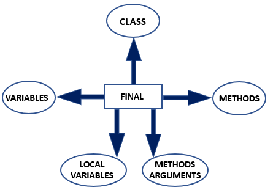

**Final Class**:

-   Final Keyword is used with a class when we want to restrict its inheritance by any other class.
-   For example, If we have a final class Honda, then any attempt to extend this class can lead to a compile-time error.

**Example:**

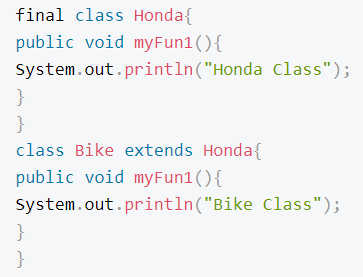

**Output:**

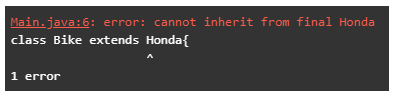

**Final Method:**

-   Final Keyword is used to indicate Java Runtime Environment that this method is not meant to be overridden in any of its subclasses.

**Example:**

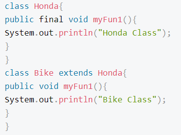

**Output:**

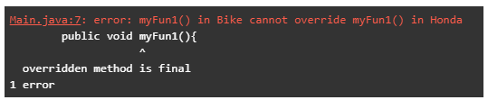

**Final Variable**:

-   The final keyword is used with a variable to restrict any modification to the variable’s value, thus indicating JVM to treat it as a constant.
-   This means final variables can be initialized only **once.**

## 2. Abstract Non-Access Modifier

**Abstract Class**:

-   A class is declared as abstract to indicate that this class cannot be instantiated, which means no objects can be formed for this class but can be inherited.
-   Still, this class has a constructor that will be called inside the constructor of its subclass.
-   It can contain abstract as well as final methods, where abstract methods will be overridden in the subclass.

**Code:**

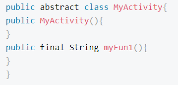

**Abstract Method**

-   Abstract methods are methods without any definition.
-   It contains only the signature of the method and is meant to indicate that these need to be overridden in the subclass.

**Example:** public abstract void fun1();

**Code:**

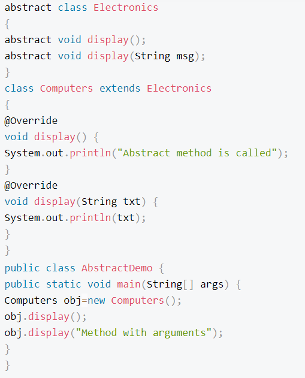

**Output:**

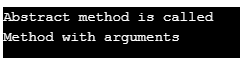

## 3. Synchronized Non-Access Modifier

-   This keyword helps prevent the access of one method by multiple threads simultaneously, thus synchronizing the flow of a program and bringing out the desired results using the multithreading feature.

**Code:**

**Output:**

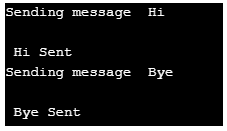

## 4. Static Non-Access Modifier

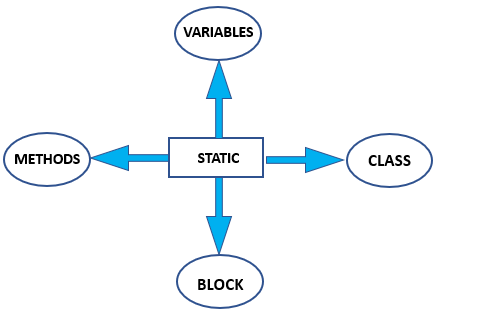

-   This variable is used for memory management and the first thing being referenced while loading a class.
-   These members are treated on a class level; thus, they cannot be called using an object; instead, the name of the class is used to refer to them.

**Static Variable:**

-   If a variable is declared as static, then only a single copy of the variable is created and shared among all the objects.
-   Thus any change made to the variable by one object will be reflected in other others.
-   Therefore, the variables that hold value on the class level is declared as static.

**Static Class**:

-   Static keyword can only be used with nested classes.

**Static Methods**:

-   Static Methods are referenced by class name thus can only access static member variables and other static methods.
-   Also, these methods cannot be referred to using this or super pointer.
-   The main method is the most common example of a static method that always get loaded while its class is being loaded.

**Static Block:**

-   This is said to be a block being used to perform certain operations while class is being loaded.
-   Since it is static thus can use only static members of the class.

**Code:**

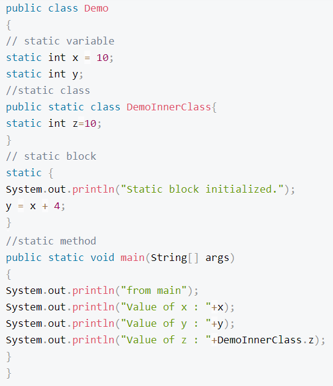

**Output:**

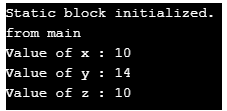

#### 5. Native Non Access Modifier

-   The native keyword is used only with the methods to indicate that the particular method is written in platform -dependent.
-   These are used to improve the system’s performance, and the existing legacy code can be easily reused.

**Example:** Consider a function myfun1 in class NativeDemo that is written in C++. To use this code, we will create a link library mylib1 and load it using the class’s static block.

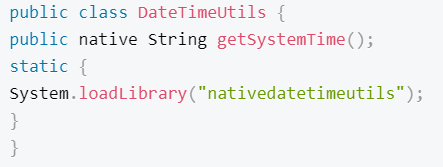

#### 6. Strictfp Non-Access Modifier

**Strictfp Class / Method:**

-   This keyword is used to ensure that results from an operation on floating-point numbers brings out the same results on every platform.
-   This keyword can not be used with abstract methods, variables or constructors as these need not contain operations.

**Code:**

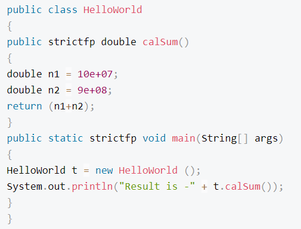

**Output:**

#### 7. Transient Non-Access Modifier

-   While transferring the data from one end to another over a network, it must be serialised for successful receiving of data, which means convert to byte stream before sending and converting it back at receiving end.
-   To tell JVM about the members who need not undergo serialization instead of being lost during transfer, a transient modifier comes into the picture.

**Syntax**:

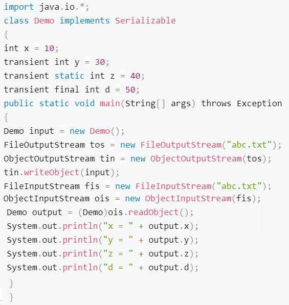

**Output:**

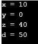

### Conclusion

-   Non-access modifiers are the type of modifiers that tell JVM about the behavior of classes, methods, or variables defined and prepared accordingly.
-   It also helps in synchronizing the flow as well as displaying similar results from operations being performed irrespective of the platform used for execution.

### References

1.  https://www.educba.com/non-access-modifiers-in-java/
