# Java Arrays

**Content**

## 1. Java Arrays

-   Java provides a data structure, the **array**, which stores a fixed-size sequential collection of elements of the same type.
-   Arrays are used to store multiple values in a single variable, instead of declaring separate variables for each value.
-   The elements of an array are stored in a contiguous memory location.

    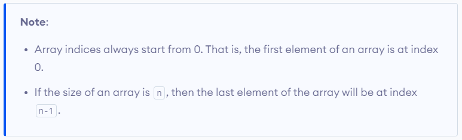

## 1.1 Declaring Array Variables

-   To use an array in a program, you must declare a variable to reference the array, and you must specify the type of array the variable can reference.

**Syntax:**

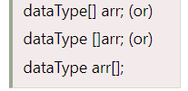

-   **dataType -** it can be primitive data types like int, char, double, byte, etc. or Java objects
-   **arrayName -** it is an identifier

**Example-1:**

-   Here, data is an array that can hold values of type double.

**But, how many elements can array this hold?**

-   Good question! To define the number of elements that an array can hold, we have to allocate memory for the array in Java.

**Example-2:**

-   Here, the array can store **10** elements. We can also say that the **size or length** of the array is 10.
-   In Java, we can declare and allocate the memory of an array in one single statement.

**Syntax:**

****

-   The above statement does two things :
1.  It creates an array using new dataType[arraySize].
2.  It assigns the reference of the newly created array to the variable arrayRefVar.

**Example-3:**

## 1.2 How to Initialize Arrays in Java?

-   In Java, we can initialize arrays during declaration.

**Example-1:**

-   Here, we have created an array named age and initialized it with the values inside the curly brackets.
-   Note that we have not provided the size of the array.
-   In this case, the Java compiler automatically specifies the size by counting the number of elements in the array (i.e. 5).
-   In the Java array, each memory location is associated with a number.
-   The number is known as an array index.
-   We can also initialize arrays in Java, using the index number.

**Example-2:**

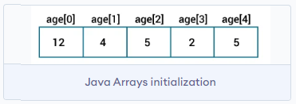

## 1.3 Access the Elements of an Array in Java

-   We can access the element of an array using the index number.

**Syntax:**

**Example:**

**Output:**

-   In the above example, notice that we are using the index number to access each element of the array.
-   We can use loops to access all the elements of the array at once.

## 1.4 Change an Array Element

-   To change the value of a specific element, refer to the index number:

    

## 1.5 Array Length

-   To find out how many elements an array has, use the length property:

## 1.6 Advantages of array

**1) Code Optimization**

-   It makes the code optimized, we can retrieve or sort the data efficiently.

**2) Random access**

-   We can get any data located at an index position.

## 1.7 Disadvantages of array

**1) Size Limit**

-   We can store only the fixed size of elements in the array.
-   It doesn’t grow its size at runtime.
-   To solve this problem, collection framework is used in Java which grows automatically.

# 2. Java Arrays Loop

## 2.1 Array with for Loop

-   You can loop through the array elements with the for loop, and use the length property to specify how many times the loop should run.

    **Example:**

****

## 2.2 Array with For-Each

-   There is also a "**for-each**" loop, which is used exclusively to loop through elements in arrays:

**Syntax:**

****

**Example:**

****

-   The example above can be read like this: **for each** String element (called **i** - as in **i**ndex) in **cars**, print out the value of **i**.
-   If you compare the for loop and **for-each** loop, you will see that the **for-each** method is easier to write, it does not require a counter (using the length property), and it is more readable.

## Types of Array in java

There are two types of array.

-   Single Dimensional Array
-   Multidimensional Array

## 2.1 Single Dimensional Array in Java

-   It also known as a linear array, the elements are stored in a single row.

**Example:**

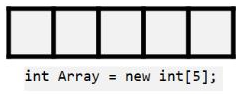

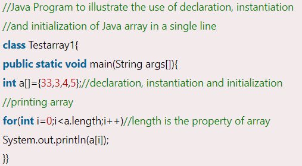

**Output:**

**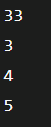**

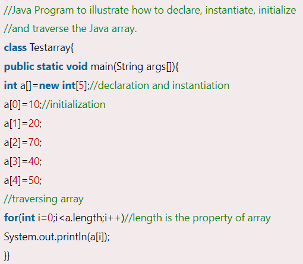

**Output:**

****

## Multidimensional Array in Java

Two-dimensional arrays store the data in rows and columns:

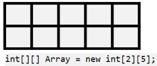

In such case, data is stored in row and column based index (also known as matrix form).

**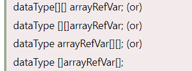**

**Example to instantiate Multidimensional Array in Java**

****

### Example of Multidimensional Java Array

Let's see the simple example to declare, instantiate, initialize and print the 2Dimensional array.

**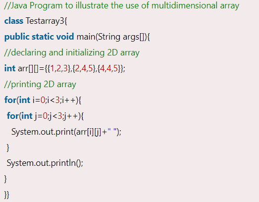**

**Output:**

**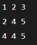**

# How to Create Array of Objects in Java

In this section, we will learn **how to create and initialize an array of objects in Java**.

## Array of Objects in Java

Java is an object-oriented programming language. Most of the work done with the help of **objects**. We know that an array is a collection of the same data type that dynamically creates objects and can have elements of primitive types. Java allows us to store objects in an array. In Java

, the class is also a user-defined data type. An array that conations **class type elements** are known as an **array of objects**. It stores the reference variable of the object.

## Creating an Array of Objects

Before creating an array of objects, we must create an instance of the class by using the new keyword. We can use any of the following statements to create an array of objects.

**Syntax:**

Or

Or

Suppose, we have created a class named Employee. We want to keep records of 20 employees of a company having three departments. In this case, we will not create 20 separate variables. Instead of this, we will create an array of objects, as follows.

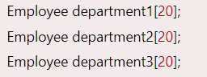

The above statements create an array of objects with 20 elements.

Let's create an array of objects in a Java program

.

In the following program, we have created a class named Product and initialized an array of objects using the constructor. We have created a constructor of the class Product that contains product id and product name. In the main function, we have created individual objects of the class Product. After that, we have passed initial values to each of the objects using the constructor.

**ArrayOfObjects.java**

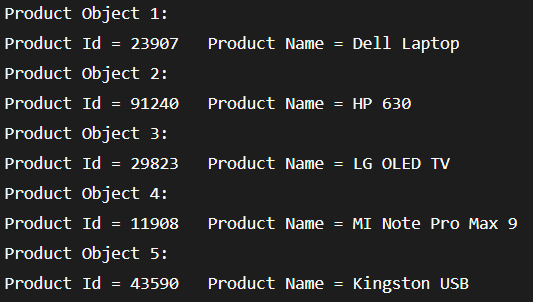

## References

https://www.w3schools.com/java/java_arrays.asp

https://www.javatpoint.com/array-in-java

https://www.programiz.com/java-programming/arrays
