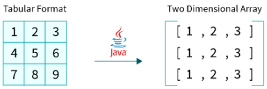

# Java Arrays

**Content**

## 1. Java Arrays

-   Java provides a data structure, the **array**, which stores a fixed-size sequential collection of elements of the same type.
-   Arrays are used to store multiple values in a single variable, instead of declaring separate variables for each value.
-   The elements of an array are stored in a contiguous memory location.

**Note:**

-   Array indices always start from 0. That is, the first element of an array is at index 0.
-   If the size of an array is n, then the last element of the array will be at index n-1.

## 2. Types of Array in java

There are three types of arrays.

-   One Dimensional Array
-   Two Dimensional Array
-   Multidimensional Array

## 2.1 One Dimensional Array in Java

-   One dimensional array of Java is a normal array where, the array contains sequential elements (of same type).
-   It is also known as a linear array or 1D array, the elements are stored in a single row.
-   One dimensional array use single index to store elements.

## 2.1.1 Declaring 1D Array Variables in Java

-   To use an array in a program, you must declare a variable to reference the array, and you must specify the type of array the variable can reference.

**Syntax:**

-   **dataType -** it can be primitive data types like int, char, double, byte, etc. or Java objects
-   **arrayName -** it is an identifier

**Example-1:**

-   Here, data is an array that can hold values of type double.

**But, how many elements can array this hold?**

-   Good question! To define the number of elements that an array can hold, we have to allocate memory for the array in Java.

**Example-2:**

-   Here, the array can store **10** elements. We can also say that the **size or length** of the array is 10.
-   In Java, we can declare and allocate the memory of an array in one single statement.

**Syntax:**

****

-   The above statement does two things :
1.  It creates an array using new dataType[arraySize].
2.  It assigns the reference of the newly created array to the variable arrayRefVar.

**Example-3:**

## 2.1.2 Initializing 1D Array in Java

-   In Java, we can initialize arrays during declaration.

**Example-1:**

-   Here, we have created an array named age and initialized it with the values inside the curly brackets.
-   Note that we have not provided the size of the array.
-   In this case, the Java compiler automatically specifies the size by counting the number of elements in the array (i.e. 5).
-   In the Java array, each memory location is associated with a number.
-   The number is known as an array index.
-   We can also initialize arrays in Java, using the index number.

**Example-2:**

## 2.1.3 Accessing 1D Array elements in Java

-   We can access the element of an array using the index number.

**Syntax:**

**Example:**

**Output:**

-   In the above example, notice that we are using the index number to access each element of the array.
-   We can use loops to access all the elements of the array at once.

# 2.1.4 Iterating/Traversing 1D Arrays in Java

**1) 1D Array with for Loop**

-   You can loop through the array elements with the **for** loop, and use the **length** property to specify how many times the loop should run.

    **Example:**

**** **2) 1D Array with for-each**

-   There is also a "**for-each**" loop, which is used exclusively to loop through elements in arrays:

**Syntax:**

****

**Example:**

****

-   The example above can be read like this: **for each** String element (called **i** - as in **i**ndex) in **cars**, print out the value of **i**.
-   If you compare the for loop and **for-each** loop, you will see that the **for-each** method is easier to write, it does not require a counter (using the length property), and it is more readable.

## 2.1.5 Change an 1D Array Element

-   To change the value of a specific element, refer to the index number:

    

## 2.1.6 1D Array Length

-   To find out how many elements an array has, use the length property:

## 2.2 Two Dimensional Array in Java

In Java, the tabular representation of data is implemented using a two-dimensional array.

The 2D array is organized as matrices which can be represented as the collection of rows and columns.

## 2.2.1 Declaring 2D Array Variables in Java

a 2D array consists of rows and columns, we need two indices, one to refer rows and the other to a particular column in that row. Hence, the syntax of declaring a two-dimensional array is similar to that of a one-dimensional array with the exception of having two square brackets instead of one:

Here, the DataType describes the type of values that the array can store, while the ArrayName is the reference variable for the two-dimensional array object.

The above-described syntax only declares the array i.e., the memory is allocated for the array object but the values will be added later.

## 2.2.2 Initializing 2D Array in Java

to create a two-dimensional array object we need to use the new keyword as shown below:

Here, the new DataType[r][c] statement creates a two dimensional array object that contains r rows and c columns and elements of DataType type. This array object is referenced by the reference variable ArrayName.

Let's understand the creation of Java's two-dimensional array with an example:

Here, the reference variable a points to a two-dimensional array object that represents a 3X33*X*3 integer matrix i.e.*i*.*e*., the array object contains 33 rows and 33 columns, and can only store integer (int) values.

**Note:** When we create a 2D array object using the new keyword, the JVM (Java Virtual Machine) allocates the memory required for the two-dimensional array and initializes the memory spaces with the default values according to the data type of the array object. For example, in the case of the Integer array (int[][]), every element of the array is initialized with the default value of 0.

## 2.2.3 Accessing 2D Array elements in Java

we can directly access any element from an array using indexing. In the case of two-dimensional arrays, we use row and column indices to access a particular element from the matrix. It has the following syntax:

Here, the ArrayName[i][j] statement is used to access the element present at the intersection of **i**th row and **j**th column in the two dimensional array ArrayName.

**Note :**

-   In Java, the index always starts from 0. Hence to access the element in **n**th row, we need to use (n-1) as the index.
-   We can only access the elements of an array using positive integer as the index. We can't use negative indices to access any elements from an array in Java.
-   If we pass an index that is greater than the size of the array (out of bounds index), the ArrayIndexOutOfBoundsException error will occur.

# 2.2.4 Iterating/Traversing 2D Array in Java

**1) 2D Array with for Loop**

****

**Output:**

****

**2) 2D Array with for-each**

We can also use the [for...each loop](https://www.programiz.com/java-programming/enhanced-for-loop) to access elements of the multidimensional array. For example,

## 2.2.5 Change an 2D Array Element

## 2.2.6 2D Array Length

## 2.4 Advantages of array

**1) Code Optimization**

-   It makes the code optimized, we can retrieve or sort the data efficiently.

**2) Random access**

-   We can get any data located at an index position.

## 2.5 Disadvantages of array

**1) Size Limit**

-   We can store only the fixed size of elements in the array.
-   It doesn’t grow its size at runtime.
-   To solve this problem, collection framework is used in Java which grows automatically.

## Multidimensional Array in Java

Two-dimensional arrays store the data in rows and columns:

In such case, data is stored in row and column based index (also known as matrix form).

****

**Example to instantiate Multidimensional Array in Java**

****

### Example of Multidimensional Java Array

Let's see the simple example to declare, instantiate, initialize and print the 2Dimensional array.

****

**Output:**

****

# How to Create Array of Objects in Java

In this section, we will learn **how to create and initialize an array of objects in Java**.

## Array of Objects in Java

Java is an object-oriented programming language. Most of the work done with the help of **objects**. We know that an array is a collection of the same data type that dynamically creates objects and can have elements of primitive types. Java allows us to store objects in an array. In Java

, the class is also a user-defined data type. An array that conations **class type elements** are known as an **array of objects**. It stores the reference variable of the object.

## Creating an Array of Objects

Before creating an array of objects, we must create an instance of the class by using the new keyword. We can use any of the following statements to create an array of objects.

**Syntax:**

Or

Or

Suppose, we have created a class named Employee. We want to keep records of 20 employees of a company having three departments. In this case, we will not create 20 separate variables. Instead of this, we will create an array of objects, as follows.

The above statements create an array of objects with 20 elements.

Let's create an array of objects in a Java program

.

In the following program, we have created a class named Product and initialized an array of objects using the constructor. We have created a constructor of the class Product that contains product id and product name. In the main function, we have created individual objects of the class Product. After that, we have passed initial values to each of the objects using the constructor.

**ArrayOfObjects.java**

## References

https://www.w3schools.com/java/java_arrays.asp

https://www.javatpoint.com/array-in-java

https://www.programiz.com/java-programming/arrays

https://www.scaler.com/topics/two-dimensional-array-in-java/
