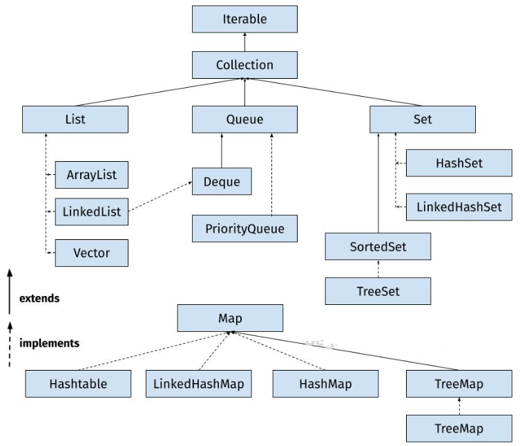

# Collections Framework

**Content**

[1. What is Java Collections?](#1-what-is-java-collections)

[2. Collections Framework Class Hierarchy](#2-collections-framework-class-hierarchy)

[2.1 Java Collections API Interfaces](#21-java-collections-api-interfaces)

[2.2 Benefits of Java Collections Framework](#22-benefits-of-java-collections-framework)

[2.3 Disadvantages of collection framework](#22-benefits-of-java-collections-framework)

[3. References](#3-references)

## 1. What is Java Collections?

-   Collections are like containers that group multiple items in a single unit.
-   For example, a jar of chocolates, a list of names, etc.
-   Collections are used in every programming language and when Java arrived, it also came with few Collection classes – **Vector**, **Stack**, **Hashtable**, **Array**.
-   Java 1.2 provided **Collections Framework** that is the architecture to represent and manipulate Collections in java in a standard way.
-   Java Collections Framework consists of the following parts:

## 1) Interfaces

-   Java Collections Framework interfaces provides the abstract data type to represent collection.

**java.util.Collection**:

-   It is the root interface of Collections Framework hierarchy.
-   It contains some important methods such as size(), iterator(), add(), remove(), clear() that every Collection class must implement.
-   Some other important interfaces are java.util.List, java.util.Set, java.util.Queue and java.util.Map.
-   The Map is the only interface that doesn’t inherit from the Collection interface but it’s part of the Collections framework.
-   All the collections framework interfaces are present in java.util package.

## 2) Implementation Classes

-   Java Collections framework provides implementation classes for core collection interfaces.
-   We can use them to create different types of collections in the Java program.
-   Some important collection classes are ArrayList, LinkedList, HashMap, TreeMap, HashSet, and TreeSet.
-   These classes solve most of our programming needs but if we need some special collection class, we can extend them to create our custom collection class.
-   Java 1.5 came up with thread-safe collection classes that allowed us to modify Collections while iterating over them.
-   Some of them are CopyOnWriteArrayList, ConcurrentHashMap, CopyOnWriteArraySet. These classes are in java.util.concurrent package.
-   All the collection classes are present in java.util and java.util.concurrent package.

## 3) Algorithms

-   Algorithms are useful methods to provide some common functionalities such as searching, sorting and shuffling.

## 2. Collections Framework Class Hierarchy

-   The **Java Collections Framework** is a collection of interfaces and classes, which helps in storing and processing the data efficiently.
-   This framework has several useful classes which have tons of useful functions which makes a programmer task super easy.
-   Below class diagram shows Collections Framework hierarchy. For simplicity, I have included only commonly used interfaces and classes.

## 2.1 Java Collections API Interfaces

-   Java collection interfaces are the foundation of the Java Collections Framework.
-   Note that all the core collection interfaces are generic; for example public interface Collection\<E\>.
-   The \<E\> syntax is for Generics and when we declare Collection, we should use it to specify the type of Object it can contain.
-   It helps in reducing run-time errors by type-checking the Objects at compile-time.
-   To keep the number of core collection interfaces manageable, the Java platform doesn’t provide separate interfaces for each variant of each collection type.
-   If an unsupported operation is invoked, a collection implementation throws an UnsupportedOperationException.

**1. Collection interface**

-   This is the root of the collection hierarchy.
-   A collection represents a group of objects known as its elements.
-   The Java platform doesn’t provide any direct implementations of this interface.
-   The interface has methods to tell you how many elements are in the collection (size, isEmpty), to check whether a given object is in the collection (contains), to add and remove an element from the collection (add, remove), and to provide an iterator over the collection (iterator).
-   Collection interface also provides bulk operations methods that work on the entire collection – containsAll, addAll, removeAll, retainAll, clear.
-   The toArray methods are provided as a bridge between collections and older APIs that expect arrays on input.

**2. Iterator Interface**

-   Iterator interface provides methods to iterate over the elements of the Collection.
-   We can get the instance of iterator using iterator() method.
-   Iterator takes the place of Enumeration in the Java Collections Framework.
-   Iterators allow the caller to remove elements from the underlying collection during the iteration.
-   Iterators in collection classes implement **Iterator Design Pattern**.

**3. Set Interface**

-   Set is a collection that cannot contain duplicate elements.
-   This interface models the mathematical set abstraction and is used to represent sets, such as the deck of cards.
-   The Java platform contains three general-purpose Set implementations: HashSet, TreeSet, and LinkedHashSet.
-   Set interface doesn’t allow random-access to an element in the Collection.
-   You can use iterator or foreach loop to traverse the elements of a Set.

**4. List Interface**

-   List is an ordered collection and can contain duplicate elements.
-   You can access any element from its index.
-   List is more like array with dynamic length.
-   List is one of the most used Collection type.
-   ArrayList and LinkedList are implementation classes of List interface.
-   List interface provides useful methods to add an element at a specific index, remove/replace element based on the index and to get a sub-list using the index.
-   Collections class provide some useful algorithm for List – sort, shuffle, reverse, binarySearch etc.

**5. Queue Interface**

-   Queue is a collection used to hold multiple elements prior to processing.
-   Besides basic Collection operations, a Queue provides additional insertion, extraction, and inspection operations.
-   Queues typically, but do not necessarily, order elements in a FIFO (first-in-first-out) manner.
-   Among the exceptions are priority queues, which order elements according to a supplied comparator or the elements’ natural ordering.
-   Whatever the ordering used, the head of the queue is the element that would be removed by a call to remove or poll.
-   In a FIFO queue, all new elements are inserted at the tail of the queue.

**6. Dequeue Interface**

-   A linear collection that supports element insertion and removal at both ends.
-   The name deque is short for “double-ended queue” and is usually pronounced “deck”.
-   Most Deque implementations place no fixed limits on the number of elements they may contain, but this interface supports capacity-restricted deques as well as those with no fixed size limit.
-   This interface defines methods to access the elements at both ends of the deque.
-   Methods are provided to insert, remove, and examine the element.

**7. Map Interface**

-   Map is an object that maps keys to values.
-   A map cannot contain duplicate keys: Each key can map to at most one value.
-   The Java platform contains three general-purpose Map implementations: HashMap, TreeMap, and LinkedHashMap.
-   The basic operations of Map are put, get, containsKey, containsValue, size, and isEmpty.

**8. ListIterator Interface**

-   An iterator for lists that allows the programmer to traverse the list in either direction, modify the list during iteration, and obtain the iterator’s current position in the list.
-   Java ListIterator has no current element; its cursor position always lies between the element that would be returned by a call to previous() and the element that would be returned by a call to next().

**9. SortedSet Interface**

-   SortedSet is a Set that maintains its elements in ascending order.
-   Several additional operations are provided to take advantage of the ordering.
-   Sorted sets are used for naturally ordered sets, such as word lists and membership rolls.

**10. SortedMap Interface**

-   A map that maintains its mappings in ascending key order.
-   This is the Map analog of SortedSet.
-   Sorted maps are used for naturally ordered collections of key/value pairs, such as dictionaries and telephone directories.

## 2.2 Benefits of Java Collections Framework

Java Collections framework have following benefits:

-   **Reduced Development Effort** – It comes with almost all common types of collections and useful methods to iterate and manipulate the data. So we can concentrate more on business logic rather than designing our collection APIs.
-   **Better Quality** – Using core collection classes that are well-tested increases our program quality rather than using any home-developed data structure.
-   **Reusability and Interoperability**
-   **Reduce effort** to maintain because everybody knows Collection API classes.

## 2.3 Disadvantages of collection framework

1.  It must cast to the correct type.
2.  It can’t be done compile-time type checking.

**Note: Above two disadvantages can be removed from the collection framework by using generics.**

## 3. References

1.  https://www.digitalocean.com/community/tutorials/collections-in-java-tutorial
2.  https://beginnersbook.com/java-collections-tutorials/
