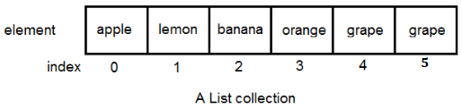
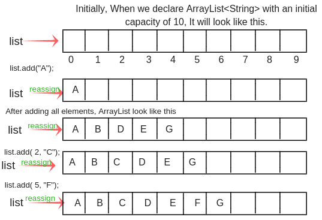
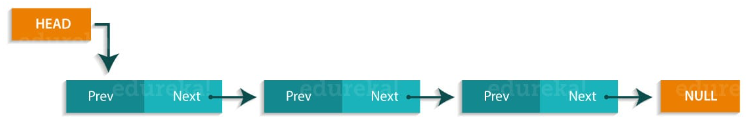
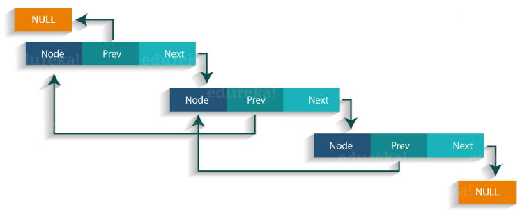
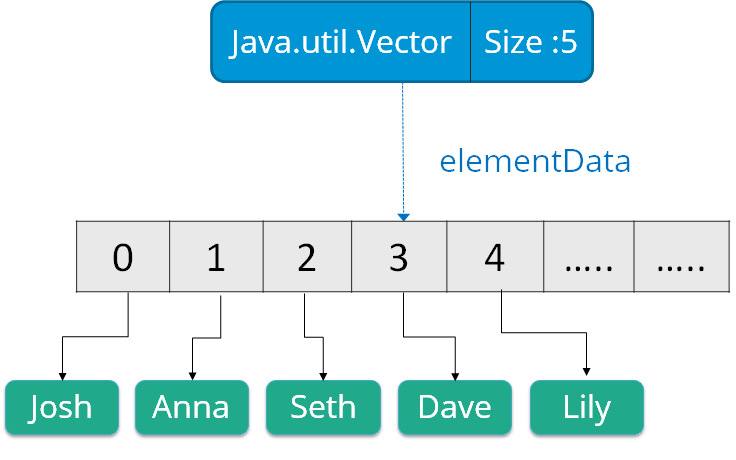
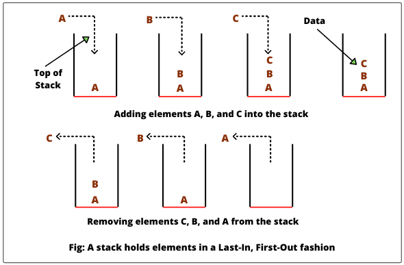

## 

# Collection List

**Content**

[1. List](#1-list)

[1.1 ArrayList](#11-arraylist)

1.2 LinkedList

1.3 Vector

[1.4 Stack](#2-references)

[2. References](#2-references)

## 1. List

-   A List is an ordered Collection (sometimes called a sequence).
-   Lists may contain duplicate elements.
-   Elements can be inserted or accessed by their position in the list, using a zero-based index.

    

**The classes that implements List interface are:**

-   ArrayList
-   LinkedList
-   Vector
-   Stack

## 1.1 ArrayList

-   ArrayList is a popular alternative of arrays in Java.
-   It is based on an Array **data structure**.
-   ArrayList is a resizable-array implementation of the List interface.
-   It implements all optional list operations, and permits all elements, including null.
-   *ArrayList* resides within Java Core Libraries, so you don't need any additional libraries.

    

**Important Features of ArrayList Java**

-   **Dynamic Resizing:** ArrayList grows dynamically as we add elements to the list or shrinks as we remove elements from the list.
-   **Ordered:** ArrayList preserves the order of the elements i.e. the order in which the elements were added to the list.
-   **Index based:** ArrayList in Java supports random access from the list using index positions starting with ‘0’.
-   **Object based:** ArrayList can store only Objects data types. They cannot be used for primitive data types (int, float, etc). We require a wrapper class in that case.
-   **Not Synchronized:** ArrayList in Java is not synchronized, we can use the [Vector](https://www.scaler.com/topics/java/vector-in-java/) class for the synchronized version.
-   In order to use ArrayList just add the following import statement:

```java
import java.util.ArrayList;
```

**1) Create an ArrayList**

-   Create an ArrayList object called **cars** that will store strings:

**Example:**

```java
import java.util.ArrayList; // import the ArrayList class
ArrayList<String> cars = new ArrayList<String>(); // Create an ArrayList object
```

**2) Add Elements to the ArrayList**

-   You may insert an element either at the end or at the specific position:

**Example:**

```java
import java.util.ArrayList;
public class Main {
  public static void main(String[] args) {
    ArrayList<String> cars = new ArrayList<String>();
    cars.add("Volvo");
    cars.add("BMW");
    cars.add("Ford");
    cars.add("Mazda");
    System.out.println(cars);
  }
}
```

**Output:**

```
[Volvo, BMW, Ford, Mazda]
```

**3) Access an Item**

-   To access an element in the ArrayList, use the get() method and refer to the index number:

**Example:**

```java
import java.util.ArrayList;
public class Main { 
  public static void main(String[] args) { 
    ArrayList<String> cars = new ArrayList<String>();
    cars.add("Volvo");
    cars.add("BMW");
    cars.add("Ford");
    cars.add("Mazda");
    System.out.println(cars.get(0));
  } 
}
```

**Output:**

```
Volvo
```

**Remember:** Array indexes start with 0: [0] is the first element. [1] is the second element, etc.

**4) Change an Item**

-   To modify an element, use the set() method and refer to the index number:

**Example:**

```java
import java.util.ArrayList;
public class Main { 
  public static void main(String[] args) { 
    ArrayList<String> cars = new ArrayList<String>();
    cars.add("Volvo");
    cars.add("BMW");
    cars.add("Ford");
    cars.add("Mazda");
    cars.set(0, "Opel");
    System.out.println(cars);
  } 
}
```

**Output:**

```
[Opel, BMW, Ford, Mazda]
```

**5) Remove an Item**

-   To remove an element, use the remove() method and refer to the index number:

**Example:**

```java
import java.util.ArrayList;
public class Main { 
  public static void main(String[] args) { 
    ArrayList<String> cars = new ArrayList<String>();
    cars.add("Volvo");
    cars.add("BMW");
    cars.add("Ford");
    cars.add("Mazda");
    cars.remove(0);
    System.out.println(cars);
  } 
}
```

**Output:**

```
[BMW, Ford, Mazda]
```

-   To remove all the elements in the ArrayList, use the clear() method:

**Example:**

```java
import java.util.ArrayList;
public class Main { 
  public static void main(String[] args) { 
    ArrayList<String> cars = new ArrayList<String>();
    cars.add("Volvo");
    cars.add("BMW");
    cars.add("Ford");
    cars.add("Mazda");
    cars.clear();
    System.out.println(cars);
  } 
}
```

**Output:**

```
[]
```

**6) ArrayList Size**

-   To find out how many elements an ArrayList have, use the size method:

```java
cars.size();
```

**7) Loop Through an ArrayList**

-   Loop through the elements of an ArrayList with a for loop, and use the size() method to specify how many times the loop should run:

**Example:**

```java
import java.util.ArrayList;
public class Main {
  public static void main(String[] args) {
    ArrayList<String> cars = new ArrayList<String>();
    cars.add("Volvo");
    cars.add("BMW");
    cars.add("Ford");
    cars.add("Mazda");
    for (int i = 0; i < cars.size(); i++) {
      System.out.println(cars.get(i));
    }
  }
}
```

**Output:**

```
Volvo
BMW
Ford
Mazda
```

-   You can also loop through an ArrayList with the **for-each** loop:

**Example:**

```java
public class Main {
  public static void main(String[] args) {
    ArrayList<String> cars = new ArrayList<String>();
    cars.add("Volvo");
    cars.add("BMW");
    cars.add("Ford");
    cars.add("Mazda");
    for (String i : cars) {
      System.out.println(i);
    }
  }
}
```

**Output:**

```
Volvo
BMW
Ford
Mazda
```

-   You can also loop through an ArrayList with **Iterator** :

**Example:**

```java
public class Main {
  public static void main(String[] args) {
    ArrayList<String> cars = new ArrayList<String>();
    cars.add("Volvo");
    cars.add("BMW");
    cars.add("Ford");
    cars.add("Mazda");
    Iterator itr = cars.iterator();
    while(itr.hasNext()){
      System.out.println(itr.next());
    }
  }
}
```

**Output:**

```
Volvo
BMW
Ford
Mazda
```

## 1.2 LinkedList

-   LinkedList is a linear data structure.
-   Linked List is a sequence of links which contains items.
-   Each link contains a connection to another link.
-   Java Linked List class uses two types of Linked list to store the elements:
1.  Singly Linked List
2.  Doubly Linked List

**Singly Linked List**:

-   In a singly Linked list each node in this list stores the data of the node and a pointer or reference to the next node in the list.
-   Refer to the below image to get a better understanding of single Linked list.



**Doubly Linked List**:

-   In a doubly Linked list, it has two references, one to the next node and another to previous node.
-   You can refer to the below image to get a better understanding of doubly linked list.



**Example:**

```java
import java.util.*;
public class JavaExample{
  public static void main(String args[]){
    LinkedList<String> linkList = new LinkedList<>();
    linkList.add("Apple"); //["Apple"]
    linkList.add("Orange"); //["Apple", "Orange"]

    //inserting element at first position
    linkList.add(0, "Banana"); ////["Banana", "Apple", "Orange"]

    System.out.println("LinkedList elements: ");
    //iterating LinkedList using iterator
    Iterator<String> it = linkList.iterator();
    while(it.hasNext()){
      System.out.println(it.next());
    }
  }
}
```

**Output:**

```
LinkedList elements:
Banana
Apple
Orange
```

## 1.3 Vector

-   Vector class in Java was introduced in JDK 1.0 version.
-   It is present in Java.util package.
-   A vector can be defined as a dynamic array that can grow or shrink on its own i.e. vector will grow when more elements are added to it and will shrink when elements are removed from it.
-   This behavior is unlike that of arrays which are static. But similar to arrays, vector elements can be accessed using integer indices.

**Java Vector class is similar to ArrayList class with two main differences.**

-   Vector is synchronized. It is used for thread safety.
-   It contains many legacy methods that are not now a part of the collections framework.



**Example:**

```java
import java.util.*;
public class JavaExample{
  public static void main(String args[]){
    Vector<String> v = new Vector<>();
    v.add("item1"); //["item1"]
    v.add("item2"); //["item1", "item2"]
    v.add("item3"); //["item1", "item2", "item3"]

    //removing an element
    v.remove("item2"); //["item1", "item3"]

    System.out.println("Vector Elements: ");
    //iterating Vector using iterator
    Iterator<String> it = v.iterator();
    while(it.hasNext()){
      System.out.println(it.next());
    }
  }
}
```

**Output:**

```
Vector Elements:
item1
item3
```

## 1.4 Stack

-   A stack is an ordered data structure belonging to the Java Collection Framework.
-   In this collection, the elements are added and removed from one end only.
-   The end at which the elements are added and removed is called “Top of the Stack”.
-   As addition and deletion are done only at one end, the first element added to the stack happens to be the last element removed from the stack. Thus stack is called a LIFO (Last-in, First-out) data structure.
-   The elements are inserted using push() method at the end of the stack, the pop() method removes the element which was inserted last in the Stack.

    

**Example:**

```java
import java.util.*;
public class JavaExample{
  public static void main(String args[]){
    Stack<String> stack = new Stack<>();

    //push() method adds the element in the stack
    //and pop() method removes the element from the stack
    stack.push("Chaitanya"); //["Chaitanya"]
    stack.push("Ajeet"); //["Chaitanya", Ajeet]
    stack.push("Hari"); //["Chaitanya", "Ajeet", "Hari"]
    stack.pop(); //removes the last element
    stack.push("Steve"); //["Chaitanya", "Ajeet", "Steve"]
    stack.push("Carl"); //["Chaitanya", "Ajeet", "Steve", "Carl"]
    stack.pop(); //removes the last element

    System.out.println("Stack elements: ");
    for(String str: stack){
      System.out.println(str);
    }
  }
}
```

**Output:**

```
Stack elements:
Chaitanya
Ajeet
Steve
```

## 2. References

1.  https://beginnersbook.com/java-collections-tutorials/
2.  https://www.w3schools.com/java/java_arraylist.asp
3.  https://www.edureka.co/blog/java-collections/
4.  https://www.softwaretestinghelp.com/java-stack-tutorial/
