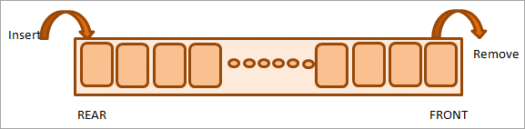

## Java Queue

-   Java Queue is an interface available in java.util package and extends java.util.Collection interface.
-   Just like a real-world queue (for instance, in a bank or at ATM), Queue inserts elements at the end of the queue and removes from the beginning of the queue.
-   We can use Queue to store elements before processing those elements.



-   Java Queue represents an ordered list of elements.
-   Java Queue follows FIFO order to insert and remove it’s elements. FIFO stands for First In First Out.
-   Java Queue supports all methods of Collection interface.
-   Most frequently used Queue implementations are LinkedList, ArrayBlockingQueue and PriorityQueue.
-   BlockingQueues do not accept null elements. If we perform any null related operation, it throws NullPointerException.
-   BlockingQueues are used to implement Producer/Consumer based applications.
-   BlockingQueues are thread-safe.
-   All Queues which are available in java.util package are Unbounded Queues and Queues which are available in java.util.concurrent package are Bounded Queues.
-   All Deques are not thread-safe.
-   ConcurrentLinkedQueue is an unbounded thread-safe Queue based on linked nodes.
-   All Queues supports insertion at the tail of the queue and removal at the head of the queue, except Deques.
-   Deques are queues but they support element insertion and removal at both ends.


**Example:**

```java
import java.util.*;

public class QueueExample {
   public static void main(String[] args) {
		
	Queue<String> queue = new LinkedList<>();
	queue.add("one");
	queue.add("two");
	queue.add("three");
	queue.add("four");
	System.out.println(queue);
		
	queue.remove("three");
	System.out.println(queue);
	System.out.println("Queue Size: " + queue.size());
	System.out.println("Queue Contains element 'two' or not? : " + queue.contains("two"));

	// To empty the queue
	queue.clear();
   }
}
```

**Output:-**

```
[one, two, three, four]
[one, two, four]
Queue Size: 3
Queue Contains element 'two' or not? : true
```

## Java Array to Queue

-   Here we can explore how to convert a Java array to Queue using “Collections.addAll()” method.

**Example:**

```java
import java.util.*;

public class ArrayToQueue {
    public static void main(String[] args) {
		
	String nums[] = {"one","two","three","four","five"};
	Queue<String> queue = new LinkedList<>();
	Collections.addAll(queue, nums);
	System.out.println(queue);
   }
}
```

**Output:**

```
[one, two, three, four, five]
```

## Java Queue to Array

-   Here we will explore how to convert a Java Queue to a Java Array using “toArray()”.

**Example:**

```java
import java.util.*;

public class QueueToArray {
   public static void main(String[] args) {
		
	Queue<String> queue = new LinkedList<>();
	queue.add("one");
	queue.add("two");
	queue.add("three");
	queue.add("four");
	queue.add("five");
		
	String strArray[] = queue.toArray(new String[queue.size()]);
	System.out.println(Arrays.toString(strArray)); 

   }
}
```

**Output:**

```
[one, two, three, four, five]
```

## Java Queue Insert Operations

Queue supports insert operation in two forms:

-   Queue.add(e): It throws an exception if the operation fails.
-   Queue.offer(e): It returns a special value if the operation fails.

**NOTE:** Here special value may be either “false” or “null”

### Queue add() operation

-   The add() operation is used to insert new element into the queue.
-   If it performs insert operation successfully, it returns “true” value. Otherwise it throws java.lang.IllegalStateException.

**Example:**

```java
import java.util.concurrent.*;

public class QueueAddOperation {
   public static void main(String[] args) {
		
	BlockingQueue<String> queue = new ArrayBlockingQueue<>(2);

	System.out.println(queue.add("one"));
	System.out.println(queue.add("two"));
	System.out.println(queue);
	System.out.println(queue.add("three"));
	System.out.println(queue);
   }
}
```

**Output:**

```
true
true
[one, two]
Exception in thread "main" java.lang.IllegalStateException: Queue full
```

-   As our queue is limited to two elements, when we try to add third element using BlockingQueue.add(), it throws an exception as shown above.

## Queue offer() operation

-   The offer() operation is used to insert new element into the queue.
-   If it performs insert operation successfully, it returns “true” value. Otherwise it returns “false” value.

**Example:**

```java
import java.util.concurrent.*;

public class QueueOfferOperation {
   public static void main(String[] args) {
		
	BlockingQueue<String> queue = new ArrayBlockingQueue<>(2);

	System.out.println(queue.offer("one"));
	System.out.println(queue.offer("two"));
	System.out.println(queue);
	System.out.println(queue.offer("three"));
	System.out.println(queue);
   }
}
```

**Output:**

```
true
true
[one, two]
false
[one, two]
```

-   As our queue is limited to two elements, when we try to add third element using BlockingQueue.offer() operation, it returns “false” value as shown above.

## Java Queue Delete Operations

-   The Delete operations returns the head element of the queue, if it performs successfully.
-   As we know, Queue supports delete operation in two forms:

    i) Queue.remove(): It throws an exception if the operation fails.

    ii) Queue.poll(): It returns a special value if the operation fails.

**NOTE:** Here special value may be either “false” or “null”

### Queue remove() operation

-   The remove() operation is used to delete an element from the head of the queue.
-   If it performs delete operation successfully, it returns the head element of the queue. Otherwise it throws java.util.NoSuchElementException.

**Example:**

```java
import java.util.*;

public class QueueRemoveOperation 
{
   public static void main(String[] args) 
   {		
	Queue<String> queue = new LinkedList<>();
	queue.offer("one");
	queue.offer("two");		
	System.out.println(queue);		
	System.out.println(queue.remove());
	System.out.println(queue.remove());		
	System.out.println(queue.remove());		
   }
}
```

**Output:**

```
[one, two]
one
two
Exception in thread "main" java.util.NoSuchElementException
```

-   As our queue has only two elements, when we try to call remove() method for third time, it throws an exception as shown above.

## Queue poll() operation

-   The poll() operation is used to delete an element from the head of the queue.
-   If it performs delete operation successfully, it returns the head element of the queue. Otherwise it returns “null” value.

**Example:**

```java
import java.util.*;

public class QueuePollOperation 
{
   public static void main(String[] args) 
   {		
	Queue<String> queue = new LinkedList<>();
	queue.offer("one");
	queue.offer("two");		
	System.out.println(queue);		
	System.out.println(queue.poll());
	System.out.println(queue.poll());		
	System.out.println(queue.poll());		
   }
}
```

**Output:**

```
[one, two]
one
two
null
```

-   As our queue has only two elements, when we try to call poll() method for third time, it returns null value as shown above.

## Java Queue Examine Operations

-   If this operation performs successfully, it returns the head element of the queue without removing it. As we know, Queue supports examine operation in two forms:

i) Queue.element(): It throws an exception if the operation fails.

ii) Queue.peek(): It returns a special value if the operation fails.

**NOTE:-** Here special value may be either “false” or “null”

## Queue element() operation

-   The element() operation is used to retrieve an element from the head of the queue, without removing it.
-   If it performs examine operation successfully, it returns the head element of the queue. Otherwise it throws java.util.NoSuchElementException.

**Example:**

```java
import java.util.*;

public class QueueElementOperation {
   public static void main(String[] args) {
		
	Queue<String> queue = new LinkedList<>();
	queue.add("one");
		
	System.out.println(queue.element());
	System.out.println(queue);
	queue.clear();
	System.out.println(queue.element());
   }
}
```

**Output:**

```
one
[one]
Exception in thread "main" java.util.NoSuchElementException
```

-   If we try to call element() method on empty Queue, it throws an exception as shown above.

## Queue peek() operation

-   The peek() operation is used to retrieve an element from the head of the queue, without removing it.
-   If it performs examine operation successfully, it returns the head element of the queue. Otherwise it returns null value.

**Example:**

```java
import java.util.*;

public class QueuePeekOperation {
   public static void main(String[] args) {
		
	Queue<String> queue = new LinkedList<>();
	queue.add("one");
		
	System.out.println(queue.peek());
	System.out.println(queue);
	queue.clear();
	System.out.println(queue.peek());
   }
}
```

**Output:**

```
one
[one]
null
```

If we try to call peek() method on empty Queue, it returns null value, but does NOT throw an exception as shown above.

## References

1.  https://www.digitalocean.com/community/tutorials/java-queue
