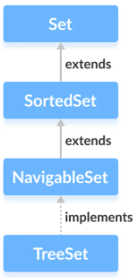

# Set

**Content**

1\. Set

1.1 HashSet

1.2 LinkedHashSet

1.3 TreeSet

2\. References

## 1. Set

-   A Set is a Collection that cannot contain duplicate elements.
-   There are three main implementations of Set interface:
1.  HashSet
2.  TreeSet
3.  LinkedHashSet.

## 1.1 HashSet

-   **HashSet** internally uses HashMap to store it’s elements.
-   Whenever you create a HashSet object, one **HashMap** object associated with it is also created.
-   This HashMap object is used to store the elements you enter in the HashSet.
-   The elements you add into HashSet are stored as **keys** of this HashMap object.
-   The value associated with those keys will be a **constant**.

**How HashSet Works Internally In Java?**

-   Let’s see one example of HashSet and how it maintains HashMap internally.


-   In the same manner, all methods of HashSet class process internally backing HashMap object to get the desired result.

## 1.1.1 Creating a HashSet

-   In order to create a hash set, we must import the **java.util.HashSet** package first.
-   Once we import the package, here is how we can create hash sets in Java.

```java
// HashSet with 8 capacity and 0.75 load factor
HashSet<Integer> number = new HashSet<>(8, 0.6);
```

-   Here, we have created a hash set named **numbers.**
-   Notice, the part new **HashSet\<\>(8, 0.6)**. Here, the first parameter is **capacity**, and the second parameter is **loadFactor**.
-   **capacity** - The capacity of this hash set is 8. Meaning, it can store 8 elements.
-   **loadFactor** - The load factor of this hash set is 0.6. This means, whenever our hash set is filled by 60%, the elements are moved to a new hash table of double the size of the original hash table.
-   **Default capacity and load factor**
-   It's possible to create a hash table without defining its capacity and load factor.

**Example:**

```java
// HashSet with default capacity and load factor
HashSet<Integer> number = new HashSet<>();
```

By default,

-   the capacity of the hash set will be 16
-   the load factor will be 0.75

## 1.1.2 Add Items

-   The HashSet class has many useful methods.
-   For example, to add items to it, use the add() method:

```java
// Import the HashSet class
import java.util.HashSet;

public class Main {
  public static void main(String[] args) {
    HashSet<String> cars = new HashSet<String>();
    cars.add("Volvo");
    cars.add("BMW");
    cars.add("Ford");
    cars.add("BMW");
    cars.add("Mazda");
    System.out.println(cars);
  }
}
```

**Output:**

```
[Volvo, Mazda, Ford, BMW]
```

**Note:** In the example above, even though BMW is added twice it only appears once in the set because every item in a set has to be unique.

## 1.1.3 Check If an Item Exists

-   To check whether an item exists in a HashSet, use the contains() method:

**Example**

```java
cars.contains("Mazda");
```

## 1.1.4 Remove an Item

-   To remove an item, use the remove() method:

**Example:**

```java
// Import the HashSet class
import java.util.HashSet;

public class Main {
  public static void main(String[] args) {
    HashSet<String> cars = new HashSet<String>();
    cars.add("Volvo");
    cars.add("BMW");
    cars.add("Ford");
    cars.add("BMW");
    cars.add("Mazda");
    cars.remove("Volvo");
    System.out.println(cars);
  }
}

[Mazda, Ford, BMW]
```

-   To remove all items, use the clear() method:

**Example**

```java
cars.clear();
```

## 1.1.5 HashSet Size

-   To find out how many items there are, use the size method.

**Example:**

```java
cars.size();
```

## 1.1.6 Loop Through a HashSet

-   Loop through the items of an HashSet with a **for-each** loop:

**Example:**

```java
for (String car : cars) {
  System.out.println(car);
}
```

-   You can also loop through an hashSet with **Iterator** :

**Example:**

```
import java.util.*;
public class JavaExample{
  public static void main(String args[]){
    HashSet<String> set = new HashSet<>();
    set.add("Paul");
    set.add("Ram");
    set.add("Aaron");
    set.add("Leo");
    set.add("Becky");

    Iterator<String> it = set.iterator();
    while(it.hasNext()){
      System.out.println(it.next());
    }
  }
}
```

**Output:**

```
Aaron
Leo
Paul
Ram
Becky
```

## 1.2 LinkedHashSet

-   LinkedHashSet is an **extended version** of HashSet.
-   HashSet doesn’t follow any order where as LinkedHashSet maintains **insertion order**.
-   HashSet uses **HashMap object** internally to store it’s elements where as LinkedHashSet uses **LinkedHashMap object** internally to store and process it’s elements.

**How LinkedHashSet Works Internally In Java?**

-   Let’s see one example of LinkedHashSet to know how it works internally.

```java
public class LinkedHashSetExample { 
public static void main(String[] args) { 
    //Creating LinkedHashSet 
    LinkedHashSet set = new LinkedHashSet(); 
    //Adding elements to LinkedHashSet 
    set.add("BLUE"); 
    set.add("RED"); 
    set.add("GREEN");    
    set.add("BLACK");
 	}
 }
```

-   Look at the below image to see how above program works.


**Another Example:**

```java
import java.util.*;
public class JavaExample{
  public static void main(String args[]){
    LinkedHashSet<String> set = new LinkedHashSet<>();
    set.add("Paul");
    set.add("Ram");
    set.add("Aaron");
    set.add("Leo");
    set.add("Becky");

    Iterator<String> it = set.iterator();
    while(it.hasNext()){
      System.out.println(it.next());
    }
  }
}
```

**Output:**

```
Paul
Ram
Aaron
Leo
Becky
```

## 1.3 TreeSet

-   A **TreeSet in Java** is another important implementation of the [Set interface](https://www.scientecheasy.com/2020/10/java-set.html/) .
-   TreeSet is similar to HashSet except that it sorts the elements in the ascending order while HashSet doesn’t maintain any order.
-   TreeSet allows null element but like HashSet it doesn’t allow.
-   For example, a set of books might be kept by height or alphabetically by title and author.

    

-   In Java TreeSet, access and retrieval of elements are quite fast because of using tree structure. Therefore, TreeSet is an excellent choice for quick and fast access to large amounts of sorted data.
-   The only restriction with using tree set is that we cannot add duplicate elements in the tree set.

**Hierarchy of TreeSet class in Java**



**Features of TreeSet class in Java**

There are several important features of TreeSet class in java that must be kept in mind. They are as:

1\. Java TreeSet contains unique elements similar to the HashSet. It does not allow the addition of a duplicate element.

2\. The access and retrieval times are quite fast.

3\. TreeSet does not allow inserting null element.

4\. TreeSet class is non-synchronized. That means it is not thread-safe.

5\. TreeSet maintains the ascending order. When we add elements into the collection in any order, the values are automatically presented in sorted, ascending order.

6\. Java TreeSet internally uses a TreeMap for storing elements.

## 1.3.1 Creating a TreeSet

-   In order to create a tree set, we must import the java.util.TreeSet package first.
-   Once we import the package, here is how we can create a TreeSet in Java.

```java
TreeSet<Integer> numbers = new TreeSet<>();
```

-   Here, we have created a TreeSet without any arguments. In this case, the elements in TreeSet are sorted naturally (ascending order).
-   However, we can customize the sorting of elements by using the Comparator interface.

## 1.3.2 Insert Elements to TreeSet

-   add() - inserts the specified element to the set
-   addAll() - inserts all the elements of the specified collection to the set

**Example:**

```java
import java.util.TreeSet;
class Main {
public static void main(String[] args) {
    TreeSet<Integer> evenNumbers = new TreeSet<>();
    // Using the add() method
    evenNumbers.add(2);
    evenNumbers.add(4);
    evenNumbers.add(6);
    System.out.println("TreeSet: " + evenNumbers);
    TreeSet<Integer> numbers = new TreeSet<>();
    numbers.add(1);
    // Using the addAll() method
    numbers.addAll(evenNumbers);
    System.out.println("New TreeSet: " + numbers);
}
}
```

**Output:**

```
TreeSet: [2, 4, 6]
New TreeSet: [1, 2, 4, 6]
```

## 1.3.3 Access TreeSet Elements

-   To access the elements of a tree set, we can use the iterator() method. In order to use this method, we must import java.util.Iterator package.

**Example:**

```java
import java.util.TreeSet;
import java.util.Iterator;
class Main {
public static void main(String[] args) {
    TreeSet<Integer> numbers = new TreeSet<>();
    numbers.add(2);
    numbers.add(5);
    numbers.add(6);
    System.out.println("TreeSet: " + numbers);
    // Calling iterator() method
    Iterator<Integer> iterate = numbers.iterator();
    System.out.print("TreeSet using Iterator: ");
    // Accessing elements
    while(iterate.hasNext()) {
        System.out.print(iterate.next());
              System.out.print(", ");
     }
}
}
```

**Output**

```
TreeSet: [2, 5, 6]
TreeSet using Iterator: 2, 5, 6,
```

## 1.3.4 Remove Elements

-   remove() - removes the specified element from the set
-   removeAll() - removes all the elements from the set

**Example:**

```java
import java.util.TreeSet;
class Main {
public static void main(String[] args) {
    TreeSet<Integer> numbers = new TreeSet<>();
    numbers.add(2);
    numbers.add(5);
    numbers.add(6);
    System.out.println("TreeSet: " + numbers);
    // Using the remove() method
    boolean value1 = numbers.remove(5);
    System.out.println("Is 5 removed? " + value1);
          // Using the removeAll() method
    boolean value2 = numbers.removeAll(numbers);
    System.out.println("Are all elements removed? " + value2);
}
}
```

**Output**

```
TreeSet: [2, 5, 6]
Is 5 removed? true
Are all elements removed? true
```

### 1.3.5 Iterate Through TreeSet

-   To access the individual elements of TreeSet, we need to iterate through the TreeSet or in other words, traverse through the TreeSet.
-   We do this by declaring an Iterator for the TreeSet and then using this Iterator to access each element.
-   For this, we use the next () method of an iterator that returns the next element in the TreeSet.

**Example:**

```java
import java.util.*;
public class JavaExample{
  public static void main(String args[]){
    TreeSet<String> set = new TreeSet<>();
    set.add("Paul");
    set.add("Ram");
    set.add("Aaron");
    set.add("Leo");
    set.add("Becky");

    Iterator<String> it = set.iterator();
    while(it.hasNext()){
      System.out.println(it.next());
    }
  }
}
```

**Output:**

```
Aaron
Becky
Leo
Paul
Ram
```

**Using a for-each loop**

-   Iterate the elements of a TreeSet using the for-each loop

**Example**

```java
import java.util.*;
public class IteratingTreeSetForEachTest {
   public static void main(String[] args) {
      Set<String> treeSetObj = new TreeSet<String>();
      treeSetObj.add("India");
      treeSetObj.add("Australia");
      treeSetObj.add("West Indies");
      treeSetObj.add("South Africa");
      treeSetObj.add("England");
      for(String str : treeSetObj) { // for-each loop
         System.out.println(str);
      }
   }
}
```

**Output**

```
Australia
England
India
South Africa
West Indies
```

## 2. References

1.  https://beginnersbook.com/java-collections-tutorials/
2.  https://www.w3schools.com/java/java_hashset.asp
3.  https://www.programiz.com/java-programming/hashset
4.  https://javaconceptoftheday.com/how-hashset-works-internally-in-java/
5.  https://javaconceptoftheday.com/how-linkedhashset-works-internally-in-java/
6.  https://www.programiz.com/java-programming/treeset
7.  https://www.softwaretestinghelp.com/treeset-in-java/
8.  https://www.programiz.com/java-programming/treeset
9.  https://www.scientecheasy.com/2020/10/treeset-in-java.html/
10. https://www.tutorialspoint.com/how-many-ways-to-iterate-a-treeset-in-java
