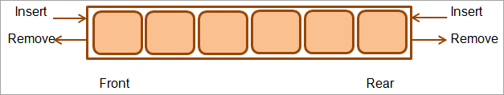

# Queue, Deque and Priority Queue

**Content**

[1. Java Queue](#1-java-queue)

[2. Java Deque](#2-java-deque)

[3. Java Priority Queue](#3-java-priority-queue)

[4. References](#4-references)

## 1. Java Queue

-   Java Queue is an interface available in java.util package and extends java.util.Collection interface.
-   Just like a real-world queue (for instance, in a bank or at ATM), Queue inserts elements at the end of the queue and removes from the beginning of the queue.
-   We can use Queue to store elements before processing those elements.


## 1.1 Features of a Queue

-   Java Queue represents an ordered list of elements.
-   Java Queue follows FIFO order to insert and remove it’s elements. FIFO stands for First In First Out.
-   The queue collection has two ends i.e. front & rear. The elements are added at the rear and removed from the front.
-   Java Queue supports all methods of Collection interface.
-   Most frequently used Queue implementations are LinkedList, ArrayBlockingQueue and PriorityQueue.
-   BlockingQueues do not accept null elements. If we perform any null related operation, it throws NullPointerException.
-   BlockingQueues are used to implement Producer/Consumer based applications.
-   BlockingQueues are thread-safe.
-   Queues which are available in java.util package are Unbounded Queues and Queues which are available in java.util.concurrent package are Bounded Queues.
-   All Deques are not thread-safe.
-   ConcurrentLinkedQueue is an unbounded thread-safe Queue based on linked nodes.
-   All Queues supports insertion at the tail of the queue and removal at the head of the queue, except Deques.

## 2. Java Deque

-   Deques or “double-ended queue” are queues but they support element insertion and removal at both ends.
-   It can either be used as a queue(first-in-first-out/FIFO) or as a stack(last-in-first-out/LIFO).
-   The deque is an interface in Java belonging to java.util package and it implements java.queue interface.



-   Deque is mostly used to implement stack, queue, or list data structures.
-   It can also be used to implement priority queues.
-   The diagram below shows the hierarchy for the double-ended queue or deque.
-   As shown in the below diagram, the Deque interface extends to the Queue interface that in turn extends the Collection interface.


## 3. Java Priority Queue

-   Priority Queue is a special queue in which the elements are present not as per FIFO order but according to the natural elements or any custom comparator used during queue creation.
-   In Priority Queue, the front of the queue has the least elements as per the natural ordering and the rear is pointed to the greatest element in the queue.
-   **An example Priority Queue consisting of numbers is shown below.**


-   Thus when an element is removed from the priority queue shown above, then it will be the least element.
-   Similarly, for an alphabetical priority queue, ASCII values will be considered and the queue elements will be ordered as per the ASCII values.

**Enlisted below are some of the major characteristics of the PriorityQueue:**

-   PriorityQueue is an unbound queue.
-   PriorityQueue does not allow null values.
-   For non-comparable objects, we cannot create a priority queue.
-   PriorityQueue inherits from the classes like AbstractQueue, AbstractCollection, Collection, and Object.
-   The head or front of the queue contains the least element as per the natural ordering.
-   Priority Queue implementation is not thread-safe. Thus if we desire synchronized access, we should use the PriorityBlockingQueue.
-   The PriorityQueue class inherits Java Queue Interface and is a part of the java.util package.

**The below diagram shows the class hierarchy for the PriorityQueue class.**


-   Unlike normal queues, priority queue elements are retrieved in sorted order.
-   Suppose, we want to retrieve elements in the ascending order.
-   In this case, the head of the priority queue will be the smallest element.
-   Once this element is retrieved, the next smallest element will be the head of the queue.
-   It is important to note that the elements of a priority queue may not be sorted.
-   However, elements are always retrieved in sorted order.

## 3.1 Creating PriorityQueue

-   In order to create a priority queue, we must import the java.util.PriorityQueue package.
-   Once we import the package, here is how we can create a priority queue in Java.

```java
PriorityQueue<Integer> numbers = new PriorityQueue<>();
```

-   Here, we have created a priority queue without any arguments.
-   In this case, the head of the priority queue is the smallest element of the queue.
-   And elements are removed in ascending order from the queue.
-   However, we can customize the ordering of elements with the help of the Comparator interface.

## 3.2 Insert Elements to PriorityQueue

-   add() - Inserts the specified element to the queue. If the queue is full, it throws an exception.
-   offer() - Inserts the specified element to the queue. If the queue is full, it returns false.

**Example:**

```java
import java.util.PriorityQueue;
class Main {
  public static void main(String[] args) {
    // Creating a priority queue
    PriorityQueue<Integer> numbers = new PriorityQueue<>();
    // Using the add() method
    numbers.add(4);
    numbers.add(2);
    System.out.println("PriorityQueue: " + numbers);
    // Using the offer() method
    numbers.offer(1);
    System.out.println("Updated PriorityQueue: " + numbers);
  }
}
```

**Output**

```
PriorityQueue: [2, 4]
Updated PriorityQueue: [1, 4, 2]
```

-   Here, we have created a priority queue named *numbers*. We have inserted 4 and 2 to the queue.
-   Although 4 is inserted before 2, the head of the queue is 2. It is because the head of the priority queue is the smallest element of the queue.
-   We have then inserted 1 to the queue. The queue is now rearranged to store the smallest element 1 to the head of the queue.

## 3.3 Access PriorityQueue Elements

-   To access elements from a priority queue, we can use the peek() method.
-   This method returns the head of the queue.

**Example:**

```java
import java.util.PriorityQueue;
class Main {
  public static void main(String[] args) {
    // Creating a priority queue
    PriorityQueue<Integer> numbers = new PriorityQueue<>();
    numbers.add(4);
    numbers.add(2);
    numbers.add(1);
    System.out.println("PriorityQueue: " + numbers);
    // Using the peek() method
    int number = numbers.peek();
    System.out.println("Accessed Element: " + number);
  }
}
```

**Output**

```
PriorityQueue: [1, 4, 2]
Accessed Element: 1
```

## 3.4 Remove PriorityQueue Elements

-   remove() - removes the specified element from the queue
-   poll() - returns and removes the head of the queue

**Example:**

```java
import java.util.PriorityQueue;
class Main {
  public static void main(String[] args) {
    // Creating a priority queue
    	    PriorityQueue<Integer> numbers = new PriorityQueue<>();
    numbers.add(4);
    numbers.add(2);
    numbers.add(1);
    System.out.println("PriorityQueue: " + numbers);
    // Using the remove() method
    boolean result = numbers.remove(2);
    System.out.println("Is the element 2 removed? " + result);
    // Using the poll() method
    int number = numbers.poll();
    System.out.println("Removed Element Using poll(): " + number);
  }
}
```

**Output**

```
PriorityQueue: [1, 4, 2]
Is the element 2 removed? true
Removed Element Using poll(): 1
```

## 3.5 Iterating Over a PriorityQueue

-   To iterate over the elements of a priority queue, we can use the iterator() method.
-   In order to use this method, we must import the java.util.Iterator package.

**Example:**

```java
import java.util.PriorityQueue;
import java.util.Iterator;
class Main {
  public static void main(String[] args) {
    // Creating a priority queue
    PriorityQueue<Integer> numbers = new PriorityQueue<>();
    numbers.add(4);
    numbers.add(2);
    numbers.add(1);
    System.out.print("PriorityQueue using iterator(): ");
    //Using the iterator() method
    Iterator<Integer> iterate = numbers.iterator();
    while(iterate.hasNext()) {
        System.out.print(iterate.next());
        System.out.print(", ");
    }
  }
}
```

**Output**

```
PriorityQueue using iterator(): 1, 4, 2,
```

## 4. References

1.  https://www.digitalocean.com/community/tutorials/java-queue
2.  https://www.programiz.com/java-programming/priorityqueue
3.  https://www.softwaretestinghelp.com/java-priority-queue-tutorial/
4.  https://www.softwaretestinghelp.com/deque-in-java/
