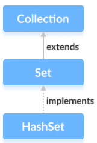
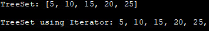

# Set

**Content**

1\. Set

1.1 HashSet

1.2 LinkedHashSet

1.3 TreeSet

2\. References

## 1. Set

-   A Set is a Collection that cannot contain duplicate elements.
-   There are three main implementations of Set interface:
1.  HashSet
2.  TreeSet
3.  LinkedHashSet.

## 1.1 HashSet

-   HashSet which stores its elements in a hash table, is the best-performing implementation.
-   HashSet allows only unique elements.
-   it is found in the java.util package:
-   It doesn’t maintain the insertion order which means element inserted last can appear at first when traversing the HashSet.
-   The HashSet class of the Java Collections framework provides the functionalities of the hash table data structure.
-   It implements the [Set interface](https://www.programiz.com/java-programming/set).



### Example

## Creating a HashSet

In order to create a hash set, we must import the java.util.HashSet package first.

Once we import the package, here is how we can create hash sets in Java.

```java
// HashSet with 8 capacity and 0.75 load factor
HashSet<Integer> numbers = new HashSet<>(8, 0.75);
```

Here, we have created a hash set named numbers.

Notice, the part new HashSet\<\>(8, 0.75). Here, the first parameter is **capacity**, and the second parameter is **loadFactor**.

-   **capacity** - The capacity of this hash set is 8. Meaning, it can store 8 elements.
-   **loadFactor** - The load factor of this hash set is 0.6. This means, whenever our hash set is filled by 60%, the elements are moved to a new hash table of double the size of the original hash table.

**Default capacity and load factor**

It's possible to create a hash table without defining its capacity and load factor. For example,

```java
// HashSet with default capacity and load factor
HashSet<Integer> numbers1 = new HashSet<>();
```

By default,

-   the capacity of the hash set will be 16
-   the load factor will be 0.75

## Add Items

The HashSet class has many useful methods. For example, to add items to it, use the add() method:

**Example:**

```java
// Import the HashSet class
import java.util.HashSet;

public class Main {
  public static void main(String[] args) {
    HashSet<String> cars = new HashSet<String>();
    cars.add("Volvo");
    cars.add("BMW");
    cars.add("Ford");
    cars.add("BMW");
    cars.add("Mazda");
    System.out.println(cars);
  }
}
```

Output:

```
[Volvo, Mazda, Ford, BMW]
```

**Note:** In the example above, even though BMW is added twice it only appears once in the set because every item in a set has to be unique.

## Check If an Item Exists

To check whether an item exists in a HashSet, use the contains() method:

### Example

cars.contains("Mazda");

## Remove an Item

To remove an item, use the remove() method:

### Example

```// Import the HashSet class
[Mazda, Ford, BMW]
```

To remove all items, use the clear() method:

### Example

cars.clear();

## HashSet Size

To find out how many items there are, use the size method:

### Example

cars.size();

## Loop Through a HashSet

Loop through the items of an HashSet with a **for-each** loop:

### Example

```// Import the HashSet class
Volvo
Mazda
Ford
BMW


import java.util.*;
public class JavaExample{
  public static void main(String args[]){
    HashSet<String> set =  new HashSet<>();
    set.add("Paul");
    set.add("Ram");
    set.add("Aaron");
    set.add("Leo");
    set.add("Becky");

    Iterator<String> it = set.iterator();
    while(it.hasNext()){
      System.out.println(it.next());
    }
  }
}
```

**Output:**

```
Aaron
Leo
Paul
Ram
Becky
```

## 1.2 LinkedHashSet

-   Unlike HashSet, the LinkedHashSet maintains insertion order.

**Example:**

```java
import java.util.*;
public class JavaExample{
  public static void main(String args[]){
    LinkedHashSet<String> set = new LinkedHashSet<>();
    set.add("Paul");
    set.add("Ram");
    set.add("Aaron");
    set.add("Leo");
    set.add("Becky");

    Iterator<String> it = set.iterator();
    while(it.hasNext()){
      System.out.println(it.next());
    }
  }
}
```

**Output:**

```
Paul
Ram
Aaron
Leo
Becky
```

## 1.3 TreeSet

-   TreeSet stores elements in a red-black tree. It is substantially slower than HashSet.
-   TreeSet class implements SortedSet interface, which allows TreeSet to order its elements based on their values, which means TreeSet elements are sorted in ascending order.
-   The TreeSet class of the Java collections framework provides the functionality of a tree data structure.
-   It extends the NavigableSet interface.


## Creating a TreeSet

In order to create a tree set, we must import the java.util.TreeSet package first.

Once we import the package, here is how we can create a TreeSet in Java.

TreeSet\<Integer\> numbers = new TreeSet\<\>();

Here, we have created a TreeSet without any arguments. In this case, the elements in TreeSet are sorted naturally (ascending order).

However, we can customize the sorting of elements by using the Comparator interface. We will learn about it later in this tutorial.

## Insert Elements to TreeSet

-   add() - inserts the specified element to the set
-   addAll() - inserts all the elements of the specified collection to the set

For example,

import java.util.TreeSet;

class Main {

public static void main(String[] args) {

TreeSet\<Integer\> evenNumbers = new TreeSet\<\>();

// Using the add() method

evenNumbers.add(2);

evenNumbers.add(4);

evenNumbers.add(6);

System.out.println("TreeSet: " + evenNumbers);

TreeSet\<Integer\> numbers = new TreeSet\<\>();

numbers.add(1);

// Using the addAll() method

numbers.addAll(evenNumbers);

System.out.println("New TreeSet: " + numbers);

}

}

[Run Code](https://www.programiz.com/java-programming/online-compiler)

**Output**

TreeSet: [2, 4, 6]

New TreeSet: [1, 2, 4, 6]

## Access TreeSet Elements

To access the elements of a tree set, we can use the iterator() method. In order to use this method, we must import java.util.Iterator package. For example,

import java.util.TreeSet;

import java.util.Iterator;

class Main {

public static void main(String[] args) {

TreeSet\<Integer\> numbers = new TreeSet\<\>();

numbers.add(2);

numbers.add(5);

numbers.add(6);

System.out.println("TreeSet: " + numbers);

// Calling iterator() method

Iterator\<Integer\> iterate = numbers.iterator();

System.out.print("TreeSet using Iterator: ");

// Accessing elements

while(iterate.hasNext()) {

System.out.print(iterate.next());

System.out.print(", ");

}

}

}

[Run Code](https://www.programiz.com/java-programming/online-compiler)

**Output**

TreeSet: [2, 5, 6]

TreeSet using Iterator: 2, 5, 6,

## Remove Elements

-   remove() - removes the specified element from the set
-   removeAll() - removes all the elements from the set

For example,

import java.util.TreeSet;

class Main {

public static void main(String[] args) {

TreeSet\<Integer\> numbers = new TreeSet\<\>();

numbers.add(2);

numbers.add(5);

numbers.add(6);

System.out.println("TreeSet: " + numbers);

// Using the remove() method

boolean value1 = numbers.remove(5);

System.out.println("Is 5 removed? " + value1);

// Using the removeAll() method

boolean value2 = numbers.removeAll(numbers);

System.out.println("Are all elements removed? " + value2);

}

}

[Run Code](https://www.programiz.com/java-programming/online-compiler)

**Output**

TreeSet: [2, 5, 6]

Is 5 removed? true

Are all elements removed? true

### Iterate Through TreeSet

To access the individual elements of TreeSet, we need to iterate through the TreeSet or in other words, traverse through the TreeSet.

We do this by declaring an Iterator for the TreeSet and then using this Iterator to access each element. For this, we use the next () method of an iterator that returns the next element in the TreeSet.

**The following Java program demonstrates the use of the Iterator to iterate through TreeSet.**

| import java.util.TreeSet; import java.util.Iterator;   class Main {  public static void main(String[] args) {  //create and initialize TreeSet  TreeSet\<Integer\> num_Treeset = new TreeSet\<\>();  num_Treeset.add(20);  num_Treeset.add(5);  num_Treeset.add(15);  num_Treeset.add(25);  num_Treeset.add(10);  System.out.println("TreeSet: " + num_Treeset);    // Call iterator() method to define Iterator for TreeSet  Iterator\<Integer\> iter_set = num_Treeset.iterator();  System.out.print("TreeSet using Iterator: ");  // Access TreeSet elements using Iterator  while(iter_set.hasNext()) {  System.out.print(iter_set.next());  System.out.print(", ");  }  } } |
|----------------------------------------------------------------------------------------------------------------------------------------------------------------------------------------------------------------------------------------------------------------------------------------------------------------------------------------------------------------------------------------------------------------------------------------------------------------------------------------------------------------------------------------------------------------------------------------------------------------------------------------------------------------------------------|

**Output:**

TreeSet: [5, 10, 15, 20, 25]  
TreeSet using Iterator: 5, 10, 15, 20, 25,



**Example:**

```java
import java.util.*;
public class JavaExample{
  public static void main(String args[]){
    TreeSet<String> set = new TreeSet<>();
    set.add("Paul");
    set.add("Ram");
    set.add("Aaron");
    set.add("Leo");
    set.add("Becky");

    Iterator<String> it = set.iterator();
    while(it.hasNext()){
      System.out.println(it.next());
    }
  }
}
```

**Output:**

```
Aaron
Becky
Leo
Paul
Ram
```

## 2. References

1.  https://beginnersbook.com/java-collections-tutorials/
2.  https://www.w3schools.com/java/java_hashset.asp
3.  https://www.programiz.com/java-programming/hashset
4.  https://www.programiz.com/java-programming/treeset
5.  https://www.softwaretestinghelp.com/treeset-in-java/
6.  https://www.programiz.com/java-programming/treeset
