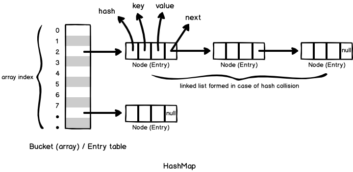
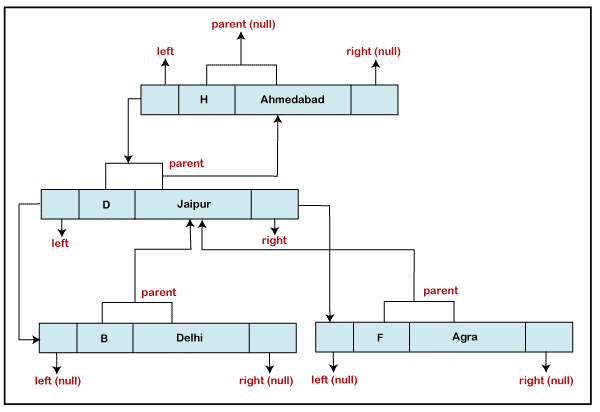

# Map

**Content**

1\. Map

1.1 HashMap

1.2 TreeMap

1.3 LinkedHashMap

2\. References

## 1. Map

-   A Map is an object that maps keys to values.
-   A map cannot contain duplicate keys.
-   There are three main implementations of Map interfaces:
1.  HashMap
2.  TreeMap
3.  LinkedHashMap.

## 1.1 HashMap

-   HashMap is like HashSet, it doesn’t maintain insertion order and doesn’t sort the elements in any order.
-   [Click here](https://beginnersbook.com/2013/12/hashmap-in-java-with-example/) to **learn HashMap in detail**.

# How HashMap works internally in Java?

## 

## Add Items

The HashMap class has many useful methods. For example, to add items to it, use the put() method:

**Example**

```java
// Import the HashMap class
import java.util.HashMap;

public class Main {
  public static void main(String[] args) {
    // Create a HashMap object called capitalCities
    HashMap<String, String> capitalCities = new HashMap<String, String>();

    // Add keys and values (Country, City)
    capitalCities.put("England", "London");
    capitalCities.put("Germany", "Berlin");
    capitalCities.put("Norway", "Oslo");
    capitalCities.put("USA", "Washington DC");
    System.out.println(capitalCities);
  }
}
```

**Output:**

{USA=Washington DC, Norway=Oslo, England=London, Germany=Berlin}

## Access an Item

To access a value in the HashMap, use the get() method and refer to its key:

### Example

```java
capitalCities.get("England");
```

## Remove an Item

To remove an item, use the remove() method and refer to the key:

**Example**

```java
import java.util.HashMap;

public class Main {
  public static void main(String[] args) {
    HashMap<String, String> capitalCities = new HashMap<String, String>();
    capitalCities.put("England", "London");
    capitalCities.put("Germany", "Berlin");
    capitalCities.put("Norway", "Oslo");
    capitalCities.put("USA", "Washington DC");
    capitalCities.remove("England");
    System.out.println(capitalCities); 
  }
}
```

Output:

{USA=Washington DC, Norway=Oslo, Germany=Berlin}

To remove all items, use the clear() method:

**Example**

```java
capitalCities.clear();
```

## HashMap Size

To find out how many items there are, use the size() method:

**Example**

```java
capitalCities.size();
```

## Loop Through a HashMap

Loop through the items of a HashMap with a **for-each** loop.

**Note:** Use the keySet() method if you only want the keys, and use the values() method if you only want the values:

**Example**

// Print keys

```java
import java.util.HashMap;

public class Main {
  public static void main(String[] args) {
    HashMap<String, String> capitalCities = new HashMap<String, String>();
    capitalCities.put("England", "London");
    capitalCities.put("Germany", "Berlin");
    capitalCities.put("Norway", "Oslo");
    capitalCities.put("USA", "Washington DC");
    
    for (String i : capitalCities.keySet()) {
      System.out.println(i);
    }
  }
}
```

**Output:**

```
USA
Norway
England
Germany
```

// Print values

```java
import java.util.HashMap;

public class Main {
  public static void main(String[] args) {
    HashMap<String, String> capitalCities = new HashMap<String, String>();
    capitalCities.put("England", "London");
    capitalCities.put("Germany", "Berlin");
    capitalCities.put("Norway", "Oslo");
    capitalCities.put("USA", "Washington DC");
    
    for (String i : capitalCities.values()) {
      System.out.println(i);
    }
  }
}
```

**Ouput:**

```
Washington DC
Oslo
London
Berlin
```

### Example

// Print keys and values

```java
for (String i : capitalCities.keySet()) {
  System.out.println("key: " + i + " value: " + capitalCities.get(i));
}
```

**Example:**

```java
import java.util.*;
public class JavaExample{
  public static void main(String args[]){
    HashMap<Integer, String> hmap = new HashMap<>();

    //key and value pairs
    hmap.put(101, "Chaitanya");
    hmap.put(105, "Derick");
    hmap.put(111, "Logan");
    hmap.put(120, "Paul");

    //print HashMap elements
    Set set = hmap.entrySet();
    Iterator iterator = set.iterator();
    while(iterator.hasNext()) {
      Map.Entry m = (Map.Entry)iterator.next();
      System.out.print("key is: "+ m.getKey() + " & Value is: ");
      System.out.println(m.getValue());
    }
  }
}
```

**Output:**

```
Key is: 101 & value is: Chaitanya
Key is: 120 & value is: Paul
Key is: 105 & value is: Derick
Key is: 111 & value is: Logan
```

## 1.2 TreeMap

-   **TreeMap:** It stores its elements in a red-black tree.
-   The elements of TreeMap are sorted in ascending order.
-   It is substantially slower than HashMap.
-   [Click here](https://beginnersbook.com/2013/12/treemap-in-java-with-example/) to **learn TreeMap in detail with examples**.
-   This is the same example that we have seen above in HashMap. Here, elements are sorted based on keys.

    

**Example:**

```java
import java.util.*;
public class JavaExample{
  public static void main(String args[]){
    TreeMap<Integer, String> hmap = new TreeMap<>();

    //key and value pairs
    hmap.put(101, "Chaitanya");
    hmap.put(105, "Derick");
    hmap.put(111, "Logan");
    hmap.put(120, "Paul");

    //print HashMap elements
    Set set = hmap.entrySet();
    Iterator iterator = set.iterator();
    while(iterator.hasNext()) {
      Map.Entry m = (Map.Entry)iterator.next();
      System.out.print("key is: "+ m.getKey() + " & Value is: ");
      System.out.println(m.getValue());
    }
  }
}
```

**Output:**

```
Key is: 101 & value is: Chaitanya
Key is: 105 & value is: Derick
Key is: 111 & value is: Logan
Key is: 120 & value is: Paul
```

## 1.3 LinkedHashMap

-   It maintains insertion order.
-   [Click here](https://beginnersbook.com/2013/12/linkedhashmap-in-java/), to learn LinkedHashMap in detail.
-   As you can see: In the following example, the key & value pairs maintained the insertion order.

**Example:**

```java
import java.util.*;
public class JavaExample{
  public static void main(String args[]){
    LinkedHashMap<Integer, String> hmap = new LinkedHashMap<>();

    //key and value pairs
    hmap.put(100, "Chaitanya");
    hmap.put(120, "Paul");
    hmap.put(105, "Derick");
    hmap.put(111, "Logan");

    //print LinkedHashMap elements
    Set set = hmap.entrySet();
    Iterator iterator = set.iterator();
    while(iterator.hasNext()) {
      Map.Entry m = (Map.Entry)iterator.next();
      System.out.print("key is: "+ m.getKey() + " & Value is: ");
      System.out.println(m.getValue());
    }
  }
}
```

**Output:**

```
key is: 100 & Value is: Chaitanya
key is: 120 & Value is: Paul
key is: 105 & Value is: Derick
key is: 111 & Value is: Logan
```

## 2. References

1.  <https://beginnersbook.com/java-collections-tutorials/>
2.  https://www.w3schools.com/java/java_hashmap.asp
3.  
