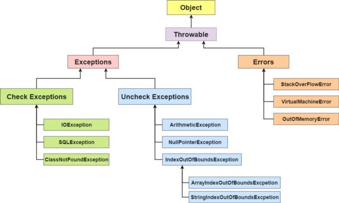

# Java Exception Handling

**Content**

[1. Introduction](#1-introduction)

[2. Throwing and Catching Exceptions](#2-throwing-and-catching-exceptions)

[3. How JVM Handles an Exception(Default Exception Handling)](#3-how-jvm-handles-an-exceptiondefault-exception-handling)

[4. Java Exception Handling Keywords](#4-java-exception-handling-keywords)

[5. Java Exception Hierarchy](#5-java-exception-hierarchy)

[6. The common exception scenarios in Java:](#6-the-common-exception-scenarios-in-java)

[7. Java 7 Automatic Resource Management and Catch block improvements](#7-java-7-automatic-resource-management-and-catch-block-improvements)

[8. References](#8-references)

# 1. Introduction

-   An *exception* is an error event that can happen during the execution of a program and disrupts its normal flow.
-   Java provides a robust and object-oriented way to handle exception scenarios known as Java Exception Handling.
-   Exceptions in Java can arise from different kinds of situations such as wrong data entered by the user, hardware failure, network connection failure, or a database server that is down.
-   The code that specifies what to do in specific exception scenarios is called exception handling.

# 2. Throwing and Catching Exceptions

-   Java creates an *exception object* when an error occurs while executing a statement.
-   The exception object contains a lot of debugging information such as method hierarchy, line number where the exception occurred, and type of exception.
-   If an exception occurs in a method, the process of creating the exception object and handing it over to the runtime environment is called *“throwing the exception”*.
-   The normal flow of the program halts and the Java Runtime Environment (JRE) tries to find the handler for the exception.
-   Exception Handler is the block of code that can process the exception object.
1.  The logic to find the exception handler begins with searching in the method where the error occurred.
2.  If no appropriate handler is found, then it will move to the caller method.
3.  And so on.
-   So if the method’s call stack is A-\>B-\>C and an exception is raised in method C, then the search for the appropriate handler will move from C-\>B-\>A.
-   If an appropriate exception handler is found, the exception object is passed to the handler to process it.
-   The handler is said to be *“catching the exception”*.
-   If there is no appropriate exception handler, found then the program terminates and prints information about the exception to the console.
-   Java Exception handling framework is used to handle runtime errors only.
-   The compile-time errors have to be fixed by the developer writing the code else the program won’t execute.

# 3. How JVM Handles an Exception(Default Exception Handling)

-   If an exception is encountered inside the method, it creates an object called the Exception Object.
-   The object is then transferred to the run-time system or JVM.
-   The object contains all the information of the exception, starting from name and description of the exception, and the current state of the exception.
-   Various methods might be called where the exception occurred, the ordered list of these methods is known as Call Stack.

After this, the following will happen:

-   The JVM searches the call stack to look for the method that contains the code to handle the occurred exception, this block of code is known as an Exception handler.
-   Now the JVM looks for the method where the exception took place.
-   If the JVM finds an appropriate handler, it passes the exception method to the handler.
-   If the JVM is unable to find an appropriate handler, it sends the object to the default exception handler, which prints a default message and terminates the abnormality.

**Code to explain Exception handling by JVM:**

```java
package com.DataFlair.exceptions;
public class exception
{
public static void main(String args[]){
String str = null;
System.out.println(str.length());
}
}
```

**The output of the above code:**

```
java.lang.NullPointerException
at com.DataFlair.exceptions.exception.main(exception.java:7)
at com.DataFlair.exceptions.__SHELL0.run(__SHELL0.java:6)
at java.base/jdk.internal.reflect.NativeMethodAccessorImpl.invoke0(Native Method)
at java.base/jdk.internal.reflect.NativeMethodAccessorImpl.invoke(NativeMethodAccessorImpl.java:62)
at java.base/jdk.internal.reflect.DelegatingMethodAccessorImpl.invoke(DelegatingMethodAccessorImpl.java:43)
at java.base/java.lang.reflect.Method.invoke(Method.java:566)
at bluej.runtime.ExecServer$3.lambda$run$0(ExecServer.java:849)
at bluej.runtime.ExecServer.runOnTargetThread(ExecServer.java:964)
at bluej.runtime.ExecServer$3.run(ExecServer.java:846)
```

# 4. Java Exception Handling Keywords

-   Java provides specific keywords for exception handling purposes.

## 4.1 try-catch

-   We use the try-catch block for exception handling in our code.
-   try is the start of the block and catch is at the end of the try block to handle the exceptions.
-   We can have multiple catch blocks with a try block.
-   The try-catch block can be nested too.
-   The catch block requires a parameter that should be of type Exception.

## 4.2 finally

-   The finally block is optional and can be used only with a try-catch block.
-   Since exception halts the process of execution, we might have some resources open that will not get closed, so we can use the finally block.
-   The finally block always gets executed, whether an exception occurred or not.

## 4.3 Throw

-   We know that if an error occurs, an exception object is getting created and then Java runtime starts processing to handle them.
-   Sometimes we might want to generate exceptions explicitly in our code.
-   For example, in a user authentication program, we should throw exceptions to clients if the password is null.
-   The throw keyword is used to throw exceptions to the runtime to handle it.

## 4.4 Throws

-   When we are throwing an exception in a method and not handling it, then we have to use the throws keyword in the method signature to let the caller program know the exceptions that might be thrown by the method.
-   The caller method might handle these exceptions or propagate them to its caller method using the throws keyword.
-   We can provide multiple exceptions in the throws clause, and it can be used with the main() method also.

## 4.5 An Exception Handling Example:

```java
package com.journaldev.exceptions;
import java.io.FileNotFoundException;
import java.io.IOException;
public class ExceptionHandling {
	public static void main(String[] args) throws FileNotFoundException, IOException {
		try {
			testException(-5);
			testException(-10);
		} catch(FileNotFoundException e) {
			e.printStackTrace();
		} catch(IOException e) {
			e.printStackTrace();
		} finally {
			System.out.println("Releasing resources");
		}
		testException(15);
	}
	public static void testException(int i) throws FileNotFoundException, IOException {
		if (i < 0) {
			FileNotFoundException myException = new FileNotFoundException("Negative Integer " + i);
			throw myException;
		} else if (i > 10) {
			throw new IOException("Only supported for index 0 to 10");
		}
	}
}
```

**Explanation:**

-   The testException() method is throwing exceptions using the throw keyword.
-   The method signature uses the throws keyword to let the caller know the type of exceptions it might throw.
-   In the main() method, I am handling exceptions using the try-catch block in the main() method.
-   When I am not handling it, I am propagating it to runtime with the throws clause in the main() method.
-   The testException(-10) never gets executed because of the exception and then the finally block is executed.
-   The printStackTrace() is one of the useful methods in the Exception class for debugging purposes.

**This code will output the following:**

```
java.io.FileNotFoundException: Negative Integer -5
	at com.journaldev.exceptions.ExceptionHandling.testException(ExceptionHandling.java:24)
	at com.journaldev.exceptions.ExceptionHandling.main(ExceptionHandling.java:10)
Releasing resources
Exception in thread "main" java.io.IOException: Only supported for index 0 to 10
	at com.journaldev.exceptions.ExceptionHandling.testException(ExceptionHandling.java:27)
	at com.journaldev.exceptions.ExceptionHandling.main(ExceptionHandling.java:19)
```

**Some important points to note:**

-   We can’t have catch or finally clause without a try statement.
-   A try statement should have either catch block or finally block, it can have both blocks.
-   We can’t write any code between try-catch-finally blocks.
-   We can have multiple catch blocks with a single try statement.
-   try-catch blocks can be nested similar to if-else statements.
-   We can have only one finally block with a try-catch statement.

# 5. Java Exception Hierarchy

-   As stated earlier, when an exception is raised an exception object is getting created.
-   Java Exceptions are hierarchical and inheritance is used to categorize different types of exceptions.
-   In java, the exceptions are present in the java.lang.Throwable class.
-   **Throwable** is the parent class of Java Exceptions Hierarchy and it has two child objects: **Error** and **Exception**, which are further inherited by other subclasses.
-   The hierarchy of the Throwable class is:

    

**Types of Java Exceptions:**

-   There are mainly two types of exceptions Checked and Unchecked Exceptions, but according to Oracle there are actually three types of exceptions:  
    1\. Checked Exception  
    2\. Unchecked Exception  
    3\. Error

## 5.1 Errors

-   Errors are exceptional scenarios that are out of the scope of application, and it’s not possible to anticipate and recover from them.
-   For example, hardware failure, Java virtual machine (JVM) crash, or out-of-memory error.
-   That’s why we have a separate hierarchy of Errors and we should not try to handle these situations.
-   Some of the common Errors are OutOfMemoryError and StackOverflowError.

## 5.2 Checked Exceptions

-   The exception classes which directly inherit from the Throwable class with an exception of RuntimeException and Error are checked exceptions.
-   They are checked during compilation time.
-   For example: IOException, SQLException, ClassnotFound, FileNotFoundException. etc.
-   Checked Exceptions are exceptional scenarios that we can anticipate in a program and try to recover from it.
-   We should catch this exception and provide a useful message to the user and log it properly for debugging purposes.
-   The Exception is the parent class of all Checked Exceptions.
-   If we are throwing a Checked Exception, we must catch it in the same method, or we have to propagate it to the caller using the throws keyword.

## 5.3 Runtime / Unchecked Exception:

-   Runtime Exceptions are caused by bad programming.
-   For example, trying to retrieve an element from an array.
-   We should check the length of the array first before trying to retrieve the element otherwise it might throw ArrayIndexOutOfBoundException at runtime.
-   RuntimeException is the parent class of all Runtime Exceptions.
-   If we are throwing any Runtime Exception in a method, it’s not required to specify them in the method signature throws clause.
-   Runtime exceptions can be avoided with better programming.
-   The exception classes inheriting the RuntimeException class are unchecked exceptions.
-   They are not checked at compilation time but during runtime.
-   For example: ArithmeticException, IndexOutOfBOundException, etc.

**Some useful methods of Exception Classes**

-   Java Exception and all of its subclasses don’t provide any specific methods, and all of the methods are defined in the base class - Throwable.
-   The Exception classes are created to specify different kinds of Exception scenarios so that we can easily identify the root cause and handle the Exception according to its type.
-   The Throwable class implements the Serializable interface for interoperability.

**Some of the useful methods of the Throwable class are:**

**1) public String getMessage()**

-   This method returns the message String of Throwable and the message can be provided while creating the exception through its constructor.

**2) public String getLocalizedMessage()**

-   This method is provided so that subclasses can override it to provide a locale-specific message to the calling program.
-   The Throwable class implementation of this method uses the getMessage() method to return the exception message.

**3) public synchronized Throwable getCause()**

-   This method returns the cause of the exception or null if the cause is unknown.

**4) public String toString()**

-   This method returns the information about Throwable in String format, the returned String contains the name of the Throwable class and localized message.

**5) public void printStackTrace()**:

-   This method prints the stack trace information to the standard error stream, this method is overloaded, and we can pass PrintStream or PrintWriter as an argument to write the stack trace information to the file or stream.

# 6. The common exception scenarios in Java:

**1. SQLException:**

-   Using invalid SQL queries in the java program might lead to this kind of exception.

**2. IOException:**

-   Whenever the JVM fails to open the IO stream, this exception is thrown by the JVM.

**3. ClassNotFoundException:**

-   If we try to access a class that does not exist or has been deleted from the path, the JVM throws this error.

**4. ArithmeticException:**

-   Dividing a number by zero will give an ArithmeticException, as we all know anything divided by zero is infinite.

**Code to illustrate ArithmeticException:**

```java
package com.DataFlair.exceptions;
public class exception
{
public static void main(String args[])
{
int exp = 50/0;
System.out.println("This is an Arithmetic Exception: " + exp);
}
}
```

**The output of the above Code:**

```
java.lang.ArithmeticException: / by zero
at com.DataFlair.exceptions.exception.main(exception.java:6)
at com.DataFlair.exceptions.__SHELL0.run(__SHELL0.java:6)
at java.base/jdk.internal.reflect.NativeMethodAccessorImpl.invoke0(Native Method)
at java.base/jdk.internal.reflect.NativeMethodAccessorImpl.invoke(NativeMethodAccessorImpl.java:62)
at java.base/jdk.internal.reflect.DelegatingMethodAccessorImpl.invoke(DelegatingMethodAccessorImpl.java:43)
at java.base/java.lang.reflect.Method.invoke(Method.java:566)
at bluej.runtime.ExecServer$3.lambda$run$0(ExecServer.java:849)
at bluej.runtime.ExecServer.runOnTargetThread(ExecServer.java:964)
at bluej.runtime.ExecServer$3.run(ExecServer.java:846)
```

**5. NullPointerException:**

-   Trying to find the length of a null string is an example of this kind of exception.
-   We all know that null doesn’t have a physical memory assigned to it, thus it doesn’t have a length. So, it will give a NullPointerException.

**Code to explain NullPointerException:**

```java
package com.DataFlair.exceptions;
public class exception
{
public static void main(String args[])
{
String str= null;
System.out.println(str.length());
}
}
```

**The output of the above code:**

```
java.lang.NullPointerException
at com.DataFlair.exceptions.exception.main(exception.java:7)
at com.DataFlair.exceptions.__SHELL1.run(__SHELL1.java:6)
at java.base/jdk.internal.reflect.NativeMethodAccessorImpl.invoke0(Native Method)
at java.base/jdk.internal.reflect.NativeMethodAccessorImpl.invoke(NativeMethodAccessorImpl.java:62)
at java.base/jdk.internal.reflect.DelegatingMethodAccessorImpl.invoke(DelegatingMethodAccessorImpl.java:43)
at java.base/java.lang.reflect.Method.invoke(Method.java:566)
at bluej.runtime.ExecServer$3.lambda$run$0(ExecServer.java:849)
at bluej.runtime.ExecServer.runOnTargetThread(ExecServer.java:964)
at bluej.runtime.ExecServer$3.run(ExecServer.java:846)
```

**6. NumberFormatException:**

-   
-   If we declare a variable as a string with multiple characters and try to convert it into a digit, it will give a NumberFormatException.

**Code to Explain NumberFormatException:**

```java
package com.DataFlair.exceptions;
public class exception
{
public static void main(String args[])
{
String str= "DataFlair";
int num=Integer.parseInt(str);
System.out.println(num);
}
}
```

**The output of the above code:**

```
java.lang.NumberFormatException: For input string: “DataFlair”
at java.base/java.lang.NumberFormatException.forInputString(NumberFormatException.java:65)
at java.base/java.lang.Integer.parseInt(Integer.java:652)
at java.base/java.lang.Integer.parseInt(Integer.java:770)
at com.DataFlair.exceptions.exception.main(exception.java:7)
at com.DataFlair.exceptions.__SHELL2.run(__SHELL2.java:6)
at java.base/jdk.internal.reflect.NativeMethodAccessorImpl.invoke0(Native Method)
at java.base/jdk.internal.reflect.NativeMethodAccessorImpl.invoke(NativeMethodAccessorImpl.java:62)
at java.base/jdk.internal.reflect.DelegatingMethodAccessorImpl.invoke(DelegatingMethodAccessorImpl.java:43)
at java.base/java.lang.reflect.Method.invoke(Method.java:566)
at bluej.runtime.ExecServer$3.lambda$run$0(ExecServer.java:849)
at bluej.runtime.ExecServer.runOnTargetThread(ExecServer.java:964)
at bluej.runtime.ExecServer$3.run(ExecServer.java:846)
```

**7. ArrayIndexOutOfBOundException:**

-   This is the most common exception that occurs in a program.
-   Programmers often forget the size of the array and call for an index that is larger than the size of the array, causing ArrayIndexOutOfBoundException.

**Code to Explain ArrayIndexOutOfBOundException:**

```java
package com.DataFlair.exceptions;
public class exception
{
public static void main(String args[])
{
int num[]=new int[50];
num[100]=1000;
System.out.println(num[100]);
}
}
```

**The output of the above code:**

```
java.lang.ArrayIndexOutOfBoundsException: Index 100 out of bounds for length 50
at com.DataFlair.exceptions.exception.main(exception.java:7)
at com.DataFlair.exceptions.__SHELL3.run(__SHELL3.java:6)
at java.base/jdk.internal.reflect.NativeMethodAccessorImpl.invoke0(Native Method)
at java.base/jdk.internal.reflect.NativeMethodAccessorImpl.invoke(NativeMethodAccessorImpl.java:62)
at java.base/jdk.internal.reflect.DelegatingMethodAccessorImpl.invoke(DelegatingMethodAccessorImpl.java:43)
at java.base/java.lang.reflect.Method.invoke(Method.java:566)
at bluej.runtime.ExecServer$3.lambda$run$0(ExecServer.java:849)
at bluej.runtime.ExecServer.runOnTargetThread(ExecServer.java:964)
at bluej.runtime.ExecServer$3.run(ExecServer.java:846)
```

**8. IllegalArgumentException:**

-   IllegalArgument Exception is thrown when we pass an incorrect argument into a method.

**Code to explain IllegalArgumentException:**

```java
package com.DataFlair.exceptions;
public class exception
{
public static void main(String[] args)
{
Thread t1 = new Thread(new Runnable() {
public void run()
{
try {
Thread.sleep(-10);
}
catch (InterruptedException e) {
e.printStackTrace();
}
System.out.println("DataFlair");
}
});
t1.setName("Test Thread");
t1.start();
}
}
```

**The output of the above code:**

```
Exception in thread “Test Thread” java.lang.IllegalArgumentException: timeout value is negative
at java.base/java.lang.Thread.sleep(Native Method)
at com.DataFlair.exceptions.exception$1.run(exception.java:10)
at java.base/java.lang.Thread.run(Thread.java:834)
```

**9. IllegalStateException:**

-   If we call a method at the wrong time, we get the IllegalStateException.
-   It means that the state of the environment does not meet the operation.

**Code to understand IllegalStateException:**

```java
package com.DataFlair.exceptions;
import java.util.ArrayList;
import java.util.ListIterator;
public class exception
{
public static void main(String args[]) {
ArrayList<String> list = new ArrayList<String>();
list.add("Data");
list.add("Flair");
ListIterator<String> it = list.listIterator();
it.remove();//Removing element without moving the first position.
}
}
```

**The output of the above code:**

```
java.lang.IllegalStateException
at java.base/java.util.ArrayList$Itr.remove(ArrayList.java:1009)
at com.DataFlair.exceptions.exception.main(exception.java:11)
at com.DataFlair.exceptions.__SHELL0.run(__SHELL0.java:6)
at java.base/jdk.internal.reflect.NativeMethodAccessorImpl.invoke0(Native Method)
at java.base/jdk.internal.reflect.NativeMethodAccessorImpl.invoke(NativeMethodAccessorImpl.java:62)
at java.base/jdk.internal.reflect.DelegatingMethodAccessorImpl.invoke(DelegatingMethodAccessorImpl.java:43)
at java.base/java.lang.reflect.Method.invoke(Method.java:566)
at bluej.runtime.ExecServer$3.lambda$run$0(ExecServer.java:849)
at bluej.runtime.ExecServer.runOnTargetThread(ExecServer.java:964)
at bluej.runtime.ExecServer$3.run(ExecServer.java:846)
```

# 7. Java 7 Automatic Resource Management and Catch block improvements

-   If you are catching a lot of exceptions in a single try block, you will notice that the catch block code mostly consists of redundant code to log the error.
-   In Java 7, one of the features was an improved catch block where we can catch multiple exceptions in a single catch block.
-   Here is an example of the catch block with this feature:

```java
catch (IOException | SQLException ex) {
logger.error(ex);
throw new MyException(ex.getMessage());
}
```

-   There are some constraints such as the exception object is final and we can’t modify it inside the catch block, read the full analysis at Java 7 Catch Block Improvements.
-   Most of the time, we use the finally block just to close the resources.
-   Sometimes we forget to close them and get runtime exceptions when the resources are exhausted.
-   These exceptions are hard to debug, and we might need to look into each place where we are using that resource to make sure we are closing it.
-   In Java 7, one of the improvements was try-with-resources where we can create a resource in the try statement itself and use it inside the try-catch block.
-   When the execution comes out of the try-catch block, the runtime environment automatically closes these resources.
-   Here is an example of the try-catch block with this improvement

```java
try (MyResource mr = new MyResource()) {
System.out.println("MyResource created in try-with-resources");
} catch (Exception e) {
e.printStackTrace();
}
```

# 8. References

1.  https://www.digitalocean.com/community/tutorials/exception-handling-in-java
2.  https://data-flair.training/blogs/java-exception/
