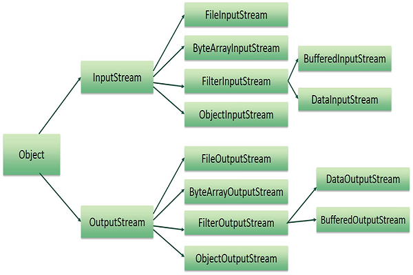

# File operations in Java

**Content**

[1. File operations in Java](#1-file-operations-in-java)

[1.1 Create a File](#11-create-a-file)

[1.2 Read from a File](#12-read-from-a-file)

[1.3 Write to a File](#13-write-to-a-file)

1.4 Delete a File

2\. References

# 1. File operations in Java

The following are the several operations that can be performed on a file in Java :

-   **Create a File**
-   **Read from a File**
-   **Write to a File**
-   **Delete a File**

Now let us study each of the above operations in detail.

## 1.1 Create a File

-   In order to create a file in Java, you can use the createNewFile() method.
-   If the file is successfully created, it will return a Boolean value true and false if the file already exists.
-   Following is a demonstration of how to create a file in Java :

```java
// Import the File class
import java.io.File;
// Import the IOException class to handle errors
import java.io.IOException;
public class Sample1 {
    public static void main(String[] args) {
        try {
            File Obj = new File("myfile.txt");
            if (Obj.createNewFile()) {
                System.out.println("File created: " + Obj.getName());
            }
            else {
                System.out.println("File already exists.");
            }
        }
        catch (IOException e) {
            System.out.println("An error has occurred.");
            e.printStackTrace();
        }
    }
}
```

**Output**

```
An error has occurred.
```

-   Here is a hierarchy of classes to deal with Input and Output streams.

## 

## 1.2 Read from a File

-   We will use the Scanner class in order to read contents from a file.
-   Following is a demonstration of how to read contents from a file in Java :

```java
/ Import the File class
import java.io.File;
// Import this class for handling errors
import java.io.FileNotFoundException;
// Import the Scanner class to read content from text files
import java.util.Scanner;
public class GFG {
    public static void main(String[] args) {
        try {
            File Obj = new File("myfile.txt");
            Scanner Reader = new Scanner(Obj);
            while (Reader.hasNextLine()) {
                String data = Reader.nextLine();
                System.out.println(data);
            }
            Reader.close();
        }
        catch (FileNotFoundException e) {
            System.out.println("An error has occurred.");
            e.printStackTrace();
        }
    }
}
```

**Output**

```
An error has occurred.
```

## 1.3 Write to a File

-   We use the FileWriter class along with its write() method in order to write some text to the file.
-   Following is a demonstration of how to write text to a file in Java :

```java
// Import the FileWriter class
import java.io.FileWriter;
// Import the IOException class for handling errors
import java.io.IOException;
public class GFG {
    public static void main(String[] args) {
        try {
            FileWriter Writer = new FileWriter("myfile.txt");
            Writer.write("Files in Java are seriously good!!");
            Writer.close();
            System.out.println("Successfully written.");
        }
        catch (IOException e) {
            System.out.println("An error has occurred.");
            e.printStackTrace();
        }
    }
}
```

**Output**

An error has occurred.

## 1.4 Delete a File

-   We use the delete() method in order to delete a file.
-   Following is a demonstration of how to delete a file in Java :

```java
// Import the File class
import java.io.File;
public class GFG {
    public static void main(String[] args) {
        File Obj = new File("myfile.txt");
        if (Obj.delete()) {
            System.out.println("The deleted file is : " + myObj.getName());
        }
        else {
            System.out.println("Failed in deleting the file.");
        }
    }
}
```

**Output**

```
Failed in deleting the file.
```

# 2. References

1.  https://www.geeksforgeeks.org/file-handling-in-java/
