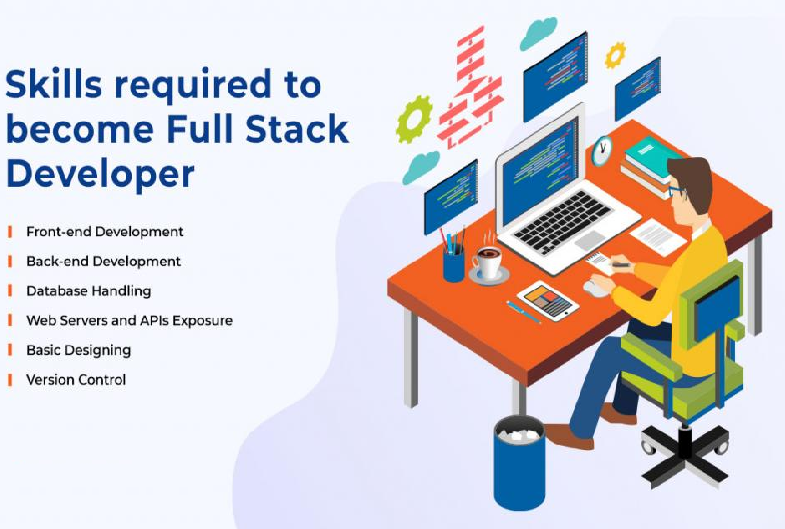
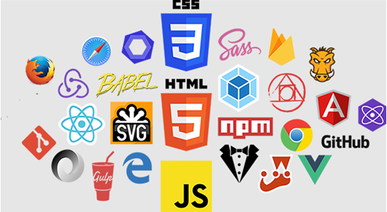
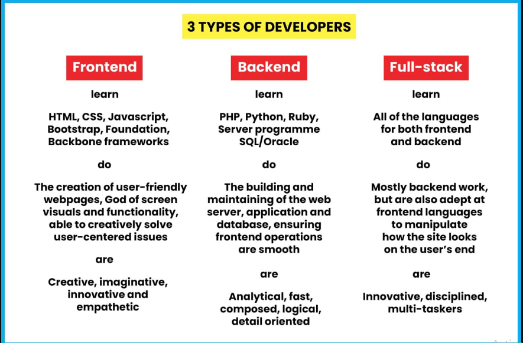
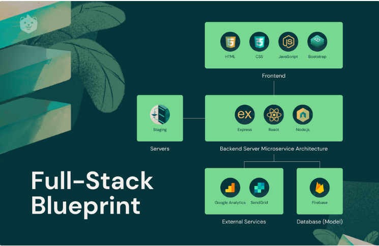

## Full Stack Web Development: The Big Picture

## What is Full-stack Development?

-   The development of both front end (client-side) and back end (server-side) portions of web applications.

## Who is a Full-stack web developer?

-   A Full-stack web developer is a developer or an engineer who works with both the frontend and backend of a software application.

## What are Skills Required to Become Full-stack web developer?

## What is a Frontend Development (client-side)?

-   A front-end developer must have experience working with HTML and CSS as well as the scripting language, JavaScript on the client-side.
-   The goal of a frontend developer is to provide an interactive platform.
-   A front-end developer could include user experience design and user interface design, skills that help a team evaluate the best methods of displaying and collecting information.
-   **Front end Languges:** HTML, CSS, Bootstrap, JavaScript, ES5, HTML DOM, JSON, XML, jQuery, Angular, React, Vue, Backbone.js, Ember.js, Redux, Storybook, GraphQL, Meteor.js, Grunt, Gulp etc.

    

## What is a Backend Development (server-side)?

-   The server-side development of a web application is primary focus on how the website works.
-   It is responsible for the Creation, edit/update, and recollection of data
-   **Back end Languages:** PHP, ASP, C++, C\#, Java, Python, Node.js, Express.js, Ruby, REST, GO, SQL, MongoDB, Firebase, Sass, Less, PaaS (AWS, GCP, Azure, and Heroku), etc.

    ****

**Note:** A typical software application mainly consists of three parts front end, back end, and database.

## FrontEnd vs BackEnd vs Fullstack

****

## FULL STACK: THE BIG PICTURE

## Popular Stacks:

**MEAN Stack:** MongoDB, Express, AngularJS, and Node.js.  
**MERN Stack:** MongoDB, Express, ReactJS, and Node.js  
**Django Stack:** Django, Python, and MySQL as Database.  
**Rails or Ruby on Rails:** Uses Ruby, PHP, and MySQL.  
**LAMP Stack:** Linux, Apache, MySQL, and PHP.

## Advantages of Full Stack

-   You can master all the techniques involved in a development project.
-   You can make a prototype very rapidly.
-   You can provide help to all the team members.
-   You can reduce the cost of the project.
-   You can reduce the time used for team communication.
-   You can switch between front and back end development based on requirements.
-   You can better understand all aspects of new and upcoming technologies.

## Disadvantages of Full Stack

-   The solution chosen can be wrong for the project.
-   The solution chosen can be dependent on developer skills.
-   The solution can generate a key person risk.
-   Being a full stack developer is increasingly complex.

.
