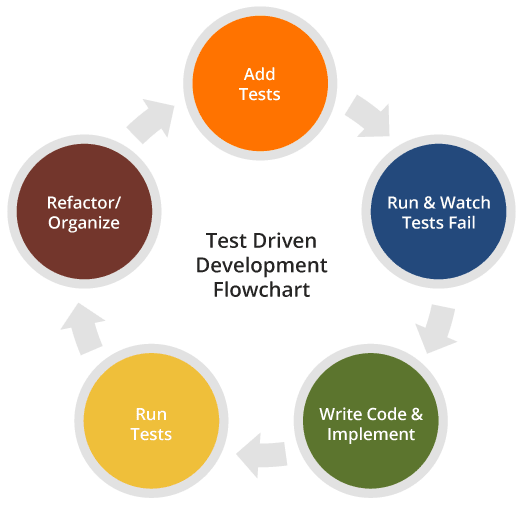

**Introduction**

When we first started learning programming, what we'd normally do is write code, run the program. Then conduct tests by entering some inputs hoping that the output is as we desired. If not, we go back writing our code again and fixing bugs.

Well, there's nothing wrong with that. In fact, for your entire life as a programmer you'd be doing all these three things:

1.  **write** code
2.  **run** the program
3.  **test** the behavior of your program

Then repeat again

But you won't always be writing simple console applications. Sooner or later, you'll find yourself doing repetitive tests with slightly varying inputs.

In the real world where you'd be dealing with much much bigger and more complex software, doing those three things every time will be **very time consuming**. There will also be cases where you need to isolate your changes and just **test a specific part** rather than the whole system.

## What is Unit testing?

So instead of running and testing your entire program every time you have to a change in your code, we can automate it by **writing code to test our code**. More specifically, write code that would test a single part of the system isolated from everything else. That's unit testing.

### An analogy

For example, you are building a house and you need some light bulbs. So you go to the store and buy a light bulb. In order to make sure that the light bulb you just bought works, you need to test it.

But the good thing about it is that it's independent of your house. You can test it by itself. No need to actually install it in your house and see if it lights up. Instead, you or the sales assistant can install it to a test bulb socket (found in most hardware or appliance stores) and see if it lights up. You are essentially **testing** a single **unit** of a light bulb which is meant to be part of your house (i.e. the entire system) under construction.

Imagine if it wasn't possible to test the light bulb alone. You have to go back to your house first, finish building it, install the light bulbs and test if it actually switches on. Quite a hassle, isn't it?

# Test-Driven Development vs. Behavior Driven Development

*by Thejasree Prakash*

Chances are you have heard of Test-Driven development (TDD) and Behavior-Driven Development (BDD) in software development. Below are definitions of both of these practices, including the major differences between the two.

## Test-Driven Development (TDD)

TDD is a software development technique that involves writing automated test cases prior to writing functional pieces of the code. This is popular in agile methodologies as it drives delivering a shippable product at the end of a sprint.

#### **This process can be divided into multiple steps:**

1.  A developer, based on requirement documents, writes an automated test case.
2.  The development team runs these automated test scripts against what is currently developed and the tests fail, as they should since none of the features have been implemented yet.
3.  development team functional code to ensure the automated test script gives them a green light.
4.  The development team can then refactor and organize the code to produce a tested deliverable at the end of the sprint.
-   

Test cases are mostly written in programming languages such as Java, Ruby, etc., and can be written using test automation tools such as Selenium, Watir, Windmill, etc. Since test scripts are written in programming languages, it is hard for a business analyst or test owner to verify the test scripts.

## Behavior Driven Development (BDD)

BDD is a software development technique that defines the user behavior prior to writing test automation scripts or the functional pieces of code.

#### **Used in an agile sprint, this method ensures that a shippable product is generated at the end of a sprint. This involves:**

1.  The behavior of the user is defined by a product owner/business analyst/QA in simple English.
2.  These are then converted to automated scripts to run against functional code.
3.  The development team then starts writing the functional code to ensure the automated test script gives them a green light.
4.  The development team can then refactor and organize the code to produce a tested deliverable at the end of the sprint.

BDD can be driven by multiple tools such as Cucumber, FitNesse, PowerTools, Docker, and others. The test scripts are written in plain English in Gherkin, and Wiki frameworks. Since the behavior is defined in English, it gives a common ground for ALL stakeholders involved in the project. This reduces the risk of developing code that wouldn’t stand up to the accepted behavior of the user.

*BDD explains the behavior of an application for the end-user while TDD focuses on how functionality is implemented. \#Dev*  
[Click To Tweet](https://twitter.com/intent/tweet?text=BDD%20explains%20the%20behavior%20of%20an%20application%20for%20the%20end%20user%20while%20TDD%20focuses%20on%20how%20functionality%20is%20implemented.%20%23Dev&via=46383764248a1145f8f50c3378e625a9&related=46383764248a1145f8f50c3378e625a9&url=https://www.glowtouch.com/?p=4346)

## TDD vs. BDD

1.  BDD is in a more readable format by every stakeholder since it is in English. Unlike TDD, test cases are written in programming languages such as Ruby and Java.
2.  BDD explains the behavior of an application for the end-user while TDD focuses on how functionality is implemented. Changes in functionality can be accommodated with less impact in BDD as opposed to TDD.
3.  BDD enables all the stakeholders to be on the same page with requirements which makes acceptance easy, as opposed to TDD.

The behavior of the application is the central idea in BDD; it focuses on the customer and pushes developers and testers to walk in the customer’s shoes. If actions do not affect the end-user, BDD might not represent such a scenario very well. If so, TDD serves the purpose better.

Like many other software development practices, it might not be feasible to identify what works for all projects universally. For systems that are driven by the actions of the end-user such as an eCommerce website or an HR system, BDD acts as a good medium to capture all the user actions. For systems that have third-party API calls, cron jobs, or data exports/imports, TDD might be the better solution.

References

1.https://dev.to/gervg/step-by-step-introduction-to-unit-testing-in-java-3ae7

2.https://www.glowtouch.com/test-driven-development-vs-behavior-driven-development/
