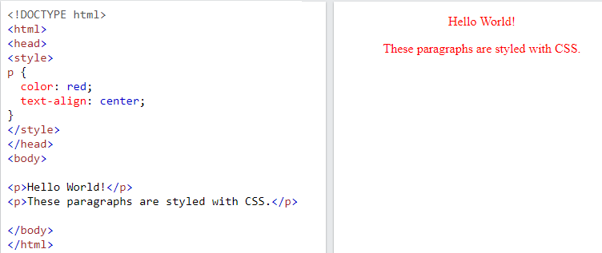

## Overview of CSS

**Content**

1\. What is CSS?

2\. Why Use CSS?

3\. CSS Solved a Big Problem

4\. CSS Saves a Lot of Work!

5\. CSS Syntax

6\. References

## 1. What is CSS?

-   CSS stands for Cascading Style Sheets.
-   CSS is the language we use to style a Web page.
-   CSS describes how HTML elements are to be displayed on screen, paper, or in other media.
-   CSS saves a lot of work. It can control the layout of multiple web pages all at once.
-   External stylesheets are stored in CSS files.

## 2. Why Use CSS?

-   CSS is used to define styles for your web pages, including the design, layout and variations in display for different devices and screen sizes.

## 3. CSS Solved a Big Problem

-   HTML was NEVER intended to contain tags for formatting a web page!
-   HTML was created to describe the content of a web page, like:
-   \<h1\>This is a heading\</h1\>
-   \<p\>This is a paragraph.\</p\>
-   When tags like \<font\>, and color attributes were added to the HTML 3.2 specification, it started a nightmare for web developers. Development of large websites, where fonts and color information were added to every single page, became a long and expensive process.
-   To solve this problem, the World Wide Web Consortium (W3C) created CSS.
-   CSS removed the style formatting from the HTML page!

## 4. CSS Saves a Lot of Work!

-   The style definitions are normally saved in external .css files.
-   With an external style sheet file, you can change the look of an entire website by changing just one file!

# 5. CSS Syntax

-   A CSS rule consists of a selector and a declaration block.

**Syntax**

-   The selector points to the HTML element you want to style.
-   The declaration block contains one or more declarations separated by semicolons.
-   Each declaration includes a CSS property name and a value, separated by a colon.
-   Multiple CSS declarations are separated with semicolons, and declaration blocks are surrounded by curly braces.

**Example**

-   In this example all \<p\> elements will be center-aligned, with a red text color:

**Example Explained**

-   p is a selector in CSS (it points to the HTML element you want to style: \<p\>).
-   color is a property, and red is the property value
-   text-align is a property, and center is the property value

# 6. References

1.  <https://www.w3schools.com/css/css_intro.asp>
2.  https://www.w3schools.com/css/css_syntax.asp
