# CSS Properties

**Content**

**1. CSS Backgrounds**

**1.1 CSS background-color**

**1.2 CSS background-image**

**1.3 CSS Background Image Repeat**

1.3.1 CSS background-repeat

1.3.2 CSS background-repeat: no-repeat

1.3.3 CSS background-position

**1.4 CSS background-attachment**

**1.5 CSS background - Shorthand property**

**2. CSS Borders**

**2.1 CSS Border Style**

**2.2 border-width**

**2.3 CSS Border Color**

2.3.1 Specific Side Colors

2.3.1.1 HEX Values

2.3.1.2 RGB Values

2.3.1.3 HSL Values

**2.4 CSS Border Sides**

2.4.1 CSS Border - Individual Sides

**2.5 CSS Border - Shorthand Property**

2.5.1 Left Border

2.5.2 Bottom Border

**2.6 CSS Rounded Borders**

**3. CSS Margins**

**3.1 Margin - Individual Sides**

**3.2 Margin - Shorthand Property**

2\. References

# 1. CSS Backgrounds

-   The CSS background properties are used to add background effects for elements.

## 1.1 CSS background-color

-   The background-color property specifies the background color of an element.

**Example**

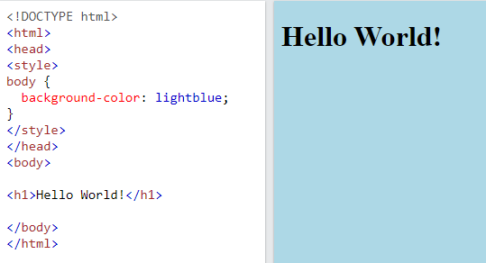

With CSS, a color is most often specified by:

-   a valid color name - like "red"
-   a HEX value - like "\#ff0000"
-   an RGB value - like "rgb(255,0,0)"

Look at [CSS Color Values](https://www.w3schools.com/cssref/css_colors_legal.asp) for a complete list of possible color values.

## 1.2 CSS background-image

-   The background-image property specifies an image to use as the background of an element.
-   By default, the image is repeated so it covers the entire element.

**Example**

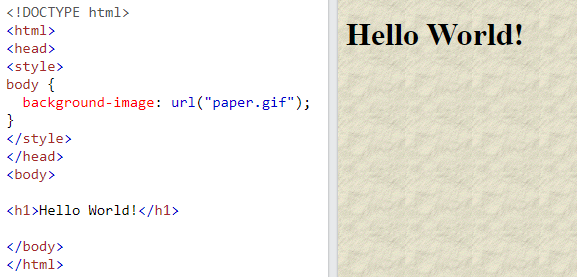

**Note:** When using a background image, use an image that does not disturb the text.

# 1.3 CSS Background Image Repeat

## 1.3.1 CSS background-repeat

-   By default, the background-image property repeats an image both horizontally and vertically.
-   Some images should be repeated only horizontally or vertically, or they will look strange, like this:

**Example**

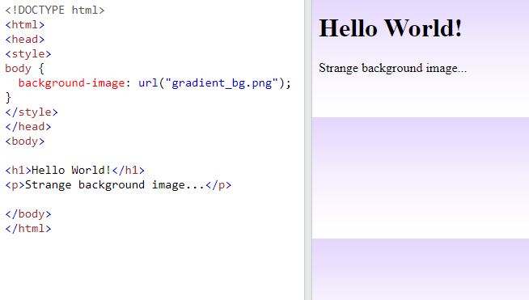

**Note:** To repeat an image vertically, set background-repeat: repeat-y;

## 1.3.2 CSS background-repeat: no-repeat

-   Showing the background image only once is also specified by the background-repeat property:

**Example**

-   Show the background image only once:

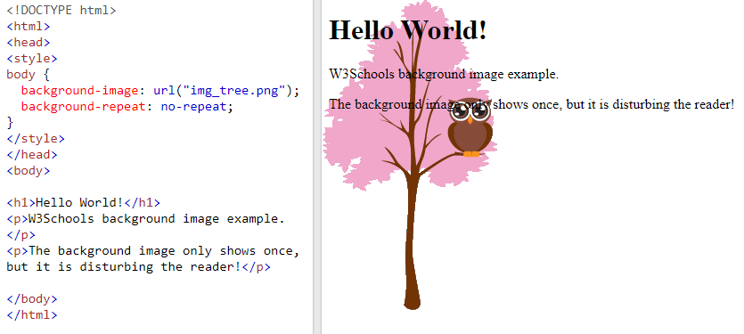

-   In the example above, the background image is placed in the same place as the text. We want to change the position of the image, so that it does not disturb the text too much.

## 1.3.3 CSS background-position

-   The background-position property is used to specify the position of the background image.

**Example**

-   Position the background image in the top-right corner:

body {  
background-image: url("img_tree.png");  
background-repeat: no-repeat;  
background-position: right top;  
}

**Output**

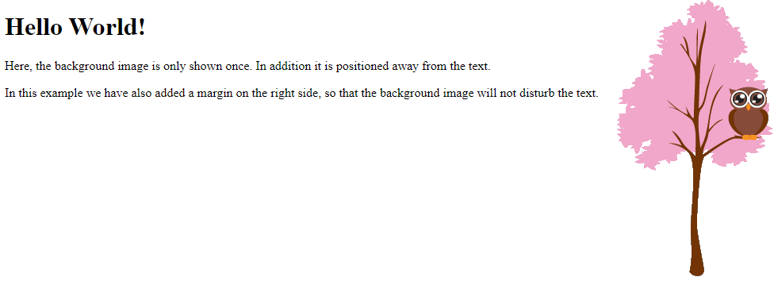

## 1.4 CSS background-attachment

-   The background-attachment property specifies whether the background image should scroll or be fixed (will not scroll with the rest of the page):

**Example**

-   Specify that the background image should be fixed:

body {  
background-image: url("img_tree.png");  
background-repeat: no-repeat;  
background-position: right top;  
background-attachment: fixed;

}

**Output**  
}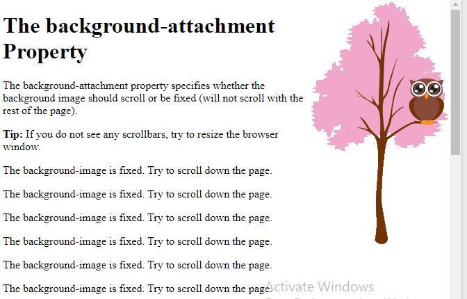

## 1.5 CSS background - Shorthand property

-   To shorten the code, it is also possible to specify all the background properties in one single property. This is called a shorthand property.

**Instead of writing:**

body {  
background-color: \#ffffff;  
background-image: url("img_tree.png");  
background-repeat: no-repeat;  
background-position: right top;  
}

**You can use the shorthand property background:**

**Example**

-   Use the shorthand property to set the background properties in one declaration:

body {  
background: \#ffffff url("img_tree.png") no-repeat right top;  
}

**Output**

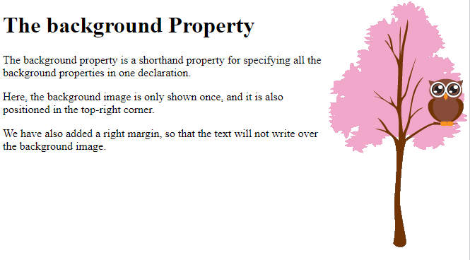

When using the shorthand property the order of the property values is:

-   background-color
-   background-image
-   background-repeat
-   background-attachment
-   background-position

It does not matter if one of the property values is missing, as long as the other ones are in this order. Note that we do not use the background-attachment property in the examples above, as it does not have a value.

# 2. CSS Borders

-   The CSS border properties allow you to specify the style, width, and color of an element's border.

**Example**

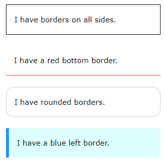

## 2.1 CSS Border Style

-   The border-style property specifies what kind of border to display.

The following values are allowed:

-   dotted - Defines a dotted border
-   dashed - Defines a dashed border
-   solid - Defines a solid border
-   double - Defines a double border
-   groove - Defines a 3D grooved border. The effect depends on the border-color value
-   ridge - Defines a 3D ridged border. The effect depends on the border-color value
-   inset - Defines a 3D inset border. The effect depends on the border-color value
-   outset - Defines a 3D outset border. The effect depends on the border-color value
-   none - Defines no border
-   hidden - Defines a hidden border

The border-style property can have from one to four values (for the top border, right border, bottom border, and the left border).

**Example**

-   Demonstration of the different border styles:

p.dotted {border-style: dotted;}  
p.dashed {border-style: dashed;}  
p.solid {border-style: solid;}  
p.double {border-style: double;}  
p.groove {border-style: groove;}  
p.ridge {border-style: ridge;}  
p.inset {border-style: inset;}  
p.outset {border-style: outset;}  
p.none {border-style: none;}  
p.hidden {border-style: hidden;}  
p.mix {border-style: dotted dashed solid double;}

**Output**

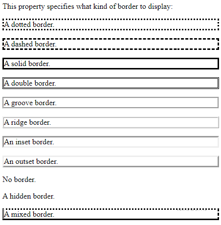

## 2.2 border-width

-   The **border-width** property specifies the width of the four borders.
-   The width can be set as a specific size (in px, pt, cm, em, etc) or by using one of the three pre-defined values: **thin, medium, or thick:**

**Example**

-   Demonstration of the different border widths:

p.one {  
border-style: solid;  
border-width: 5px;  
}

p.two {  
border-style: solid;  
border-width: medium;  
}

p.three {  
border-style: dotted;  
border-width: 2px;  
}

p.four {  
border-style: dotted;  
border-width: thick;  
}

**Output**

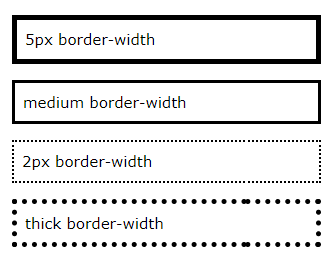

## 2.3 CSS Border Color

-   The border-color property is used to set the color of the four borders.

The color can be set by:

-   name - specify a color name, like "red"
-   HEX - specify a HEX value, like "\#ff0000"
-   RGB - specify a RGB value, like "rgb(255,0,0)"
-   HSL - specify a HSL value, like "hsl(0, 100%, 50%)"
-   transparent

**Note:** If border-color is not set, it inherits the color of the element.

**Example**

-   Demonstration of the different border colors:

p.one {  
border-style: solid;  
border-color: red;  
}

p.two {  
border-style: solid;  
border-color: green;  
}

p.three {  
border-style: dotted;  
border-color: blue;  
}

**Output**

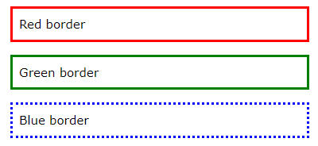

## 2.3.1 Specific Side Colors

-   The border-color property can have from one to four values (for the top border, right border, bottom border, and the left border).

**Example**

p.one {  
border-style: solid;  
border-color: red green blue yellow; /\* red top, green right, blue bottom and yellow left \*/  
}

**Output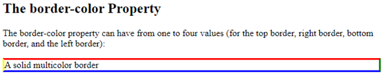**

## 2.3.1.1 HEX Values

The color of the border can also be specified using a hexadecimal value (HEX):

**Example**

p.one {  
border-style: solid;  
border-color: \#ff0000; /\* red \*/  
}

## 2.3.1.2 RGB Values

-   You can also use RGB values:

**Example**

p.one {  
border-style: solid;  
border-color: rgb(255, 0, 0); /\* red \*/  
}

## 2.3.1.3 HSL Values

-   You can also use HSL values:

**Example**

p.one {  
border-style: solid;  
border-color: hsl(0, 100%, 50%); /\* red \*/  
}

## 2.4 CSS Border Sides

## 2.4.1 CSS Border - Individual Sides

-   From the examples above, you have seen that it is possible to specify a different border for each side.
-   In CSS, there are also properties for specifying each of the borders (top, right, bottom, and left):

**Example**

p {  
border-top-style: dotted;  
border-right-style: solid;  
border-bottom-style: dotted;  
border-left-style: solid;  
}

**Output**

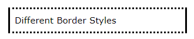

So, here is how it works:

If the border-style property has four values:

-   **border-style: dotted solid double dashed;**
    -   top border is dotted
    -   right border is solid
    -   bottom border is double
    -   left border is dashed

If the border-style property has three values:

-   **border-style: dotted solid double;**
    -   top border is dotted
    -   right and left borders are solid
    -   bottom border is double

If the border-style property has two values:

-   **border-style: dotted solid;**
    -   top and bottom borders are dotted
    -   right and left borders are solid

If the border-style property has one value:

-   **border-style: dotted;**
    -   all four borders are dotted

**Example**

/\* Four values \*/  
p {  
border-style: dotted solid double dashed;  
}

/\* Three values \*/  
p {  
border-style: dotted solid double;  
}

/\* Two values \*/  
p {  
border-style: dotted solid;  
}

/\* One value \*/  
p {  
border-style: dotted;  
}

**Output**

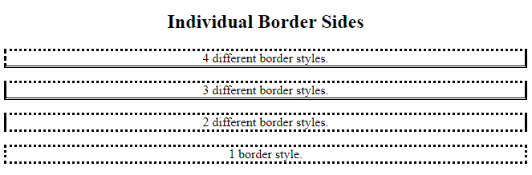

## 2.5 CSS Border - Shorthand Property

-   To shorten the code, it is also possible to specify all the individual border properties in one property.

The border property is a shorthand property for the following individual border properties:

-   border-width
-   border-style (required)
-   border-color

**Example**

p {  
border: 5px solid red;  
}

**Output**

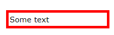

You can also specify all the individual border properties for just one side:

### 2.5.1 Left Border

**Example**

p {  
border-left: 6px solid red;  
}

**Output**

### 2.5.2 Bottom Border

**Example**

p {  
border-bottom: 6px solid red;  
}

**Output**

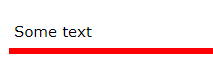

## 2.6 CSS Rounded Borders

-   The border-radius property is used to add rounded borders to an element:

**Example**

p {  
border: 2px solid red;  
border-radius: 5px;  
}

**Output**

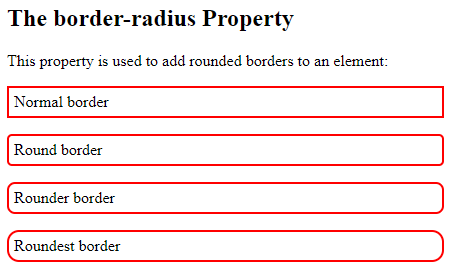

# 3. CSS Margins

-   The CSS margin properties are used to create space around elements, outside of any defined borders.
-   With CSS, you have full control over the margins. There are properties for setting the margin for each side of an element (top, right, bottom, and left).

## 3.1 Margin - Individual Sides

CSS has properties for specifying the margin for each side of an element:

-   margin-top
-   margin-right
-   margin-bottom
-   margin-left

All the margin properties can have the following values:

-   auto - the browser calculates the margin
-   *length* - specifies a margin in px, pt, cm, etc.
-   *%* - specifies a margin in % of the width of the containing element
-   inherit - specifies that the margin should be inherited from the parent element

**Note:** Negative values are allowed.

**Example**

-   Set different margins for all four sides of a \<p\> element:

p {  
margin-top: 100px;  
margin-bottom: 100px;  
margin-right: 150px;  
margin-left: 80px;  
}

**Output**

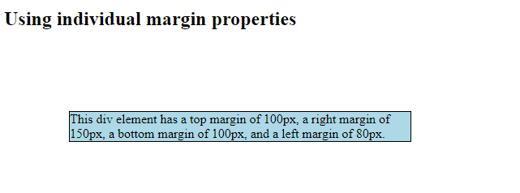

## 3.2 Margin - Shorthand Property

-   To shorten the code, it is possible to specify all the margin properties in one property.

The margin property is a shorthand property for the following individual margin properties:

-   margin-top
-   margin-right
-   margin-bottom
-   margin-left

So, here is how it works:

**If the margin property has four values:**

-   **margin: 25px 50px 75px 100px;**
    -   top margin is 25px
    -   right margin is 50px
    -   bottom margin is 75px
    -   left margin is 100px

**Example**

p {  
margin: 25px 50px 75px 100px;  
}

**If the margin property has three values:**

-   **margin: 25px 50px 75px;**
    -   top margin is 25px
    -   right and left margins are 50px
    -   bottom margin is 75px

**Example**

Use the margin shorthand property with three values:

p {  
margin: 25px 50px 75px;  
}

**If the margin property has two values:**

-   **margin: 25px 50px;**
    -   top and bottom margins are 25px
    -   right and left margins are 50px

**Example**

p {  
margin: 25px 50px;  
}

**If the margin property has one value:**

-   **margin: 25px;**
    -   all four margins are 25px

**Example**

p {  
margin: 25px;  
}

# CSS Padding

The CSS padding properties are used to generate space around an element's content, inside of any defined borders.

With CSS, you have full control over the padding. There are properties for setting the padding for each side of an element (top, right, bottom, and left).

## Padding - Individual Sides

CSS has properties for specifying the padding for each side of an element:

-   padding-top
-   padding-right
-   padding-bottom
-   padding-left

All the padding properties can have the following values:

-   *length* - specifies a padding in px, pt, cm, etc.
-   *%* - specifies a padding in % of the width of the containing element
-   inherit - specifies that the padding should be inherited from the parent element

**Note:** Negative values are not allowed.

### Example

Set different padding for all four sides of a \<div\> element:

div {  
padding-top: 50px;  
padding-right: 30px;  
padding-bottom: 50px;  
padding-left: 80px;  
}

## Padding - Shorthand Property

To shorten the code, it is possible to specify all the padding properties in one property.

The padding property is a shorthand property for the following individual padding properties:

-   padding-top
-   padding-right
-   padding-bottom
-   padding-left

So, here is how it works:

If the padding property has four values:

-   **padding: 25px 50px 75px 100px;**
    -   top padding is 25px
    -   right padding is 50px
    -   bottom padding is 75px
    -   left padding is 100px

### Example

Use the padding shorthand property with four values:

div {  
padding: 25px 50px 75px 100px;  
}

If the padding property has three values:

-   **padding: 25px 50px 75px;**
    -   top padding is 25px
    -   right and left paddings are 50px
    -   bottom padding is 75px

### Example

Use the padding shorthand property with three values:

div {  
padding: 25px 50px 75px;  
}

If the padding property has two values:

-   **padding: 25px 50px;**
    -   top and bottom paddings are 25px
    -   right and left paddings are 50px

### Example

Use the padding shorthand property with two values:

div {  
padding: 25px 50px;  
}

If the padding property has one value:

-   **padding: 25px;**
    -   all four paddings are 25px

### Example

Use the padding shorthand property with one value:

div {  
padding: 25px;  
}

# CSS Height, Width and Max-width

The CSS height and width properties are used to set the height and width of an element.

The CSS max-width property is used to set the maximum width of an element.

## CSS Setting height and width

The height and width properties are used to set the height and width of an element.

The height and width properties do not include padding, borders, or margins. It sets the height/width of the area inside the padding, border, and margin of the element.

## CSS height and width Values

The height and width properties may have the following values:

-   auto - This is default. The browser calculates the height and width
-   length - Defines the height/width in px, cm, etc.
-   % - Defines the height/width in percent of the containing block
-   initial - Sets the height/width to its default value
-   inherit - The height/width will be inherited from its parent value

## CSS height and width Examples

This element has a height of 200 pixels and a width of 50%

### Example

Set the height and width of a \<div\> element:

div {  
height: 200px;  
width: 50%;  
background-color: powderblue;  
}

This element has a height of 100 pixels and a width of 500 pixels.

### Example

Set the height and width of another \<div\> element:

div {  
height: 100px;  
width: 500px;  
background-color: powderblue;  
}

**Note:** Remember that the height and width properties do not include padding, borders, or margins! They set the height/width of the area inside the padding, border, and margin of the element!

## Setting max-width

The max-width property is used to set the maximum width of an element.

The max-width can be specified in *length values*, like px, cm, etc., or in percent (%) of the containing block, or set to none (this is default. Means that there is no maximum width).

The problem with the \<div\> above occurs when the browser window is smaller than the width of the element (500px). The browser then adds a horizontal scrollbar to the page.

Using max-width instead, in this situation, will improve the browser's handling of small windows.

**Tip:** Drag the browser window to smaller than 500px wide, to see the difference between the two divs!

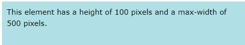

**Note:** If you for some reason use both the width property and the max-width property on the same element, and the value of the width property is larger than the max-width property; the max-width property will be used (and the width property will be ignored).

# CSS Text

## Text Color

The color property is used to set the color of the text. The color is specified by:

-   a color name - like "red"
-   a HEX value - like "\#ff0000"
-   an RGB value - like "rgb(255,0,0)"

Look at [CSS Color Values](https://www.w3schools.com/cssref/css_colors_legal.asp) for a complete list of possible color values.

The default text color for a page is defined in the body selector.

### Example

## body { color: blue; } h1 { color: green; }Text Color and Background Color

In this example, we define both the background-color property and the color property:

### Example

body {  
background-color: lightgrey;  
color: blue;  
}

h1 {  
background-color: black;  
color: white;  
}

div {  
background-color: blue;  
color: white;  
}

## Important: High contrast is very important for people with vision problems. So, always ensure that the contrast between the text color and the background color (or background image) is good! CSS Text Alignment and Text Direction

In this chapter you will learn about the following properties:

-   text-align
-   text-align-last
-   direction
-   unicode-bidi
-   vertical-align

## Text Alignment

The text-align property is used to set the horizontal alignment of a text.

A text can be left or right aligned, centered, or justified.

The following example shows center aligned, and left and right aligned text (left alignment is default if text direction is left-to-right, and right alignment is default if text direction is right-to-left):

### Example

h1 {  
text-align: center;  
}

h2 {  
text-align: left;  
}

h3 {  
text-align: right;  
}

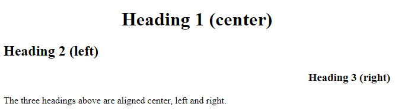

When the text-align property is set to "justify", each line is stretched so that every line has equal width, and the left and right margins are straight (like in magazines and newspapers):

### Example

div {  
text-align: justify;  
}

## Text Align Last

The text-align-last property specifies how to align the last line of a text.

### Example

Align the last line of text in three \<p\> elements:

p.a {  
text-align-last: right;  
}

p.b {  
text-align-last: center;  
}

p.c {  
text-align-last: justify;  
}

## Text Direction

The direction and unicode-bidi properties can be used to change the text direction of an element:

### Example

p {  
direction: rtl;  
unicode-bidi: bidi-override;  
}

## Vertical Alignment

The vertical-align property sets the vertical alignment of an element.

### Example

Set the vertical alignment of an image in a text:

img.a {  
vertical-align: baseline;  
}

img.b {  
vertical-align: text-top;  
}

img.c {  
vertical-align: text-bottom;  
}

img.d {  
vertical-align: sub;  
}

img.e {  
vertical-align: super;  
}

# 2. References

<https://www.w3schools.com/css/css_background.asp>

## https://www.w3schools.com/css/css_border.aspCSS Border Width
