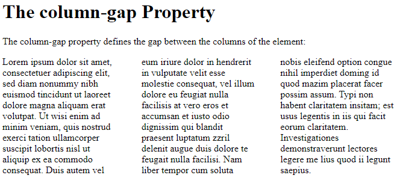

# CSS Properties

# CSS animation Property

**Example**

-   Binding an animation to a \<div\> element, using the shorthand property:

div {  
animation: mymove 5s infinite;  
}

**Output**

# CSS background-color Property

**Example**

-   Set the background color for a page:

body {background-color: coral;}

**Output**

****

# CSS background-attachment Property

**Example**

-   A background-image that will not scroll with the page (fixed):

body {  
background-image: url("img_tree.gif");  
background-repeat: no-repeat;  
background-attachment: fixed;  
}

**Output**

# CSS border Property

**Example**

-   Set the style of the borders for different elements:

h1 {  
border: 5px solid red;  
}

h2 {  
border: 4px dotted blue;  
}

div {  
border: double;  
}

**Output**

****

# CSS border-width Property

**Example**

-   Set a width for the borders:

div {border-width: thin;}

**Output**

# CSS color Property

**Example**

-   Set the text-color for different elements:

body {  
color: red;  
}

h1 {  
color: \#00ff00;  
}

p.ex {  
color: rgb(0,0,255);  
}

**Output**

# CSS column-count Property

**Example**

-   Divide the text in the \<div\> element into three columns:

div {  
column-count: 3;  
}

**Output**

# CSS column-gap Property

**Example**

-   Specify a 40 pixels gap between the columns:

div {  
column-gap: 40px;  
}

**Output**

****

# CSS direction Property

**Example**

-   Set the text direction to "right-to-left":

p.rtl {  
direction: rtl;  
}

**Output**

****

# CSS filter Property

**Example**

-   Change all images to black and white (100% gray):

img {  
filter: grayscale(100%);  
}

**Output**

# CSS font-size Property

**Example**

-   Set the font size for different elements:

div.a {  
font-size: 15px;  
}

div.b {  
font-size: large;  
}

div.c {  
font-size: 150%;  
}

**Output**

# CSS font-style Property

**Example**

-   Set different font styles for three paragraphs:

p.a {  
font-style: normal;  
}

p.b {  
font-style: italic;  
}

p.c {  
font-style: oblique;  
}

**Output**

# CSS font-variant Property

**Example**

-   Set a paragraph to a small-caps font:

p.small {  
font-variant: small-caps;  
}

**Output**

# CSS gap Property

**Example**

-   Set the gap between rows *and* columns to 50px:

.grid-container {  
gap: 50px;  
}

**Output**

# CSS margin Property

**Example**

-   Set the margin for all four sides of a \<p\> element to 35 pixels:

p {  
margin: 35px;  
}

**Output**

# CSS padding Property

**Example**

-   Set the padding for all four sides of a \<p\> element to 35 pixels:

p {  
padding: 35px;  
}

**Output**

# CSS scroll-behavior Property

**Example**

-   Add a smooth scrolling effect to the document:

html {  
scroll-behavior: smooth;  
}

**Output**

****

# CSS table-layout Property

**Example**

-   Set different table layout algorithms:

table.a {  
table-layout: auto;  
width: 180px;  
}

table.b {  
table-layout: fixed;  
width: 180px;  
}

**Output**

# CSS text-align Property

**Example**

-   Set the text alignment for different \<div\> elements:

div.a {  
text-align: center;  
}

div.b {  
text-align: left;  
}

div.c {  
text-align: right;  
}

div.c {  
text-align: justify;  
}

**Output**

# CSS text-decoration-color Property

**Example**

-   Set the color of the text-decoration to red:

p {  
text-decoration: underline;  
text-decoration-color: red;  
}

**Output**

# CSS text-decoration-style Property

**Example**

-   Set different types of text-decoration styles:

div.a {  
text-decoration-line: underline;  
text-decoration-style: solid;  
}

div.b {  
text-decoration-line: underline;  
text-decoration-style: wavy;  
}

div.c {  
text-decoration-line: underline;  
text-decoration-style: double;  
}

div.d {  
text-decoration-line: overline underline;  
text-decoration-style: wavy;  
}

**Output**

# CSS white-space Property

**Example**

-   Demonstrate different values of the white-space property:

p.a { white-space: nowrap; }

p.b { white-space: normal; }

p.c { white-space: pre; }

**Output**

# CSS word-spacing Property

**Example**

-   Specify that the space between words in \<p\> elements should be 30 pixels:

p {  
word-spacing: 30px;  
}

**Output**

# CSS word-wrap Property

**Example**

-   Allow long words to be able to break and wrap onto the next line:

div {  
word-wrap: break-word;  
}

**Output**

# CSS writing-mode Property

**Example**

-   Specify whether lines of text are laid out horizontally or vertically:

p.test1 {  
writing-mode: horizontal-tb;  
}

p.test2 {  
writing-mode: vertical-rl;  
}

span.test2 {  
writing-mode: vertical-rl;  
}

**Output**

****

# References

https://www.w3schools.com/cssref/css3_pr_animation.asp

https://www.w3schools.com/cssref/pr_background-color.asp

https://www.w3schools.com/cssref/pr_background-attachment.asp

https://www.w3schools.com/cssref/pr_border.asp

https://www.w3schools.com/cssref/pr_border-width.asp

https://www.w3schools.com/cssref/pr_text_color.asp

https://www.w3schools.com/cssref/css3_pr_column-count.asp

https://www.w3schools.com/cssref/css3_pr_column-gap.asp

https://www.w3schools.com/cssref/pr_text_direction.asp

https://www.w3schools.com/cssref/css3_pr_filter.asp

https://www.w3schools.com/cssref/pr_font_font-size.asp

https://www.w3schools.com/cssref/pr_font_font-style.asp

https://www.w3schools.com/cssref/pr_font_font-variant.asp

https://www.w3schools.com/cssref/pr_margin.asp

https://www.w3schools.com/cssref/css3_pr_gap.asp

https://www.w3schools.com/cssref/pr_padding.asp

https://www.w3schools.com/cssref/pr_scroll-behavior.asp

https://www.w3schools.com/cssref/pr_tab_table-layout.asp

https://www.w3schools.com/cssref/pr_text_text-align.asp

https://www.w3schools.com/cssref/css3_pr_text-decoration-color.asp

https://www.w3schools.com/cssref/css3_pr_text-decoration-style.asp

https://www.w3schools.com/cssref/pr_text_white-space.asp

https://www.w3schools.com/cssref/pr_text_word-spacing.asp

https://www.w3schools.com/cssref/css3_pr_word-wrap.asp

https://www.w3schools.com/cssref/css3_pr_writing-mode.asp
