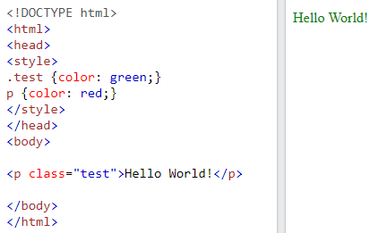
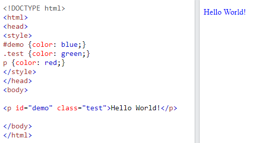
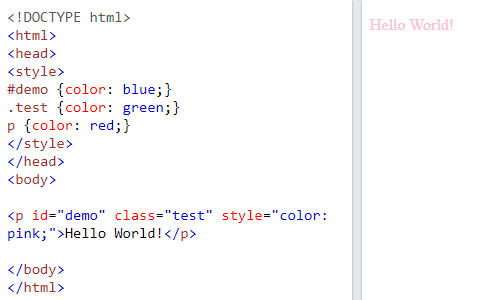
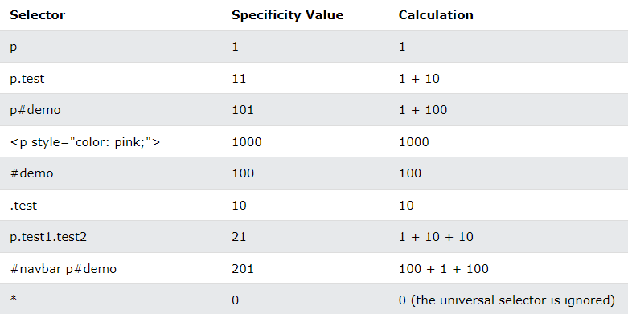
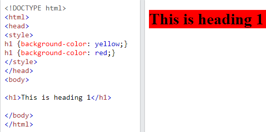
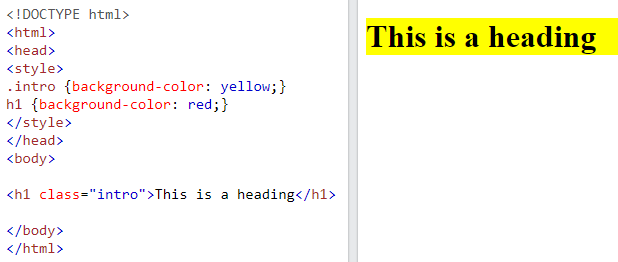

What is Specificity?

If there are two or more CSS rules that point to the same element, the selector with the highest specificity value will "win", and its style declaration will be applied to that HTML element.

### Example

In this example, we have added a class selector (named "test"), and specified a green color for this class. The text will now be green (even though we have specified a red color for the element selector "p". This is because the class selector is given higher priority:

### Example

In this example, we have added the id selector (named "demo"). The text will now be blue, because the id selector is given higher priority:

### Example 4

In this example, we have added an inline style for the "p" element. The text will now be pink, because the inline style is given the highest priority:

## Specificity Hierarchy

Every CSS selector has its place in the specificity hierarchy.

There are four categories which define the specificity level of a selector:

-   **Inline styles** - Example: \<h1 style="color: pink;"\>
-   **IDs** - Example: \#navbar
-   **Classes, pseudo-classes, attribute selectors** - Example: .test, :hover, [href]
-   **Elements and pseudo-elements** - Example: h1, :before

## How to Calculate Specificity?

Memorize how to calculate specificity!

Start at 0, add 100 for each ID value, add 10 for each class value (or pseudo-class or attribute selector), add 1 for each element selector or pseudo-element.

**Note:** Inline style gets a specificity value of 1000, and is always given the highest priority!

**Note 2:** There is one exception to this rule: if you use the !important rule, it will even override inline styles!

The table below shows some examples on how to calculate specificity values:

**The selector with the highest specificity value will win and take effect!**

Consider these three code fragments:

### Example

A: h1  
B: h1\#content  
C: \<h1 id="content" style="color: pink;"\>Heading\</h1\>

The specificity of A is 1 (one element selector)  
The specificity of B is 101 (one ID reference + one element selector)  
The specificity of C is 1000 (inline styling)

Since the third rule (C) has the highest specificity value (1000), this style declaration will be applied.

## More Specificity Rules Examples

**Equal specificity: the latest rule wins** - If the same rule is written twice into the external style sheet, then the latest rule wins:

### Example

**Contextual selectors are more specific than a single element selector -** The embedded style sheet is closer to the element to be styled. So in the following situation

### Example

**From external CSS file:**  
\#content h1 {background-color: red;}  
  
**In HTML file:**  
\<style\>  
\#content h1 {background-color: yellow;}  
\</style\>

the latter rule will be applied.

**A class selector beats any number of element selectors** - a class selector such as .intro beats h1, p, div, etc:

### Example

**The universal selector (\*) and inherited values have a specificity of 0** - The universal selector (\*) and inherited values are ignored!
