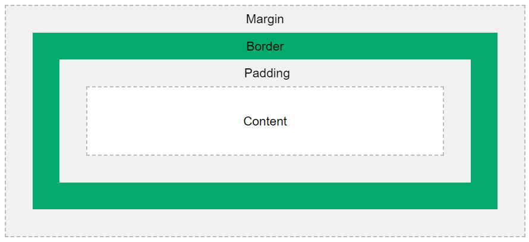
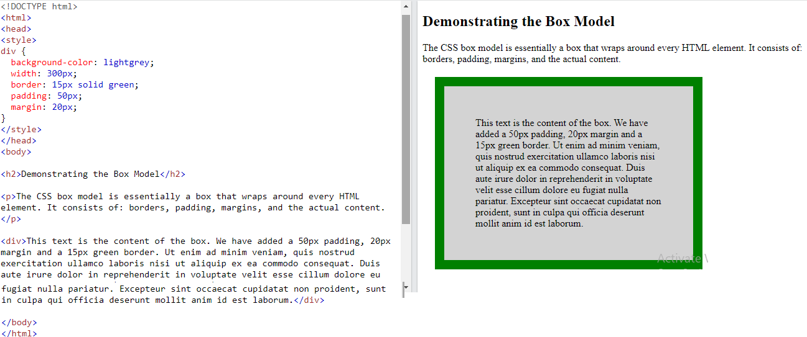
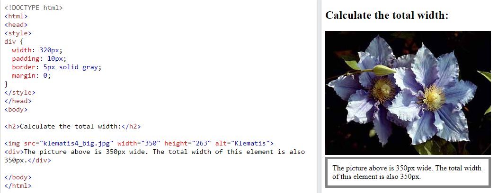

## CSS Box Model

**Content**

1\. The CSS Box Model

2\. Width and Height of an Element

3\. References

## 1. The CSS Box Model

-   In CSS, the term "box model" is used when talking about design and layout.
-   The CSS box model is essentially a box that wraps around every HTML element.
-   It consists of: margins, borders, padding, and the actual content.
-   The image below illustrates the box model:

**Explanation of the different parts:**

-   **Content** - The content of the box, where text and images appear.
-   **Padding** - Clears an area around the content. The padding is transparent.
-   **Border** - A border that goes around the padding and content.
-   **Margin** - Clears an area outside the border. The margin is transparent.
-   The box model allows us to add a border around elements, and to define space between elements.

**Example**

-   Demonstration of the box model:

## 2. Width and Height of an Element

-   In order to set the width and height of an element correctly in all browsers, you need to know how the box model works.

**Note:** When you set the width and height properties of an element with CSS, you just set the width and height of the **content area**. To calculate the full size of an element, you must also add padding, borders and margins.

**Example**

-   This \<div\> element will have a total width of 350px:

**Here is the calculation:**

**The total width of an element should be calculated like this:**

-   Total element width = width + left padding + right padding + left border + right border + left margin + right margin

**The total height of an element should be calculated like this:**

-   Total element height = height + top padding + bottom padding + top border + bottom border + top margin + bottom margin

## 3. References

1\. https://www.w3schools.com/css/css_boxmodel.asp
