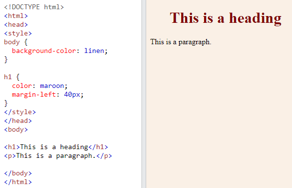

How To Add CSS

When a browser reads a style sheet, it will format the HTML document according to the information in the style sheet.

## **Three Ways to Insert CSS**

There are three ways of inserting a style sheet:

-   External CSS
-   Internal CSS
-   Inline CSS

## **External CSS**

With an external style sheet, you can change the look of an entire website by changing just one file!

Each HTML page must include a reference to the external style sheet file inside the \<link\> element, inside the head section.

### **Example**

External styles are defined within the \<link\> element, inside the \<head\> section of an HTML page:

An external style sheet can be written in any text editor, and must be saved with a .css extension.

The external .css file should not contain any HTML tags.

Here is how the "mystyle.css" file looks:

### **"mystyle.css"**

body {  
 background-color: lightblue;  
}  
  
h1 {  
 color: navy;  
 margin-left: 20px;  
}

**Note:** Do not add a space between the property value and the unit:  
Incorrect (space): margin-left: 20 px;  
Correct (nospace): margin-left: 20px;

## **Internal CSS**

An internal style sheet may be used if one single HTML page has a unique style.

The internal style is defined inside the \<style\> element, inside the head section.

### **Example**

Internal styles are defined within the \<style\> element, inside the \<head\> section of an HTML page:

## **Inline CSS**

An inline style may be used to apply a unique style for a single element.

To use inline styles, add the style attribute to the relevant element. The style attribute can contain any CSS property.

### **Example**

Inline styles are defined within the "style" attribute of the relevant element:

**Tip:** An inline style loses many of the advantages of a style sheet (by mixing content with presentation). Use this method sparingly.

## **Cascading Order**

What style will be used when there is more than one style specified for an HTML element?

All the styles in a page will "cascade" into a new "virtual" style sheet by the following rules, where number one has the highest priority:

1.  Inline style (inside an HTML element)
2.  External and internal style sheets (in the head section)
3.  Browser default

So, an inline style has the highest priority, and will override external and internal styles and browser defaults.

