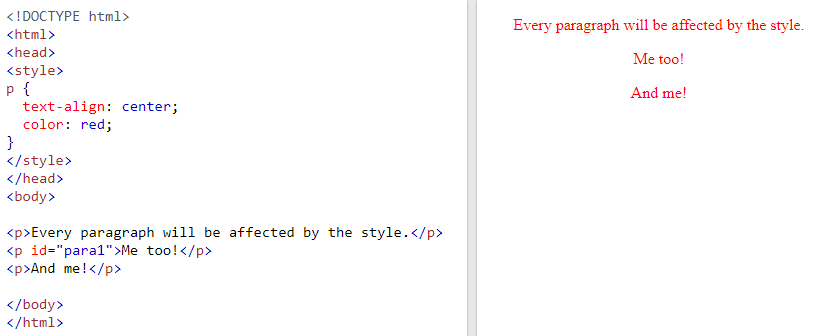
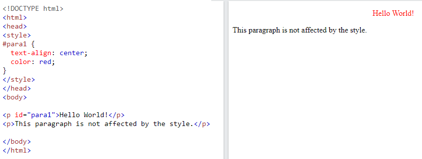
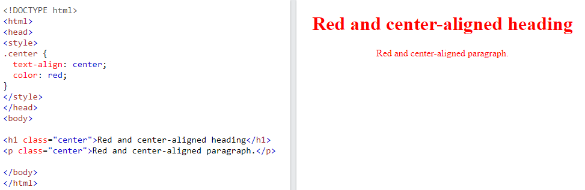
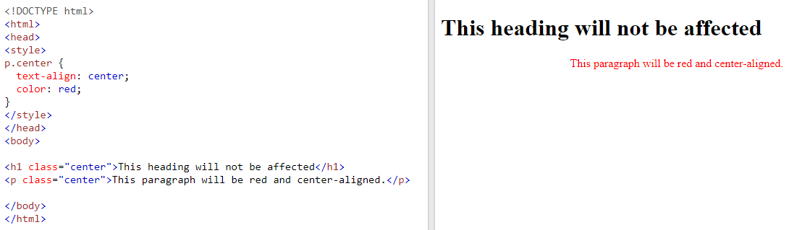
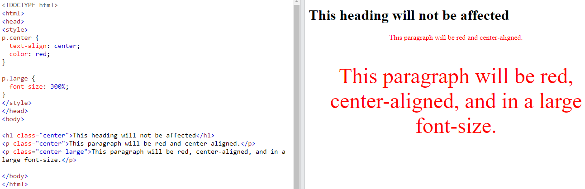
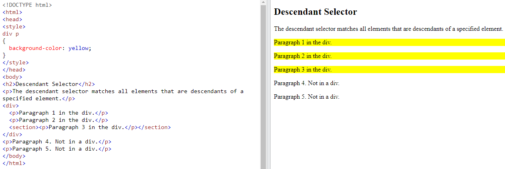

## CSS Selectors

**Content**

1\. CSS Selectors

2\. The CSS element Selector

3\. The CSS id Selector

4\. The CSS class Selector

5\. Descendant Selector

6\. References

## 1. CSS Selectors

-   CSS selectors are used to "find" (or select) the HTML elements you want to style.
-   CSS selectors divided into five categories:
1.  Simple selectors (select elements based on name, id, class)
2.  [Combinator selectors](https://www.w3schools.com/css/css_combinators.asp) (select elements based on a specific relationship between them)
3.  [Pseudo-class selectors](https://www.w3schools.com/css/css_pseudo_classes.asp) (select elements based on a certain state)
4.  [Pseudo-elements selectors](https://www.w3schools.com/css/css_pseudo_elements.asp) (select and style a part of an element)
5.  [Attribute selectors](https://www.w3schools.com/css/css_attribute_selectors.asp) (select elements based on an attribute or attribute value)

Here, am explaining the most basic CSS selectors.

## 2. The CSS element Selector

-   The element selector selects HTML elements based on the element name.

**Syntax:**

element {

\\\\ CSS property

}

**Example**

## 3. The CSS id Selector

-   The id selector uses the id attribute of an HTML element to select a specific element.
-   The id of an element is unique within a page, so the id selector is used to select one unique element!
-   To select an element with a specific id, write a hash (\#) character, followed by the id of the element.

**Syntax:**

\#id {

// CSS property

}

**Example**

**Note:** An id name cannot start with a number!

## 4. The CSS class Selector

-   The class selector selects HTML elements with a specific class attribute.
-   To select elements with a specific class, write a period (.) character, followed by the class name.

**Syntax:**

.class {

// CSS property

}

**Example**

In this example all HTML elements with class="center" will be red and center-aligned:

You can also specify that only specific HTML elements should be affected by a class.

**Example**

-   In this example only \<p\> elements with class="center" will be red and center-aligned:

HTML elements can also refer to more than one class.

**Example**

-   In this example the \<p\> element will be styled according to class="center" and to class="large":

**Note:** A class name cannot start with a number!

## 5. Descendant Selector

-   The descendant selector matches all elements that are descendants of a specified element.
-   The following example selects all \<p\> elements inside \<div\> elements:

## 6. References

1\. https://www.w3schools.com/css/css_selectors.asp
