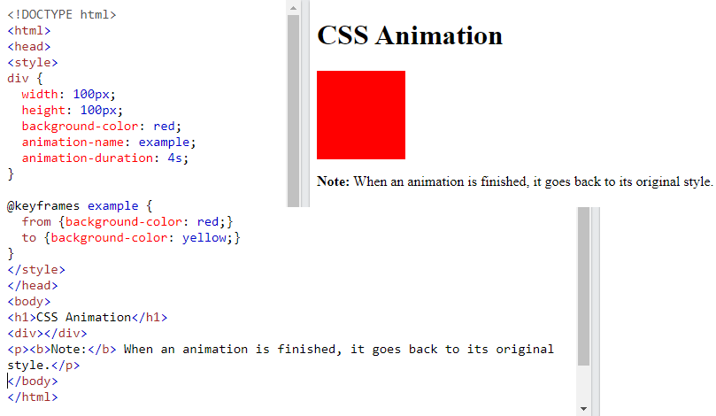
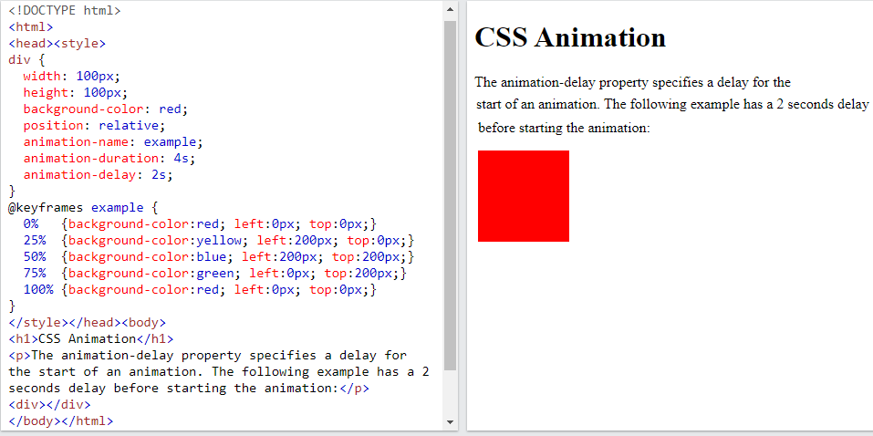

CSS Animations

CSS allows animation of HTML elements without using JavaScript or Flash!

## What are CSS Animations?

An animation lets an element gradually change from one style to another.

You can change as many CSS properties you want, as many times as you want.

To use CSS animation, you must first specify some keyframes for the animation.

Keyframes hold what styles the element will have at certain times.

In this chapter you will learn about the following properties:

-   @keyframes
-   animation-name
-   animation-duration
-   animation-delay
-   animation-iteration-count
-   animation-direction
-   animation-timing-function
-   animation-fill-mode
-   animation

## The @keyframes Rule

When you specify CSS styles inside the @keyframes rule, the animation will gradually change from the current style to the new style at certain times.

To get an animation to work, you must bind the animation to an element.

The following example binds the "example" animation to the \<div\> element. The animation will last for 4 seconds, and it will gradually change the background-color of the \<div\> element from "red" to "yellow":

**Note:** The animation-duration property defines how long an animation should take to complete. If the animation-duration property is not specified, no animation will occur, because the default value is 0s (0 seconds).

In the example above we have specified when the style will change by using the keywords "from" and "to" (which represents 0% (start) and 100% (complete)).

It is also possible to use percent. By using percent, you can add as many style changes as you like.

## Delay an Animation

The animation-delay property specifies a delay for the start of an animation.

The following example has a 2 seconds delay before starting the animation:

Negative values are also allowed. If using negative values, the animation will start as if it had already been playing for *N* seconds.

References

https://www.w3schools.com/css/css3_animations.asp
