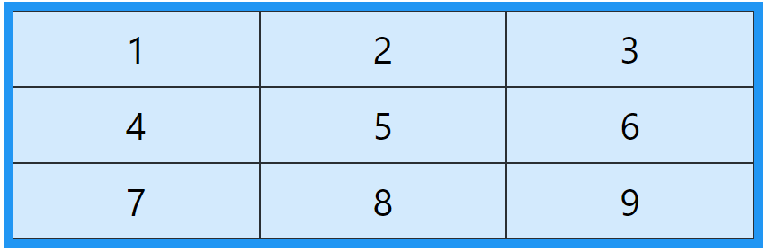

Grid Layout

The CSS Grid Layout Module offers a grid-based layout system, with rows and columns, making it easier to design web pages without having to use floats and positioning.

## Grid Elements

A grid layout consists of a parent element, with one or more child elements.

### Example

\
  
\
1\</div\>  
\
2\</div\>  
\
3\</div\>  
\
4\</div\>  
\
5\</div\>  
\
6\</div\>  
\
7\</div\>  
\
8\</div\>  
\
9\</div\>  
\</div\>

## Display Property

An HTML element becomes a grid container when its display property is set to grid or inline-grid.

### Example

.grid-container {  
 display: grid;  
}

### Example

.grid-container {  
 display: inline-grid;  
}

All direct children of the grid container automatically become *grid items*.

## Grid Columns

The vertical lines of grid items are called *columns*.

## 

## Grid Rows

The horizontal lines of grid items are called *rows*.

