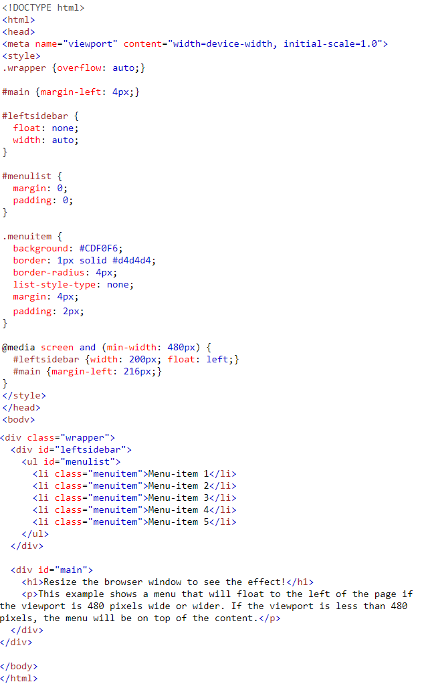

# CSS Media Queries

## CSS2 Introduced Media Types

The @media rule, introduced in CSS2, made it possible to define different style rules for different media types.

Examples: You could have one set of style rules for computer screens, one for printers, one for handheld devices, one for television-type devices, and so on.

Unfortunately these media types never got a lot of support by devices, other than the print media type.

## CSS3 Introduced Media Queries

Media queries in CSS3 extended the CSS2 media types idea: Instead of looking for a type of device, they look at the capability of the device.

Media queries can be used to check many things, such as:

-   width and height of the viewport
-   width and height of the device
-   orientation (is the tablet/phone in landscape or portrait mode?)
-   resolution

Using media queries are a popular technique for delivering a tailored style sheet to desktops, laptops, tablets, and mobile phones (such as iPhone and Android phones).

## Media Query Syntax

A media query consists of a media type and can contain one or more expressions, which resolve to either true or false.

@media not\|only *mediatype* and (*expressions*) {\*  
CSS-Code;  
\*}

The result of the query is true if the specified media type matches the type of device the document is being displayed on and all expressions in the media query are true. When a media query is true, the corresponding style sheet or style rules are applied, following the normal cascading rules.

Unless you use the not or only operators, the media type is optional and the all type will be implied.

You can also have different stylesheets for different media:

\<link rel="stylesheet" media="*mediatype* and\|not\|only (*expressions*)" href="*print.css*"\>

## CSS3 Media Types

## Media Queries Simple Examples

One way to use media queries is to have an alternate CSS section right inside your style sheet.

The following example changes the background-color to lightgreen if the viewport is 480 pixels wide or wider (if the viewport is less than 480 pixels, the background-color will be pink):

The following example shows a menu that will float to the left of the page if the viewport is 480 pixels wide or wider (if the viewport is less than 480 pixels, the menu will be on top of the content):

References

https://www.w3schools.com/css/css3_mediaqueries.asp
