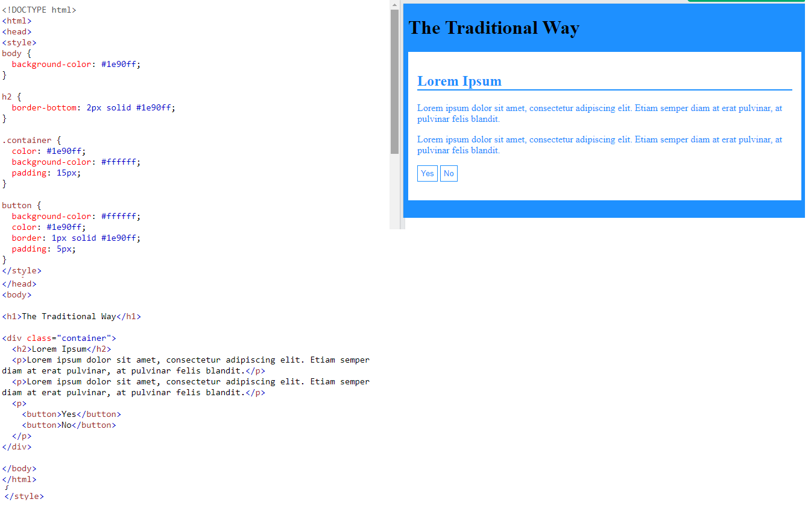
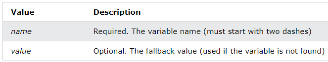
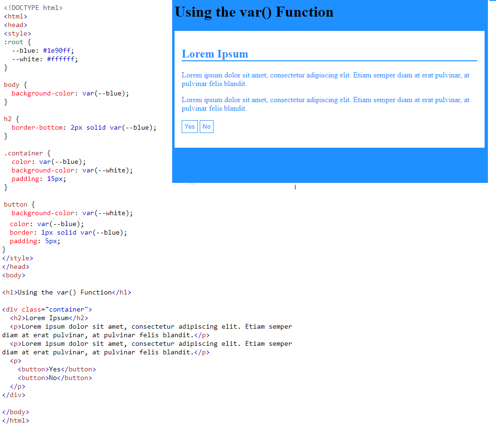

CSS Variables

-   The var() function is used to insert the value of a CSS variable.
-   CSS variables have access to the DOM, which means that you can create variables with local or global scope, change the variables with JavaScript, and change the variables based on media queries.
-   A good way to use CSS variables is when it comes to the colors of your design. Instead of copy and paste the same colors over and over again, you can place them in variables.

## The Traditional Way

The following example shows the traditional way of defining some colors in a style sheet (by defining the colors to use, for each specific element):

## Syntax of the var() Function

The var() function is used to insert the value of a CSS variable.

The syntax of the var() function is as follows:

var(--*name, value*)

**Note:** The variable name must begin with two dashes (--) and it is case sensitive!

## How var() Works

First of all: CSS variables can have a global or local scope.

Global variables can be accessed/used through the entire document, while local variables can be used only inside the selector where it is declared.

To create a variable with global scope, declare it inside the :root selector. The [:root](https://www.w3schools.com/cssref/sel_root.asp) selector matches the document's root element.

To create a variable with local scope, declare it inside the selector that is going to use it.

The following example is equal to the example above, but here we use the var() function.

First, we declare two global variables (--blue and --white). Then, we use the var() function to insert the value of the variables later in the style sheet:

