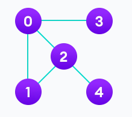
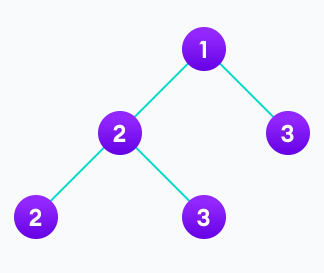
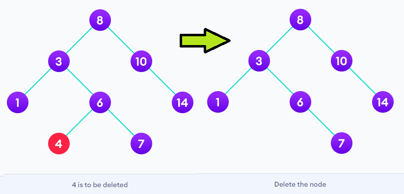
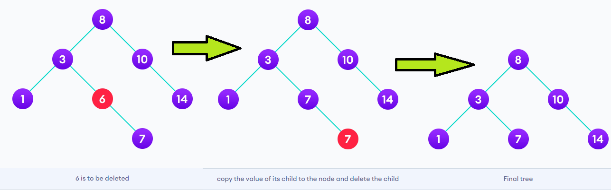
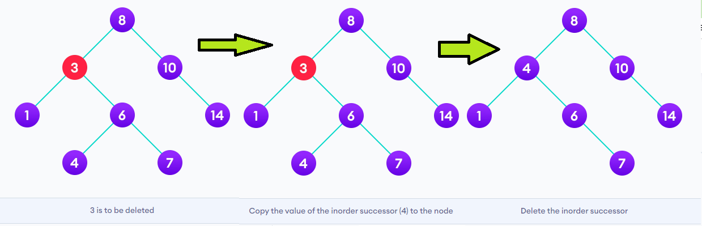

DS&A: Time Complexity - O(n) vs. O(log n)

# What is an Algorithm?

In computer programming terms, an algorithm is a set of well-defined instructions to solve a particular problem. It takes a set of input(s) and produces the desired output. For example,

An algorithm to add two numbers:

1.  Take two number inputs
2.  Add numbers using the + operator
3.  Display the result

## What are Data Structures?

Data structure is a storage that is used to store and organize data. It is a way of arranging data on a computer so that it can be accessed and updated efficiently.

Depending on your requirement and project, it is important to choose the right data structure for your project.

## Types of Data Structure

Basically, data structures are divided into two categories:

-   Linear data structure
-   Non-linear data structure

## Linear data structures

In linear data structures, the elements are arranged in sequence one after the other. Since elements are arranged in particular order, they are easy to implement.

However, when the complexity of the program increases, the linear data structures might not be the best choice because of operational complexities.

**Popular linear data structures are:**

### 1. Array Data Structure

### 2. Stack Data Structure

### 3. Queue Data Structure

### 4. Linked List Data Structure

## Non linear data structures

elements in non-linear data structures are not in any sequence. Instead they are arranged in a hierarchical manner where one element will be connected to one or more elements.

Non-linear data structures are further divided into graph and tree based data structures.

### 1. Graph Data Structure

In graph data structure, each node is called vertex and each vertex is connected to other vertices through edges.

**Popular Graph Based Data Structures:**

-   [Spanning Tree and Minimum Spanning Tree](https://www.programiz.com/dsa/spanning-tree-and-minimum-spanning-tree)
-   [Strongly Connected Components](https://www.programiz.com/dsa/strongly-connected-components)
-   [Adjacency Matrix](https://www.programiz.com/dsa/graph-adjacency-matrix)
-   [Adjacency List](https://www.programiz.com/dsa/graph-adjacency-list)

### 2. Trees Data Structure

a tree is also a collection of vertices and edges. However, in tree data structure, there can only be one edge between two vertices.

**Popular Tree based Data Structure**

-   [Binary Tree](https://www.programiz.com/dsa/binary-tree)
-   [Binary Search Tree](https://www.programiz.com/dsa/binary-search-tree)
-   [AVL Tree](https://www.programiz.com/dsa/avl-tree)
-   [B-Tree](https://www.programiz.com/dsa/b-tree)
-   [B+ Tree](https://www.programiz.com/dsa/b-plus-tree)
-   [Red-Black Tree](https://www.programiz.com/dsa/red-black-tree)

To know more information [clickhere](https://www.programiz.com/dsa/data-structure-types)

**Algorithm Analysis**

Analysis of efficiency of an algorithm can be performed at two different stages, before implementation and after implementation, as

A priori analysis − This is defined as theoretical analysis of an algorithm. Efficiency of algorithm is measured by assuming that all other factors e.g. speed of processor, are constant and have no effect on implementation.

A posterior analysis − This is defined as empirical analysis of an algorithm. The chosen algorithm is implemented using programming language. Next the chosen algorithm is executed on target computer machine. In this analysis, actual statistics like running time and space needed are collected.

Algorithm analysis is dealt with the execution or running time of various operations involved. Running time of an operation can be defined as number of computer instructions executed per operation.

**Algorithm Complexity**

Suppose X is treated as an algorithm and N is treated as the size of input data, the time and space implemented by the Algorithm X are the two main factors which determine the efficiency of X.

Time Factor − The time is calculated or measured by counting the number of key operations such as comparisons in sorting algorithm.

Space Factor − The space is calculated or measured by counting the maximum memory space required by the algorithm.

The complexity of an algorithm f(N) provides the running time and / or storage space needed by the algorithm with respect of N as the size of input data.

**Space Complexity**

Space complexity of an algorithm represents the amount of memory space needed the algorithm in its life cycle.

Space needed by an algorithm is equal to the sum of the following two components

A fixed part that is a space required to store certain data and variables (i.e. simple variables and constants, program size etc.), that are not dependent of the size of the problem.

A variable part is a space required by variables, whose size is totally dependent on the size of the problem. For example, recursion stack space, dynamic memory allocation etc.

Space complexity S(p) of any algorithm p is S(p) = A + Sp(I) Where A is treated as the fixed part and S(I) is treated as the variable part of the algorithm which depends on instance characteristic I. Following is a simple example that tries to explain the concept

Algorithm

SUM(P, Q)

Step 1 - START

Step 2 - R ← P + Q + 10

Step 3 - Stop

Here we have three variables P, Q and R and one constant. Hence S(p) = 1+3. Now space is dependent on data types of given constant types and variables and it will be multiplied accordingly.

**Time Complexity**

Time Complexity of an algorithm is the representation of the amount of time required by the algorithm to execute to completion. Time requirements can be denoted or defined as a numerical function t(N), where t(N) can be measured as the number of steps, provided each step takes constant time.

For example, in case of addition of two n-bit integers, N steps are taken. Consequently, the total computational time is t(N) = c\*n, where c is the time consumed for addition of two bits. Here, we observe that t(N) grows linearly as input size increases.

Searching is the process of finding some particular element in the list. If the element is present in the list, then the process is called successful, and the process returns the location of that element; otherwise, the search is called unsuccessful.

Two popular search methods are Linear Search and Binary Search.

Linear search is also called as **sequential search algorithm.** It is the simplest searching algorithm. In Linear search, we simply traverse the list completely and match each element of the list with the item whose location is to be found. If the match is found, then the location of the item is returned; otherwise, the algorithm returns NULL.

It is widely used to search an element from the unordered list, i.e., the list in which items are not sorted. The worst-case time complexity of linear search is **O(n).**

## Working of Linear search

## Linear Search complexity

Now, let's see the time complexity of linear search in the best case, average case, and worst case. We will also see the space complexity of linear search.

### 1. Time Complexity

| **Case**         | **Time Complexity** |
|------------------|---------------------|
| **Best Case**    | O(1)                |
| **Average Case** | O(n)                |
| **Worst Case**   | O(n)                |

-   **Best Case Complexity -** In Linear search, best case occurs when the element we are finding is at the first position of the array. The best-case time complexity of linear search is **O(1).**
-   **Average Case Complexity -** The average case time complexity of linear search is **O(n).**
-   **Worst Case Complexity -** In Linear search, the worst case occurs when the element we are looking is present at the end of the array. The worst-case in linear search could be when the target element is not present in the given array, and we have to traverse the entire array. The worst-case time complexity of linear search is **O(n).**

The time complexity of linear search is **O(n)** because every element in the array is compared only once.

### 2. Space Complexity

| **Space Complexity** | O(1) |
|----------------------|------|

-   The space complexity of linear search is O(1).

## Linear Search Algorithm

Linear Search ( A: array of item, n: total no. of items ,x: item to be searched)

Step 1: Set i to 1

Step 2: if i \> n then go to step 7

Step 3: if A[i] = x then go to step 6

Step 4: Set i to i + 1

Step 5: Go to Step 2

Step 6: Print Element x Found at index i and go to step 8

Step 7: Print element not found

Step 8: Exit

# **Time complexity:** O(N) **Auxiliary Space:** O(1)

# Binary Search Tree(BST)

Binary search tree is a data structure that quickly allows us to maintain a sorted list of numbers.

The properties of a binary search tree are

1.  All nodes of left subtree are less than the root node
2.  All nodes of right subtree are more than the root node
3.  Both subtrees of each node are also BSTs i.e. they have the above two properties

## Search Operation

The algorithm depends on the property of BST that if each left subtree has values below root and each right subtree has values above the root.

If the value is below the root, we can say for sure that the value is not in the right subtree; we need to only search in the left subtree and if the value is above the root, we can say for sure that the value is not in the left subtree; we need to only search in the right subtree.

**Algorithm:**

If root == NULL

return NULL;

If number == root-\>data

return root-\>data;

If number \< root-\>data

return search(root-\>left)

If number \> root-\>data

return search(root-\>right)

## Insert Operation

Inserting a value in the correct position is similar to searching because we try to maintain the rule that the left subtree is lesser than root and the right subtree is larger than root.

We keep going to either right subtree or left subtree depending on the value and when we reach a point left or right subtree is null, we put the new node there.

**Algorithm:**

If node == NULL

return createNode(data)

if (data \< node-\>data)

node-\>left = insert(node-\>left, data);

else if (data \> node-\>data)

node-\>right = insert(node-\>right, data);

return node;

## Deletion Operation

There are three cases for deleting a node from a binary search tree.

### Case I

In the first case, the node to be deleted is the leaf node. In such a case, simply delete the node from the tree.

### Case II

In the second case, the node to be deleted lies has a single child node. In such a case follow the steps below:

1.  Replace that node with its child node.
2.  Remove the child node from its original position.

### Case III

In the third case, the node to be deleted has two children. In such a case follow the steps below:

1.  Get the inorder successor of that node.
2.  Replace the node with the inorder successor.
3.  Remove the inorder successor from its original position.

## Binary Search Tree Complexities

### Time Complexity

| **Operation** | **Best Case Complexity** | **Average Case Complexity** | **Worst Case Complexity** |
|---------------|--------------------------|-----------------------------|---------------------------|
| Search        | O(log n)                 | O(log n)                    | O(n)                      |
| Insertion     | O(log n)                 | O(log n)                    | O(n)                      |
| Deletion      | O(log n)                 | O(log n)                    | O(n)                      |

Here, *n* is the number of nodes in the tree.

### Space Complexity

The space complexity for all the operations is *O(n)*.

## Binary Search Tree Applications

1.  In multilevel indexing in the database
2.  For dynamic sorting
3.  For managing virtual memory areas in Unix kernel

<https://www.tutorialspoint.com/time-and-space-complexity-in-data-structure>

<https://www.programiz.com/dsa/binary-search-tree>

https://www.javatpoint.com/linear-search
